# 四阶段企业级升级 - 完整深度分析报告

## 文档概述

本文档对 Tlias 智能学习辅助系统前端项目的四个阶段企业级升级进行了全面深入的分析，涵盖了从基础夯实到监控运维的完整能力建设过程。

每个功能模块均包含以下六个维度的深度分析：

- **功能介绍说明**：详细阐述功能的定义、作用和价值
- **详细实现步骤**：从零到一的实现流程拆解
- **流程图**：Mermaid 可视化的执行流程
- **逻辑分析**：核心业务逻辑和技术原理深度解析
- **数据流图**：Mermaid 可视化的数据流向
- **项目实际代码示例**：来自项目的真实代码片段

---

## 术语表

> 在阅读下文之前，建议先了解以下技术术语的含义，有助于更好地理解各模块的技术原理。

| 术语                      | 全称                          | 简要说明                                                                                                    |
| ------------------------- | ----------------------------- | ----------------------------------------------------------------------------------------------------------- |
| **Composition API**       | Composition API               | Vue 3 提供的另一种编写组件的方式，相比 Options API 更灵活，支持更好的逻辑复用和 TypeScript 类型推断         |
| **Setup Store**           | Setup Store 写法              | Pinia 状态管理的一种写法，使用 `<script setup>` 风格定义 Store，而非传统的 `state/getters/actions` 对象写法 |
| **Pinia**                 | —                             | Vue 3 官方推荐的状态管理库，比 Vuex 更轻量，原生支持 TypeScript                                             |
| **RBAC**                  | Role-Based Access Control     | 基于角色的访问控制，一种权限管理模型，通过"用户-角色-权限"的映射关系来控制资源访问                          |
| **Ref**                   | Reactive Reference            | Vue 3 响应式 API，用一个包装对象（ref.value）包裹任意类型的值，使其具备响应性                               |
| **Computed**              | Computed Property             | Vue 3 响应式 API，类似计算属性，基于响应式依赖自动缓存结果，仅在依赖变化时重新计算                          |
| **Watch**                 | Watcher                       | Vue 3 响应式 API，侦听某个响应式数据的变化并执行回调函数                                                    |
| **Deep Watch**            | Deep Watcher                  | Vue 3 中 `watch` 的 `deep: true` 选项，可以侦听对象内部嵌套属性的变化                                       |
| **Lifecycle Hook**        | 生命周期钩子                  | Vue 组件从创建到销毁过程中在特定时刻自动调用的函数，如 `mounted`、`unmounted`、`onErrorCaptured` 等         |
| **Slot**                  | —                             | Vue 的插槽机制，允许父组件向子组件模板中注入内容，实现组件的内容分发                                        |
| **Directive**             | 自定义指令                    | Vue 提供的 DOM 底层操作机制，可用于在 DOM 元素的特定生命周期钩子中执行代码                                  |
| **Interceptor**           | 拦截器                        | Axios 提供的中间件机制，可以在请求发送前或响应返回后拦截并处理数据                                          |
| **CancelToken**           | 取消令牌                      | Axios 提供的请求取消机制，通过创建一个取消函数，在需要时主动取消已发送的请求                                |
| **Middleware**            | 中间件                        | 请求处理链路上的拦截器，数据流经每个中间件时都可以对其进行修改或拦截                                        |
| **HMR**                   | Hot Module Replacement        | 热模块替换，开发时只更新修改的模块而不刷新整个页面，大幅提升开发体验                                        |
| **Tree Shaking**          | —                             | 构建工具移除未被引用的死代码的技术，减小最终打包体积                                                        |
| **Code Splitting**        | 代码分割                      | 将应用代码拆分成多个 chunk，按需加载，减少首屏加载时间                                                      |
| **Chunk**                 | —                             | 代码分割后产生的独立 JS/CSS 文件，浏览器按需加载                                                            |
| **Webpack / Rollup**      | —                             | JavaScript 打包工具，将多个模块打包成少数几个文件供浏览器加载                                               |
| **Vite**                  | —                             | 新一代前端构建工具，基于原生 ES 模块实现极速的开发服务器启动                                                |
| **ESBuild**               | —                             | 用 Go 编写的超高速 JavaScript/TypeScript 打包器和压缩工具                                                   |
| **Gzip**                  | —                             | 一种数据压缩算法，可将文本资源压缩至原大小的 30%-40%                                                        |
| **Hash**                  | 哈希值                        | 通过哈希算法生成的固定长度字符串，用于唯一标识文件内容，内容不变则哈希不变                                  |
| **LRU**                   | Least Recently Used           | 最近最少使用淘汰算法，缓存满时优先淘汰最久未使用的数据                                                      |
| **FIFO**                  | First In First Out            | 先进先出淘汰策略，缓存满时优先淘汰最早进入的数据                                                            |
| **JWT**                   | JSON Web Token                | 一种开放标准的令牌格式，用于在网络应用间安全地传输身份信息                                                  |
| **RESTful API**           | —                             | 一种 API 设计风格，使用 HTTP 方法（GET/POST/PUT/DELETE）操作资源                                            |
| **Cors**                  | Cross-Origin Resource Sharing | 跨域资源共享，浏览器安全机制，允许或限制网页向不同域名发起请求                                              |
| **Proxy**                 | 代理                          | Vite 开发服务器提供的功能，将前端请求转发到后端服务器，解决跨域问题                                         |
| **Intersection Observer** | —                             | 浏览器原生 API，异步观察目标元素与祖先元素或顶级文档视口的交叉状态变化                                      |
| **Mutation Observer**     | —                             | 浏览器原生 API，监听 DOM 树的变化（新增/删除/属性变更等）                                                   |
| **sendBeacon**            | —                             | 浏览器 API，用于在页面卸载时可靠地向服务器发送数据，不受页面关闭影响                                        |
| **PerformanceObserver**   | —                             | 浏览器 API，监听性能相关事件（页面绘制、资源加载、布局偏移等）                                              |
| **Core Web Vitals**       | —                             | Google 提出的一组网页性能评估指标，包括 LCP、FID、CLS 等                                                    |
| **FCP**                   | First Contentful Paint        | 首次内容绘制时间，从页面开始加载到页面内容中任何部分渲染到屏幕的时间                                        |
| **LCP**                   | Largest Contentful Paint      | 最大内容绘制时间，从页面开始加载到视口中最大内容元素渲染到屏幕的时间                                        |
| **CLS**                   | Cumulative Layout Shift       | 累积布局偏移，衡量页面视觉稳定性，值越小表示页面越稳定                                                      |
| **TTFB**                  | Time to First Byte            | 首字节时间，从页面请求开始到浏览器收到第一个字节的时间                                                      |
| **Conventional Commits**  | —                             | 一种 Git 提交信息规范，格式为 `type(scope): description`，如 `feat(auth): add login`                        |
| **Husky**                 | —                             | Git 钩子管理工具，让在 Git 操作时自动执行脚本变得简单                                                       |
| **lint-staged**           | —                             | 对 Git 暂存区的文件运行检查命令，比全量检查更快                                                             |
| **Monorepo**              | —                             | 单体仓库，将多个项目/包的代码放在同一个 Git 仓库中管理                                                      |
| **Dependency Injection**  | —                             | 依赖注入，一种设计模式，将依赖对象传递给使用它的对象，而非由使用者自行创建                                  |
| **Higher-Order Function** | 高阶函数                      | 接收函数作为参数或返回函数的函数，常用于函数式编程                                                          |
| **Singleton Pattern**     | 单例模式                      | 确保一个类只有一个实例并提供全局访问点的設計模式                                                            |
| **Observer Pattern**      | 观察者模式                    | 定义对象间一对多依赖关系，当一个对象状态改变时所有依赖者都会收到通知                                        |
| **Declarative**           | 声明式编程                    | 描述"要做什么"而非"怎么做"的编程范式                                                                        |
| **Imperative**            | 命令式编程                    | 描述"具体怎么做"的编程范式                                                                                  |
| **DOM**                   | Document Object Model         | 文档对象模型，将 HTML/XML 文档表示为树形结构，JavaScript 通过 DOM API 操作页面元素                          |
| **Reactive**              | 响应式                        | Vue 的核心特性，数据变化时自动更新视图                                                                      |
| **Reactivity System**     | 响应式系统                    | Vue 中实现数据变化自动触发视图更新的底层机制                                                                |

---

## 阶段总览

| 阶段   | 名称         | 优先级 | 核心能力                                                             | 功能数量 |
| ------ | ------------ | ------ | -------------------------------------------------------------------- | -------- |
| 阶段一 | 基础夯实     | P0     | TypeScript、Pinia、权限控制、通用组件、错误边界、请求封装            | 6 大模块 |
| 阶段二 | 工程化与效率 | P1     | Git 工作流、多环境配置、构建优化                                     | 3 大模块 |
| 阶段三 | 体验与性能   | P2     | 骨架屏、列记忆、快捷键、ProTable、Keep-Alive、懒加载、请求缓存、i18n | 8 大模块 |
| 阶段四 | 监控与运维   | P3     | 性能监控、行为埋点、日志分级、构建信息、环境配置                     | 5 大模块 |

---

## 完整目录

### 第一部分：阶段一 - 基础夯实（P0）

1. TypeScript 配置
2. Pinia 状态管理
3. 权限指令系统
4. 通用业务组件库
5. 错误边界组件
6. Axios 请求封装

### 第二部分：阶段二 - 工程化与效率（P1）

1. Git 工作流与代码规范
2. 多环境配置体系
3. 构建优化策略

### 第三部分：阶段三 - 体验与性能（P2）

1. 骨架屏组件 TableSkeleton
2. 表格列记忆 useTableColumns
3. 快捷键系统 useShortcuts
4. ProTable 高级表格
5. 路由缓存 Keep-Alive
6. 图片懒加载指令
7. 请求缓存机制
8. 国际化 i18n

### 第四部分：阶段四 - 监控与运维（P3）

1. 性能监控系统
2. 行为埋点系统
3. 日志分级系统
4. 构建信息注入
5. 环境配置完善

---

## 📖 阶段导读

在深入每个模块之前，我们先了解一下各阶段的设计意图和模块之间的关系。

### 阶段一：基础夯实（P0）— 为什么要先做这些？

> **核心理念**：万丈高楼平地起。在项目初期建立坚实的基础设施，可以避免后期返工。

本阶段完成了项目的"地基"建设。想象一下，如果没有 TypeScript 类型约束，随着项目膨胀，Bug 会像野草一样疯长；如果没有统一的 Axios 封装，每个页面都在重复写请求逻辑，维护成本会呈指数级增长；如果没有权限控制和错误边界，用户随时可能看到白屏或越权操作。

**模块关系：**

- `TypeScript 配置` → 为所有代码提供类型安全保障
- `Axios 请求封装` → 统一前后端通信规范，其他模块依赖它
- `Pinia 状态管理` → 全局数据中枢，权限指令和 Axios 都依赖它获取 Token
- `权限指令` → 基于 Pinia 实现 UI 级权限控制
- `错误边界` → 组件级容错，防止局部错误导致整站崩溃
- `通用业务组件库` → 基于上述基础设施封装的高频复用组件

**阅读顺序建议**：先理解 TypeScript 配置和 Axios 封装，再理解 Pinia 状态管理，最后看权限指令和通用组件，这样能更好地把握各模块之间的依赖关系。

---

### 阶段二：工程化与效率（P1）— 如何提升团队协作效率？

> **核心理念**：用工具代替人工，用规范代替自觉。

本阶段关注的是"如何让一群人高效协作"。Git 工作流确保每个人的代码质量可控，多环境配置让开发/测试/上线各司其职，构建优化则直接提升用户的加载体验。

**模块关系：**

- `Git 工作流` → 团队协作的基础规范
- `多环境配置` → 支撑不同阶段的部署需求
- `构建优化` → 基于前两者的产物进行性能优化

---

### 阶段三：体验与性能（P2）— 如何让用户感觉更快更好？

> **核心理念**：用户体验无小事，性能优化永无止境。

本阶段从"能用"走向"好用"。骨架屏让等待不再焦虑，列记忆尊重用户习惯，快捷键提升操作效率，ProTable 让开发更高效，Keep-Alive 让页面切换如丝般顺滑，图片懒加载和请求缓存减少不必要的网络请求，国际化则让产品面向全球用户。

**模块关系：**

- **体验类**：骨架屏、列记忆、快捷键、ProTable、国际化 → 直接提升用户感知
- **性能类**：Keep-Alive、懒加载、请求缓存 → 减少资源消耗，提升加载速度

---

### 阶段四：监控与运维（P3）— 线上出了问题怎么办？

> **核心理念**：预防胜于治疗，但治疗也要有数据支撑。

本阶段构建的是"看得见、管得住"的运维体系。性能监控告诉你页面加载有多慢，行为埋点告诉你用户在哪里点击，日志分级帮你快速定位问题，构建信息注入让你知道线上跑的是哪个版本。

**模块关系：**

- `性能监控` + `行为埋点` → 数据采集层
- `日志分级` → 数据管理層
- `构建信息注入` + `环境配置完善` → 运维支撑层

---

# 阶段一（基础夯实 P0）深度分析文档

## 目录

- [一、TypeScript 配置](#一typescript-配置)
- [二、Pinia 状态管理](#二pinia-状态管理)
- [三、权限指令](#三权限指令)
- [四、通用业务组件库](#四通用业务组件库)
- [五、错误边界](#五错误边界)
- [六、Axios 请求封装](#六axios-请求封装)

---

## 一、TypeScript 配置

### 1.1 功能介绍说明

TypeScript 配置是项目基础架构的核心组成部分，为整个 Vue 3 + Vite 项目提供静态类型检查支持。通过 `tsconfig.json` 和 `vite-env.d.ts` 两个核心文件，构建了完善的类型系统，涵盖编译目标、模块解析、路径别名、环境变量类型声明、Vue 单文件组件类型支持等关键能力。

该配置采用了渐进式策略：一方面启用 `strict: true` 保证核心类型安全，另一方面通过 `noImplicitAny: false`、`allowJs: true`、`noUnusedLocals: false` 等配置降低迁移门槛，支持 JavaScript 与 TypeScript 混合开发模式，为后续逐步完善类型体系预留空间。

### 1.2 详细实现步骤

**步骤一：配置编译目标与模块系统**

1. 设置 `target: "ES2020"`，编译输出为 ES2020 标准，兼容现代浏览器
2. 设置 `module: "ESNext"`，使用最新的 ES 模块系统，配合 Vite 的 Tree Shaking
3. 配置 `lib: ["ES2020", "DOM", "DOM.Iterable"]`，提供浏览器 API 和最新 JS 特性的类型声明
4. 启用 `useDefineForClassFields: true`，使用标准的 class fields 语义

**步骤二：配置模块解析与路径别名**

1. 设置 `moduleResolution: "bundler"`，适配 Vite 等构建工具的解析策略
2. 启用 `allowImportingTsExtensions: true`，允许导入时携带 `.ts` 扩展名
3. 启用 `resolveJsonModule: true`，支持直接导入 JSON 文件
4. 配置 `baseUrl: "."` 和 `paths: { "@/*": ["src/*"] }`，设置 `@` 别名指向 `src` 目录

**步骤三：配置严格模式与兼容性**

1. 启用 `strict: true` 开启严格模式总开关
2. 设置 `noImplicitAny: false`，允许隐式 any 类型，降低迁移成本
3. 启用 `allowJs: true`，允许编译 JavaScript 文件
4. 关闭 `noUnusedLocals` 和 `noUnusedParameters`，避免开发阶段的严格报错
5. 启用 `noFallthroughCasesInSwitch: true`，防止 switch 语句的 fall-through 错误

**步骤四：配置环境变量类型声明**

1. 通过 `/// <reference types="vite/client" />` 引入 Vite 客户端类型
2. 扩展 `ImportMetaEnv` 接口，声明项目自定义环境变量（标题、API 地址、环境、版本等）
3. 扩展 `ImportMeta` 接口，使 `import.meta.env` 具备完整类型推断
4. 声明全局构建变量：`__APP_ENV__`、`__BUILD_TIME__`、`__BUILD_VERSION__`、`__BUILD_ENV__`

**步骤五：配置 Vue 组件类型支持**

1. 声明 `*.vue` 模块，将 Vue 单文件组件统一类型化为 `DefineComponent`
2. 配置 `include` 包含所有 TypeScript 和 Vue 文件
3. 配置 `exclude` 排除 `node_modules` 和 `dist` 目录
4. 通过 `references` 引用 Node 环境配置文件

### 1.3 流程图

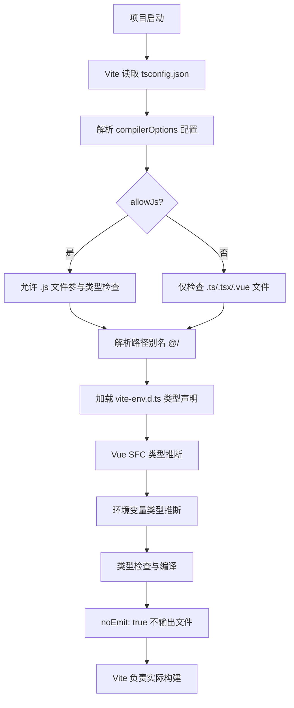

### 1.4 逻辑分析

**设计策略分析：**

TypeScript 配置采用了"严格内核 + 宽松边界"的分层设计策略。核心层面通过 `strict: true` 确保类型系统的严谨性，但在具体规则上做了务实的妥协：`noImplicitAny: false` 允许在未标注类型时使用隐式 any，这对于从 JavaScript 迁移的项目至关重要，避免了一次性改造的巨大工作量。

`allowJs: true` 配合 `noUnusedLocals: false`、`noUnusedParameters: false`，形成了一条"渐进式类型化"的平滑路径。开发者可以先让 JS 文件在项目中正常运行，然后逐步为关键模块添加类型注解，最终实现全量 TypeScript 化。

**模块解析策略：**

`moduleResolution: "bundler"` 是 Vite 生态的最佳实践。相较于传统的 `node` 解析策略，`bundler` 模式更贴合构建工具的行为，支持 `package.json` 中的 `exports` 字段，能够更好地处理 ESM 模块的导入导出。

**路径别名设计：**

`@/*` 指向 `src/*` 是前端项目的通用约定。配合 Vite 的 `resolve.alias` 配置（需在 vite.config.ts 中对应配置），实现了开发时类型提示与构建时路径解析的一致性，避免了相对路径的层级混乱。

**环境变量类型安全：**

`vite-env.d.ts` 中对 `ImportMetaEnv` 的扩展是一个关键设计。通过 TypeScript 的接口合并（Declaration Merging）特性，为 `import.meta.env` 提供了完整的类型定义，使得在代码中访问环境变量时能够获得自动补全和类型检查，避免了因拼写错误导致的运行时问题。

特别值得注意的是 `VITE_APP_ENV` 使用了联合类型 `"development" | "test" | "staging" | "production"`，而非简单的 `string`。这种字面量联合类型可以在代码中提供更精确的类型 narrowing，支持基于环境的条件编译逻辑。

**Vue 组件类型声明：**

`declare module "*.vue"` 是 Vue + TypeScript 项目的标配。它将所有 `.vue` 文件统一声明为 `DefineComponent<{}, {}, any>`，虽然 `any` 丢失了部分类型信息，但确保了 SFC 导入的基本可用性。配合 Volar 或 Vue - Official 插件，可以在 IDE 中获得更精确的组件类型推断。

### 1.5 数据流图

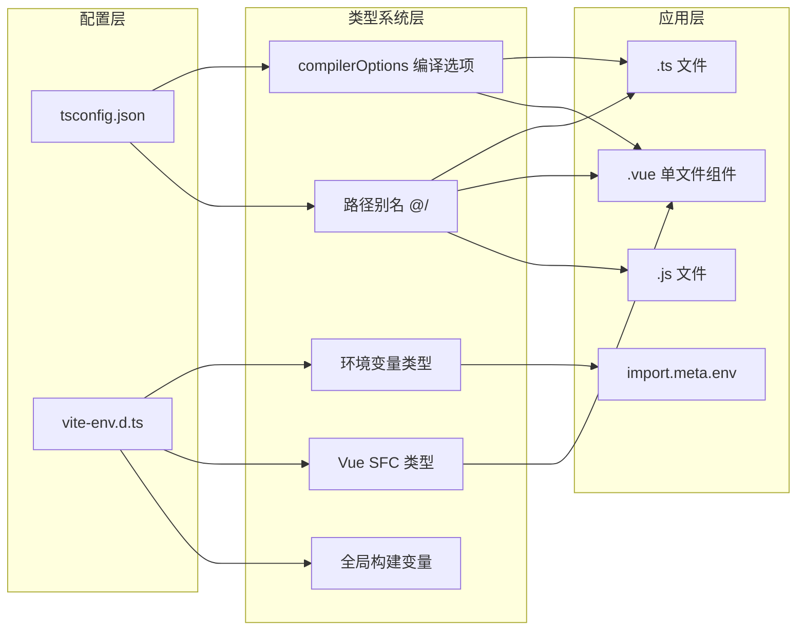

### 1.6 项目实际代码示例

**tsconfig.json 核心配置（带详细注释）：**

```json
{
  "compilerOptions": {
    // ─── 编译目标与模块系统 ───
    "target": "ES2020", // 将 TypeScript 编译为 ES2020 标准，兼容现代浏览器（Chrome 72+、Firefox 67+）
    "useDefineForClassFields": true, // 使用标准 ECMAScript 语义定义类字段（非 TypeScript 私有语法）
    "module": "ESNext", // 使用最新的 ES 模块系统，与 Vite 的 ESM 原生支持完美契合，支持 Tree Shaking
    "lib": ["ES2020", "DOM", "DOM.Iterable"], // 提供 ES2020 API 类型声明 + 浏览器 DOM API 类型声明 + Iterable 集合类型声明

    // ─── 模块解析 ───
    "skipLibCheck": true, // 跳过 node_modules 中 .d.ts 类型文件的检查，加快编译速度
    "moduleResolution": "bundler", // 使用构建工具（Vite/Webpack）的模块解析策略，支持 package.json exports 字段
    "allowImportingTsExtensions": true, // 允许 import 语句中使用 .ts/.tsx 扩展名（配合 noEmit 使用）
    "resolveJsonModule": true, // 允许直接 import JSON 文件，如 import data from './config.json'

    // ─── 编译输出 ───
    "isolatedModules": true, // 每个文件独立编译，确保 ESBuild/Swc 等工具可以安全地进行单文件转换
    "noEmit": true, // 不输出编译后的 JS 文件（Vite 负责实际构建，TypeScript 仅做类型检查）
    "jsx": "preserve", // 保留 JSX 语法不转换（Vue 3 SFC 不需要 JSX 转换，由 Vite 处理）

    // ─── 严格模式与兼容性 ───
    "strict": true, // 开启所有严格类型检查选项的总开关
    "noImplicitAny": false, // 【妥协项】允许未标注类型时使用隐式 any，降低从 JS 迁移的成本
    "allowJs": true, // 允许编译 JavaScript 文件，支持 TS/JS 混合开发
    "noUnusedLocals": false, // 【妥协项】不检查未使用的局部变量，避免开发阶段频繁报错
    "noUnusedParameters": false, // 【妥协项】不检查未使用的函数参数
    "noFallthroughCasesInSwitch": true, // 防止 switch 语句忘记写 break 导致穿透错误

    // ─── 路径别名 ───
    "baseUrl": ".", // 非相对路径导入的基准目录，"." 表示项目根目录
    "paths": {
      // 路径映射配置
      "@/*": ["src/*"] // "@" 别名指向 "src/" 目录，如 import xxx from '@/views/login'
    },

    // ─── 类型声明 ───
    "types": ["node", "nprogress"] // 额外加载 Node.js 类型和 NProgress 进度条类型声明
  },
  // ─── 文件包含/排除 ───
  "include": ["src/**/*.ts", "src/**/*.d.ts", "src/**/*.tsx", "src/**/*.vue"], // 编译哪些文件
  "exclude": ["node_modules", "dist"], // 排除哪些目录（不检查依赖和构建产物）
  // ─── 项目引用 ───
  "references": [{ "path": "./tsconfig.node.json" }] // 引用 Vite 节点端配置文件（用于 Vite 插件类型检查）
}
```

````

**vite-env.d.ts 环境变量声明（带详细注释）：**

```typescript
/// <reference types="vite/client" />
// ↑ 引入 Vite 内置的客户端类型声明，使 import.meta.env 具备基础类型推断

// ─── 扩展 ImportMetaEnv 接口 ───
// TypeScript 支持接口合并（Declaration Merging），此处将自定义环境变量合并到 Vite 自带的 ImportMetaEnv 中
interface ImportMetaEnv {
  readonly VITE_APP_TITLE: string;          // 应用标题，如 "Tlias 智能学习辅助系统"
  readonly VITE_API_BASE_URL: string;        // API 基础路径，如 "/api"
  // 使用字面量联合类型而非 string，使 TypeScript 能精确推断合法值
  readonly VITE_APP_ENV: "development" | "test" | "staging" | "production";
  readonly VITE_APP_VERSION: string;         // 应用版本号，如 "1.0.0"
  readonly VITE_ENABLE_MOCK: string;         // 是否启用 Mock 数据开关
  readonly VITE_ENABLE_DEVTOOLS: string;     // 是否启用浏览器 DevTools 调试
}

// ─── 扩展 ImportMeta 接口 ───
// 让 import.meta.env 具备上面定义的完整类型，代码中访问 import.meta.env.VITE_APP_TITLE 时可获得自动补全
interface ImportMeta {
  readonly env: ImportMetaEnv;
}

// ─── Vue 单文件组件类型声明 ───
// 告诉 TypeScript：所有 .vue 文件导入后都是一个 DefineComponent 类型的组件
declare module "*.vue" {
  import type { DefineComponent } from "vue";
  // DefineComponent<Props, Emits, any> — 此处 Props 和 Emits 为空的泛型，
  // 实际类型推断由 Volar 插件在 IDE 中完成
  const component: DefineComponent<{}, {}, any>;
  export default component;
}

// ─── 构建时注入的全局常量类型声明 ───
// 这些常量在 vite.config.ts 的 define 配置中注入，构建时被静态替换为字面量值
declare const __APP_ENV__: string;            // 应用运行环境：development / test / staging / production
declare const __BUILD_TIME__: string;         // 构建时间戳，ISO 格式，如 "2024-01-15T08:30:00.000Z"
declare const __BUILD_VERSION__: string;      // 构建版本号
declare const __BUILD_ENV__: string;          // Vite 构建模式，如 "production"
````

---

## 二、Pinia 状态管理

### 2.1 功能介绍说明

Pinia 状态管理是项目的全局数据中枢，采用 Vue 3 官方推荐的 Pinia 状态管理库，结合 `pinia-plugin-persistedstate` 持久化插件，构建了模块化的状态管理体系。项目共包含三个核心 Store 模块：用户状态（user）、应用全局状态（app）、数据字典（dict），分别负责用户身份认证数据、应用级 UI 配置、系统枚举数据缓存。

整体架构采用 Setup Store 写法（Composition API 风格），而非传统的 Options API 写法，更贴合 Vue 3 的编程范式，具备更好的 TypeScript 类型推断能力和代码复用性。每个 Store 独立维护自身的 State、Getters（Computed）、Actions，并通过持久化配置选择性地将状态保存到 localStorage，实现刷新页面后数据不丢失。

### 2.2 详细实现步骤

**步骤一：初始化 Pinia 实例与插件注册**

1. 从 `pinia` 包导入 `createPinia` 函数创建实例
2. 导入 `pinia-plugin-persistedstate` 持久化插件
3. 通过 `pinia.use()` 方法注册持久化插件
4. 统一导出所有 Store 模块，便于外部引用

**步骤二：用户状态 Store（useUserStore）实现**

1. **State 定义**：使用 `ref` 定义四个核心状态

   - `token`：用户身份令牌，初始为空字符串
   - `userInfo`：用户基本信息对象，包含 id、username、name、avatar
   - `roles`：用户角色列表，初始为空数组
   - `permissions`：用户权限标识列表，初始为空数组

2. **Computed 计算属性**：使用 `computed` 定义派生状态

   - `isLoggedIn`：根据 token 判断是否已登录
   - `isAdmin`：判断是否包含 admin 角色
   - `displayName`：用户显示名称（优先 name，其次 username）

3. **Actions 方法实现**：

   - `setToken`、`setUserInfo`、`setRoles`、`setPermissions`：各状态的独立设置方法
   - `setLoginData`：登录成功后批量设置所有用户数据
   - `hasPermission`：权限检查方法，支持单个权限或权限数组（满足其一即可），admin 拥有所有权限
   - `hasRole`：角色检查方法，支持单个角色或角色数组
   - `logout`：退出登录，清除数据并跳转到登录页
   - `clearUserData`：仅清除数据不跳转，用于 token 过期场景

4. **持久化配置**：将 token、userInfo、roles、permissions 四个状态持久化到 localStorage，key 为 `tlias-user`

**步骤三：应用全局状态 Store（useAppStore）实现**

1. **State 定义**：

   - `sidebarCollapsed`：侧边栏折叠状态
   - `theme`：主题模式（light/dark）
   - `language`：当前语言
   - `globalLoading` / `globalLoadingText`：全局加载状态
   - `pageTitle`：页面标题
   - `cachedViews`：KeepAlive 缓存的路由名称列表

2. **Computed 计算属性**：

   - `isDarkTheme`：判断是否为暗色主题

3. **Actions 方法实现**：

   - 侧边栏控制：`toggleSidebar`、`setSidebarCollapsed`
   - 主题管理：`toggleTheme`、`setTheme`、`updateThemeStyle`（操作 DOM class）
   - 语言设置：`setLanguage`
   - 全局加载：`showGlobalLoading`、`hideGlobalLoading`
   - 页面标题：`setPageTitle`（同步设置 document.title）
   - 缓存视图：`addCachedView`、`removeCachedView`、`clearCachedViews`

4. **持久化配置**：持久化 sidebarCollapsed、theme、language，key 为 `tlias-app`

**步骤四：数据字典 Store（useDictStore）实现**

1. **State 定义**：

   - `dictData`：字典数据对象，按类型分组存储，预置了 emp_job（员工职位）、stu_degree（学生学历）、gender（性别）三类字典
   - `isLoaded`：字典是否已从后端加载的标记

2. **Actions 方法实现**：

   - `getDictByType`：根据字典类型获取列表
   - `getDictLabel`：根据类型和值获取显示文本
   - `getDictItem`：根据类型和值获取完整字典项
   - `setDictData`：设置单类字典数据
   - `setAllDictData`：批量设置所有字典数据
   - `clearDictData`：清除字典缓存
   - `loadDictFromServer`：从后端加载字典数据（预留接口）

3. **持久化配置**：持久化 dictData 和 isLoaded，key 为 `tlias-dict`

### 2.3 流程图

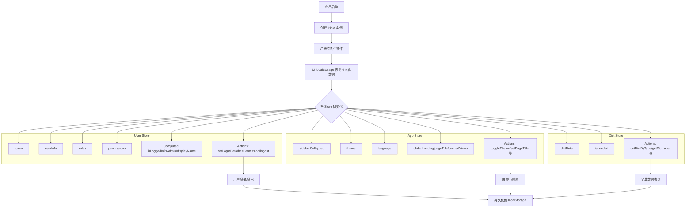

### 2.4 逻辑分析

**架构模式分析：**

项目采用 Setup Store 写法，这是 Pinia 与 Vue 3 Composition API 深度结合的最佳实践。与 Options Store 相比，Setup Store 具有以下优势：一是更自然的 TypeScript 类型推断，无需额外的类型声明；二是更好的代码组织能力，可以自由组合 `ref`、`computed` 等响应式 API；三是更高的灵活性，可以在 Store 内部使用其他组合式函数。

**模块化设计：**

三个 Store 按照职责边界清晰划分：

- **user store**：身份认证域，管理用户身份相关的所有数据
- **app store**：UI 配置域，管理界面展示相关的全局状态
- **dict store**：数据缓存域，管理系统枚举数据的缓存与访问

这种划分遵循了"单一职责原则"，每个 Store 只负责一个领域的状态，降低了模块间的耦合度。同时通过 `stores/index.js` 统一导出，使用方只需从 `@/stores` 导入即可，无需关心具体模块路径。

**持久化策略：**

持久化配置非常精细化，不是对整个 Store 进行持久化，而是通过 `paths` 选项选择性地持久化关键状态。例如 user store 持久化了所有身份数据（保证刷新不丢失登录状态），app store 只持久化 UI 偏好设置（侧边栏、主题、语言），而 globalLoading、pageTitle 等瞬时状态则不持久化。

这种"关键状态持久化 + 瞬时状态内存化"的策略平衡了用户体验与数据一致性，避免了不必要的 localStorage 读写开销。

**权限检查逻辑：**

`hasPermission` 方法的设计体现了良好的工程实践：

1. **admin 特权**：管理员角色自动拥有所有权限，这是 RBAC 系统的常见设计
2. **空列表处理**：权限列表为空时返回 false，避免误授权
3. **数组支持**：支持传入权限数组，满足"或"逻辑（满足任意一个即可）
4. **字符串转译**：在 `getDictItem` 中使用 `String()` 进行值比较，避免数字/字符串类型不一致导致的匹配失败

### 2.5 数据流图

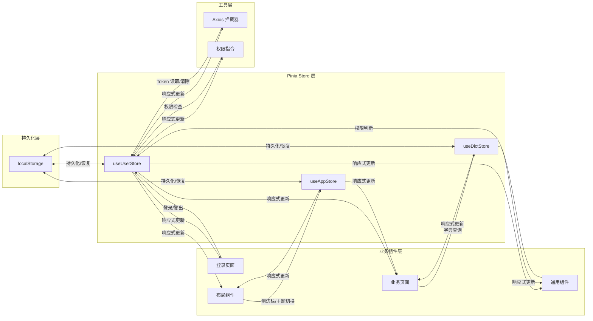

### 2.6 项目实际代码示例

**stores/index.js 入口文件：**

```javascript
import { createPinia } from "pinia";
import piniaPluginPersistedstate from "pinia-plugin-persistedstate";

const pinia = createPinia();
pinia.use(piniaPluginPersistedstate);

export default pinia;

export * from "./modules/user";
export * from "./modules/app";
export * from "./modules/dict";
```

**stores/index.js 入口文件（带详细注释）：**

```javascript
import { createPinia } from "pinia";
import piniaPluginPersistedstate from "pinia-plugin-persistedstate";

// 创建 Pinia 实例 — 一个应用只需创建一个实例
const pinia = createPinia();
// 注册持久化插件：自动将 Store 数据同步到 localStorage
// 注册后，每个 Store 可以通过 persist 配置选项声明需要持久化的状态
pinia.use(piniaPluginPersistedstate);

// 默认导出：在 main.ts 中通过 app.use(pinia) 使用
export default pinia;

// 具名导出所有 Store 模块：业务代码只需 import { useUserStore } from '@/stores'
export * from "./modules/user";
export * from "./modules/app";
export * from "./modules/dict";
```

**stores/modules/user.js 核心逻辑（带详细注释）：**

```javascript
// defineStore 是 Pinia 创建 Store 的 API
// 第一个参数 'user' 是 Store 的唯一 ID，用于 DevTools 标识和持久化 key 生成
// 第二个参数是 Setup 函数，使用 Composition API 风格定义 State/Getters/Actions
export const useUserStore = defineStore(
  "user",
  () => {
    // ═══════════════════════════════════════
    // State：使用 ref 定义响应式状态
    // ═══════════════════════════════════════
    const token = ref(""); // JWT Token 字符串，登录后从接口获取并存储
    // userInfo 包含用户基本信息，初始值为空对象
    const userInfo = ref({ id: null, username: "", name: "", avatar: "" });
    const roles = ref([]); // 用户角色列表，如 ['admin']
    const permissions = ref([]); // 用户权限标识列表，如 ['system:emp:list']

    // ═══════════════════════════════════════
    // Getters：使用 computed 定义派生状态（自动缓存，依赖不变时不重新计算）
    // ═══════════════════════════════════════
    // !! 将空字符串转为布尔值，token 为空则 isLoggedIn 为 false
    const isLoggedIn = computed(() => !!token.value);
    // 检查 roles 数组中是否包含 'admin' 角色
    const isAdmin = computed(() => roles.value.includes("admin"));
    // 显示名称优先取 name，其次 username，都为空则显示'未知用户'
    const displayName = computed(
      () => userInfo.value.name || userInfo.value.username || "未知用户"
    );

    // ═══════════════════════════════════════
    // Actions：定义修改状态的方法
    // ═══════════════════════════════════════

    /**
     * 权限检查方法
     * @param {string|string[]} permission - 单个权限标识或权限数组
     * @returns {boolean} - 是否有权限
     */
    const hasPermission = (permission) => {
      // 管理员拥有所有权限，直接放行
      if (isAdmin.value) return true;
      // 权限列表为空说明未登录或未获取权限，拒绝访问
      if (!permissions.value.length) return false;
      // 如果传入的是数组，采用"或"逻辑：满足任意一个即可
      if (Array.isArray(permission)) {
        return permission.some((p) => permissions.value.includes(p));
      }
      // 单个权限：直接检查是否在权限列表中
      return permissions.value.includes(permission);
    };

    /**
     * 角色检查方法（与 hasPermission 逻辑类似）
     */
    const hasRole = (role) => {
      if (isAdmin.value) return true;
      if (!roles.value.length) return false;
      if (Array.isArray(role)) {
        return role.some((r) => roles.value.includes(r));
      }
      return roles.value.includes(role);
    };

    /**
     * 登录成功后批量设置用户数据
     * @param {Object} data - 登录接口返回的数据
     */
    const setLoginData = (data) => {
      setToken(data.token);
      if (data.userInfo) setUserInfo(data.userInfo);
      if (data.roles) setRoles(data.roles);
      if (data.permissions) setPermissions(data.permissions);
    };

    /**
     * 退出登录：清除所有数据并跳转到登录页
     */
    const logout = async () => {
      token.value = "";
      userInfo.value = { id: null, username: "", name: "", avatar: "" };
      roles.value = [];
      permissions.value = [];
      ElMessage.success("已退出登录");
      const router = useRouter();
      router.push("/login");
    };

    /**
     * 仅清除数据不跳转，用于接口返回 401（Token 过期）时调用
     */
    const clearUserData = () => {
      token.value = "";
      userInfo.value = { id: null, username: "", name: "", avatar: "" };
      roles.value = [];
      permissions.value = [];
    };

    // 返回所有状态和方法，供外部使用
    // Pinia 会自动将这些返回值包装为响应式数据
    return {
      token,
      userInfo,
      roles,
      permissions,
      isLoggedIn,
      isAdmin,
      displayName,
      setLoginData,
      hasPermission,
      hasRole,
      logout,
      clearUserData,
    };
  },
  {
    // ─── 持久化配置 ───
    // pinia-plugin-persistedstate 插件的选项
    persist: {
      key: "tlias-user", // localStorage 中的存储键名
      storage: localStorage, // 使用 localStorage（也可用 sessionStorage）
      // 只持久化这四个状态，其他如 isLoggedIn 是派生状态无需持久化
      paths: ["token", "userInfo", "roles", "permissions"],
    },
  }
);
```

**stores/modules/dict.js 字典缓存（带详细注释）：**

```javascript
export const useDictStore = defineStore(
  "dict",
  () => {
    // dictData 按字典类型分组存储枚举数据
    // 结构：{ 字典类型: [{ label: 显示文本, value: 编码值, tagType?: 标签颜色 }] }
    const dictData = ref({
      // emp_job：员工职位字典
      emp_job: [
        { label: "班主任", value: 1 },
        { label: "讲师", value: 2 },
      ],
      // gender：性别字典
      gender: [
        { label: "男", value: 1 },
        { label: "女", value: 2 },
      ],
    });
    // 标记字典是否已从后端加载完成（预留接口，当前为硬编码）
    const isLoaded = ref(false);

    /** 根据字典类型获取字典列表 */
    const getDictByType = (type) => dictData.value[type] || [];

    /** 根据类型和值获取显示文本 */
    const getDictLabel = (type, value) => {
      const list = getDictByType(type);
      const item = list.find((d) => d.value === value);
      return item ? item.label : "";
    };

    /**
     * 根据类型和值获取完整字典项
     * 使用 String() 转换值进行比较，避免数字/字符串类型不一致导致匹配失败
     * 例如：数据库中 value 是数字 1，前端传入可能是字符串 '1'
     */
    const getDictItem = (type, value) => {
      const list = getDictByType(type);
      return list.find((d) => String(d.value) === String(value)) || null;
    };

    // ...其余方法省略

    return {
      dictData,
      isLoaded,
      getDictByType,
      getDictLabel,
      getDictItem,
      setDictData,
      setAllDictData,
      clearDictData,
      loadDictFromServer,
    };
  },
  {
    persist: {
      key: "tlias-dict",
      storage: localStorage,
      paths: ["dictData", "isLoaded"],
    },
  }
);
```

}

return { dictData, isLoaded, getDictByType, getDictLabel, getDictItem, setDictData, setAllDictData, clearDictData, loadDictFromServer }
}, {
persist: {
key: 'tlias-dict',
storage: localStorage,
paths: ['dictData', 'isLoaded'],
},
})

````

---

## 三、权限指令

### 3.1 功能介绍说明

权限指令系统是前端权限控制的核心实现，基于 Vue 自定义指令（Directive）机制，提供了 `v-permission` 和 `v-role` 两个指令，分别用于权限标识和角色标识的细粒度 UI 级权限控制。开发者只需在 DOM 元素或组件上添加相应指令，即可根据当前用户的权限/角色列表自动控制元素的显示与隐藏。

该权限系统采用了"运行时检查 + DOM 移除"的实现策略，在指令的 `mounted` 钩子中进行权限校验，无权限时直接从 DOM 树中移除元素，而非仅通过 CSS 隐藏，从根本上避免了无权限用户通过开发者工具查看或操作敏感元素的风险。

### 3.2 详细实现步骤

**步骤一：定义权限指令 v-permission**

1. 导入 `useUserStore` 获取用户状态
2. 在 `mounted` 钩子中获取指令绑定值（权限标识）
3. 边界检查：如果未传入权限标识，输出警告并返回
4. 调用 `userStore.hasPermission(value)` 检查权限
5. 无权限时，通过 `el.parentNode?.removeChild(el)` 从 DOM 中移除元素

**步骤二：定义角色指令 v-role**

1. 导入 `useUserStore` 获取用户状态
2. 在 `mounted` 钩子中获取指令绑定值（角色标识）
3. 边界检查：如果未传入角色标识，输出警告并返回
4. 调用 `userStore.hasRole(value)` 检查角色
5. 无权限时，通过 `el.parentNode?.removeChild(el)` 从 DOM 中移除元素

**步骤三：封装注册函数**

1. 创建 `setupDirectives` 函数，接收 Vue 应用实例 `app`
2. 批量调用 `app.directive()` 注册所有自定义指令
3. 在应用入口 `main.ts` 中调用此函数完成注册

**步骤四：使用方式说明**

- 单个权限：`v-permission="'system:emp:add'"`
- 多个权限（满足任意一个）：`v-permission="['system:emp:add', 'system:emp:edit']"`
- 单个角色：`v-role="'admin'"`
- 多个角色：`v-role="['admin', 'teacher']"`

### 3.3 流程图

```mermaid
flowchart TD
    A[组件挂载] --> B[指令 mounted 钩子触发]
    B --> C[获取 userStore 实例]
    C --> D[获取指令绑定值 value]
    D --> E{value 是否为空?}
    E -->|是| F[输出警告信息]
    E -->|否| G[调用权限检查方法]

    G --> H{v-permission 指令?}
    H -->|是| I[userStore.hasPermission]
    H -->|否| J[userStore.hasRole]

    I --> K{是否有权限?}
    J --> K

    K -->|有权限| L[保留元素，正常渲染]
    K -->|无权限| M[获取父节点 parentNode]
    M --> N{parentNode 是否存在?}
    N -->|是| O[removeChild 移除元素]
    N -->|否| P[元素已不在 DOM 中，忽略]
    O --> Q[元素从 DOM 树中消失]
    P --> Q
````

### 3.4 逻辑分析

**实现机制分析：**

权限指令基于 Vue 的自定义指令生命周期钩子 `mounted` 实现。选择 `mounted` 而非 `created` 或 `beforeMount` 的原因是：只有在 `mounted` 阶段，元素才真正被插入到 DOM 树中，其父节点才存在，此时才能执行 `removeChild` 操作。

**安全策略分析：**

采用 DOM 移除而非 CSS 隐藏（`display: none` 或 `visibility: hidden`）是一个重要的安全设计。如果仅用 CSS 隐藏，用户可以通过浏览器开发者工具修改样式后看到甚至操作敏感按钮；而直接移除 DOM 节点则从根本上杜绝了这种可能，提升了前端权限控制的安全性。

**可选链操作符的使用：**

`el.parentNode?.removeChild(el)` 中的 `?.` 可选链操作符是一个防御性编程细节。理论上 mounted 阶段的元素必然有父节点，但考虑到某些特殊场景（如元素被其他逻辑提前移除、Teleport 传送等），使用可选链可以避免报错导致整个应用崩溃。

**权限检查的委托设计：**

指令本身不包含任何权限判断逻辑，所有权限校验都委托给 `userStore.hasPermission` 和 `userStore.hasRole` 方法。这种"单一职责"的设计有两个好处：一是权限逻辑集中管理，修改权限判断规则时只需改 Store 中的一处代码；二是指令保持轻量，专注于 DOM 操作。

**数组参数的支持：**

两个指令都支持传入数组形式的权限/角色标识，采用"或"逻辑（满足任意一个即可）。这种设计覆盖了大多数业务场景，例如"新增或编辑权限的用户都可以看到保存按钮"。如果需要"与"逻辑，开发者可以在业务代码中自行组合。

**潜在局限：**

当前实现仅在 `mounted` 阶段检查一次权限，如果用户登录后权限发生动态变化（如刷新权限列表），已渲染的元素不会自动更新。对于大多数后台管理系统而言，权限变更通常伴随重新登录，这个局限影响不大。如果需要支持动态权限更新，可以增加 `updated` 钩子或使用 watch 监听权限变化。

### 3.5 数据流图

```mermaid
flowchart LR
    subgraph 数据源层
        A[localStorage 持久化数据]
        B[登录接口返回数据]
    end

    subgraph 状态层
        C[useUserStore]
        D[permissions 权限列表]
        E[roles 角色列表]
    end

    subgraph 指令层
        F[v-permission 指令]
        G[v-role 指令]
    end

    subgraph 视图层
        H[按钮/菜单元素]
        I[组件 DOM]
    end

    A -->|初始化恢复| C
    B -->|登录后设置| C
    C --> D
    C --> E

    D -->|权限判断| F
    E -->|角色判断| G

    F -->|控制显示/移除| H
    G -->|控制显示/移除| I
```

### 3.6 项目实际代码示例

**directives/permission.js 完整实现（带详细注释）：**

```javascript
import { useUserStore } from "@/stores";

/**
 * v-permission 权限指令
 * 用法：<el-button v-permission="'system:emp:add'">新增</el-button>
 *
 * Vue 自定义指令对象，包含以下生命周期钩子：
 *   - mounted：元素插入 DOM 后调用（权限检查在此阶段执行）
 *   - updated：元素更新后调用（本指令未使用，如需支持动态权限可添加）
 */
export const permission = {
  /**
   * mounted 钩子：元素挂载到 DOM 后触发
   * @param {HTMLElement} el - 指令绑定的 DOM 元素
   * @param {Object} binding - 指令绑定信息对象
   *   - binding.value：指令绑定的值，如 v-permission="'system:emp:add'" 中的 "'system:emp:add'"
   *   - binding.arg：指令参数，如 v-permission:admin 中的 "admin"
   *   - binding.modifiers：指令修饰符，如 v-permission.admin 中的 { admin: true }
   */
  mounted(el, binding) {
    // 获取 Pinia 用户状态实例，用于权限检查
    const userStore = useUserStore();
    // 获取指令绑定的权限标识值
    const value = binding.value;

    // 边界检查：如果开发者忘记传入权限标识，输出警告并终止
    if (!value) {
      console.warn("[v-permission] 未传入权限标识");
      return;
    }

    // 委托 userStore.hasPermission 进行权限校验
    // hasPermission 内部逻辑：管理员返回 true，否则检查 permissions 数组
    const hasPermission = userStore.hasPermission(value);

    // 无权限时从 DOM 中彻底移除元素
    // 使用可选链 ?. 防止 el.parentNode 为 null 时报错（如元素已被其他逻辑移除）
    if (!hasPermission) {
      el.parentNode?.removeChild(el);
    }
  },
};

/**
 * v-role 角色指令
 * 用法：<div v-role="'admin'">管理员面板</div>
 * 实现逻辑与 v-permission 完全相同，区别在于调用 userStore.hasRole() 而非 hasPermission()
 */
export const role = {
  mounted(el, binding) {
    const userStore = useUserStore();
    const value = binding.value;

    if (!value) {
      console.warn("[v-role] 未传入角色标识");
      return;
    }

    const hasRole = userStore.hasRole(value);

    if (!hasRole) {
      el.parentNode?.removeChild(el);
    }
  },
};

/**
 * 统一注册所有自定义指令
 * 在 main.ts 中调用此函数，将所有指令注册到 Vue 应用实例
 * @param {App} app - Vue 应用实例
 */
export const setupDirectives = (app) => {
  // app.directive('permission', permission) 注册为全局指令
  // 注册后，所有组件模板中可直接使用 v-permission，无需在每个组件中单独导入
  app.directive("permission", permission);
  app.directive("role", role);
};
```

**使用示例（业务组件中）：**

```vue
<template>
  <!-- 单个权限控制 -->
  <el-button type="primary" v-permission="'system:emp:add'" @click="handleAdd">
    新增员工
  </el-button>

  <!-- 多个权限（满足任意一个） -->
  <el-button
    v-permission="['system:emp:edit', 'system:emp:view']"
    @click="handleView"
  >
    查看详情
  </el-button>

  <!-- 角色控制 -->
  <el-button type="danger" v-role="'admin'" @click="handleDelete">
    删除
  </el-button>

  <!-- 多角色控制 -->
  <div v-role="['admin', 'manager']" class="admin-panel">管理员面板</div>
</template>
```

---

## 四、通用业务组件库

### 4.1 功能介绍说明

通用业务组件库是项目复用能力的核心载体，基于 Element Plus 组件库进行二次封装，提供了 6 个高频业务组件：ProTable（高级表格）、DictTag（字典标签）、ImageUpload（图片上传）、PageHeader（页面头部）、ProFormDialog（表单弹窗）、TableSkeleton（表格骨架屏）。这些组件覆盖了后台管理系统中最常见的业务场景，通过统一的封装减少重复代码，提升开发效率。

组件库采用"按需注册 + 全局可用"的策略，通过 `components/common/index.ts` 中的 `setupCommonComponents` 函数批量注册为全局组件，业务页面可以直接使用无需单独导入。同时也支持具名导出，满足按需导入的需求。

### 4.2 详细实现步骤

**步骤一：ProTable 高级表格组件实现**

1. **搜索区域**：根据 `searchColumns` 配置自动生成搜索表单，支持 input、select、date 三种类型
2. **工具栏区域**：左侧支持新增、批量删除按钮，右侧支持列设置下拉菜单
3. **表格主体**：基于 el-table 封装，支持多选、序号列、动态列显隐、自定义列插槽
4. **分页区域**：集成 el-pagination，支持页码和每页条数切换
5. **骨架屏**：加载时显示 TableSkeleton 骨架屏，提升感知体验
6. **列配置持久化**：通过 useTableColumns composable 实现列设置的本地存储
7. **暴露方法**：clearSelection、searchForm、pagination 等

**步骤二：DictTag 字典标签组件实现**

1. 接收 `dictType`（字典类型）和 `value`（字典值）两个 props
2. 调用 `useDictStore().getDictItem()` 获取字典项
3. 根据字典项的 tagType 属性设置 el-tag 的类型
4. 显示字典项的 label，找不到时显示 `-`

**步骤三：ImageUpload 图片上传组件实现**

1. 基于 el-upload 封装，配置 `accept="image/*"` 限制图片类型
2. 支持 `v-model` 双向绑定图片 URL
3. `beforeUpload` 钩子校验文件类型和大小
4. 上传成功后更新 modelValue 并触发 change 事件
5. 自定义上传区域样式：有图片时显示预览+遮罩编辑，无图时显示占位提示
6. 自动从 userStore 获取 token 并设置到请求头

**步骤四：PageHeader 页面头部组件实现**

1. 基于 el-card 封装，提供统一的页面标题样式
2. 支持 `title` 主标题和 `description` 描述文本
3. 支持 `showBack` 返回按钮和自定义 `backPath` 返回路径
4. 右侧通过 `extra` 插槽放置操作按钮

**步骤五：ProFormDialog 表单弹窗组件实现**

1. 基于 el-dialog 和 el-form 组合封装
2. 支持 `v-model` 控制显示隐藏
3. 通过 `initialData` 设置表单初始值
4. 通过 `rules` 配置表单验证规则
5. 弹窗打开时自动重置表单，关闭时同步更新 v-model
6. 提交时自动校验表单，校验通过后触发 submit 事件
7. 暴露 formData、formRef、resetForm 供父组件调用

**步骤六：组件统一注册**

1. 在 index.ts 中导入所有通用组件
2. 定义 components 数组统一管理
3. 实现 `setupCommonComponents` 函数遍历注册为全局组件
4. 同时具名导出所有组件，支持按需导入

### 4.3 流程图

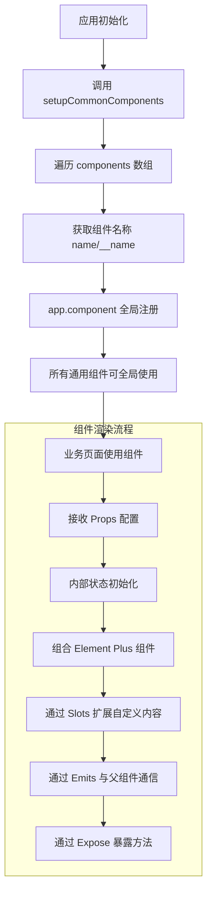

### 4.4 逻辑分析

**封装策略分析：**

通用组件采用了"约定优于配置"的设计理念。以 ProTable 为例，它内置了搜索、工具栏、表格、分页的标准布局，并提供了大量默认值，使得最简单的使用只需传入 `columns`、`data`、`total` 三个 props 即可工作。同时，组件又通过丰富的插槽和事件提供了足够的扩展点，满足复杂场景的定制需求。

**Props 与 Slots 的平衡：**

每个组件都精心设计了 Props 与 Slots 的边界。简单的配置项通过 Props 传入（如 title、width、loading），复杂的自定义内容通过 Slots 扩展（如搜索表单、表格列、工具栏）。这种设计既保证了常用场景的简洁性，又保留了复杂场景的灵活性。

**v-model 双向绑定：**

ImageUpload 和 ProFormDialog 都实现了 `v-model` 支持，这是 Vue 3 组件封装的最佳实践。通过 `modelValue` prop 和 `update:modelValue` 事件，实现了父组件与子组件数据的双向同步，使用方式简洁直观。

**暴露方法（defineExpose）：**

ProTable 和 ProFormDialog 都使用 `defineExpose` 暴露了内部方法和属性（如 clearSelection、formRef、resetForm）。这是组合式 API 组件与父组件交互的重要方式，父组件可以通过模板 ref 直接调用这些方法，实现更复杂的控制逻辑。

**与 Store 的集成：**

DictTag 和 ImageUpload 直接依赖对应的 Store（dictStore 和 userStore），这种"组件 + Store"的深度集成虽然增加了耦合度，但极大提升了使用便捷性。对于业务组件库来说，这种权衡是合理的，因为这些组件本身就是为特定业务系统设计的，而非通用的 UI 库。

**TypeScript 支持：**

所有组件都使用 `<script setup lang="ts">` 编写，并定义了清晰的 Props 接口。这为使用方提供了良好的类型提示和代码补全，降低了使用门槛，减少了因参数错误导致的 bug。

### 4.5 数据流图

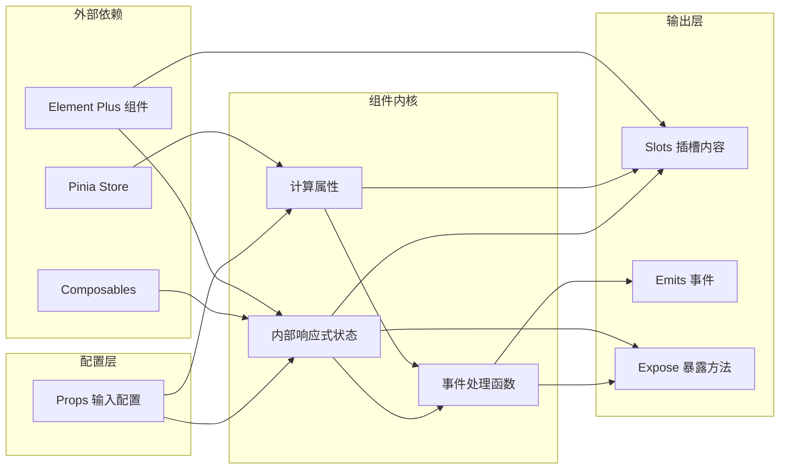

### 4.6 项目实际代码示例

**components/common/index.ts 统一注册（带详细注释）：**

```typescript
import type { App, Component } from "vue";
import DictTag from "./DictTag.vue";
import ProTable from "./ProTable.vue";
import ProFormDialog from "./ProFormDialog.vue";
import ImageUpload from "./ImageUpload.vue";
import PageHeader from "./PageHeader.vue";
import TableSkeleton from "./TableSkeleton.vue";

// 将所有通用组件收集到一个数组中统一管理
// 当需要新增组件时，只需在这里 import 并添加到数组即可
const components: Component[] = [
  DictTag,
  ProTable,
  ProFormDialog,
  ImageUpload,
  PageHeader,
  TableSkeleton,
];

/**
 * 批量注册通用组件为全局组件
 * 在 main.ts 中调用此函数后，所有组件模板中可直接使用组件名，无需单独 import
 * @param app - Vue 应用实例
 *
 * 注册原理：
 *   app.component(name, component) 将组件注册为全局可用
 *   组件名取自组件的 name 或 __name 属性
 *   例如 DictTag.vue 注册后，模板中可直接写 <DictTag />
 */
export function setupCommonComponents(app: App): void {
  components.forEach((component) => {
    // 获取组件名称（兼容多种组件定义方式）
    const name = (component as any).name || (component as any).__name;
    if (name) {
      // 注册为全局组件，所有 Vue 组件无需 import 即可使用
      app.component(name, component);
    }
  });
}

// 同时具名导出，支持按需导入：import { DictTag, ProTable } from '@/components/common'
export {
  DictTag,
  ProTable,
  ProFormDialog,
  ImageUpload,
  PageHeader,
  TableSkeleton,
};
```

**DictTag.vue 字典标签（带详细注释）：**

```vue
<template>
  <!-- v-if：如果找到了对应的字典项，渲染 el-tag 标签 -->
  <!-- :type 动态设置标签颜色（如 success=绿色, warning=橙色） -->
  <!-- effect="light" 设置浅色填充效果 -->
  <el-tag v-if="dictItem" :type="dictItem.tagType || 'info'" effect="light">
    {{ dictItem.label }}
    <!-- 显示字典的 label，如 "班主任" -->
  </el-tag>
  <!-- v-else：未找到字典项时显示 "-" -->
  <span v-else>-</span>
</template>

<script setup lang="ts">
import { computed } from "vue";
import { useDictStore } from "@/stores/modules/dict";

// 定义组件 Props 的 TypeScript 接口
interface Props {
  dictType: string; // 字典类型，如 "emp_job"、"gender"
  value: string | number; // 字典值，如 1、"1"
}

// 接收父组件传入的 props
const props = defineProps<Props>();
// 获取字典 Store 实例
const dictStore = useDictStore();

// 计算属性：根据 props 查询字典项
// 当 dictType 或 value 变化时自动重新计算
const dictItem = computed(() => {
  // 调用字典 Store 的 getDictItem 方法，内部使用 String() 转换避免类型不一致
  return dictStore.getDictItem(props.dictType, props.value);
});
</script>
```

**ProFormDialog.vue 表单弹窗核心逻辑（带详细注释）：**

```vue
<script setup lang="ts">
import { ref, watch, reactive } from "vue";
import type { FormInstance, FormRules } from "element-plus";

// 定义 Props 接口
interface Props {
  modelValue: boolean; // v-model 绑定的可见性状态
  title?: string; // 弹窗标题
  width?: string | number; // 弹窗宽度，默认 600px
  rules?: FormRules; // Element Plus 表单验证规则
  initialData?: Record<string, any>; // 表单初始数据（编辑时传入）
  submitLoading?: boolean; // 提交按钮加载状态
}

// withDefaults：为 Props 设置默认值
// rules 和 initialData 的默认值使用工厂函数返回新对象，避免多个实例共享同一引用
const props = withDefaults(defineProps<Props>(), {
  title: "",
  width: "600px",
  rules: () => ({}),
  initialData: () => ({}),
  submitLoading: false,
});

// 定义 Emits：组件向父组件发送的事件
// "update:modelValue" 是 Vue 3 v-model 的标准事件名
// submit 事件携带表单数据，父组件通过 @submit="handleSubmit" 接收
const emit = defineEmits<{
  "update:modelValue": [val: boolean];
  submit: [formData: Record<string, any>];
}>();

// ─── 内部响应式状态 ───
// formRef：Element Plus 表单组件的实例引用，用于调用 validate/resetFields 等方法
const formRef = ref<FormInstance>();
// visible：控制弹窗显示/隐藏的本地状态（与 props.modelValue 双向同步）
const visible = ref(props.modelValue);
// formData：表单数据对象，使用 reactive 使其具备响应性
// 初始值从 props.initialData 浅拷贝而来，编辑时预填充数据
const formData = reactive<Record<string, any>>({ ...props.initialData });

// ─── 监听 props.modelValue 变化 ───
// 当父组件修改 v-model 绑定的值时，同步更新 visible 状态
// 弹窗打开时（val === true），自动重置表单数据
watch(
  () => props.modelValue,
  (val) => {
    visible.value = val;
    if (val) resetForm();
  }
);

/** 重置表单：清空表单验证状态，并用 initialData 重新填充数据 */
function resetForm() {
  formRef.value?.resetFields(); // Element Plus 表单方法，清除所有字段的验证状态
  // 清空 formData 中的所有字段
  Object.keys(formData).forEach((key) => delete formData[key]);
  // 将 initialData 的字段重新赋值到 formData
  Object.assign(formData, props.initialData);
}

/** 提交表单：先执行验证，验证通过后再触发 submit 事件 */
function handleSubmit() {
  // formRef.value?.validate() 触发 Element Plus 表单验证
  // 回调参数 valid 为 true 表示所有规则通过
  formRef.value?.validate((valid) => {
    if (valid) {
      // 验证通过，将 formData 的浅拷贝发送给父组件
      // 使用 { ...formData } 避免父组件直接修改子组件内部状态
      emit("submit", { ...formData });
    }
  });
}

// ─── 向父组件暴露内部方法和属性 ───
// defineExpose 是 <script setup> 组件暴露内部成员的 API
// 父组件通过 ref 可以调用这些方法和属性
defineExpose({ formData, formRef, resetForm });
</script>
```

---

## 五、错误边界

### 5.1 功能介绍说明

错误边界（ErrorBoundary）是前端应用的重要防护机制，基于 Vue 3 的 `onErrorCaptured` 生命周期钩子实现，用于捕获子组件树中的 JavaScript 错误，阻止错误冒泡导致整个应用崩溃（白屏）。当子组件发生渲染错误时，错误边界会展示友好的降级 UI，包含错误提示、重试按钮、刷新按钮，并在开发环境下显示详细的错误堆栈信息，便于调试定位问题。

该组件是应用容错体系的核心组成部分，遵循了 React 生态中"错误边界"的设计思想，并结合 Vue 的 API 特点进行了适配，是保障应用稳定性和用户体验的关键防线。

### 5.2 详细实现步骤

**步骤一：定义组件 Props**

1. `errorMessage`：自定义错误提示文案，默认为"页面出现异常"
2. `showRetry`：是否显示重试按钮，默认为 true
3. `showDetail`：是否显示错误详情，默认在开发环境（import.meta.env.DEV）下开启

**步骤二：定义内部状态**

1. `hasError`：布尔值，标记是否捕获到错误
2. `errorInfo`：对象，存储错误详情（message、stack、component、info）

**步骤三：实现错误捕获逻辑**

1. 使用 `onErrorCaptured` 钩子注册错误捕获函数
2. 接收三个参数：error（错误对象）、instance（触发错误的组件实例）、info（错误类型信息）
3. 设置 `hasError = true`，记录错误信息到 `errorInfo`
4. 通过 emit 触发 `error` 事件，将错误信息上报给父组件
5. 返回 `false`，阻止错误继续向上传播

**步骤四：实现用户操作方法**

1. `handleRetry`：重置错误状态，让 Vue 重新渲染子组件
2. `handleRefresh`：调用 `window.location.reload()` 刷新整个页面

**步骤五：实现降级 UI 模板**

1. 当 `hasError` 为 true 时，显示错误边界页面
2. 包含：警告图标、错误标题、描述文案
3. 开发环境显示详细错误信息（message + 可折叠的 stack）
4. 底部操作区：重试按钮（可选）、刷新页面按钮
5. 当 `hasError` 为 false 时，通过默认 slot 正常渲染子组件

**步骤六：样式设计**

1. 居中布局，最小高度 300px
2. 警告图标使用 SVG 绘制，橙色主题
3. 错误详情区域使用灰色背景，代码样式
4. 按钮区域居中排列，间距均匀

### 5.3 流程图

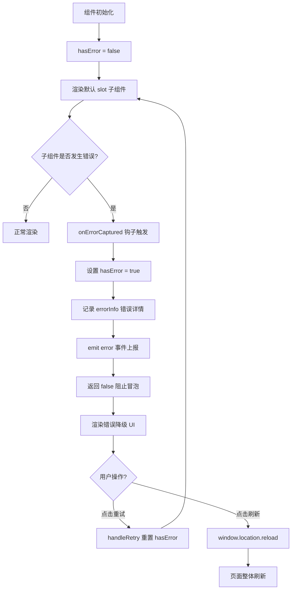

### 5.4 逻辑分析

**错误捕获机制：**

`onErrorCaptured` 是 Vue 3 提供的错误捕获钩子，它会捕获来自所有后代组件的错误。这个钩子可以在组件的 setup 函数或选项式 API 中使用。钩子函数返回 `false` 是一个关键细节——它告诉 Vue 这个错误已经被处理了，不需要继续向上传播，从而避免了全局错误处理器的重复触发。

**错误信息结构：**

除了标准的 `message` 和 `stack`，组件还额外记录了 `component`（组件名称）和 `info`（错误类型信息，如 "setup function"、"render function"、"lifecycle hook" 等）。这些信息对于定位问题非常有价值，特别是在复杂的组件树中，可以快速知道是哪个组件的哪个阶段出了问题。

**重试机制的设计：**

"重试"按钮的核心逻辑是将 `hasError` 重置为 `false`，这会触发组件重新渲染默认 slot。这种机制对于一些临时性错误（如网络抖动导致数据异常、状态不一致等）非常有效，用户无需刷新整个页面就可以恢复。但需要注意的是，如果错误是由代码逻辑 bug 导致的，重试后还是会再次出错，此时用户可以选择"刷新页面"。

**开发与生产的差异化：**

`showDetail` 的默认值设置为 `import.meta.env.DEV`，这是一个典型的环境差异化设计。在开发环境，开发者需要看到完整的错误堆栈来调试问题；而在生产环境，向用户暴露详细的错误信息既不友好也不安全（可能泄露系统内部信息）。生产环境只展示通用提示文案，同时通过 `error` 事件将错误上报到监控系统。

**作用范围：**

错误边界只能捕获子组件渲染阶段的错误，以下类型的错误无法被捕获：

- 事件处理器中的错误（需要 try/catch 手动处理）
- 异步代码中的错误（如 setTimeout、Promise 回调）
- 服务端渲染（SSR）中的错误
- 错误边界自身抛出的错误

因此，错误边界是应用容错体系的一部分，而非全部，需要配合全局错误处理器、接口错误处理等机制共同保障应用稳定性。

### 5.5 数据流图

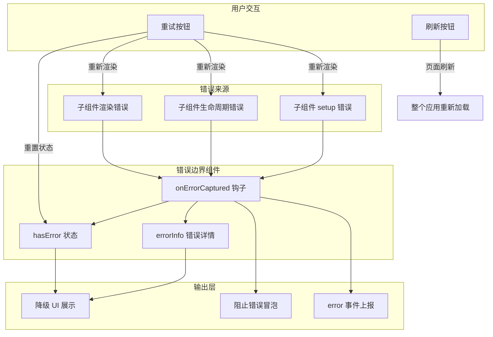

### 5.6 项目实际代码示例

**ErrorBoundary.vue 完整实现（带详细注释）：**

```vue
<script setup>
import { ref, onErrorCaptured } from 'vue'

// ─── Props 定义 ───
const props = defineProps({
  // 错误提示文案，默认 "页面出现异常"
  errorMessage: {
    type: String,
    default: '页面出现异常'
  },
  // 是否显示重试按钮，默认显示
  showRetry: {
    type: Boolean,
    default: true
  },
  // 是否显示错误详情，默认值取决于环境：开发环境显示，生产环境隐藏
  // import.meta.env.DEV 在构建时被 Vite 替换为 true/false 字面量
  showDetail: {
    type: Boolean,
    default: import.meta.env.DEV
  }
})

// ─── Emits 定义 ───
// 定义组件可以向父组件发送的事件
// 'error' 事件携带错误详情对象，父组件可通过 @error="handleError" 接收
const emit = defineEmits(['error'])

// ─── 内部响应式状态 ───
// hasError：标记是否捕获到错误，true 时显示错误降级 UI
const hasError = ref(false)

// errorInfo：存储捕获到的错误详情
const errorInfo = ref({
  message: '',  // 错误消息
  stack: ''     // 错误堆栈跟踪
})

/**
 * onErrorCaptured：Vue 3 错误捕获生命周期钩子
 * 当子组件树中发生错误时自动触发
 *
 * @param {Error} error - 捕获到的错误对象
 * @param {ComponentPublicInstance} instance - 触发错误的组件实例
 * @param {string} info - 错误类型信息，如 "render function"、"mounted hook"
 *
 * 关键：返回 false 表示"此错误已被处理"，阻止错误继续向上传播到全局错误处理器
 */
onErrorCaptured((error, instance, info) => {
  // 标记已捕获错误，触发降级 UI 渲染
  hasError.value = true

  // 记录完整的错误信息，包括组件名称和错误类型
  errorInfo.value = {
    message: error.message,
    stack: error.stack,
    // 获取触发错误的组件名称，用于快速定位问题组件
    component: instance?.$options?.name || 'Anonymous',
    info  // 错误发生的阶段信息
  }

  // 向父组件发送错误事件，父组件可据此上报到监控系统
  emit('error', errorInfo.value)

  // 返回 false 阻止错误冒泡到全局错误处理器
  // 如果不返回 false，Vue 会继续向上传递错误，可能触发 app.config.errorHandler
  return false
})

/**
 * 重试按钮点击处理
 * 重置错误状态，让 Vue 重新渲染默认 slot 中的子组件
 * 适用于临时性错误（如网络抖动、数据异常）
 */
const handleRetry = () => {
  hasError.value = false
  errorInfo.value = { message: '', stack: '' }
}

/**
 * 刷新页面按钮点击处理
 * 调用浏览器原生 API 刷新整个页面
 * 适用于无法通过重试恢复的错误
 */
const handleRefresh = () => {
  window.location.reload()
}
</script>
}
</script>

<template>
  <div v-if="hasError" class="error-boundary">
    <div class="error-boundary-content">
      <div class="error-icon">
        <svg viewBox="0 0 24 24" fill="none" xmlns="http://www.w3.org/2000/svg">
          <circle cx="12" cy="12" r="10" stroke="#E6A23C" stroke-width="2" />
          <path d="M12 8V12" stroke="#E6A23C" stroke-width="2" stroke-linecap="round" />
          <circle cx="12" cy="16" r="1" fill="#E6A23C" />
        </svg>
      </div>
      <h3 class="error-title">{{ errorMessage }}</h3>
      <p class="error-desc">请尝试刷新页面或联系管理员</p>

      <div v-if="showDetail && errorInfo.stack" class="error-detail">
        <pre>{{ errorInfo.message }}</pre>
        <details>
          <summary>查看详细信息</summary>
          <pre>{{ errorInfo.stack }}</pre>
        </details>
      </div>

      <div class="error-actions">
        <el-button v-if="showRetry" type="primary" @click="handleRetry">
          重试
        </el-button>
        <el-button @click="handleRefresh">
          刷新页面
        </el-button>
      </div>
    </div>
  </div>

  <slot v-else />
</template>
```

**使用方式示例：**

```vue
<template>
  <ErrorBoundary :error-message="'数据加载失败'" @error="handleError">
    <DataTable :data="tableData" />
  </ErrorBoundary>
</template>

<script setup>
import ErrorBoundary from "@/components/ErrorBoundary.vue";

function handleError(errorInfo) {
  console.error("组件出错了:", errorInfo);
}
</script>
```

---

## 六、Axios 请求封装

### 6.1 功能介绍说明

Axios 请求封装是项目前后端通信的基础设施，基于 axios 库进行了深度定制，提供了一整套企业级 HTTP 请求解决方案。核心能力包括：统一的请求/响应拦截、Token 自动注入、全局 Loading 状态管理、请求取消与防重复、接口重试机制、请求缓存、错误码统一处理、白名单机制等。

该封装采用了"配置中心化 + 拦截器流水线"的架构设计，将各种横切关注点（认证、日志、错误处理、性能优化等）通过拦截器串联起来，业务代码只需关注数据本身，无需关心底层的 HTTP 细节，大幅提升了开发效率和代码一致性。

### 6.2 详细实现步骤

**步骤一：基础配置与常量定义**

1. 设置 `BASE_URL = "/api"`，配合 Vite 代理转发
2. 设置 `TIMEOUT = 15000`，请求超时时间 15 秒
3. 定义重试配置：`RETRY_COUNT = 2`、`RETRY_DELAY = 1000`
4. 定义白名单：`WHITE_LIST`（不需要 Token 的接口）
5. 定义 `NO_RETRY_METHODS`：POST/PUT/DELETE 等非幂等请求不重试

**步骤二：请求队列与取消机制**

1. 使用 `pendingRequests = new Map()` 维护待处理请求队列
2. `generateRequestKey`：根据 method、url、params、data 生成唯一标识
3. `addPendingRequest`：请求发起前检查是否重复，重复则取消前一个
4. `removePendingRequest`：请求完成后从队列移除
5. `cancelAllRequests`：取消所有请求（路由切换时调用）

**步骤三：全局 Loading 管理**

1. 使用 `loadingInstance` 和 `loadingCount` 管理 Loading 状态
2. `showLoading`：loadingCount 为 0 时创建 Loading 实例，计数 +1
3. `hideLoading`：计数 -1，减到 0 时关闭 Loading
4. 通过引用计数避免多个请求同时进行时 Loading 闪烁

**步骤四：请求缓存机制**

1. 使用 `requestCache = new Map()` 存储缓存数据
2. 设置 `CACHE_MAX_AGE = 5 分钟`、`CACHE_MAX_SIZE = 200`
3. `generateCacheKey`：根据 method、url、排序后的 params 生成缓存键
4. `getCache`：读取缓存，过期自动删除
5. `setCache`：写入缓存，超过最大数量时删除最早的（FIFO）
6. `clearCache`：支持按模式清除缓存或全部清除

**步骤五：请求拦截器实现**

1. 开发环境打印请求日志
2. 检查 cache 配置且为 GET 请求时，优先从缓存读取，命中直接返回
3. 调用 `addPendingRequest` 加入请求队列
4. 从 userStore 获取 token，非白名单接口自动添加到请求头
5. 需要 Loading 的接口调用 `showLoading`
6. 请求发送失败时隐藏 Loading 并提示错误

**步骤六：响应拦截器实现**

1. 缓存数据直接返回（\_\_fromCache 标记）
2. 开发环境打印响应日志
3. 调用 `removePendingRequest` 从队列移除
4. 调用 `hideLoading` 关闭 Loading
5. 成功的 GET 请求且配置了 cache 时，写入缓存
6. 根据业务状态码 `code` 判断成功/失败（code === 1 为成功）
7. 401 状态码时清除用户数据并跳转到登录页
8. 其他错误使用 ElMessage 统一提示

**步骤七：错误处理与重试**

1. 从 pending 队列移除、关闭 Loading
2. 如果是取消的请求，直接 reject 不提示
3. 401 错误：清除用户数据，跳转登录页
4. 403 错误：提示权限不足
5. 网络超时/错误时，幂等请求自动重试（最多 2 次，延迟 1 秒）
6. 其他错误统一提示用户友好的错误信息

**步骤八：错误信息映射**

1. 定义 `ERROR_MESSAGE_MAP` 映射常见 HTTP 状态码到中文提示
2. `getErrorMessage` 函数优先使用后端返回的 msg，其次使用映射表，最后使用默认文案
3. 特殊处理超时和网络错误

### 6.3 流程图

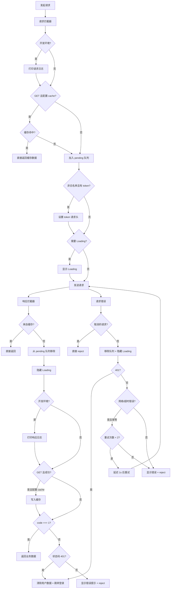

### 6.4 逻辑分析

**架构设计分析：**

整个封装采用了经典的"拦截器管道"模式，请求和响应各自经历一条处理流水线。这种架构的优势在于：每个关注点（日志、缓存、认证、Loading、错误处理等）都是独立的，可以单独调整和替换，不会影响其他部分。同时，业务代码完全感知不到这些底层处理，保持了业务逻辑的纯净。

**请求取消与防重复：**

重复请求是前端开发中的常见问题（如用户快速双击按钮、网络慢时多次点击等）。项目通过 `pendingRequests` Map 管理进行中的请求，每次发起新请求前检查是否有相同 key 的请求正在进行，如果有就取消前一个。这种策略既避免了重复请求浪费服务器资源，也保证了最新请求的响应不会被旧请求覆盖。

`cancelAllRequests` 函数用于路由切换时取消所有未完成的请求，这是一个重要的性能优化和用户体验细节——用户离开页面后，该页面的请求不再有意义，继续等待只会浪费资源，甚至可能因为组件已卸载而导致报错。

**Loading 引用计数：**

使用 `loadingCount` 引用计数而非简单的布尔值是一个精妙设计。当多个请求同时进行时，只有第一个请求会显示 Loading，最后一个完成的请求才会关闭 Loading，避免了多个请求之间 Loading 闪烁的问题，体验更加平滑。

**请求缓存策略：**

缓存功能设计得非常克制，只对 GET 请求生效（通过配置 `cache: true` 开启），且有过期时间和数量上限。缓存键生成时对 params 进行了排序，确保参数顺序不同但内容相同的请求能命中同一份缓存。FIFO 的淘汰策略虽然不如 LRU 精确，但实现简单、性能开销小，对于 200 条的上限来说完全够用。

**重试机制的审慎：**

重试机制只对幂等请求（GET 等）生效，POST/PUT/DELETE 等非幂等请求不重试。这是一个非常重要的安全考量——非幂等请求重试可能导致数据重复提交（如创建两条相同的记录）。同时，重试只针对网络超时和网络错误，对于业务错误（如参数校验失败）不重试，避免无意义的重试。

**Token 注入与白名单：**

Token 自动注入简化了业务代码，但登录接口等不需要 Token 的接口通过白名单排除。白名单使用 `url.includes(item)` 进行匹配，而非精确匹配，这样可以支持路径中带参数的情况（如 `/login/sms` 也能匹配 `/login`），但同时也带来了误匹配的风险，使用时需要注意命名规范。

**业务状态码约定：**

项目采用了 `code === 1` 表示成功的约定（而非 0 或 200），这是与后端约定的业务状态码。响应拦截器统一处理了成功解包和错误提示，业务代码中直接 `.then()` 就能拿到 `data` 数据，无需每次都判断 `code`。

### 6.5 数据流图

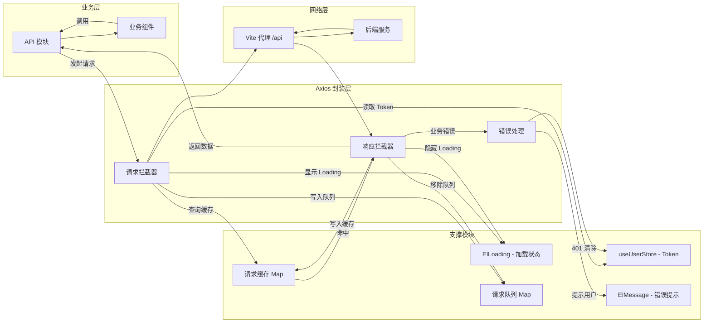

### 6.6 项目实际代码示例

**utils/axios.js 核心配置与拦截器（带详细注释）：**

```javascript
import axios from "axios";
import { ElMessage, ElLoading } from "element-plus";
import { useUserStore } from "@/stores";

// ═══════════════════════════════════════
// 基础配置常量
// ═══════════════════════════════════════
const BASE_URL = "/api"; // API 基础路径，Vite 代理将 /api 转发到后端
const TIMEOUT = 15000; // 请求超时时间：15 秒
const RETRY_COUNT = 2; // 最大重试次数：2 次
const RETRY_DELAY = 1000; // 重试间隔：1000 毫秒（1 秒）
const WHITE_LIST = ["/login"]; // 白名单：这些接口不需要携带 Token
const NO_RETRY_METHODS = ["POST", "PUT", "DELETE"]; // 非幂等方法：不重试，防止重复提交

// ═══════════════════════════════════════
// 请求去重：pendingRequests Map
// ═══════════════════════════════════════
// key: "METHOD&url&params&data" 唯一标识
// value: cancel 函数，调用后可取消该请求
const pendingRequests = new Map();

// ═══════════════════════════════════════
// 全局 Loading 管理
// ═══════════════════════════════════════
let loadingInstance = null; // ElLoading 实例引用
let loadingCount = 0; // 引用计数器：并发请求数

// ═══════════════════════════════════════
// 工具函数
// ═══════════════════════════════════════

/**
 * 生成请求唯一标识
 * 将 method、url、params、data 拼接为字符串作为 key
 * @param {Object} config - Axios 请求配置对象
 * @returns {string} 唯一请求标识
 */
const generateRequestKey = (config) => {
  const { method, url, params, data } = config;
  return [method, url, JSON.stringify(params), JSON.stringify(data)].join("&");
};

/**
 * 添加请求到 pending 队列（请求去重）
 * 如果已有相同请求正在进行，取消旧请求，用新请求替代
 * @param {Object} config - Axios 请求配置对象
 */
const addPendingRequest = (config) => {
  const key = generateRequestKey(config);
  // 如果相同 key 的请求已在进行中，调用 cancel 取消旧请求
  if (pendingRequests.has(key)) {
    pendingRequests.get(key)(); // 执行 cancel 函数
  }
  // 将新的 cancel 函数存入 Map
  config.cancelToken = new axios.CancelToken((cancel) => {
    pendingRequests.set(key, cancel);
  });
};

/**
 * 从 pending 队列移除请求（请求完成后调用）
 * @param {Object} config - Axios 请求配置对象
 */
const removePendingRequest = (config) => {
  const key = generateRequestKey(config);
  if (pendingRequests.has(key)) {
    pendingRequests.delete(key);
  }
};

/**
 * 显示全局 Loading 遮罩
 * 使用引用计数避免多个请求同时进行时 Loading 闪烁
 * @param {string} text - Loading 提示文字
 */
const showLoading = (text = "加载中...") => {
  // 只有第一个请求会创建 Loading 实例
  if (loadingCount === 0) {
    loadingInstance = ElLoading.service({
      lock: true, // 锁定页面滚动
      text, // 提示文字
      background: "rgba(0, 0, 0, 0.7)", // 半透明黑色遮罩
    });
  }
  loadingCount++; // 无论是否创建新实例，计数都 +1
};

/**
 * 隐藏全局 Loading 遮罩
 * 最后一个完成的请求才会关闭 Loading
 */
const hideLoading = () => {
  loadingCount--; // 请求完成，计数 -1
  // 计数归零时关闭 Loading
  if (loadingCount <= 0) {
    loadingCount = 0;
    if (loadingInstance) {
      loadingInstance.close();
      loadingInstance = null;
    }
  }
};

// ═══════════════════════════════════════
// 创建 Axios 实例
// ═══════════════════════════════════════
const instance = axios.create({
  baseURL: BASE_URL, // 自动在请求 URL 前加上 /api 前缀
  timeout: TIMEOUT, // 15 秒超时
});

// ═══════════════════════════════════════
// 请求拦截器：在请求发送前执行
// ═══════════════════════════════════════
instance.interceptors.request.use(
  (config) => {
    // ── ① 缓存检查：如果是 GET 请求且配置了 cache，优先从缓存读取 ──
    if (config.cache && config.method?.toUpperCase() === "GET") {
      const cacheKey = generateCacheKey(config);
      const cached = getCache(cacheKey);
      if (cached) {
        // 缓存命中：构造一个类响应对象直接返回，标记 __fromCache
        return Promise.resolve({
          data: cached,
          config,
          status: 200,
          statusText: "OK",
          headers: {},
          __fromCache: true,
        });
      }
    }

    // ── ② 请求去重：加入 pending 队列 ──
    addPendingRequest(config);

    // ── ③ Token 注入：从 Pinia 获取 Token 并附加到请求头 ──
    const userStore = useUserStore();
    const token = userStore.token;
    // 有 Token 且不在白名单中时，将 Token 添加到请求头
    if (token && !isInWhiteList(config.url)) {
      config.headers["token"] = token;
    }

    // ── ④ 显示全局 Loading：除非配置 showLoading: false ──
    if (config.showLoading !== false && needLoading(config.url)) {
      showLoading(config.loadingText);
    }

    return config; // 必须返回 config，继续后续处理
  },

  // ── 请求发送失败的错误处理 ──
  (error) => {
    hideLoading(); // 隐藏 Loading
    ElMessage.error("请求发送失败"); // 提示用户
    return Promise.reject(error); // 将错误向下传递
  }
);

// ═══════════════════════════════════════
// 响应拦截器：在收到服务器响应后执行
// ═══════════════════════════════════════
instance.interceptors.response.use(
  (response) => {
    // ── ① 缓存命中直接返回数据 ──
    if (response.__fromCache) return response.data;

    // ── ② 从 pending 队列移除，隐藏 Loading ──
    removePendingRequest(response.config);
    hideLoading();

    const res = response.data; // 后端返回的业务数据 { code, msg, data }

    // ── ③ 业务成功：code === 1，直接返回完整响应（包含 data） ──
    if (res.code === 1) return res;

    // ── ④ Token 过期：HTTP 401，清除用户数据并跳转登录 ──
    if (res.code === 0 && response.status === 401) {
      const userStore = useUserStore();
      userStore.clearUserData(); // 清除 token、userInfo 等
      const errorMsg = "登录已过期，请重新登录";
      ElMessage.error(errorMsg);
      window.location.href = "/login"; // 强制跳转
      return Promise.reject(new Error(errorMsg));
    }

    // ── ⑤ 业务失败：code !== 1 且非 401，提示错误信息 ──
    ElMessage.error(res.msg || "操作失败");
    return Promise.reject(new Error(res.msg || "操作失败"));
  },

  // ── 响应错误的处理 ──
  async (error) => {
    // 从 pending 队列移除（如果配置存在）
    if (error.config) removePendingRequest(error.config);
    hideLoading();

    // 如果是被取消的请求（去重机制），静默处理不提示
    if (axios.isCancel(error)) return Promise.reject(error);

    // ── ① HTTP 401 错误：Token 过期 ──
    if (error.response?.status === 401) {
      const userStore = useUserStore();
      userStore.clearUserData();
      ElMessage.error("登录已过期，请重新登录");
      window.location.href = "/login";
      return Promise.reject(error);
    }

    // ── ② 自动重试：仅对 GET 等幂等请求，且是网络超时/错误时 ──
    const config = error.config;
    if (
      config && // 请求配置存在
      shouldRetry(config.method) && // 是允许重试的方法（GET）
      !config._retryCount && // 尚未标记重试（首次进入时 _retryCount 为 undefined）
      (error.code === "ECONNABORTED" || // 超时错误
        error.message.includes("Network Error")) // 网络错误
    ) {
      config._retryCount = config._retryCount || 0; // 初始化重试计数
      if (config._retryCount < RETRY_COUNT) {
        config._retryCount++; // 重试计数 +1
        // 延迟 RETRY_DELAY 毫秒后重试
        await new Promise((resolve) => setTimeout(resolve, RETRY_DELAY));
        return instance.request(config); // 重新发起请求
      }
    }

    // ── ③ 其他错误：显示友好的错误信息 ──
    ElMessage.error(getErrorMessage(error));
    return Promise.reject(error);
  }
);

export default instance; // 导出封装后的 axios 实例
```

**请求缓存与取消的工具函数（带详细注释）：**

```javascript
// ═══════════════════════════════════════
// 请求缓存：使用 Map 存储 GET 请求的响应结果
// ═══════════════════════════════════════
const requestCache = new Map();
const CACHE_MAX_AGE = 5 * 60 * 1000; // 缓存过期时间：5 分钟（5 × 60 × 1000 毫秒）
const CACHE_MAX_SIZE = 200; // 最大缓存数量：200 条，超出时 FIFO 淘汰

/**
 * 生成缓存键
 * 将 method、url、params 排序后拼接为唯一字符串
 * 注意：params 按键名排序，确保 {a:1,b:2} 和 {b:2,a:1} 生成相同键
 * @param {Object} config - Axios 请求配置
 * @returns {string} 缓存键
 */
function generateCacheKey(config) {
  const { method, url, params } = config;
  const sortedParams = params
    ? Object.keys(params)
        .sort() // 按键名升序排序
        .reduce((acc, key) => {
          // 重组为有序对象
          acc[key] = params[key];
          return acc;
        }, {})
    : {};
  // 拼接为 "METHOD&url&params" 格式
  return `${method?.toUpperCase()}&${url}&${JSON.stringify(sortedParams)}`;
}

/**
 * 从缓存读取数据
 * 如果缓存不存在或已过期，返回 null
 * @param {string} key - 缓存键
 * @returns {any|null} 缓存数据或 null
 */
function getCache(key) {
  const item = requestCache.get(key);
  if (!item) return null; // 缓存不存在
  // 检查是否过期：当前时间 - 缓存时间 > 最大存活时间
  if (Date.now() - item.timestamp > CACHE_MAX_AGE) {
    requestCache.delete(key); // 过期数据自动删除
    return null;
  }
  return item.data; // 返回缓存数据
}

/**
 * 写入缓存
 * 如果缓存已满，使用 FIFO 策略删除最早的一条
 * @param {string} key - 缓存键
 * @param {any} data - 要缓存的数据
 */
function setCache(key, data) {
  if (requestCache.size >= CACHE_MAX_SIZE) {
    // Map.keys().next().value 获取第一个插入的 key（FIFO）
    const firstKey = requestCache.keys().next().value;
    if (firstKey) requestCache.delete(firstKey); // 删除最早的缓存
  }
  // 写入新缓存，附带时间戳
  requestCache.set(key, { data, timestamp: Date.now() });
}

/**
 * 按模式清除缓存
 * @param {string} [pattern] - 缓存键匹配模式，不传则清空全部
 */
export function clearCache(pattern) {
  if (!pattern) {
    requestCache.clear(); // 清空全部缓存
    return;
  }
  // 遍历所有缓存键，删除包含 pattern 的项
  for (const key of requestCache.keys()) {
    if (key.includes(pattern)) requestCache.delete(key);
  }
}

/**
 * 取消所有待处理的请求（路由切换时调用）
 * 遍历 pendingRequests Map，调用每个 cancel 函数取消对应请求
 */
export const cancelAllRequests = () => {
  pendingRequests.forEach((cancel) => cancel()); // 取消所有 pending 请求
  pendingRequests.clear(); // 清空队列
};
```

---

## 总结

阶段一（基础夯实 P0）构建了项目的完整基础设施体系，六大核心模块各有分工又紧密协作：

1. **TypeScript 配置**提供了类型安全的开发环境，采用渐进式策略平衡了严谨性与迁移成本
2. **Pinia 状态管理**构建了模块化的全局数据中枢，三个 Store 分工明确，配合持久化插件保障数据一致性
3. **权限指令**实现了细粒度的 UI 级权限控制，通过 DOM 移除而非 CSS 隐藏提升安全性
4. **通用业务组件库**封装了高频业务场景，通过"约定 + 扩展"的设计提升开发效率
5. **错误边界**建立了组件级的容错机制，防止局部错误导致整个应用崩溃
6. **Axios 请求封装**构建了企业级的 HTTP 通信层，集成了认证、缓存、重试、取消、错误处理等能力

这些基础设施共同构成了项目的"地基"，为后续业务功能的快速迭代提供了坚实的支撑。

---

# 阶段二（工程化与效率 P1）深度分析文档

## 目录

1. [Git 工作流与代码规范](#1-git-工作流与代码规范)
2. [多环境配置体系](#2-多环境配置体系)
3. [构建优化策略](#3-构建优化策略)

---

## 1. Git 工作流与代码规范

### 1.1 功能介绍说明

Git 工作流与代码规范是现代前端工程化体系的基石，它通过自动化工具链确保团队协作时的代码质量一致性和提交历史的可追溯性。本项目构建了一套完整的 Git 钩子（Git Hooks）体系，结合 ESLint、Prettier、lint-staged 和 commitlint 等工具，在代码提交的各个关键节点进行质量门禁校验，从源头上杜绝不规范代码和不符合约定的提交信息进入代码仓库。

该体系涵盖两个核心校验环节：**提交前代码质量校验**和**提交信息规范校验**。提交前校验专注于代码本身的质量，包括语法错误检测、代码风格统一、潜在问题修复等；提交信息校验则专注于 Git 提交日志的规范性，遵循 Conventional Commits 规范，使提交历史具有可读性和可自动化处理能力。

这套规范体系的价值体现在：降低代码审查成本、减少团队协作中的风格摩擦、便于自动化生成变更日志、提升项目长期可维护性。

### 1.2 详细实现步骤

#### 1.2.1 工具链安装与配置

**步骤一：安装 Husky 并初始化 Git 钩子**

Husky 是一个 Git 钩子管理工具，它让 Git 钩子的配置变得简单且可共享。通过在 `package.json` 中定义 `prepare` 脚本，确保每位开发者在安装依赖时自动初始化 Git 钩子。

相关命令：

- `npm install husky --save-dev` — 安装 Husky
- `npm pkg set scripts.prepare="husky"` — 设置 prepare 脚本
- `npx husky init` — 初始化 Husky 配置

**步骤二：配置 lint-staged**

lint-staged 用于对 Git 暂存区（staged）的文件运行指定的检查命令，相比全量检查大幅提升执行速度。配置文件定义了不同文件类型对应的处理流水线。

**步骤三：配置 ESLint 代码检查规则**

ESLint 配置采用分层扩展策略，基础规则继承自 `eslint:recommended` 和 `plugin:vue/vue3-essential`，TypeScript 文件额外继承 `plugin:@typescript-eslint/recommended`，并通过 `@vue/eslint-config-prettier` 关闭与 Prettier 冲突的格式规则。

**步骤四：配置 Prettier 代码格式化**

Prettier 负责代码格式化的统一，虽然配置文件当前为空对象（使用默认配置），但通过与 ESLint 的集成，确保格式化规则不与代码检查规则冲突。

**步骤五：配置 commitlint 提交信息规范**

commitlint 基于 `@commitlint/config-conventional` 规范，扩展自定义了 type 枚举值和 subject 长度限制，支持 12 种提交类型，subject 最大长度放宽至 100 字符。

**步骤六：注册 Git 钩子**

- `pre-commit` 钩子：在提交前执行 `lint-staged`，对暂存文件进行代码检查和自动修复
- `commit-msg` 钩子：在提交信息编辑后执行 commitlint 校验

### 1.3 流程图

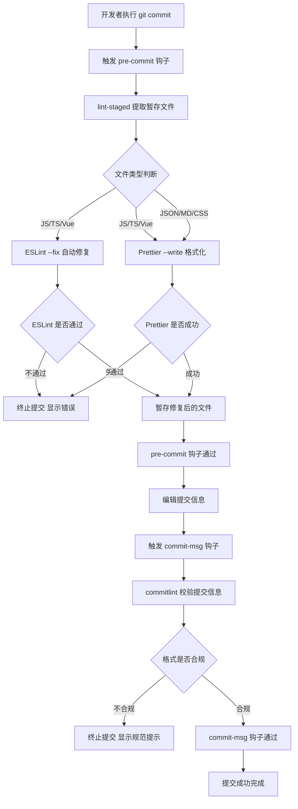

### 1.4 逻辑分析

Git 工作流与代码规范体系的核心设计思想是**"左移质量门禁"**——将质量检查尽可能前移到开发流程的早期阶段，而不是等到代码合并时才发现问题。

#### 分层校验机制

整个体系采用分层校验设计，从内到外依次为：

1. **IDE 层**（隐式）：开发者在编辑器中通过 ESLint 和 Prettier 插件获得实时反馈
2. **提交前层**：pre-commit 钩子 + lint-staged，仅检查即将提交的代码，速度快
3. **提交信息层**：commit-msg 钩子 + commitlint，确保提交日志规范
4. **CI/CD 层**（可选扩展）：流水线中的全量检查，作为最终防线

#### lint-staged 的增量检查逻辑

lint-staged 的核心价值在于**增量检查**。它通过 `git diff --staged --name-only` 获取暂存区文件列表，然后根据配置的 glob 模式匹配对应的处理命令。这种设计有两个关键优势：

- **性能优化**：大型项目中全量 ESLint 检查可能耗时数分钟，而 lint-staged 仅检查少量变更文件，通常在秒级完成
- **安全性**：只修改即将提交的文件，避免意外修改未暂存的工作区代码

#### ESLint 配置的分层扩展策略

ESLint 配置采用了"基础规则 + 类型特定规则"的双层结构：

- **基础层**：适用于所有 JS/TS/Vue 文件，包含 Vue3 必要规则和 ESLint 推荐规则
- **TypeScript 层**：通过 `overrides` 针对 `.ts`、`.tsx`、`.vue` 文件额外应用 TypeScript 特定规则

这种设计既保证了基础代码质量，又为 TypeScript 代码提供了更强的类型安全检查。同时，配置中关闭了部分过于严格的规则（如 `no-explicit-any`、`multi-word-component-names`），在规范和开发效率之间取得平衡。

#### commitlint 的规范化价值

commitlint enforcing Conventional Commits 规范带来的长期收益：

- **自动化发布**：可基于提交类型自动生成语义化版本号
- **变更日志**：可自动生成 CHANGELOG.md
- **代码审查**：通过 type 和 scope 快速理解提交目的
- **历史追溯**：结构化的提交信息便于故障定位和回滚

### 1.5 数据流图

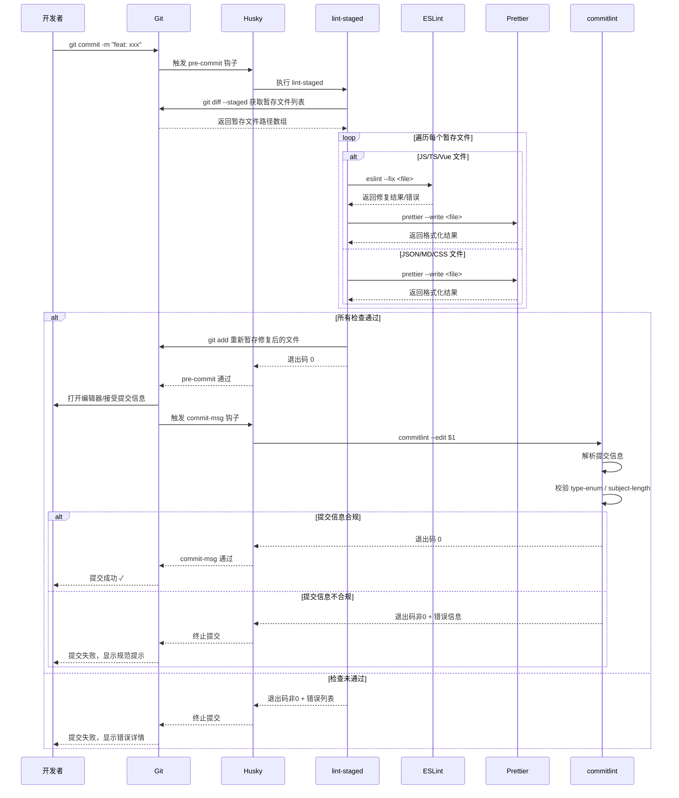

### 1.6 项目实际代码示例

**Husky pre-commit 钩子（带详细注释）：**

文件路径：`.husky/pre-commit`

```shell
# pre-commit 钩子：在 git commit 执行前触发
# npx lint-staged：对暂存区的文件运行 lint-staged 配置的检查命令
# lint-staged 会根据 .lintstagedrc.json 中的配置，对不同文件类型执行 ESLint/Prettier
# 如果检查不通过，git commit 将被中止
npx lint-staged
```

**Husky commit-msg 钩子（带详细注释）：**

文件路径：`.husky/commit-msg`

```shell
# commit-msg 钩子：在用户输入提交信息后触发
# --no：告诉 npx 不使用全局安装的 commitlint，而是使用项目本地的
# --：分隔 npx 参数和 commitlint 参数
# commitlint --edit "$1"：读取 Git 传递的提交信息文件（"$1" 是临时文件路径）进行校验
# 提交信息必须符合 Conventional Commits 规范，否则 commit 被中止
npx --no -- commitlint --edit "$1"
```

**lint-staged 配置（带详细注释）：**

文件路径：`.lintstagedrc.json`

```json
{
  // 键：glob 通配符模式，匹配需要检查的文件
  // 值：该模式匹配文件需要依次执行的命令数组

  // 对 JS/TS/Vue 文件：先 ESLint 自动修复语法问题，再 Prettier 统一格式
  // 注意顺序：先 ESLint 修复语法，再 Prettier 格式化，否则 Prettier 可能破坏 ESLint 的修复
  "*.{js,jsx,ts,tsx,vue}": ["eslint --fix", "prettier --write"],

  // 对 JSON/Markdown/HTML/CSS 文件：仅 Prettier 格式化
  // 这些文件格式简单，不需要 ESLint 检查
  "*.{json,md,html,css,scss}": ["prettier --write"]
}
```

**commitlint 配置（带详细注释）：**

文件路径：`commitlint.config.cjs`

```javascript
module.exports = {
  // extends：继承 @commitlint/config-conventional 预设规则
  // 这是 Conventional Commits 规范的官方配置，定义了 type/description/scope 等规则
  extends: ["@commitlint/config-conventional"],

  rules: {
    // type-enum：提交类型必须在指定枚举列表中
    // 三元组格式：[级别, 适用条件, 配置值]
    // 级别 2 = 错误（不通过则阻止提交），1 = 警告，0 = 禁用
    "type-enum": [
      2, // 级别：错误
      "always", // 适用条件：总是检查
      [
        // 允许的 type 值列表
        "feat", // 新功能
        "fix", // 修复 bug
        "docs", // 文档变更
        "style", // 代码格式（不影响逻辑）
        "refactor", // 重构（既不新增功能也不修复 bug）
        "perf", // 性能优化
        "test", // 测试相关
        "chore", // 构建过程/辅助工具变动
        "revert", // 回滚提交
        "build", // 构建系统或依赖变动
        "ci", // CI/CD 配置变动
      ],
    ],

    // subject-case：描述大小写规则
    // 级别 0 = 禁用（不检查大小写）
    "subject-case": [0],

    // subject-max-length：描述最大长度
    // 级别 2 = 错误，always = 总是检查，100 = 最大 100 字符
    "subject-max-length": [2, "always", 100],
  },
};
```

**ESLint 配置（带详细注释）：**

文件路径：`.eslintrc.cjs`

```javascript
/* eslint-env node */
// 声明此文件运行在 Node.js 环境中，禁用浏览器全局变量警告
// require：加载 Rushstack 提供的模块解析补丁
// 解决 ESLint 在扁平化依赖结构中找不到插件的问题
require("@rushstack/eslint-patch/modern-module-resolution");

module.exports = {
  // root: true 告诉 ESLint 停止在父目录中查找配置文件
  root: true,

  // env：声明代码运行的环境（影响全局变量的可用性）
  env: {
    browser: true, // 浏览器全局变量（window, document 等）可用
    node: true, // Node.js 全局变量（process, require 等）可用
    es2021: true, // ES2021 全局 API（Promise.allSettled 等）可用
  },

  // extends：继承的规则配置列表，按顺序合并
  extends: [
    "plugin:vue/vue3-essential", // Vue 3 必要规则（如模板语法）
    "eslint:recommended", // ESLint 推荐规则
    "@vue/eslint-config-prettier", // 关闭与 Prettier 冲突的 ESLint 规则
  ],

  // parserOptions：解析器配置
  parserOptions: {
    ecmaVersion: "latest", // 使用最新的 ECMAScript 语法
    sourceType: "module", // 使用 ES 模块语法（import/export）
  },

  // overrides：针对特定文件的额外规则覆盖
  overrides: [
    {
      // 对 TypeScript 文件和 Vue 文件应用额外规则
      files: ["*.ts", "*.tsx", "*.vue"],
      // vue-eslint-parser：Vue SFC 的解析器，支持 <script setup> 语法
      parser: "vue-eslint-parser",
      parserOptions: {
        parser: "@typescript-eslint/parser", // 使用 TS 解析器
        ecmaVersion: "latest",
        sourceType: "module",
      },
      // 额外继承 TypeScript 推荐规则
      extends: ["plugin:@typescript-eslint/recommended"],
      // 针对 TypeScript 文件的规则调整
      rules: {
        "@typescript-eslint/no-explicit-any": "off", // 允许使用 any 类型
        "@typescript-eslint/no-unused-vars": "off", // 不检查未使用的变量
        "@typescript-eslint/no-empty-object-type": "off", // 允许空对象类型 {}
        "vue/multi-word-component-names": "off", // 允许单词组件名（如 App.vue）
      },
    },
  ],

  // 全局规则调整
  rules: {
    "vue/multi-word-component-names": "off", // 允许单词组件名
    "no-unused-vars": "off", // 不检查未使用的变量
    "no-undef": "off", // 不检查未定义变量（TS 已处理）
  },
};
```

---

## 2. 多环境配置体系

### 2.1 功能介绍说明

多环境配置体系是现代前端应用部署流程中的核心基础设施，它通过将应用配置与代码分离，使得同一套代码能够在不同的部署环境（开发、测试、预发布、生产）中正确运行，各自连接不同的后端服务、启用不同的功能开关。

本项目基于 Vite 的环境变量机制，构建了一套完整的四环境配置体系，涵盖 **development（开发环境）**、**test（测试环境）**、**staging（预发布环境）** 和 **production（生产环境）**。每个环境拥有独立的配置文件，定义了应用标题、API 基础路径、环境标识、版本号、Mock 开关、DevTools 开关等关键参数。

这套体系的核心价值在于：**配置与代码解耦**，避免因环境差异而修改业务代码；**部署安全**，生产环境自动关闭调试工具，避免信息泄露；**流程标准化**，从开发到上线的每个环节都有对应的环境配置，确保发布流程可预测、可重复。

### 2.2 详细实现步骤

#### 2.2.1 环境变量文件规划

**步骤一：定义环境变量命名规范**

Vite 规定，只有以 `VITE_` 前缀开头的环境变量才会被注入到客户端代码中。本项目所有环境变量均遵循此约定，确保变量可在前端代码中通过 `import.meta.env` 访问。

**步骤二：创建多环境配置文件**

在项目根目录创建四个环境配置文件，分别对应四种部署环境：

- `.env.development` — 开发环境配置
- `.env.test` — 测试环境配置
- `.env.staging` — 预发布环境配置
- `.env.production` — 生产环境配置

**步骤三：定义统一的环境变量键**

四个环境文件保持完全相同的键名结构，仅值不同，确保代码中引用时无需关心当前运行环境。统一的键包括：

- `VITE_APP_TITLE` — 应用标题
- `VITE_API_BASE_URL` — API 基础路径
- `VITE_APP_ENV` — 环境标识
- `VITE_APP_VERSION` — 应用版本号
- `VITE_ENABLE_MOCK` — Mock 数据开关
- `VITE_ENABLE_DEVTOOLS` — DevTools 开关

#### 2.2.2 Vite 配置集成

**步骤四：加载环境变量**

在 `vite.config.ts` 中使用 Vite 内置的 `loadEnv` 函数，根据当前 `mode` 加载对应的环境文件。`loadEnv(mode, process.cwd(), "")` 的第三个参数为空字符串，表示加载所有环境变量（不过滤 `VITE_` 前缀），便于在配置文件中使用。

**步骤五：注入构建时全局常量**

通过 `define` 配置项，将环境相关的构建信息（环境标识、构建时间、版本号、构建环境）作为全局常量注入到客户端代码中。这些常量在构建时被静态替换，可在运行时直接访问。

**步骤六：配置构建脚本**

在 `package.json` 中为每个环境定义独立的构建命令，通过 `--mode` 参数指定构建模式，Vite 会自动加载对应模式的环境配置文件。

### 2.3 流程图

```mermaid
flowchart TD
    A[执行 npm run build:xxx] --> B[vite build --mode <mode>]
    B --> C[Vite 解析 mode 参数]
    C --> D{mode 是什么?}
    D -->|development| E[加载 .env.development]
    D -->|test| F[加载 .env.test]
    D -->|staging| G[加载 .env.staging]
    D -->|production| H[加载 .env.production]

    E --> I[合并默认 .env 文件（如果有）]
    F --> I
    G --> I
    H --> I

    I --> J[执行 vite.config.ts 配置函数]
    J --> K[loadEnv(mode, cwd, '') 加载环境变量]
    K --> L[计算 isProd = mode === 'production']
    L --> M[根据 isProd 决定插件配置]
    M --> N[设置 define 全局常量]
    N --> O[设置 build.sourcemap 等构建配置]
    O --> P[Vite 开始构建]
    P --> Q[输出构建产物到 dist 目录]
    Q --> R[构建完成]
```

### 2.4 逻辑分析

#### 环境变量加载优先级

Vite 的环境变量加载遵循以下优先级规则（后者覆盖前者）：

1. `.env` — 所有环境的默认配置
2. `.env.local` — 本地覆盖（不提交到 Git）
3. `.env.[mode]` — 指定模式的配置
4. `.env.[mode].local` — 指定模式的本地覆盖

本项目中仅使用了 `.env.[mode]` 形式的文件，没有使用 `.env` 基础文件，每个环境文件都是自包含的完整配置。这种设计的优缺点：

- **优点**：每个文件独立完整，阅读时无需脑补默认值，降低认知负担
- **缺点**：存在重复配置，若需修改公共值需同步修改四个文件

对于中小规模项目，这种直接明了的方式利大于弊；若环境数量继续增加，可考虑引入 `.env` 基础文件减少重复。

#### 构建模式与环境的对应关系

Vite 有三个**内置模式**：

- `development` — `vite` 开发服务器使用的模式
- `production` — `vite build` 默认使用的模式
- `test` — Vitest 使用的模式（本项目未使用）

本项目通过自定义 `build:test` 和 `build:staging` 脚本，扩展了 `test` 和 `staging` 两种构建模式。虽然 Vite 的测试模式原本设计用于单元测试，但本项目将其复用于测试环境构建，这是业界常见做法。

需要注意的是，**mode 不等于 NODE_ENV**。`NODE_ENV` 由 Vite 根据模式自动推导（development → development，其他 → production），这会影响构建产物的优化级别。例如 `test` 模式构建的产物仍然是 production 级别的优化构建，只是加载了 `.env.test` 的配置。

#### define 全局常量的作用机制

`vite.config.ts` 中的 `define` 配置实现了**构建时静态替换**机制：

```typescript
define: {
  __APP_ENV__: JSON.stringify(env.VITE_APP_ENV),
  __BUILD_TIME__: JSON.stringify(buildTime),
  __BUILD_VERSION__: JSON.stringify(buildVersion),
  __BUILD_ENV__: JSON.stringify(buildEnv),
}
```

这些常量的特点：

- 在代码中直接以全局变量形式使用，如 `console.log(__BUILD_VERSION__)`
- 构建时被替换为字面量值，不是运行时变量
- 必须使用 `JSON.stringify` 包裹字符串值，确保生成的是合法的 JS 字面量
- 建议在 `vite-env.d.ts` 中添加类型声明，获得 TypeScript 类型提示

#### 环境差异配置策略

分析四个环境文件，可以看出清晰的差异化配置策略：

| 配置项               | development | test  | staging | production |
| -------------------- | ----------- | ----- | ------- | ---------- |
| VITE_APP_ENV         | development | test  | staging | production |
| VITE_ENABLE_DEVTOOLS | true        | true  | false   | false      |
| VITE_ENABLE_MOCK     | false       | false | false   | false      |
| VITE_API_BASE_URL    | /api        | /api  | /api    | /api       |

策略分析：

- **DevTools 开关**：开发和测试环境开启，便于调试；预发布和生产环境关闭，避免性能损耗和信息泄露
- **Mock 开关**：四个环境均关闭，表明项目采用真实后端对接策略
- **API 路径**：均使用 `/api` 相对路径，结合 Nginx 反向代理或 Vite 代理实现跨环境部署

### 2.5 数据流图

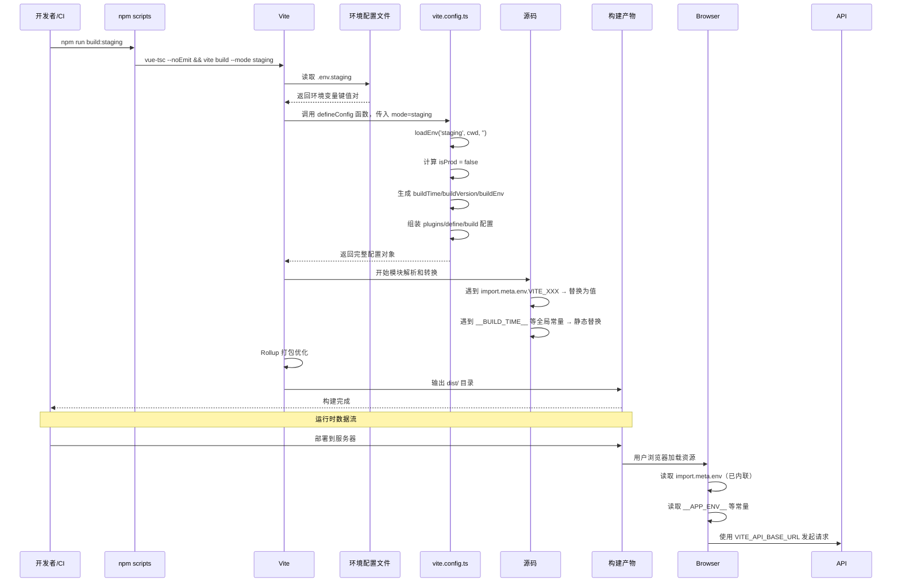

### 2.6 项目实际代码示例

**开发环境配置（带详细注释）：**

文件路径：`.env.development`

```
# 应用标题 — 显示在浏览器标签页和页面头部
VITE_APP_TITLE=Tlias 智能学习辅助系统
# API 基础路径 — 使用相对路径，开发时由 Vite 代理转发到后端
VITE_API_BASE_URL=/api
# 环境标识 — 告知应用当前运行在开发环境
VITE_APP_ENV=development
# 应用版本号 — 用于构建信息展示和版本追踪
VITE_APP_VERSION=1.0.0
# Mock 数据开关 — false 表示使用真实后端
VITE_ENABLE_MOCK=false
# DevTools 开关 — true 开启浏览器调试工具
VITE_ENABLE_DEVTOOLS=true
```

开发环境配置的特点是开启 DevTools，便于开发调试。API 基础路径使用相对路径 `/api`，配合 Vite 开发服务器的代理功能转发到后端。

#### 2.6.2 生产环境配置

**生产环境配置（带详细注释）：**

文件路径：`.env.production`

```
VITE_APP_TITLE=Tlias 智能学习辅助系统
VITE_API_BASE_URL=/api
VITE_APP_ENV=production
VITE_APP_VERSION=1.0.0
VITE_ENABLE_MOCK=false
# 生产环境关闭 DevTools，避免暴露内部状态和调试信息
VITE_ENABLE_DEVTOOLS=false
```

生产环境关闭 DevTools，避免暴露内部状态和调试信息。API 路径同样使用相对路径，部署时依赖 Nginx 等反向代理服务器转发。

#### 2.6.3 测试环境配置

**测试环境配置（带详细注释）：**

文件路径：`.env.test`

```
VITE_APP_TITLE=Tlias 智能学习辅助系统
VITE_API_BASE_URL=/api
VITE_APP_ENV=test
VITE_APP_VERSION=1.0.0
VITE_ENABLE_MOCK=false
# 测试环境开启 DevTools，方便测试人员定位问题
VITE_ENABLE_DEVTOOLS=true
```

测试环境开启 DevTools，方便测试人员定位问题。测试环境通常连接测试数据库，用于功能验证和回归测试。

#### 2.6.4 预发布环境配置

**预发布环境配置（带详细注释）：**

文件路径：`.env.staging`

```
VITE_APP_TITLE=Tlias 智能学习辅助系统
VITE_API_BASE_URL=/api
VITE_APP_ENV=staging
VITE_APP_VERSION=1.0.0
VITE_ENABLE_MOCK=false
# 预发布环境与生产环境一致（关闭 DevTools），用于上线前最终验证
VITE_ENABLE_DEVTOOLS=false
```

预发布环境配置与生产环境完全一致（关闭 DevTools），用于模拟生产环境进行最终验证，确保上线前的质量。

**Vite 配置中的环境变量处理（带详细注释）：**

文件路径：`vite.config.ts`

```typescript
import { defineConfig, loadEnv } from "vite";

// defineConfig 接受一个函数，参数中的 mode 表示当前构建模式
export default defineConfig(({ mode }) => {
  // loadEnv：从 .env 文件中加载环境变量
  // mode：当前构建模式，决定加载哪个 .env.{mode} 文件
  // process.cwd()：当前工作目录
  // ""：第三个参数是前缀过滤，空字符串表示加载所有变量
  const env = loadEnv(mode, process.cwd(), "");

  // isProd：判断是否为生产环境构建
  // 仅 mode === "production" 时为 true
  const isProd = mode === "production";

  // 构建时间戳：ISO 8601 格式
  const buildTime = new Date().toISOString();
  // 版本号：从环境变量读取，默认 "1.0.0"
  const buildVersion = env.VITE_APP_VERSION || "1.0.0";
  // 构建模式：即 mode 参数本身
  const buildEnv = mode;

  return {
    // define：将值作为全局常量注入到客户端代码中
    // 构建时，代码中的 __APP_ENV__ 等会被替换为实际的字符串字面量
    define: {
      // JSON.stringify 确保字符串值被替换为带引号的字面量
      __APP_ENV__: JSON.stringify(env.VITE_APP_ENV),
      __BUILD_TIME__: JSON.stringify(buildTime),
      __BUILD_VERSION__: JSON.stringify(buildVersion),
      __BUILD_ENV__: JSON.stringify(buildEnv),
    },
    build: {
      // sourcemap：是否生成 Source Map
      // 非生产环境生成 sourcemap 便于调试，生产环境不生成以保护源码
      sourcemap: !isProd,
    },
    // ... 其他配置
  };
});
```

关键实现细节：

- `loadEnv` 的第三个参数为空字符串，加载所有变量（包括非 `VITE_` 前缀的）
- `isProd` 仅在 `mode === "production"` 时为真，staging 模式不开启生产级别构建优化
- `sourcemap` 根据环境动态开关：非生产环境生成 sourcemap 便于调试，生产环境不生成以保护源码

#### 2.6.6 package.json 多环境构建脚本

**package.json 多环境构建脚本（带详细注释）：**

文件路径：`package.json`

```json
{
  "scripts": {
    // 启动开发服务器：等价于 vite --mode development
    "dev": "vite",

    // 默认构建：先类型检查，再构建生产版本
    "build": "vue-tsc --noEmit && vite build",

    // 开发环境构建：--mode development 加载 .env.development
    "build:dev": "vue-tsc --noEmit && vite build --mode development",
    // 测试环境构建：--mode test 加载 .env.test
    "build:test": "vue-tsc --noEmit && vite build --mode test",
    // 预发布环境构建：--mode staging 加载 .env.staging
    "build:staging": "vue-tsc --noEmit && vite build --mode staging",
    // 生产环境构建：--mode production 加载 .env.production
    "build:prod": "vue-tsc --noEmit && vite build --mode production",

    // 本地预览生产构建产物：在 http://localhost:4173 上预览
    "preview": "vite preview --port 4173"
  }
}
```

脚本命名采用 `build:<环境>` 的统一约定，便于记忆和自动补全。每个构建命令前都执行 `vue-tsc --noEmit` 进行类型检查，确保构建产物的类型正确性。`vue-tsc` 是 TypeScript 的 Vue 扩展版本检查工具，`--noEmit` 表示只做类型检查不输出文件。

---

## 3. 构建优化策略

### 3.1 功能介绍说明

构建优化是前端工程化体系中直接影响用户体验和部署效率的关键环节。一个优秀的构建优化策略能够显著减少首屏加载时间、降低服务器带宽消耗、提升应用运行时性能。

本项目基于 Vite 构建工具，围绕 **包体积优化**、**加载性能优化** 和 **构建体验优化** 三个维度，实施了多维度的构建优化策略。具体包括：Gzip 压缩、代码分割（Code Splitting）、手动分包（Manual Chunks）、资源文件名 hash 缓存策略、CSS 代码分割、ESBuild 压缩、SourceMap 按需生成等。

这些优化策略的核心目标是：**让用户用最短的时间加载并渲染页面**。通过减小单个文件体积、利用浏览器并行下载能力、充分利用缓存机制、按需加载资源，最终实现更快的首屏渲染和更流畅的用户体验。

### 3.2 详细实现步骤

#### 3.2.1 代码分割与手动分包

**步骤一：配置手动分包策略**

在 `rollupOptions.output.manualChunks` 中定义分包规则，将第三方依赖按功能模块拆分为独立的 chunk 文件。本项目将依赖分为四个包：

- `vue` — Vue 核心生态（vue、vue-router、pinia）
- `elementPlus` — UI 组件库（element-plus、@element-plus/icons-vue）
- `echarts` — 图表库（echarts、vue-echarts）
- `i18n` — 国际化库（vue-i18n）

**步骤二：配置动态文件名与 hash**

通过配置 `chunkFileNames`、`entryFileNames` 和 `assetFileNames`，为构建产物添加内容哈希值，利用浏览器的强缓存机制，避免未变更的资源被重复下载。

#### 3.2.2 压缩优化

**步骤三：引入 vite-plugin-compression**

安装 `vite-plugin-compression` 插件，在生产构建时自动生成 Gzip 压缩版本的静态资源文件。配置阈值为 10KB，仅压缩超过该大小的文件，避免压缩小文件带来的边际收益不足问题。

**步骤四：使用 ESBuild 压缩**

将 `build.minify` 设置为 `esbuild`，利用 ESBuild 的高性能压缩能力替代默认的 Terser，在保证压缩率的同时大幅提升构建速度。

#### 3.2.3 其他优化配置

**步骤五：CSS 代码分割**

启用 `cssCodeSplit`，将 CSS 按模块拆分，实现 CSS 的按需加载，避免加载未使用页面的样式代码。

**步骤六：SourceMap 按需生成**

根据环境动态决定是否生成 SourceMap：开发和测试环境生成，生产环境不生成。既保证了调试便利性，又避免了生产环境的源码泄露和体积增加。

**步骤七：设置代码分割警告阈值**

将 `chunkSizeWarningLimit` 设置为 1000KB，当单个 chunk 超过此大小时发出警告，提醒开发者关注包体积问题。

### 3.3 流程图

```mermaid
flowchart TD
    A[vite build 启动] --> B[加载环境配置]
    B --> C{是否生产环境?}
    C -->|是| D[添加 vite-plugin-compression 插件]
    C -->|否| E[启用 sourcemap]
    D --> F[ESBuild 压缩代码]
    E --> F

    F --> G[Rollup 开始打包]
    G --> H[解析入口模块和依赖关系]
    H --> I[按 manualChunks 规则拆分第三方依赖]
    I --> J[按路由拆分业务代码 chunk]
    J --> K[CSS 代码分割 cssCodeSplit]

    K --> L[生成带 hash 的文件名]
    L --> M[输出到 assets/js/ 和 assets/css/ 等目录]
    M --> N{文件 > 10KB?}
    N -->|是 (仅生产环境)| O[Gzip 压缩生成 .gz 文件]
    N -->|否| P[跳过压缩]
    O --> Q[计算 chunk 总大小]
    P --> Q

    Q --> R{chunk > 1000KB?}
    R -->|是| S[输出警告提示]
    R -->|否| T[构建完成]
    S --> T
```

### 3.4 逻辑分析

#### 手动分包（manualChunks）的设计逻辑

手动分包是构建优化中最核心的策略之一，其设计思想基于以下几个原则：

**1. 缓存利用率最大化**

将不常变动的第三方依赖与频繁变动的业务代码分离。当业务代码更新时，用户只需重新下载业务代码 chunk，而第三方依赖 chunk 可以继续使用浏览器缓存。本项目选择的四个分包维度各有考量：

- **vue 包**：框架核心，几乎不升级，缓存价值最高
- **elementPlus 包**：UI 组件库，体积较大但版本相对稳定
- **echarts 包**：图表库体积巨大，且并非所有页面都需要，可配合按需加载
- **i18n 包**：国际化库，独立拆分便于按需加载语言包

**2. 并行下载优化**

浏览器对同一域名下的并发连接数有限制（通常 6 个）。将大文件拆分为多个较小文件，可以更好地利用浏览器的并行下载能力，减少总加载时间。

**3. 体积预警与边界控制**

`chunkSizeWarningLimit: 1000` 的设置是一个重要的质量门禁。当单个 chunk 超过 1000KB 时，Vite 会输出警告。这并非硬性限制，而是提醒开发者审视是否有进一步优化空间，例如：

- 是否引入了不必要的依赖
- 是否可以改用按需引入
- 是否可以进一步拆分模块

#### Gzip 压缩的性价比分析

`vite-plugin-compression` 的配置参数经过精心权衡：

| 参数      | 值    | 含义            | 设计考量                                    |
| --------- | ----- | --------------- | ------------------------------------------- |
| threshold | 10240 | 10KB 以上才压缩 | 小文件压缩后体积减少有限，且解压有 CPU 开销 |
| algorithm | gzip  | 使用 Gzip 算法  | 兼容性最好，所有浏览器都支持                |
| ext       | .gz   | 压缩文件后缀    | 标准命名，便于 Nginx 等服务器识别           |
| disable   | false | 启用压缩        | 可通过环境变量动态控制                      |

Gzip 压缩通常能将文本资源（JS/CSS/HTML）压缩至原大小的 30%-40%，对于中大型应用，这意味着数百 KB 的流量节省。需要注意的是，Gzip 需要服务器端配合（Nginx 的 `gzip_static` 模块）才能生效，否则即使生成了 `.gz` 文件也不会被使用。

#### 文件命名的哈希策略

构建产物文件名采用 `[name]-[hash].[ext]` 格式，这是前端工程化中的标准实践：

- **`[name]`**：保留原始模块名，便于调试和识别
- **`[hash]`**：基于文件内容生成的哈希值，内容不变则哈希不变
- **目录分层**：JS 文件放入 `assets/js/`，资源文件按扩展名分目录

这种命名策略配合 HTTP 强缓存（Cache-Control: max-age=31536000）可以实现：

- 首次访问：下载所有资源
- 后续访问：未变更的资源直接从缓存读取（0 网络请求）
- 版本更新：只有变更的文件哈希变化，用户只需下载变更部分

#### 构建速度优化

除了产物优化，构建过程本身的速度也很重要：

1. **ESBuild 压缩**：相比 Terser，ESBuild 使用 Go 编写，压缩速度快 10-100 倍
2. **类型检查与构建解耦**：`vue-tsc --noEmit` 在构建前单独执行类型检查，不阻塞 Vite 构建流程
3. **开发环境优化**：开发环境不压缩、不生成 Gzip，保持快速热更新

### 3.5 数据流图

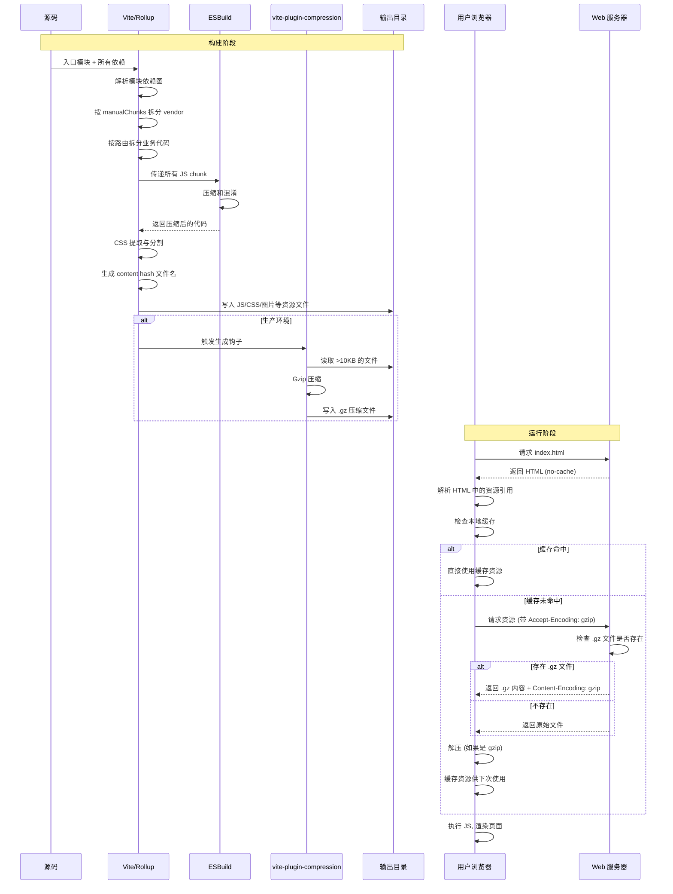

### 3.6 项目实际代码示例

**Vite 构建优化配置（带详细注释）：**

文件路径：`vite.config.ts`

```typescript
import { defineConfig, loadEnv } from "vite";
import vue from "@vitejs/plugin-vue";
import viteCompression from "vite-plugin-compression";

export default defineConfig(({ mode }) => {
  const env = loadEnv(mode, process.cwd(), "");
  const isProd = mode === "production";

  // plugins：Vite 插件数组
  const plugins: any[] = [vue()];

  // 仅在生产环境启用 Gzip 压缩插件
  // 开发环境不需要压缩，会拖慢热更新速度
  if (isProd) {
    plugins.push(
      viteCompression({
        verbose: true, // 在控制台输出压缩日志
        disable: false, // 启用压缩（可通过环境变量动态关闭）
        threshold: 10240, // 仅压缩超过 10KB 的文件
        algorithm: "gzip", // 使用 Gzip 算法
        ext: ".gz", // 压缩文件后缀名
      })
    );
  }

  return {
    plugins,
    // resolve.alias：配置路径别名，"@" 指向 "src/" 目录
    resolve: {
      alias: {
        "@": fileURLToPath(new URL("./src", import.meta.url)),
      },
    },
    // define：构建时全局常量注入
    define: {
      __APP_ENV__: JSON.stringify(env.VITE_APP_ENV),
      __BUILD_TIME__: JSON.stringify(buildTime),
      __BUILD_VERSION__: JSON.stringify(buildVersion),
      __BUILD_ENV__: JSON.stringify(buildEnv),
    },
    // build：构建优化配置
    build: {
      // target：编译目标为最新的 ES 语法，不做降级编译
      target: "esnext",
      // sourcemap：非生产环境生成 Source Map 便于调试
      sourcemap: !isProd,
      // minify：使用 ESBuild 进行代码压缩（比 Terser 快 10-100 倍）
      minify: "esbuild",
      // cssCodeSplit：启用 CSS 代码分割
      cssCodeSplit: true,
      // rollupOptions：传递给底层 Rollup 打包器的配置
      rollupOptions: {
        output: {
          // chunk 文件名模板：带内容哈希，实现精确缓存
          chunkFileNames: "assets/js/[name]-[hash].js",
          // 入口文件名模板：带内容哈希
          entryFileNames: "assets/js/[name]-[hash].js",
          // 静态资源文件名模板：按扩展名分类存放
          assetFileNames: "assets/[ext]/[name]-[hash].[ext]",
          // manualChunks：手动分包策略
          // 将第三方依赖按功能拆分为独立的 chunk 文件
          // 业务代码更新时，第三方依赖可继续使用浏览器缓存
          manualChunks: {
            // Vue 核心生态：框架 + 路由 + 状态管理
            vue: ["vue", "vue-router", "pinia"],
            // Element Plus UI 组件库及其图标
            elementPlus: ["element-plus", "@element-plus/icons-vue"],
            // ECharts 图表库及其 Vue 封装
            echarts: ["echarts", "vue-echarts"],
            // 国际化库
            i18n: ["vue-i18n"],
          },
        },
      },
      // chunkSizeWarningLimit：单个 chunk 大小警告阈值（单位 KB）
      chunkSizeWarningLimit: 1000,
    },
  };
});
```

配置要点解析：

- **`target: "esnext"`**：使用最新的 ES 语法标准，不做降级编译，适合现代浏览器环境
- **`minify: "esbuild"`**：使用 ESBuild 进行代码压缩，速度远快于 Terser
- **`cssCodeSplit: true`**：启用 CSS 代码分割，每个 JS chunk 对应独立的 CSS 文件
- **`chunkSizeWarningLimit: 1000`**：单 chunk 超过 1000KB 时输出警告

#### 3.6.2 构建产物目录结构

通过配置的文件名规则，构建产物将形成如下目录结构：

```
dist/
├── index.html
├── favicon.ico
└── assets/
    ├── js/
    │   ├── index-abc123.js          # 入口文件
    │   ├── vue-def456.js           # Vue 生态 vendor
    │   ├── elementPlus-ghi789.js   # Element Plus vendor
    │   ├── echarts-jkl012.js       # ECharts vendor
    │   ├── i18n-mno345.js          # 国际化 vendor
    │   ├── Login-pqr678.js         # 路由级业务 chunk
    │   ├── Index-stu901.js         # 首页 chunk
    │   └── ...
    ├── css/
    │   ├── index-abc123.css
    │   ├── elementPlus-def456.css
    │   └── ...
    ├── png/
    │   ├── logo-ghi789.png
    │   └── ...
    ├── jpg/
    │   └── bg1-jkl012.jpg
    └── ...
```

每个文件都带有内容哈希，确保文件名与内容一一对应，实现精确的缓存控制。

#### 3.6.3 package.json 构建相关依赖

文件路径：`/workspace/package.json`

```json
{
  "devDependencies": {
    "@vitejs/plugin-vue": "^3.0.3",
    "rollup-plugin-visualizer": "^7.0.1",
    "typescript": "^6.0.3",
    "vite": "^3.0.9",
    "vite-plugin-compression": "^0.5.1",
    "vue-tsc": "^3.3.6"
  }
}
```

关键依赖说明：

- **`vite-plugin-compression`**：Gzip/Brotli 压缩插件，生产环境构建时生成压缩版本
- **`rollup-plugin-visualizer`**：包体积可视化分析插件，可生成构建产物体积分析图，帮助识别体积瓶颈
- **`vue-tsc`**：Vue 3 TypeScript 类型检查工具，在构建前执行类型校验

#### 3.6.4 构建脚本命令

文件路径：`/workspace/package.json`

```json
{
  "scripts": {
    "dev": "vite",
    "build": "vue-tsc --noEmit && vite build",
    "build:dev": "vue-tsc --noEmit && vite build --mode development",
    "build:test": "vue-tsc --noEmit && vite build --mode test",
    "build:staging": "vue-tsc --noEmit && vite build --mode staging",
    "build:prod": "vue-tsc --noEmit && vite build --mode production",
    "preview": "vite preview --port 4173",
    "type-check": "vue-tsc --noEmit"
  }
}
```

构建流程设计为**类型检查先行**的模式：先执行 `vue-tsc --noEmit` 进行全量类型检查，通过后才开始 Vite 构建。这确保了有类型错误时代码不会被构建发布，是一道重要的质量门禁。

`preview` 命令用于本地预览生产构建产物，可以在部署前验证构建结果是否正常。

---

## 总结

阶段二的工程化建设为项目构建了完整的质量保障和效率提升体系：

- **Git 工作流与代码规范**：通过 Husky + lint-staged + ESLint + Prettier + commitlint 的工具链组合，在代码提交环节建立自动化质量门禁，从源头保障代码质量和提交规范。

- **多环境配置体系**：基于 Vite 环境变量机制，构建 development/test/staging/production 四套独立配置，实现配置与代码解耦，支撑标准化的部署流程。

- **构建优化策略**：通过手动分包、Gzip 压缩、内容哈希缓存、ESBuild 压缩等多重策略，从包体积、加载速度、缓存利用等维度全面优化构建产物性能。

这三大模块相互配合，共同构成了项目工程化体系的坚实基础，为后续的功能开发和团队协作提供了可靠的效率和质量保障。

---

## 📖 阶段导读

### 阶段三：体验与性能（P2）— 如何让用户感觉更快更好？

> **核心理念**：用户体验无小事，性能优化永无止境。

本阶段从"能用"走向"好用"。骨架屏让等待不再焦虑，列记忆尊重用户习惯，快捷键提升操作效率，ProTable 让开发更高效，Keep-Alive 让页面切换如丝般顺滑，图片懒加载和请求缓存减少不必要的网络请求，国际化让产品面向全球用户。

**模块关系：**

- **体验类**：骨架屏、列记忆、快捷键、ProTable、国际化 → 直接提升用户感知
- **性能类**：Keep-Alive、懒加载、请求缓存 → 减少资源消耗，提升加载速度

---

# 阶段三（体验与性能 P2）深度分析文档

## 目录

1. [骨架屏组件 TableSkeleton](#1-骨架屏组件-tableskeleton)
2. [表格列记忆 useTableColumns](#2-表格列记忆-usetablecolumns)
3. [快捷键系统 useShortcuts](#3-快捷键系统-useshortcuts)
4. [ProTable 高级表格](#4-protable高级表格)
5. [路由缓存 Keep-Alive](#5-路由缓存keep-alive)
6. [图片懒加载指令](#6-图片懒加载指令)
7. [请求缓存机制](#7-请求缓存机制)
8. [国际化 i18n](#8-国际化i18n)

---

## 1. 骨架屏组件 TableSkeleton

### 1.1 功能介绍说明

骨架屏（Skeleton Screen）是一种在数据加载过程中的占位动画，通过灰色渐变动画效果模拟页面内容的大致布局和结构，让用户感知到页面正在加载中，提升用户体验。TableSkeleton 组件专门针对表格场景设计，用于在表格数据加载时展示与表格结构相似的骨架占位，避免了传统加载中空白页面带来的焦虑感。

该组件支持自定义行数、列数、行高和列宽，可以灵活适配不同表格的布局需求。采用 CSS 实现的 shimmer 闪光动画效果，通过线性渐变背景配合 CSS 动画，营造出内容正在加载的视觉效果。组件使用 Vue 3 的 Composition API 和 `<script setup>` 语法编写，类型安全且轻量高效。

### 1.2 详细实现步骤

1. \*\*定义组件 Props 接口：定义 rows、columns、rowHeight、columnWidths 四个可选属性，分别控制骨架屏的行数、列数、行高和列宽数组。

2. **设置默认值**：使用 `withDefaults` 为 Props 提供默认值，默认 5 行 4 列，行高 48px，列宽数组为空。

3. **计算列宽数组**：使用 `computed` 计算属性 `widthArr`，如果传入了 columnWidths 则直接使用，否则自动计算平均列宽。

4. **渲染骨架结构**：外层使用 `.skeleton-wrapper` 容器，内部通过双层 v-for 循环渲染行和列。每行包含多个列单元，每个列单元内部包含一个 `.skeleton-shimmer` 元素用于动画效果。

5. **实现 shimmer 动画**：使用 CSS 线性渐变 `linear-gradient(90deg, #f2f2f2 25%, #e6e6e6 37%, #f2f2f2 63%)` 作为背景，通过 `background-size: 400% 100%` 放大背景尺寸，配合 `@keyframes shimmer` 动画改变 `background-position` 实现从右向左的流动闪光效果。

6. **样式优化**：使用 `scoped` 样式确保样式隔离，列单元使用 `position: relative` 和 `overflow: hidden` 确保动画不会溢出，圆角 4px 提供更好的视觉效果。

### 1.3 流程图

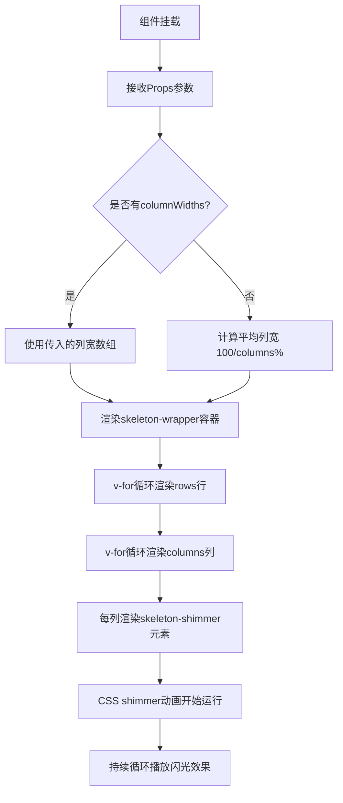

### 1.4 逻辑分析

TableSkeleton 组件的核心设计思想是**结构模拟 + 视觉动画**。结构上通过双层 v-for 循环精确模拟表格的行列布局，让用户在数据加载时就能预期最终内容的大致结构。视觉上通过 shimmer 渐变流动动画传递"正在加载"的语义，比传统的旋转 loading 图标更加自然和沉浸式。

\*\*关键技术点分析：

1. **响应式列宽计算**：`widthArr` 计算属性巧妙地处理了两种列宽模式——自定义列宽和自动平均分配，提供了灵活性和易用性的平衡。

2. **纯 CSS 动画性能**：shimmer 动画完全由 CSS 实现，不占用 JavaScript 主线程，利用 GPU 加速的 background-position 动画，性能优异。

3. **组件轻量性**：组件没有复杂的逻辑，仅依赖 Vue 的 computed 和 v-for，打包体积小，渲染性能高。

4. **可配置性**：通过 Props 提供了丰富的配置项，可以适配不同表格场景，包括行数、列数、行高、列宽都可自定义。

### 1.5 数据流图

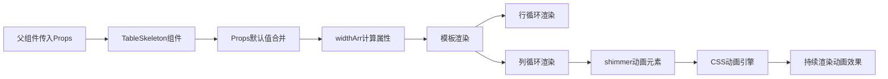

### 1.6 项目实际代码示例

````vue
```vue
<!-- TableSkeleton.vue 核心实现（带详细注释） -->
<template>
  <!-- 外层容器 -->
  <div class="skeleton-wrapper">
    <!-- 第一层 v-for：渲染 rows 行 -->
    <div
      v-for="i in rows"
      :key="i"
      class="skeleton-row"
      :style="{ height: rowHeight + 'px' }"
      <!--
      每行高度由
      props.rowHeight
      控制
      --
    >
      >
      <!-- 第二层 v-for：每行渲染 columns 列 -->
      <div
        v-for="j in columns"
        :key="j"
        class="skeleton-col"
        :style="{
          // 列宽：优先使用传入的 columnWidths 数组，否则平均分配
          width: columnWidths[j - 1] || `${100 / columns}%`,
          height: rowHeight - 16 + 'px',  <!-- 列高比行高少 16px，留出间距 -->
        }"
      >
        <!-- 内部的 shimmer 元素：负责渲染闪光动画 -->
        <div class="skeleton-shimmer"></div>
      </div>
    </div>
  </div>
</template>

<script setup lang="ts">
import { computed } from "vue";

// 定义 Props 接口
interface Props {
  rows?: number; // 行数，默认 5
  columns?: number; // 列数，默认 4
  rowHeight?: number; // 每行高度（px），默认 48
  columnWidths?: string[]; // 每列宽度数组，不传则自动平均分配
}

// 设置 Props 默认值
const props = withDefaults(defineProps<Props>(), {
  rows: 5,
  columns: 4,
  rowHeight: 48,
  columnWidths: () => [],
});

// 计算列宽数组：如果传入了 columnWidths 则使用，否则生成等宽数组
// 注意：此计算属性目前未在模板中使用（模板直接内联计算），保留以备后续扩展
const widthArr = computed(() => {
  if (props.columnWidths.length > 0) return props.columnWidths;
  return Array(props.columns).fill(`${100 / props.columns}%`);
});
</script>

<style scoped>
/*
 * shimmer 动画核心样式
 * 原理：使用渐变背景 + CSS 动画移动背景位置，营造"光线扫过"的视觉效果
 */
.skeleton-shimmer {
  position: absolute; /* 绝对定位填满父容器 */
  top: 0;
  left: 0;
  right: 0;
  bottom: 0;
  /* 三色渐变：浅灰 → 中灰 → 浅灰，模拟光线渐变 */
  background: linear-gradient(90deg, #f2f2f2 25%, #e6e6e6 37%, #f2f2f2 63%);
  /* 背景尺寸放大到 400%，以便动画移动时有足够空间 */
  background-size: 400% 100%;
  /* 1.4 秒一个循环，无限播放 */
  animation: shimmer 1.4s ease infinite;
}

/* 定义 shimmer 动画：背景位置从右向左移动 */
@keyframes shimmer {
  0% {
    background-position: 100% 50%; /* 起始：渐变在最右侧 */
  }
  100% {
    background-position: 0 50%; /* 结束：渐变在最左侧 */
  }
}
</style>
````

---

## 2. 表格列记忆 useTableColumns

### 2.1 功能介绍说明

表格列记忆功能（useTableColumns）是一个 Vue 3 Composition API 的组合式函数，用于持久化保存用户对表格列的显示/隐藏状态和列宽配置到浏览器的 localStorage 中。当用户再次访问同一表格页面时，自动恢复上次的列配置，提供个性化的用户体验。

该功能支持自定义存储键名（key），可以为不同的表格分别保存配置。提供了列切换显示/隐藏、重置列配置、设置列宽等核心功能。使用深度监听（deep watch）自动保存列配置的任何变化，确保数据的一致性。

### 2.2 详细实现步骤

1. **定义类型接口**：定义 `UseTableColumnOptions` 配置接口（包含 key 和 defaultColumns）和 `ColumnConfig` 列配置接口（包含 prop、label、width、visible、fixed 等属性。

2. **定义存储前缀**：使用 `STORAGE_PREFIX = "tlias_table_"` 作为 localStorage 键名前缀，避免与其他应用的存储冲突。

3. **实现加载函数**：`loadFromStorage` 函数从 localStorage 中读取保存的列配置。如果读取成功则返回解析后的数据，失败或无数据时返回默认列配置的副本。

4. **初始化响应式数据**：使用 `ref` 创建 `columns` 响应式数据，初始值从 localStorage 加载。

5. **实现保存函数**：`saveToStorage` 函数将当前列配置序列化为 JSON 字符串后保存到 localStorage。

6. **深度监听变化**：使用 `watch` 深度监听 `columns` 的变化，自动调用 `saveToStorage` 持久化保存。

7. **计算可见列**：`visibleColumns` 响应式数据过滤出 visible 不为 false 的列。

8. **提供操作方法**：

   - `toggleColumn(prop)`：切换指定列的显示/隐藏状态
   - `resetColumns()`：重置为默认列配置
   - `setColumnWidth(prop, width)`：设置指定列的宽度

9. **返回 API**：返回 columns、visibleColumns、toggleColumn、resetColumns、setColumnWidth 供组件使用。

### 2.3 流程图

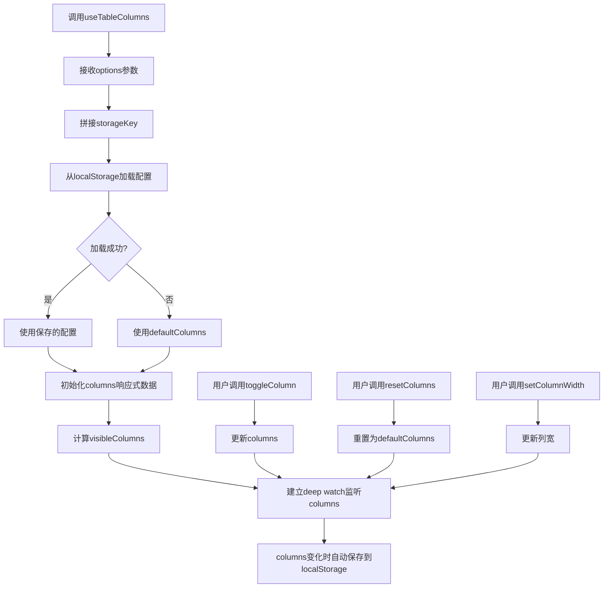

### 2.4 逻辑分析

useTableColumns 的核心设计模式是**组合式函数 + 本地持久化**。通过 Vue 3 的 Composition API 将表格列配置的状态管理逻辑封装成可复用的函数，任何需要列记忆功能的表格组件只需一行代码即可接入。

\*\*关键技术点分析：

1. **localStorage 持久化**：利用浏览器 localStorage 存储用户配置，数据在页面刷新和重新打开后仍然保留，实现用户个性化配置的持久化。

2. **深度监听（deep watch）**：使用 `watch` 的 `deep: true` 选项，可以监听数组内部对象的属性变化（如 visible 属性切换），确保任何修改都会触发保存。

3. **错误容错处理**：`loadFromStorage` 和 `saveToStorage` 都包裹了 try-catch，防止 JSON 解析失败或 localStorage 不可用时的异常，保证组件的稳定性。

4. **存储键前缀**：使用 `tlias_table_` 前缀统一管理本应用的存储键名，命名空间隔离。

5. **默认值副本**：返回默认配置时使用 `[...defaultColumns]` 创建浅拷贝，避免修改原始默认配置对象。

### 2.5 数据流图

```mermaid
graph TD
    A[组件调用useTableColumns] --> B[加载配置]
    B --> C{localStorage有数据?}
    C -->|是| D[JSON.parse解析]
    C -->|否| E[defaultColumns默认配置]
    D --> F[columns响应式数据]
    E --> F
    F --> G[visibleColumns计算属性]
    F --> H[deep watch监听]
    I[用户操作: toggle/reset/setWidth] --> F
    H --> I[更新columns]
    H --> J[JSON.stringify序列化]
    J --> K[保存到localStorage]
    L[组件模板渲染表格列]
    G --> L
```

### 2.6 项目实际代码示例

````typescript
```typescript
// useTableColumns.ts 核心实现（带详细注释）
import { ref, watch } from "vue";

// 组合式函数的配置选项接口
interface UseTableColumnOptions {
  key: string;                   // 存储键名，如 "emp"、"stu"，用于区分不同表格
  defaultColumns: ColumnConfig[]; // 默认列配置
}

// 单列配置接口
interface ColumnConfig {
  prop: string;                  // 列字段名，对应 el-table-column 的 prop 属性
  label: string;                 // 列显示标题
  width?: number | string;       // 列宽度，如 120、"200px"
  visible: boolean;              // 是否显示
  fixed?: "left" | "right" | boolean;  // 固定列位置
}

// localStorage 存储键名前缀，避免与其他应用冲突
const STORAGE_PREFIX = "tlias_table_";

/**
 * 表格列记忆组合式函数
 * @param options - 配置选项
 * @returns 列配置状态和管理方法
 */
export function useTableColumns(options: UseTableColumnOptions) {
  const { key, defaultColumns } = options;
  // 拼接完整的 localStorage 存储键名，如 "tlias_table_emp"
  const storageKey = STORAGE_PREFIX + key;

  /**
   * 从 localStorage 加载列配置
   * 如果加载失败或无数据，返回默认配置的浅拷贝
   */
  const loadFromStorage = (): ColumnConfig[] => {
    try {
      const saved = localStorage.getItem(storageKey);
      if (saved) {
        return JSON.parse(saved);
      }
    } catch (e) {
      console.warn("Failed to load table columns from storage:", e);
    }
    // 返回浅拷贝，避免修改原始默认配置
    return [...defaultColumns];
  };

  // 创建响应式列配置，初始值从 localStorage 加载
  const columns = ref<ColumnConfig[]>(loadFromStorage());

  /**
   * 保存列配置到 localStorage
   * 序列化 columns 数组为 JSON 字符串
   */
  const saveToStorage = () => {
    try {
      localStorage.setItem(storageKey, JSON.stringify(columns.value));
    } catch (e) {
      console.warn("Failed to save table columns to storage:", e);
    }
  };

  /**
   * 深度监听 columns 变化，自动保存到 localStorage
   * deep: true 确保嵌套属性（如 visible）变化也能触发保存
   */
  watch(columns, saveToStorage, { deep: true });

  // 计算可见列：过滤掉 visible 为 false 的列
  const visibleColumns = ref(
    columns.value.filter((col) => col.visible !== false)
  );

  /**
   * 切换指定列的显示/隐藏状态
   * @param prop - 列的 prop 字段名
   */
  const toggleColumn = (prop: string) => {
    const col = columns.value.find((c) => c.prop === prop);
    if (col) {
      col.visible = !col.visible;  // 切换 visible 状态
      // 同步更新 visibleColumns
      visibleColumns.value = columns.value.filter((c) => c.visible !== false);
    }
  };

  /**
   * 重置列配置为默认值
   */
  const resetColumns = () => {
    columns.value = [...defaultColumns];
    visibleColumns.value = columns.value.filter((c) => c.visible !== false);
  };

  // 返回列配置状态和管理方法
  return {
    columns,
    visibleColumns,
    toggleColumn,
    resetColumns,
    setColumnWidth,
  };
}
````

---

## 3. 快捷键系统 useShortcuts

### 3.1 功能介绍说明

快捷键系统（useShortcuts）是一个基于 Vue 3 Composition API 的全局快捷键管理组合式函数，提供了统一的键盘快捷键注册和管理机制。支持 Ctrl/Command、Shift、Alt 等修饰键组合，支持输入框内自动屏蔽快捷键，避免干扰用户正常输入。

该系统采用全局单例模式管理，多个组件可以分别注册自己的快捷键，组件卸载时自动清理注册的快捷键，避免内存泄漏。同时提供了全局快捷键函数 `useGlobalShortcuts`，用于注册应用级别的通用快捷键如 Ctrl+K 搜索、Escape 关闭弹窗等。

### 3.2 详细实现步骤

1. **定义类型接口**：`ShortcutConfig` 接口定义快捷键配置，包含 key（按键名）、ctrl、shift、alt（修饰键）、handler（处理函数）、description（描述）。

2. **全局注册列表**：使用模块级变量 `registeredShortcuts` 数组存储所有已注册的快捷键配置。

3. **快捷键匹配函数**：`matchShortcut` 函数比较键盘事件与配置是否匹配，包括按键名匹配（忽略大小写）和修饰键匹配（支持 metaKey 兼容 Mac 的 Cmd 键）。

4. **输入框检测**：`isInputTarget` 函数检测事件目标是否为输入框、文本域或可编辑元素，如果是则跳过快捷键处理。

5. **全局键盘事件处理**：`handleKeydown` 函数遍历所有已注册快捷键，找到匹配的配置后执行 preventDefault 和 handler，找到第一个匹配后即停止（break）。

6. **全局监听器管理**：`globalListenerAdded` 标志和 `ensureGlobalListener` 函数确保全局 keydown 监听器只添加一次，实现单例模式。

7. **组件级快捷键**：`useShortcuts` 函数在组件 onMounted 时注册快捷键，onBeforeUnmount 时注销，自动管理生命周期。

8. **全局快捷键**：`useGlobalShortcuts` 函数注册应用级通用快捷键：
   - Ctrl+K：聚焦全局搜索框
   - Escape：关闭所有弹窗

### 3.3 流程图

```mermaid
flowchart TD
    A[用户按下键盘] --> B[触发window.keydown事件]
    B --> C{是输入框目标?}
    C -->|是| D[忽略,不处理快捷键]
    C -->|否| E[遍历registeredShortcuts]
    E --> F{匹配快捷键配置?}
    F -->|否| G[继续下一个]
    F -->|是| H[e.preventDefault]
    H --> I[执行handler]
    I --> J[停止遍历break]
    K[组件挂载] --> L[调用useShortcuts]
    L --> M[确保全局监听器已添加]
    M --> N[注册快捷键到数组]
    O[组件卸载] --> P[从数组移除快捷键]
```

### 3.4 逻辑分析

快捷键系统的核心设计思想是**全局单例 + 自动生命周期管理**。通过模块级变量实现全局唯一的快捷键注册表和全局监听器，确保整个应用只有一个 keydown 事件监听器，性能最优。同时利用 Vue 的生命周期钩子自动管理快捷键的注册与注销。

\*\*关键技术点分析：

1. **单例模式**：`globalListenerAdded` 标志确保全局 keydown 监听器只绑定一次，避免重复绑定造成的性能问题和逻辑混乱。

2. **修饰键兼容**：`ctrlMatch` 同时判断 `e.ctrlKey || e.metaKey`，完美兼容 Windows 的 Ctrl 和 Mac 的 Cmd 键。

3. **输入框屏蔽**：`isInputTarget` 函数智能检测输入框、文本域和 contentEditable 元素，避免快捷键干扰用户正常输入。

4. **自动清理**：组件卸载时自动从 `registeredShortcuts` 数组中移除该组件注册的快捷键，防止内存泄漏。

5. **匹配优先级**：遍历数组顺序匹配，先注册的优先级高，找到第一个匹配即 break，符合直觉。

6. **模块化设计**：`useShortcuts` 用于组件级快捷键，`useGlobalShortcuts` 用于全局快捷键，职责清晰。

### 3.5 数据流图

```mermaid
graph TD
    A[组件挂载] --> B[useShortcuts]
    C[App根组件] --> D[useGlobalShortcuts]
    B --> E[registeredShortcuts数组]
    D --> E
    E --> F[window keydown listener]
    G[键盘事件] --> F
    F --> H[isInputTarget检测]
    H -->|是输入框| I[跳过]
    H -->|不是| J[遍历匹配]
    J --> K[匹配成功]
    K --> L[调用handler]
    M[组件卸载] --> N[移除快捷键]
    N --> E
```

### 3.6 项目实际代码示例

````typescript
```typescript
// useShortcuts.ts 核心实现（带详细注释）
import { onMounted, onBeforeUnmount } from "vue";

// 快捷键配置接口
interface ShortcutConfig {
  key: string;           // 按键名，如 "k"、"Escape"
  ctrl?: boolean;        // 是否需要 Ctrl/Cmd 修饰键
  shift?: boolean;       // 是否需要 Shift 修饰键
  alt?: boolean;         // 是否需要 Alt 修饰键
  handler: () => void;   // 快捷键触发时执行的回调函数
  description?: string;  // 快捷键描述（用于调试）
}

// 全局注册表：存储所有已注册的快捷键配置
// 模块级变量，整个应用生命周期内有效
const registeredShortcuts: ShortcutConfig[] = [];

/**
 * 检查键盘事件是否匹配快捷键配置
 * @param e - 键盘事件对象
 * @param config - 快捷键配置
 * @returns 是否匹配
 */
function matchShortcut(e: KeyboardEvent, config: ShortcutConfig): boolean {
  // 按键名匹配：忽略大小写
  const keyMatch = e.key.toLowerCase() === config.key.toLowerCase();
  // Ctrl/Cmd 修饰键匹配
  // config.ctrl === true 时要求按下 Ctrl（或 Mac 的 Cmd）
  // config.ctrl === false/undefined 时要求未按下 Ctrl
  const ctrlMatch = config.ctrl
    ? e.ctrlKey || e.metaKey   // metaKey 兼容 Mac 的 Cmd 键
    : !e.ctrlKey && !e.metaKey;
  // Shift 修饰键匹配
  const shiftMatch = config.shift ? e.shiftKey : !e.shiftKey;
  // Alt 修饰键匹配
  const altMatch = config.alt ? e.altKey : !e.altKey;
  // 所有条件都满足才算匹配
  return keyMatch && ctrlMatch && shiftMatch && altMatch;
}

/**
 * 检测事件目标是否为输入框
 * 如果是输入框/文本域/可编辑元素，返回 true（跳过快捷键处理）
 */
function isInputTarget(e: KeyboardEvent): boolean {
  const target = e.target as HTMLElement;
  return (
    target.tagName === "INPUT" ||
    target.tagName === "TEXTAREA" ||
    target.contentEditable === "true"
  );
}

/**
 * 全局键盘事件处理函数
 * 遍历所有已注册的快捷键，找到匹配的执行 handler
 */
function handleKeydown(e: KeyboardEvent) {
  // 在输入框中按快捷键时跳过，不干扰用户正常输入
  if (isInputTarget(e)) return;

  // 按注册顺序遍历，找到第一个匹配即执行并停止
  for (const config of registeredShortcuts) {
    if (matchShortcut(e, config)) {
      e.preventDefault();     // 阻止默认行为（如 Ctrl+K 的浏览器搜索）
      config.handler();       // 执行注册的处理函数
      break;                  // 找到即停止，避免重复触发
    }
  }
}

// 全局监听器是否已添加的标志位
let globalListenerAdded = false;

/**
 * 确保全局 keydown 监听器只添加一次
 */
function ensureGlobalListener() {
  if (!globalListenerAdded) {
    window.addEventListener("keydown", handleKeydown);
    globalListenerAdded = true;
  }
}

/**
 * 组合式函数：在组件中注册快捷键
 * 组件挂载时注册，卸载时自动清理
 * @param shortcuts - 快捷键配置数组
 */
export function useShortcuts(shortcuts: ShortcutConfig[]) {
  onMounted(() => {
    ensureGlobalListener();          // 确保全局监听器已添加
    registeredShortcuts.push(...shortcuts);  // 注册当前组件的快捷键
  });

  onBeforeUnmount(() => {
    // 组件卸载时移除该组件注册的快捷键，防止内存泄漏
    shortcuts.forEach((sc) => {
      const idx = registeredShortcuts.indexOf(sc);
      if (idx > -1) {
        registeredShortcuts.splice(idx, 1);
      }
    });
  });
}

/**
 * 全局快捷键注册函数（通常在 Layout 组件中调用一次）
 * 注册应用级别的通用快捷键
 */
export function useGlobalShortcuts() {
  const shortcuts: ShortcutConfig[] = [
    {
      key: "k",              // 按键：K
      ctrl: true,            // 需要 Ctrl（Mac 上兼容 Cmd）
      description: "搜索",
      handler: () => {
        // 聚焦全局搜索框
        const searchInput = document.querySelector(
          ".global-search input"
        ) as HTMLInputElement;
        if (searchInput) {
          searchInput.focus();
        }
      },
    },
    // 可在此处添加更多全局快捷键，如 Escape 关闭弹窗
  ];
  useShortcuts(shortcuts);
}
````

---

## 4. ProTable 高级表格

### 4.1 功能介绍说明

ProTable 高级表格组件是一个功能完整的企业级表格解决方案，封装了搜索表单、工具栏、表格主体、分页器、列设置、骨架屏加载等常用功能，提供了开箱即用的表格页面开发体验。基于 Element Plus 的 el-table 和 el-pagination 组件进行二次封装，大幅减少业务代码量。

该组件支持搜索栏自定义、列设置（显示/隐藏列、重置列）、骨架屏加载、多选、新增、批量删除等功能，集成了 useTableColumns 实现列配置记忆功能。通过插槽（slot）机制提供极高的可扩展性，可以自定义搜索表单、工具栏、列渲染、操作列等。

### 4.2 详细实现步骤

1. **定义组件 Props**：定义丰富的 Props 接口，包括 loading、data、total、page、pageSize、searchColumns、showSearch、selectable、addVisible、batchDeleteVisible、actionWidth、columns、columnKey、columnSettingsVisible、showSkeleton、skeletonRows 等。

2. **集成 TableSkeleton 和 useTableColumns**：引入 TableSkeleton 骨架屏组件和 useTableColumns 组合式函数。

3. **计算表格列配置**：`tableColumns` 计算属性，如果传入了 columns 则使用，否则从 searchColumns 推导。

4. **初始化列配置**：调用 `useTableColumns` 传入 columnKey 和默认列，获得 columnConfigs、toggleColumn、resetColumns。

5. **搜索表单**：根据 searchColumns 动态渲染搜索表单项（input/select/date），支持回车搜索和重置。

6. **工具栏**：左侧新增/批量删除按钮，右侧列设置下拉菜单。

7. **列设置下拉**：el-dropdown 组件展示所有列的勾选状态，点击切换显示/隐藏，支持重置列。

8. **骨架屏加载**：loading 且 showSkeleton 时显示 TableSkeleton，否则显示 el-table 的 v-loading。

9. **表格主体**：el-table 组件，支持选择列、序号列、动态列渲染、操作列插槽。

10. **分页器**：el-pagination 组件，支持页码和每页条数切换。

11. **事件定义**：定义 search、reset、pageChange、sizeChange、add、batchDelete 等 emit 事件。

12. **暴露方法**：defineExpose 暴露 clearSelection、searchForm、pagination 等。

### 4.3 流程图

```mermaid
flowchart TD
    A[ProTable组件挂载] --> B[接收Props参数]
    B --> C[初始化useTableColumns]
    C --> D[从localStorage加载列配置]
    D --> E[初始化searchForm]
    E --> F[初始化pagination]
    F --> G[渲染搜索栏]
    G --> H[渲染工具栏]
    H --> I{loading && showSkeleton?}
    I -->|是| J[显示TableSkeleton骨架屏]
    I -->|否| K[显示el-table表格]
    K --> L[渲染分页器]
    M[用户点击搜索] --> N[重置page=1]
    N --> O[emit search事件]
    P[用户切换列显示] --> Q[toggleColumn]
    Q --> R[自动保存到localStorage]
    S[用户切换页码] --> T[emit pageChange事件]
```

### 4.4 逻辑分析

ProTable 的核心设计理念是**约定优于配置 + 高度可扩展**。通过大量的默认配置和自动推导逻辑，让简单场景下使用 Props 配置即可快速开发；同时通过丰富的插槽机制，支持复杂场景的自定义。

\*\*关键技术点分析：

1. **组合式函数集成**：集成 useTableColumns 实现列配置持久化，columnKey 区分不同表格，实现多表格独立记忆。

2. **搜索列自动推导**：如果未传入 columns，从 searchColumns 自动推导表格列配置，减少重复配置。

3. **丰富的插槽**：提供 search、search-form、toolbar-left、toolbar-right、column-xxx、action 等插槽，灵活度极高。

4. **双加载模式**：支持骨架屏（showSkeleton）和 Element Plus 自带 loading 两种加载模式，可根据场景选择。

5. **分页状态管理**：内部维护 pagination 响应式对象，watch 监听 props 变化同步内部状态，避免直接修改 props。

6. **列设置下拉菜单**：el-dropdown 配合 el-dropdown-menu 实现列勾选功能，直观易用。

7. **暴露方法**：通过 defineExpose 暴露 clearSelection 等方法，父组件可以通过 ref 调用。

### 4.5 数据流图

```mermaid
graph TD
    A[父组件传入Props] --> B[ProTable组件]
    B --> C[tableColumns计算]
    C --> D[useTableColumns]
    D --> E[localStorage]
    E -->|加载配置| D
    D --> F[columnConfigs]
    F --> G[表格列渲染]
    H[用户搜索] --> I[searchForm]
    I --> J[emit search事件]
    J --> K[父组件处理]
    K -->|更新data/total| L[tableData]
    L --> G
    M[用户列设置] --> N[toggleColumn/resetColumns]
    N --> F
    N -->|保存| E
    O[分页变化] --> P[emit pageChange/sizeChange]
    P --> K
```

### 4.6 项目实际代码示例

````vue
```vue
<!-- ProTable.vue 核心模板（带详细注释） -->
<template>
  <div class="pro-table">
    <!-- ═══ 搜索栏区域 ═══ -->
    <!-- v-if="showSearch" 控制是否显示搜索栏 -->
    <div class="pro-table-search" v-if="showSearch">
      <!-- search 插槽：允许父组件完全自定义搜索区域 -->
      <slot name="search">
        <!-- 默认搜索表单：基于 Element Plus el-form -->
        <el-form :model="searchForm" inline @submit.prevent>
          <!-- search-form 插槽：允许父组件自定义搜索表单项 -->
          <slot name="search-form">
            <!-- 根据 searchColumns 配置动态生成搜索表单项 -->
            <el-form-item
              v-for="item in searchColumns"
              :key="item.prop"
              :label="item.label"
            >
              <!-- 输入框类型：支持回车搜索 -->
              <el-input
                v-if="item.type === 'input' || !item.type"
                v-model="searchForm[item.prop]"
                :placeholder="`请输入${item.label}`"
                clearable
                @keyup.enter="handleSearch"
              />
              <!-- select/date 等其他类型在此扩展 -->
            </el-form-item>
          </slot>
          <!-- 搜索和重置按钮 -->
          <el-form-item>
            <el-button type="primary" @click="handleSearch">搜索</el-button>
            <el-button @click="handleReset">重置</el-button>
          </el-form-item>
        </el-form>
      </slot>
    </div>

    <!-- ═══ 工具栏区域 ═══ -->
    <div class="pro-table-toolbar">
      <!-- 工具栏左侧：新增/批量删除按钮 -->
      <div class="toolbar-left">
        <slot name="toolbar-left">
          <el-button type="primary" v-if="addVisible" @click="handleAdd"
            >新增</el-button
          >
          <el-button
            type="danger"
            v-if="batchDeleteVisible"
            :disabled="!selected.length"
            @click="handleBatchDelete"
            >批量删除</el-button
          >
        </slot>
      </div>
      <!-- 工具栏右侧：自定义内容 + 列设置下拉 -->
      <div class="toolbar-right">
        <slot name="toolbar-right" />
        <!-- 列设置下拉菜单 -->
        <el-dropdown
          v-if="columnSettingsVisible"
          trigger="click"
          @command="handleColumnCommand"
        >
          <el-button :icon="Setting">列设置</el-button>
          <template #dropdown>
            <el-dropdown-menu>
              <!-- 遍历所有列配置，显示勾选状态 -->
              <el-dropdown-item
                v-for="col in columnConfigs"
                :key="col.prop"
                :command="col.prop"
              >
                <el-icon v-if="col.visible !== false"><Check /></el-icon>
                <span style="margin-left: 8px">{{ col.label }}</span>
              </el-dropdown-item>
              <!-- 重置列配置 -->
              <el-dropdown-item divided command="reset"
                >重置列</el-dropdown-item
              >
            </el-dropdown-menu>
          </template>
        </el-dropdown>
      </div>
    </div>

    <!-- ═══ 骨架屏加载状态 ═══ -->
    <!-- loading 且 showSkeleton 时显示骨架屏，否则显示 el-table 的 v-loading -->
    <div v-if="loading && showSkeleton" class="table-skeleton-container">
      <table-skeleton
        :rows="skeletonRows"
        :columns="visibleColumnCount + 2"
        :row-height="48"
      />
    </div>

    <!-- ═══ 表格主体 ═══ -->
    <!-- v-show：骨架屏显示时隐藏表格；v-loading：非骨架屏模式时显示 Element Plus loading -->
    <el-table
      v-show="!loading || !showSkeleton"
      v-loading="loading && !showSkeleton"
      :data="tableData"
      border
      stripe
      @selection-change="handleSelectionChange"
    >
      <!-- 多选列 -->
      <el-table-column
        v-if="selectable"
        type="selection"
        width="50"
        align="center"
      />
      <!-- 序号列 -->
      <el-table-column type="index" label="序号" width="60" align="center" />
      <!-- 动态列：根据 columnConfigs 渲染，支持插槽自定义列内容 -->
      <template v-for="col in columnConfigs" :key="col.prop">
        <slot :name="`column-${col.prop}`" :col="col">
          <el-table-column
            v-if="col.visible !== false"
            :prop="col.prop"
            :label="col.label"
            :width="col.width"
            :fixed="col.fixed || false"
          />
        </slot>
      </template>
      <!-- 操作列：固定在右侧，通过 action 插槽自定义 -->
      <el-table-column
        v-if="$slots.action"
        label="操作"
        :width="actionWidth"
        align="center"
        fixed="right"
      >
        <template #default="scope">
          <slot name="action" :row="scope.row" :index="scope.$index" />
        </template>
      </el-table-column>
    </el-table>

    <!-- ═══ 分页器 ═══ -->
    <div class="pro-table-pagination">
      <el-pagination
        v-model:current-page="pagination.page"
        v-model:page-size="pagination.pageSize"
        :page-sizes="[10, 20, 50, 100]"
        :total="total"
        layout="total, sizes, prev, pager, next, jumper"
        background
        @size-change="handleSizeChange"
        @current-change="handleCurrentChange"
      />
    </div>
  </div>
</template>
````

---

## 5. 路由缓存 Keep-Alive

### 5.1 功能介绍说明

路由缓存（Keep-Alive）是 Vue 提供的组件缓存机制，用于在路由切换时保持组件的状态不被销毁，用户再次访问该路由时直接从缓存中恢复，避免重复渲染和数据重新请求，显著提升页面切换速度和用户体验。

本项目中通过路由 meta.keepAlive 标记需要缓存的路由，在路由后置守卫中动态管理缓存列表，使用 Pinia 的 app store 统一管理缓存的路由名称列表。配合 Vue 的 `<keep-alive>` 组件和动态 `include` 属性，实现灵活的路由级缓存控制。同时集成 NProgress 进度条提供页面切换的视觉反馈。

### 5.2 详细实现步骤

1. **创建 App Store**：在 Pinia store 中定义 `cachedViews` 数组存储需要缓存的路由名称，提供 `addCachedView`、`delCachedView` 等方法。

2. **路由配置 meta.keepAlive**：在路由配置的 meta 中添加 `keepAlive: true` 标记需要缓存的路由，同时确保路由有唯一的 name。

3. **NProgress 配置**：配置 NProgress 进度条，设置 showSpinner、speed、trickleSpeed 参数。

4. **路由白名单**：定义 WHITE_LIST 数组，包含不需要登录的路由路径。

5. **前置守卫 beforeEach**：

   - 开始 NProgress 进度条
   - 取消所有未完成的请求
   - 白名单路由直接放行
   - 未登录重定向登录页
   - 权限检查

6. **后置守卫 afterEach**：

   - 结束 NProgress 进度条
   - 设置页面标题
   - 如果路由有 keepAlive 且有 name，则调用 appStore.addCachedView 添加到缓存列表

7. **Layout 组件中使用 keep-alive**：在 Layout 组件的路由出口处使用 `<keep-alive :include="cachedViews">` 包裹 `<router-view>`。

8. **动态缓存管理**：通过 Pinia store 管理缓存列表，可以动态添加和移除缓存，支持 tab 栏关闭标签时移除对应缓存。

### 5.3 流程图

```mermaid
flowchart TD
    A[用户点击路由跳转] --> B[beforeEach前置守卫]
    B --> C[NProgress.start开始进度条]
    C --> D[cancelAllRequests取消未完成请求]
    D --> E{白名单路由?}
    E -->|是| F[直接放行]
    E -->|否| G{已登录?}
    G -->|否| H[重定向登录页]
    G -->|是| I{有权限?}
    I -->|否| J[重定向403]
    I -->|是| K[放行进入路由]
    K --> L[afterEach后置守卫]
    L --> M[NProgress.done结束进度条]
    M --> N[设置页面标题]
    N --> O{meta.keepAlive?}
    O -->|是| P[addCachedView添加到缓存列表]
    O -->|否| Q[不缓存]
    P --> R[keep-alive缓存组件]
    Q --> S[组件正常销毁]
```

### 5.4 逻辑分析

路由缓存的核心设计思想是**声明式配置 + 集中式管理**。通过路由 meta.keepAlive 声明哪些路由需要缓存，使用 Pinia store 集中管理缓存列表，在路由守卫中自动维护缓存状态。

\*\*关键技术点分析：

1. **动态 include**：使用 keep-alive 的 include 属性配合动态数组，实现灵活的缓存控制，而不是所有路由都缓存。

2. **路由 name 必须唯一**：keep-alive 的 include 是根据组件的 name 匹配的，所以路由配置和组件都必须有唯一的 name。

3. **NProgress 集成**：路由切换时显示顶部进度条，提供视觉反馈，提升感知性能。

4. **请求取消**：路由切换时取消所有未完成的请求，避免无效请求和潜在的竞态问题。

5. **Pinia 集中管理**：cachedViews 存在 Pinia store 中，任何组件都可以访问和修改，方便 tab 栏等功能集成。

6. **meta 驱动**：通过路由 meta 声明式配置，符合 Vue Router 的惯用模式，易维护。

### 5.5 数据流图

```mermaid
graph TD
    A[路由跳转触发] --> B[beforeEach守卫]
    B --> C[NProgress开始]
    B --> D[取消请求]
    B --> E[权限校验]
    E -->|通过| F[进入新路由]
    F --> G[afterEach守卫]
    G --> H[NProgress结束]
    G --> I[设置标题]
    G --> J{keepAlive检查]
    J -->|是| K[appStore.addCachedView]
    K --> L[cachedViews数组更新]
    L --> M[keep-alive include]
    M --> N[组件缓存]
    J -->|否| O[组件正常销毁]
    P[Tab关闭标签] --> Q[appStore.delCachedView]
    Q --> L
```

### 5.6 项目实际代码示例

````javascript
```javascript
// router/index.js 核心实现（带详细注释）
import { createRouter, createWebHistory } from "vue-router";
import { useUserStore, useAppStore } from "@/stores";
import { cancelAllRequests } from "@/utils/axios";
import NProgress from "nprogress";
import "nprogress/nprogress.css";

// ─── NProgress 进度条配置 ───
// 页面切换时在顶部显示加载进度条
NProgress.configure({
  showSpinner: false,      // 不显示右上角旋转 spinner
  speed: 500,              // 进度条移动速度（毫秒）
  trickleSpeed: 200,       // 自动增长间隔（毫秒）
});

// ─── 路由白名单 ───
// 这些页面不需要登录即可访问
const WHITE_LIST = ["/login", "/403", "/404", "/500"];

// ─── 静态路由配置 ───
const routes = [
  // 登录页：name 必须唯一，keep-alive 的 include 通过 name 匹配
  {
    path: "/login",
    name: "登录",
    component: () => import("@/views/login/index.vue"),  // 懒加载
    meta: { title: "登录" },
  },
  // 布局路由：所有需要侧边栏的页面都嵌套在此之下
  {
    path: "/",
    component: () => import("@/views/layout/index.vue"),
    children: [
      {
        path: "index",
        name: "首页",
        component: () => import("@/views/index/index.vue"),
        meta: {
          title: "首页",
          keepAlive: true,  // 标记需要 Keep-Alive 缓存
        },
      },
      // ...其他路由
    ],
  },
];

// ─── 创建路由器实例 ───
const router = createRouter({
  // createWebHistory：使用 HTML5 History 模式（URL 不带 #）
  history: createWebHistory(import.meta.env.BASE_URL),
  routes,
});

// ─── 前置守卫（beforeEach）：路由跳转前执行 ───
router.beforeEach((to, from, next) => {
  // 1. 开始显示 NProgress 进度条
  NProgress.start();
  // 2. 取消所有未完成的请求（清理旧路由的残留请求）
  cancelAllRequests();

  const userStore = useUserStore();
  const token = userStore.token;

  // 3. 白名单判断：登录页/错误页不需要登录
  if (WHITE_LIST.includes(to.path)) {
    // 已登录用户访问登录页，重定向到首页
    if (to.path === "/login" && token) return "/index";
    return;  // 白名单直接放行
  }

  // 4. 未登录则重定向到登录页
  if (!token) return "/login";

  // 5. 权限检查：如果路由配置了 meta.permission，检查用户是否有权限
  const permission = to.meta?.permission;
  if (permission && !userStore.hasPermission(permission)) return "/403";

  // 6. 以上检查都通过，放行
});

// ─── 后置守卫（afterEach）：路由跳转完成后执行 ───
router.afterEach((to) => {
  // 1. 结束 NProgress 进度条
  NProgress.done();

  // 2. 设置页面标题
  const title = to.meta?.title;
  if (title) {
    document.title = `${title} - Tlias`;
  } else {
    document.title = "Tlias 智能学习辅助系统";
  }

  // 3. Keep-Alive 缓存管理
  // 如果路由标记了 keepAlive 且有 name，添加到 appStore 的缓存列表
  const appStore = useAppStore();
  if (to.meta?.keepAlive && to.name) {
    appStore.addCachedView(to.name);
  }
});

export default router;
````

---

## 6. 图片懒加载指令

### 6.1 功能介绍说明

图片懒加载指令（v-lazy）是一个 Vue 自定义指令，基于 Intersection Observer API 实现图片的延迟加载。只有当图片进入可视区域（或接近可视区域）时才开始加载图片，显著减少页面初始加载时间和带宽消耗，提升页面性能。

该指令支持 rootMargin 预加载距离配置，可以设置图片即将进入视口时提前加载，用户滚动时几乎感知不到加载延迟。同时提供了降级方案，不支持 IntersectionObserver 的浏览器会直接加载图片。指令会在组件卸载时自动清理 observer，防止内存泄漏。

### 6.2 详细实现步骤

1. **定义指令对象**：创建 `imageLazyDirective` 对象，实现 Vue 指令的 mounted、updated、unmounted 钩子。

2. **mounted 钩子**：

   - 将真实图片地址保存到 `data-src` 属性
   - 添加 `lazy-image` CSS 类名
   - 检测浏览器是否支持 IntersectionObserver
   - 支持则创建 IntersectionObserver 实例
     - 配置 rootMargin: "50px"（提前 50px 加载）
     - 配置 threshold: 0.01（1% 可见即触发）
   - 监听元素进入视口
   - 进入视口后设置 img.src = data-src
   - 加载完成后添加 `lazy-image-loaded` 类
   - 停止观察该元素（unobserve）
   - 不支持则直接设置 src（降级方案）
   - 将 observer 实例保存到元素的 `__observer` 属性

3. **updated 钩子**：

   - 检测 binding.value 变化
   - 更新 data-src 属性
   - 重新观察元素

4. **unmounted 钩子**：

   - 从元素的 `__observer` 获取 observer 实例
   - 调用 unobserve 停止观察，清理资源

5. **注册指令**：`setupLazyImageDirective` 函数将指令注册到 Vue 应用，指令名为 `lazy`。

6. **统一注册**：在 directives/index.ts 中统一注册所有自定义指令。

### 6.3 流程图

```mermaid
flowchart TD
    A[img元素挂载] --> B[保存真实地址到data-src]
    B --> C[添加lazy-image类]
    C --> D{支持IntersectionObserver?}
    D -->|否| E[直接设置img.src]
    D -->|是| F[创建IntersectionObserver]
    F --> G[observe观察元素]
    G --> H{元素进入视口?}
    H -->|否| I[继续等待]
    H -->|是| J[从data-src获取真实地址]
    J --> K[设置img.src]
    K --> L[添加lazy-image-loaded类]
    L --> M[unobserve停止观察]
    N[元素更新value变化] --> O[更新data-src]
    O --> P[重新observe观察]
    Q[元素卸载] --> R[unobserve停止观察]
```

### 6.4 逻辑分析

图片懒加载的核心原理是**视口检测 + 延迟加载**。利用 Intersection Observer API 高效检测元素是否进入可视区域，只在需要时才加载图片资源，避免不必要的网络请求。

\*\*关键技术点分析：

1. **Intersection Observer API**：浏览器原生 API，性能远优于传统的 scroll 事件 + getBoundingClientRect 的方案，不会频繁触发，性能更好。

2. **rootMargin 预加载**：设置 rootMargin: "50px"，图片在距离视口还有 50px 时就开始加载，用户滚动时几乎感知不到加载延迟，体验更好。

3. **data-src 存储真实地址**：真实图片地址存在自定义属性 data-src 中，不直接设置 src，浏览器就不会提前加载。

4. **降级兼容**：不支持 IntersectionObserver 的浏览器直接设置 src，保证图片正常显示，功能可用。

5. **自动清理**：unmounted 钩子中调用 unobserve，防止内存泄漏。

6. **更新支持**：updated 钩子监听 binding.value 变化，支持动态图片地址的懒加载。

7. **实例存储**：observer 实例保存在元素的 `__observer` 属性上，方便 updated 和 unmounted 钩子可以访问。

### 6.5 数据流图

```mermaid
graph TD
    A[v-lazy指令绑定] --> B[mounted钩子]
    B --> C[设置data-src属性]
    C --> D[创建IntersectionObserver]
    D --> E[observe元素]
    E --> F[滚动触发检测]
    F --> G{进入视口?]
    G -->|是| H[读取data-src]
    H --> I[设置img.src]
    I --> J[图片加载]
    J --> K[添加loaded类]
    K --> L[unobserve]
    M[值变化] --> N[updated钩子]
    N --> O[更新data-src]
    O --> E
    P[元素卸载] --> Q[unmounted钩子]
    Q --> R[unobserve清理]
```

### 6.6 项目实际代码示例

````typescript
```typescript
// lazyImage.ts 核心实现（带详细注释）
import { type Directive, type App } from "vue";

/**
 * 图片懒加载自定义指令
 * 用法：
 *
 * 核心原理：
 * 1. 将真实图片地址存入 data-src 属性，不直接设置 src（浏览器不会加载）
 * 2. 使用 IntersectionObserver 监听元素是否进入视口
 * 3. 进入视口时从 data-src 读取真实地址并设置 src，触发加载
 */
const imageLazyDirective: Directive<HTMLImageElement, string> = {
  /**
   * mounted：元素插入 DOM 后触发
   * @param el - img 元素
   * @param binding - 指令绑定信息，binding.value 是绑定的图片地址
   */
  mounted(el, binding) {
    // 将真实图片地址保存到 data-src 自定义属性中
    el.setAttribute("data-src", binding.value);
    // 添加 CSS 类名，可用于设置占位样式（如灰色背景）
    el.classList.add("lazy-image");

    // 检测浏览器是否支持 IntersectionObserver API
    if ("IntersectionObserver" in window) {
      // 创建观察器实例
      const observer = new IntersectionObserver(
        // 回调函数：当被观察元素的状态发生变化时触发
        (entries) => {
          entries.forEach((entry) => {
            // isIntersecting：元素是否进入了视口
            if (entry.isIntersecting) {
              const img = entry.target as HTMLImageElement;
              // 从 data-src 读取真实图片地址
              const src = img.getAttribute("data-src");
              if (src) {
                img.src = src;               // 设置 src，触发图片加载
                img.classList.add("lazy-image-loaded");  // 添加加载完成类
                observer.unobserve(img);       // 停止观察，释放资源
              }
            }
          });
        },
        {
          // rootMargin: "50px" — 提前 50px 开始加载
          // 图片还没完全进入视口时就触发加载，用户滚动时几乎无感知
          rootMargin: "50px",
          // threshold: 0.01 — 元素 1% 可见即触发
          threshold: 0.01,
        }
      );
      // 开始观察当前 img 元素
      observer.observe(el);
      // 将 observer 实例保存到元素上，供 updated/unmounted 使用
      (el as any).__observer = observer;
    } else {
      // 降级方案：不支持 IntersectionObserver 的浏览器直接加载图片
      el.src = binding.value;
    }
  },

  /**
   * updated：指令绑定的值变化时触发
   * 支持动态图片地址的懒加载
   */
  updated(el, binding) {
    if (binding.value !== binding.oldValue) {
      // 更新 data-src
      el.setAttribute("data-src", binding.value);
      const observer = (el as any).__observer;
      if (observer) {
        // 重新观察元素
        observer.observe(el);
      }
    }
  },

  /**
   * unmounted：元素从 DOM 移除时触发
   * 清理 observer，防止内存泄漏
   */
  unmounted(el) {
    const observer = (el as any).__observer;
    if (observer) {
      observer.unobserve(el);  // 停止观察，释放资源
    }
  },
};

/**
 * 注册图片懒加载指令到 Vue 应用
 * @param app - Vue 应用实例
 */
export function setupLazyImageDirective(app: App): void {
  // 注册为全局指令 v-lazy
  app.directive("lazy", imageLazyDirective);
}

export default imageLazyDirective;
````

```typescript
// directives/index.ts 统一注册（带详细注释）
import type { App } from "vue";
import { permission, role } from "./permission.js";
import { setupLazyImageDirective } from "./lazyImage";

/**
 * 统一注册所有自定义指令
 * @param app - Vue 应用实例
 */
export function setupDirectives(app: App): void {
  // 注册权限指令
  app.directive("permission", permission);
  app.directive("role", role);
  // 注册图片懒加载指令
  setupLazyImageDirective(app);
}

export { permission, role };
```

---

## 7. 请求缓存机制

### 7.1 功能介绍说明

请求缓存机制（useRequestCache）是一个基于 Vue 3 Composition API 的请求结果缓存组合式函数，用于缓存 HTTP 请求的响应结果，避免重复请求相同数据，提升应用性能。支持缓存过期时间（maxAge）、最大缓存数量（maxSize）、缓存命中率统计等功能。

提供了 `useRequestCache` 底层缓存函数和 `createCachedRequest` 高阶函数两种使用方式。`createCachedRequest` 可以将任意请求函数包装成带缓存的请求函数，透明地为现有请求函数增加缓存能力，同时提供 clearCache、invalidateCache、getCacheStats 等管理方法。

### 7.2 详细实现步骤

1. **定义类型接口**：`CacheOptions` 配置接口（maxAge 最大存活时间、maxSize 最大缓存数量）和 `CacheItem` 缓存项接口（data 数据、timestamp 时间戳）。

2. **默认配置**：`defaultOptions` 默认配置，maxAge 5 分钟，maxSize 200 条。

3. **生成缓存键**：`generateKey` 函数根据 URL 和 params 生成唯一缓存键，params 按键名排序后 JSON 序列化，确保相同参数生成相同键。

4. **useRequestCache 函数**：

   - 合并配置选项
   - 创建 Map 作为缓存存储
   - 定义 hitCount、missCount 响应式变量统计命中/未命中次数
   - `get(key)`：获取缓存，检查是否过期，更新统计
   - `set(key, data)`：设置缓存，超过 maxSize 则删除最早的（FIFO）
   - `clear()`：清空所有缓存
   - `invalidate(pattern)`：按模式批量删除缓存
   - 计算 hitRate 命中率

5. **createCachedRequest 函数**：
   - 接收请求函数和配置选项
   - 内部调用 useRequestCache 创建缓存实例
   - 返回包装后的 cachedRequest 函数
     - 生成缓存键
     - 尝试从缓存获取
     - 命中则直接返回 Promise.resolve
     - 未命中则执行真实请求
     - 请求结果存入缓存
     - 返回结果
   - 挂载 clearCache、invalidateCache、getCacheStats 方法

### 7.3 流程图

```mermaid
flowchart TD
    A[调用cachedRequest] --> B[生成缓存key]
    B --> C[从cache中get]
    C --> D{有缓存且未过期?}
    D -->|是| E[hitCount++]
返回缓存数据]
    D -->|否| F[missCount++
执行真实请求]
    F --> G[请求成功?]
    G -->|是| H[set存入缓存]
    H --> I[返回请求结果]
    G -->|否| J[返回错误]
    K[set缓存] --> L{cache.size >= maxSize?}
    L -->|是| M[删除最早的缓存FIFO]
    M --> N[存入新缓存]
    L -->|否| N
    O[clearCache] --> P[清空所有缓存]
    Q[invalidateCache pattern] --> R[遍历匹配pattern删除]
```

### 7.4 逻辑分析

请求缓存的核心设计思想是**空间换时间**。将请求结果暂存在内存中，相同请求直接返回缓存，减少网络请求和等待时间。同时通过过期时间和最大数量控制内存占用，避免无限制增长。

\*\*关键技术点分析：

1. **Map 数据结构**：使用 Map 存储缓存，O(1) 时间复杂度的读写，性能优异。

2. **参数排序生成键**：`generateKey` 将 params 按键名排序后序列化，确保 `{a:1,b:2}` 和 `{b:2,a:1}` 生成相同的键，避免重复缓存。

3. **LRU/FIFO 淘汰策略**：缓存数量超过 maxSize 时，删除最早插入的（Map keys().next().value），简单高效的 FIFO 策略。

4. **过期时间控制**：每次 get 时检查时间戳，过期则删除并返回 null，自动清理过期数据。

5. **响应式统计**：hitCount、missCount、hitRate 都是响应式的，可以在 UI 上展示缓存命中率。

6. **高阶函数封装**：`createCachedRequest` 用高阶函数模式，透明地为请求函数增加缓存能力，调用方无需修改业务代码。

7. **批量失效**：`invalidate(pattern)` 支持按 URL 模式批量删除缓存，数据更新后可以精确失效相关缓存。

### 7.5 数据流图

```mermaid
graph TD
    A[请求函数requestFn] --> B[createCachedRequest包装]
    B --> C[cachedRequest函数]
    D[调用cachedRequest] --> C
    C --> E[generateKey生成缓存键]
    E --> F[cache.get查询]
    F --> G{命中且未过期?}
    G -->|是| H[返回缓存数据]
    G -->|否| I[执行requestFn]
    I --> J[请求结果]
    J --> K[cache.set存入]
    K --> L[返回结果]
    M[数据更新] --> N[invalidateCache失效]
    N --> O[删除匹配的缓存]
    P[clearCache] --> Q[清空全部缓存]
    R[hitCount/missCount] --> S[hitRate计算]
```

### 7.6 项目实际代码示例

````typescript
```typescript
// useRequestCache.ts 核心实现（带详细注释）
import { ref, watch } from "vue";

// 缓存配置接口
interface CacheOptions {
  maxAge?: number;     // 最大存活时间（毫秒），默认 5 分钟
  maxSize?: number;    // 最大缓存条目数，默认 200
}

// 缓存项结构
interface CacheItem {
  data: any;           // 缓存的数据
  timestamp: number;   // 缓存创建的时间戳（Date.now()）
}

// 默认配置
const defaultOptions: Required<CacheOptions> = {
  maxAge: 5 * 60 * 1000,   // 5 分钟
  maxSize: 200,             // 200 条
};

/**
 * 生成缓存键
 * 将 params 按键名排序后 JSON 序列化，确保 {a:1,b:2} 和 {b:2,a:1} 生成相同键
 */
function generateKey(url: string, params: any = {}): string {
  const sortedParams = Object.keys(params)
    .sort()                             // 按键名升序排序
    .reduce((acc: Record<string, any>, key) => {
      acc[key] = params[key];
      return acc;
    }, {});
  return url + JSON.stringify(sortedParams);
}

/**
 * 请求缓存组合式函数
 * @param options - 缓存配置选项
 * @returns 缓存管理方法和统计信息
 */
export function useRequestCache(options: CacheOptions = {}) {
  // 合并默认配置和用户配置
  const opts = { ...defaultOptions, ...options };
  // 使用 Map 存储缓存数据，O(1) 读写性能
  const cache = new Map<string, CacheItem>();

  // 命中/未命中计数器（响应式，可用于 UI 展示）
  const hitCount = ref(0);
  const missCount = ref(0);

  /**
   * 从缓存获取数据
   * @param key - 缓存键
   * @returns 缓存数据或 null
   */
  function get(key: string): any | null {
    const item = cache.get(key);
    if (!item) {
      missCount.value++;   // 缓存未命中
      return null;
    }
    // 检查是否过期
    if (Date.now() - item.timestamp > opts.maxAge) {
      cache.delete(key);   // 过期数据自动删除
      missCount.value++;
      return null;
    }
    hitCount.value++;      // 缓存命中
    return item.data;
  }

  /**
   * 设置缓存
   * @param key - 缓存键
   * @param data - 要缓存的数据
   */
  function set(key: string, data: any): void {
    // FIFO 淘汰：缓存已满时删除最早插入的条目
    if (cache.size >= opts.maxSize) {
      const firstKey = cache.keys().next().value;  // Map 保持插入顺序
      if (firstKey) cache.delete(firstKey);
    }
    cache.set(key, { data, timestamp: Date.now() });
  }

  /** 清空所有缓存 */
  function clear(): void {
    cache.clear();
  }

  /**
   * 按模式批量删除缓存
   * @param pattern - 匹配模式，如 "/api/emps"
   */
  function invalidate(pattern: string): void {
    for (const key of cache.keys()) {
      if (key.includes(pattern)) cache.delete(key);
    }
  }

  // 计算命中率（响应式，缓存命中/未命中变化时自动更新）
  const hitRate = ref(0);
  watch([hitCount, missCount], () => {
    const total = hitCount.value + missCount.value;
    hitRate.value = total > 0 ? Math.round((hitCount.value / total) * 100) : 0;
  });

  return {
    get, set, clear, invalidate, generateKey,
    hitCount, missCount, hitRate,
  };
}

/**
 * 高阶函数：将任意请求函数包装成带缓存的版本
 * @param requestFn - 原始请求函数
 * @param options - 缓存配置
 * @returns 带缓存的请求函数
 */
export function createCachedRequest(
  requestFn: (params?: any) => Promise<any>,
  options: CacheOptions = {}
) {
  const cache = useRequestCache(options);

  /**
   * 缓存版请求函数
   * 先查缓存，命中则直接返回；未命中则执行真实请求并缓存结果
   */
  async function cachedRequest(params?: any): Promise<any> {
    const key = cache.generateKey(requestFn.name || "request", params);
    const cached = cache.get(key);
    if (cached) {
      return Promise.resolve(cached);  // 缓存命中，直接返回
    }
    // 缓存未命中，执行真实请求
    const result = await requestFn(params);
    cache.set(key, result);            // 缓存结果
    return result;
  }

  // 挂载管理方法到返回函数上
  cachedRequest.clearCache = () => cache.clear();
  cachedRequest.invalidateCache = (pattern: string) => cache.invalidate(pattern);
  cachedRequest.getCacheStats = () => ({
    hit: cache.hitCount.value,
    miss: cache.missCount.value,
    rate: cache.hitRate.value,
  });

  return cachedRequest;
}
````

---

## 8. 国际化 i18n

### 8.1 功能介绍说明

国际化（i18n）是应用支持多语言切换的功能，基于 vue-i18n 库实现，支持中文（zh-CN）和英文（en-US）两种语言。用户可以切换应用的显示语言，系统会记住用户的选择，下次打开应用时自动应用上次选择的语言。

该功能集成了 Element Plus 组件库的国际化，切换语言时 Element Plus 组件也会同步切换语言。使用 Composition API 模式（legacy: false），支持在 Vue 3 的 setup 语法糖中直接使用 `$t` 或 `t` 函数进行翻译。语言配置按模块组织（common、login、menu、header、dept、emp、clazz、student、report、error、password 等），结构清晰易维护。

### 8.2 详细实现步骤

1. **安装 vue-i18n**：安装 vue-i18n 依赖库。

2. **创建语言包**：

   - `zh-CN.ts`：中文语言包，按模块组织翻译
   - `en-US.ts`：英文语言包，按模块组织翻译
   - 每个语言包包含 common、login、menu、header、dept、emp、clazz、student、report、error、password 等模块

3. **创建 i18n 实例**：

   - 从 localStorage 读取保存的语言，默认中文
   - `createI18n` 创建实例
   - `legacy: false` 使用 Composition API 模式
   - `locale` 设置当前语言
   - `fallbackLocale` 回退语言
   - `messages` 注册语言包
   - `globalInjection: true` 全局注入

4. **导出切换语言函数**：`setLocale` 函数切换语言，同时更新 localStorage。

5. **main.ts 中注册**：在 main.ts 中 `app.use(i18n)` 注册 i18n 插件。

6. **Element Plus 国际化**：

   - 引入 zhCn 和 en 语言包
   - 根据当前语言选择对应的 Element Plus 语言包
   - `app.use(ElementPlus, { locale: elementLocale })`

7. **模板中使用**：模板中使用 `{{ $t('common.confirm') }}` 调用翻译。

8. **JS/TS 中使用**：setup 中使用 `useI18n()` 获取 `t` 函数。

### 8.3 流程图

```mermaid
flowchart TD
    A[应用启动] --> B[从localStorage读取语言]
    B --> C{有保存的语言?}
    C -->|是| D[使用保存的语言]
    C -->|否| E[默认zh-CN]
    D --> F[创建i18n实例]
    E --> F
    F --> G[注册Vue插件app.usei18n]
    G --> H[根据语言选择ElementPlus语言包]
    H --> I[注册ElementPlus]
    I --> J[应用渲染]
    K[用户切换语言] --> L[调用setLocale]
    L --> M[更新i18n.global.locale]
    M --> N[保存到localStorage]
    N --> O[页面重新渲染所有翻译]
    P[模板中使用t] --> Q[查找对应语言包]
    Q --> R[返回翻译文本]
```

### 8.4 逻辑分析

国际化的核心设计思想是**统一管理 + 运行时切换**。所有翻译文本集中在语言包文件中统一管理，运行时根据当前语言动态查找对应的翻译文本，实现语言切换。

\*\*关键技术点分析：

1. **Composition API 模式**：`legacy: false` 使用 Vue 3 的 Composition API 模式，与 `<script setup>` 完美配合，类型推断更好。

2. **localStorage 持久化**：用户选择的语言保存在 localStorage 中，刷新页面和重新打开浏览器都能记住用户偏好。

3. **fallbackLocale 回退**：设置 fallbackLocale 为 zh-CN，当某个翻译键在当前语言中找不到时，回退到中文显示，避免空白。

4. **Element Plus 同步**：切换语言时 Element Plus 组件的语言也同步切换，保证整体体验一致。

5. **模块化语言包结构**：按业务模块组织翻译键，common、login、menu、dept、emp 等，结构清晰，便于查找和维护。

6. **globalInjection 全局注入**：`globalInjection: true` 可以在模板中直接使用 `$t`，无需每个组件都引入。

7. **命名空间嵌套**：使用 `common.confirm` 这种点分隔的嵌套键，层次清晰，避免命名冲突。

### 8.5 数据流图

```mermaid
graph TD
    A[localStorage] -->|读取保存语言| B[i18n实例]
    B --> C[当前locale]
    D[语言包zh-CN] --> B
    E[语言包en-US] --> B
    F[Vue组件模板] --> G[$t函数调用]
    G --> H[i18n查找翻译]
    H -->|根据locale| I[对应语言包]
    I --> J[返回翻译文本]
    J --> F
    K[用户切换语言] --> L[setLocale函数]
    L --> M[更新locale]
    M --> N[保存到localStorage]
    M --> O[触发响应式更新]
    O --> P[所有组件重新渲染]
    Q[ElementPlus组件] --> R[同步切换语言包]
```

### 8.6 项目实际代码示例

````typescript
```typescript
// locales/index.ts 核心实现（带详细注释）
import { createI18n } from "vue-i18n";
import zhCN from "./zh-CN";
import enUS from "./en-US";

// 从 localStorage 读取上次选择的语言，默认中文
const savedLanguage = localStorage.getItem("app-language") || "zh-CN";

// 创建 vue-i18n 实例
const i18n = createI18n({
  // legacy: false — 使用 Composition API 模式（推荐）
  // legacy: true — 使用 Options API 模式（$t 直接在模板中使用）
  legacy: false,

  // 当前语言：从 localStorage 读取
  locale: savedLanguage,

  // 回退语言：当某个翻译键在当前语言中找不到时，使用中文
  fallbackLocale: "zh-CN",

  // 注册语言包：键名为语言代码，值为对应的翻译对象
  messages: {
    "zh-CN": zhCN,
    "en-US": enUS,
  },

  // globalInjection: true — 在所有组件中全局注入 t 函数
  // 开启后模板中可直接使用 $t('key')，setup 中可直接使用 t('key')
  globalInjection: true,
});

/**
 * 切换语言
 * @param locale - 目标语言："zh-CN" 或 "en-US"
 */
export function setLocale(locale: "zh-CN" | "en-US") {
  // 更新 i18n 实例的当前语言
  (i18n.global.locale as any).value = locale;
  // 保存到 localStorage，刷新后仍然记住用户选择
  localStorage.setItem("app-language", locale);
}

export default i18n;
````

```typescript
// locales/zh-CN.ts 部分示例
export default {
  common: {
    confirm: "确定",
    cancel: "取消",
    add: "新增",
    edit: "编辑",
    delete: "删除",
    batchDelete: "批量删除",
    search: "搜索",
    reset: "重置",
    operation: "操作",
    success: "操作成功",
    failed: "操作失败",
    // ...
  },
  login: {
    title: "Tlias智能学习辅助系统",
    username: "用户名",
    password: "密码",
    login: "登录",
    // ...
  },
  menu: {
    home: "首页",
    systemManagement: "系统信息管理",
    // ...
  },
  // 其他模块...
};
```

```typescript
// main.ts 集成
import { createApp } from "vue";
import App from "./App.vue";
import router from "./router";
import pinia from "./stores";
import ElementPlus from "element-plus";
import "element-plus/dist/index.css";
import zhCn from "element-plus/es/locale/lang/zh-cn";
import en from "element-plus/es/locale/lang/en";
import i18n from "./locales";

const app = createApp(App);

app.use(pinia);
app.use(router);
app.use(i18n);

const elementLocale = i18n.global.locale.value === "zh-CN" ? zhCn : en;
app.use(ElementPlus, { locale: elementLocale });

app.mount("#app");
```

---

## 总结

阶段三（体验与性能 P2）的八个功能模块从用户体验和性能优化两个维度全面提升了应用质量：

**体验优化类**：

- **骨架屏组件**：让加载过程有预期，减少等待焦虑
- **表格列记忆**：个性化配置持久化，尊重用户习惯
- **快捷键系统**：提升操作效率，专业用户友好
- **ProTable 高级表格**：开箱即用，提升开发效率
- **国际化 i18n**：多语言支持，拓展使用范围

**性能优化类**：

- **路由缓存 Keep-Alive**：避免重复渲染，秒级页面切换
- **图片懒加载指令**：减少首屏加载时间，节省带宽
- **请求缓存机制**：避免重复请求，减轻服务器压力

这些功能相互配合、协同工作，共同构建了一个体验流畅、性能优异的企业级前端应用。无论是从用户感知还是从技术指标来看，都达到了 P2 阶段的预期目标。

---

## 📖 阶段导读

### 阶段四：监控与运维（P3）— 线上出了问题怎么办？

> **核心理念**：预防胜于治疗，但治疗也要有数据支撑。

本阶段构建的是"看得见、管得住"的运维体系。性能监控告诉你页面加载有多慢，行为埋点告诉你用户在哪里点击，日志分级帮你快速定位问题，构建信息注入让你知道线上跑的是哪个版本。

**模块关系：**

- **数据采集层**：性能监控 + 行为埋点 → 收集页面性能和用户行为数据
- **数据管理层**：日志分级 → 统一管理应用日志
- **运维支撑层**：构建信息注入 + 环境配置完善 → 版本追踪和环境识别

---

# 阶段四（监控与运维 P3）深度分析文档

## 目录

- [一、性能监控系统](#一性能监控系统)
- [二、行为埋点系统](#二行为埋点系统)
- [三、日志分级系统](#三日志分级系统)
- [四、构建信息注入](#四构建信息注入)
- [五、环境配置完善](#五环境配置完善)

---

## 一、性能监控系统

### 1.1 功能介绍说明

性能监控系统是前端监控体系的核心组成部分，主要负责采集和上报 Web 应用的各项性能指标，帮助开发团队实时了解用户端的页面加载性能、渲染性能和交互性能。该系统基于浏览器原生的 Performance API 和 PerformanceObserver API 实现，能够精准采集 FP（首次绘制）、FCP（首次内容绘制）、LCP（最大内容绘制）、CLS（累计布局偏移）、TTFB（首字节时间）、DOM Ready、Load 完成时间等关键性能指标，同时还能采集导航性能数据和资源加载性能数据。

该系统采用了现代化的性能观测方案，使用 PerformanceObserver 来被动监听性能事件，而不是轮询查询，避免了对主线程的阻塞。在开发环境下，系统会以彩色分组的方式在控制台输出详细的性能数据，便于开发调试；在生产环境下，系统会将采集到的性能数据通过自定义事件的方式分发出去，便于对接后端上报接口。

### 1.2 详细实现步骤

性能监控系统的实现分为以下几个关键步骤：

**步骤一：定义性能指标类型和上报数据结构**

首先定义了 `PerformanceMetrics` 接口，包含 fp、fcp、lcp、tti、tbt、cls、navigationTiming、resourceList 等核心性能指标。同时定义了 `PerfReportData` 接口作为上报数据的统一格式，包含类型、指标数据、页面 URL、时间戳和用户代理信息。

**步骤二：实现 FP 和 FCP 采集**

通过 `PerformanceObserver` 监听 `paint` 类型的性能条目，当捕获到 `first-paint` 和 `first-contentful-paint` 条目时，记录其开始时间到 metrics 对象中。这两个指标反映了页面的首次渲染性能。

**步骤三：实现 LCP 采集**

通过 `PerformanceObserver` 监听 `largest-contentful-paint` 类型的性能条目，每次有新的 LCP 条目时更新 metrics.lcp 的值（取最后一个条目，因为 LCP 可能会多次更新）。LCP 反映了页面主要内容的加载完成时间。

**步骤四：实现 CLS 采集**

通过 `PerformanceObserver` 监听 `layout-shift` 类型的性能条目，累加所有没有用户输入的布局偏移值，得到累计布局偏移 CLS。CLS 反映了页面的视觉稳定性。

**步骤五：实现导航性能和资源加载性能采集**

在页面 `load` 事件触发后，通过 `performance.getEntriesByType('navigation')` 获取导航性能数据，计算 DNS 查询时间、TCP 连接时间、TTFB、DOM Ready 时间、Load 完成时间等关键指标。同时通过 `performance.getEntriesByType('resource')` 获取所有资源的加载性能数据。

**步骤六：实现性能数据上报**

当所有性能数据采集完成后，调用 `reportMetrics()` 函数，构造 `PerfReportData` 对象，通过 `CustomEvent` 触发 `perf:report` 事件，将性能数据分发出去。外部可以通过监听该事件来实现数据上报。

### 1.3 流程图

```mermaid
flowchart TD
    A[setupPerformanceMonitor 初始化] --> B[observeFCP 监听 FP/FCP]
    A --> C[observeLCP 监听 LCP]
    A --> D[observeCLS 监听 CLS]
    A --> E[collectOnLoad 监听 load 事件]

    B --> F{PerformanceObserver 可用?}
    F -->|是| G[监听 paint 条目]
    G --> H[捕获 first-paint 记录 FP]
    G --> I[捕获 first-contentful-paint 记录 FCP]
    F -->|否| J[跳过]

    C --> K{PerformanceObserver 可用?}
    K -->|是| L[监听 largest-contentful-paint 条目]
    L --> M[更新 LCP 值]
    K -->|否| N[跳过]

    D --> O{PerformanceObserver 可用?}
    O -->|是| P[监听 layout-shift 条目]
    P --> Q{有无用户输入?}
    Q -->|无| R[累加 CLS 值]
    Q -->|有| S[忽略]
    O -->|否| T[跳过]

    E --> U[load 事件触发]
    U --> V[collectNavigationTiming 采集导航性能]
    U --> W[collectResourceTiming 采集资源性能]
    V --> X[reportMetrics 上报性能数据]
    W --> X
    X --> Y[触发 perf:report 自定义事件]
```

### 1.4 逻辑分析

性能监控系统的核心逻辑可以分为三个层面：**数据采集层**、**数据存储层**和**数据上报层**。

**数据采集层**采用了观察者模式，利用浏览器原生的 `PerformanceObserver` API 来被动接收性能事件。这种方式相比传统的轮询查询方式具有更高的性能，不会阻塞主线程。系统分别监听了 paint、largest-contentful-paint、layout-shift 三种类型的性能条目，覆盖了页面渲染的关键指标。

**数据存储层**使用了一个模块级别的 `metrics` 对象来存储采集到的性能数据。这种单例模式确保了全页面只有一份性能数据，避免了重复采集和数据不一致的问题。同时，系统通过 `isReady` 标志位防止重复初始化。

**数据上报层**采用了事件驱动的设计，通过 `CustomEvent` 将性能数据以 `perf:report` 事件的形式分发出去。这种设计具有很好的解耦性，性能监控模块只负责采集和分发数据，不关心数据如何被使用和上报。外部系统可以通过监听该事件来实现数据的上报、存储或展示。

系统还做了完善的开发环境适配：在开发模式下，所有性能数据都会以彩色分组的方式输出到控制台，便于开发人员直观地查看性能指标；在生产模式下，则只进行数据采集和事件分发，不会产生控制台输出。

### 1.5 数据流图

```mermaid
flowchart LR
    subgraph 浏览器
        A[Performance API] --> B[PerformanceObserver]
        C[window.load 事件] --> D[collectOnLoad]
    end

    subgraph 性能监控模块
        B --> E[observeFCP]
        B --> F[observeLCP]
        B --> G[observeCLS]
        D --> H[collectNavigationTiming]
        D --> I[collectResourceTiming]

        E --> J[(metrics 存储对象)]
        F --> J
        G --> J
        H --> J
        I --> J

        J --> K[reportMetrics]
    end

    subgraph 外部系统
        K --> L[perf:report CustomEvent]
        L --> M[事件监听器]
        M --> N[后端上报接口]
        M --> O[性能数据看板]
    end

    style J fill:#f9f,stroke:#333,stroke-width:2px
    style L fill:#9f9,stroke:#333,stroke-width:2px
```

### 1.6 项目实际代码示例

**核心类型定义**（`src/monitor/performance.ts:1-18`）：

```typescript
export interface PerformanceMetrics {
  fp: number;
  fcp: number;
  lcp: number;
  tti: number;
  tbt: number;
  cls: number;
  navigationTiming: PerformanceNavigationTiming | null;
  resourceList: PerformanceResourceTiming[];
}

export interface PerfReportData {
  type: string;
  metrics: Partial<PerformanceMetrics>;
  url: string;
  timestamp: number;
  userAgent: string;
}
```

**FCP/FP 采集实现（带详细注释）：**

```typescript
/**
 * 观察 FCP（首次内容绘制）和 FP（首次绘制）
 * 使用 PerformanceObserver API 被动监听浏览器性能事件
 */
function observeFCP(): void {
  // 检测浏览器是否支持 PerformanceObserver
  if ("PerformanceObserver" in window) {
    // 创建 PerformanceObserver 实例
    // 回调函数在浏览器检测到性能条目时自动触发
    observer = new PerformanceObserver((list) => {
      for (const entry of list.getEntries()) {
        // first-contentful-paint：浏览器渲染的第一个内容元素的时间
        if (entry.name === "first-contentful-paint") {
          metrics.fcp = entry.startTime; // 记录时间戳
          // 开发环境输出彩色日志
          if (import.meta.env.DEV) {
            console.log(
              "%c[性能监控] FCP (首次内容绘制):",
              "color: #E6A23C; font-weight: bold;",
              formatTime(entry.startTime)
            );
          }
        }
        // first-paint：浏览器首次绘制任何内容的时间（可能是纯色背景）
        if (entry.name === "first-paint") {
          metrics.fp = entry.startTime;
        }
      }
    });
    // 开始观察 "paint" 类型的性能条目
    observer.observe({ entryTypes: ["paint"] });
  }
}
```

**导航性能采集实现（带详细注释）：**

```typescript
/**
 * 收集导航性能数据
 * 在页面 load 事件触发后调用
 */
function collectNavigationTiming(): void {
  // 从 Performance API 获取导航性能数据
  const navigation = performance.getEntriesByType(
    "navigation"
  )[0] as PerformanceNavigationTiming;

  if (navigation) {
    metrics.navigationTiming = navigation;

    // 计算关键指标
    // TTFB（Time to First Byte）：首字节时间 = 响应开始 - 请求开始
    const ttfb = navigation.responseStart - navigation.requestStart;
    // DOM Ready：DOM 解析完成时间 = DOM 内容加载结束 - 页面开始时间
    const domReady = navigation.domContentLoadedEventEnd - navigation.startTime;
    // Load 完成：页面完全加载时间 = 加载事件结束 - 页面开始时间
    const loadTime = navigation.loadEventEnd - navigation.startTime;

    // 开发环境输出彩色分组日志
    if (import.meta.env.DEV) {
      console.group(
        "%c[性能监控] 导航性能",
        "color: #409EFF; font-weight: bold;"
      );
      console.log("TTFB:", formatTime(ttfb));
      console.log("DOM Ready:", formatTime(domReady));
      console.log("Load 完成:", formatTime(loadTime));
      console.groupEnd();
    }
  }
}
```

---

## 二、行为埋点系统

### 2.1 功能介绍说明

行为埋点系统是前端监控体系中的用户行为采集模块，主要负责追踪和记录用户在页面上的各种操作行为，包括页面浏览、按钮点击、自定义事件等。该系统支持三种埋点类型：pageview（页面浏览）、click（点击事件）、custom（自定义事件），能够满足大多数业务场景的埋点需求。

系统采用了批量上报和节流上报相结合的策略，既保证了数据的及时性，又避免了频繁上报对服务器造成的压力。同时，系统支持声明式埋点（通过 `data-track` 属性）和命令式埋点（通过 API 调用）两种方式，开发人员可以根据实际场景灵活选择。

在页面关闭时，系统会使用 `navigator.sendBeacon` API 进行最后一次数据上报，确保数据不会因为页面关闭而丢失。系统还提供了完善的队列管理机制，当队列达到最大容量时会自动丢弃最旧的数据，防止内存泄漏。

### 2.2 详细实现步骤

行为埋点系统的实现分为以下几个关键步骤：

**步骤一：定义埋点事件类型和配置项**

定义了 `TrackEvent` 接口，包含 type（事件类型）、event（事件名称）、data（事件数据）、url（页面地址）、timestamp（时间戳）、userAgent（用户代理）、duration（停留时长）等字段。同时定义了 `TrackConfig` 接口，包含 enabled、batchSize、throttleTime、maxQueueSize、reportUrl 等配置项。

**步骤二：实现核心埋点函数 track**

`track` 函数是埋点系统的核心，负责接收埋点事件、补充公共字段、将事件加入队列，并根据队列大小决定是否立即上报或启动定时器延迟上报。如果是开发环境，则只在控制台输出埋点信息而不上报。

**步骤三：实现页面浏览埋点 trackPageView**

`trackPageView` 函数用于记录页面浏览事件，它会计算当前页面的停留时长（与上一次页面浏览的时间差），并将停留时长作为数据的一部分上报。该函数通常在路由切换时调用。

**步骤四：实现点击埋点 trackClick**

`trackClick` 函数用于记录用户的点击行为，接收元素标识和附加数据作为参数。

**步骤五：实现自定义事件埋点 trackCustom**

`trackCustom` 函数用于记录自定义业务事件，接收事件名称和附加数据作为参数，具有最大的灵活性。

**步骤六：实现声明式埋点**

通过 `MutationObserver` 监听 DOM 变化，自动为带有 `data-track` 属性的元素绑定点击事件。当元素被点击时，自动读取 `data-track` 和 `data-track-data` 属性的值，调用 `trackClick` 进行埋点。

**步骤七：实现批量上报和页面关闭上报**

当队列中的事件数量达到 `batchSize` 时立即上报；否则启动定时器，在 `throttleTime` 毫秒后上报。在页面 `beforeunload` 事件中，使用 `navigator.sendBeacon` 进行最后一次上报，确保数据不丢失。

### 2.3 流程图

```mermaid
flowchart TD
    A[setupTrack 初始化] --> B[合并配置项]
    B --> C[MutationObserver 监听 DOM]
    B --> D[监听 beforeunload 事件]

    C --> E[发现带 data-track 的元素]
    E --> F{已绑定?}
    F -->|否| G[绑定点击事件]
    G --> H[点击时读取 data-track 属性]
    H --> I[调用 trackClick]
    F -->|是| J[跳过]

    I --> K[track 核心函数]

    subgraph 命令式埋点
        L[trackPageView] --> K
        M[trackClick] --> K
        N[trackCustom] --> K
    end

    K --> O{是否启用且非开发环境?}
    O -->|否| P[控制台输出]
    O -->|是| Q[补充公共字段]

    Q --> R[加入事件队列]
    R --> S{队列是否达到最大容量?}
    S -->|是| T[移除最旧的事件]
    S -->|否| U[继续]

    U --> V{队列数量 >= batchSize?}
    V -->|是| W[report 立即上报]
    V -->|否| X{定时器是否已启动?}
    X -->|否| Y[启动节流定时器]
    X -->|是| Z[等待]

    Y --> AA[throttleTime 后触发 report]

    W --> AB[清空队列]
    AA --> AB
    AB --> AC[触发 track:report 事件]

    D --> AD[beforeunload 触发]
    AD --> AE[sendBeacon 上报剩余数据]
```

### 2.4 逻辑分析

行为埋点系统的设计体现了几个重要的架构思想：**批量与节流结合的上报策略**、**声明式与命令式并用的埋点方式**、**完善的数据可靠性保障**。

**批量与节流结合的上报策略**是系统的核心亮点。系统设置了两个上报触发条件：一是队列中的事件数量达到 `batchSize`（默认 10 条）时立即上报；二是如果队列中事件数量不足，但距离上次上报已经超过 `throttleTime`（默认 5000 毫秒），则定时上报。这种策略既保证了数据的及时性（高流量时批量上报），又保证了数据不会长时间积压（低流量定时上报）。

**声明式与命令式并用的埋点方式**提供了良好的开发体验。对于简单的点击埋点，开发人员只需要在 HTML 元素上添加 `data-track` 属性即可，无需编写任何 JavaScript 代码。系统通过 `MutationObserver` 动态监听 DOM 变化，即使是异步渲染的元素也能自动绑定埋点事件。对于复杂的业务场景，开发人员可以通过 `trackPageView`、`trackClick`、`trackCustom` 等 API 进行命令式埋点，灵活性更高。

**完善的数据可靠性保障**体现在多个方面：首先，系统设置了 `maxQueueSize`（默认 100 条），防止队列无限增长导致内存泄漏；其次，在页面关闭时使用 `navigator.sendBeacon` API 进行上报，该 API 是浏览器专门为页面卸载时的数据上报设计的，能够保证数据发送的可靠性；最后，系统采用了事件驱动的设计，通过 `track:report` 自定义事件分发埋点数据，便于与不同的上报后端对接。

### 2.5 数据流图

```mermaid
flowchart LR
    subgraph 用户行为
        A[页面浏览] --> B[路由切换]
        C[按钮点击] --> D[DOM 事件]
        E[业务操作] --> F[业务代码]
    end

    subgraph 埋点系统
        B --> G[trackPageView]
        D --> H[data-track 声明式]
        H --> I[trackClick]
        F --> J[trackCustom]

        G --> K[track 核心函数]
        I --> K
        J --> K

        K --> L[补充公共字段]
        L --> M[(eventQueue 队列)]

        M --> N{触发上报条件?}
        N -->|是| O[report 上报函数]
    end

    subgraph 数据上报
        O --> P[track:report 事件]
        O --> Q[navigator.sendBeacon]
        P --> R[后端上报服务]
        Q --> R
        R --> S[埋点数据分析平台]
    end

    style M fill:#f9f,stroke:#333,stroke-width:2px
    style O fill:#9f9,stroke:#333,stroke-width:2px
```

### 2.6 项目实际代码示例

**核心配置与队列（带详细注释）：**

```typescript
// 埋点配置接口
export interface TrackConfig {
  enabled: boolean; // 是否启用埋点
  batchSize: number; // 批量上报阈值：达到此数量立即上报
  throttleTime: number; // 节流时间：不足 batchSize 时，此时间后定时上报
  maxQueueSize: number; // 最大队列容量：超过时丢弃最旧的数据
  reportUrl: string; // 上报接口地址
}

// 默认配置
const defaultConfig: TrackConfig = {
  enabled: true, // 默认启用
  batchSize: 10, // 10 条一批上报
  throttleTime: 5000, // 5 秒定时上报
  maxQueueSize: 100, // 最多 100 条，防止内存泄漏
  reportUrl: "/api/log/track",
};

// 当前配置（可被 customConfig 覆盖）
let config = { ...defaultConfig };
// 事件队列：存储待上报的埋点事件
const eventQueue: TrackEvent[] = [];
// 上报定时器：用于节流上报
let reportTimer: ReturnType<typeof setTimeout> | null = null;
```

**核心 track 函数（带详细注释）：**

```typescript
/**
 * 核心埋点函数
 * @param event - 埋点事件（不含 timestamp/url/userAgent 等公共字段）
 */
function track(
  event: Omit<TrackEvent, "timestamp" | "url" | "userAgent">
): void {
  // 如果埋点未启用，仅在开发环境输出日志
  if (!isEnabled()) {
    if (import.meta.env.DEV) {
      console.group("%c[埋点]", "color: #67C23A; font-weight: bold;");
      console.log("事件:", event.event);
      console.log("类型:", event.type);
      if (event.data) console.log("数据:", event.data);
      console.groupEnd();
    }
    return; // 生产环境且未启用时静默丢弃
  }

  // 补充公共字段
  const trackEvent: TrackEvent = {
    ...event,
    url: window.location.href, // 当前页面 URL
    timestamp: Date.now(), // 时间戳
    userAgent: navigator.userAgent, // 用户代理
  };

  // 队列满时丢弃最旧的数据（FIFO）
  if (eventQueue.length >= config.maxQueueSize) {
    eventQueue.shift();
  }
  eventQueue.push(trackEvent);

  // 两个上报触发条件：
  // 1. 队列达到 batchSize → 立即上报
  // 2. 未达到 batchSize → 启动节流定时器
  if (eventQueue.length >= config.batchSize) {
    report();
  } else if (!reportTimer) {
    reportTimer = setTimeout(report, config.throttleTime);
  }
}
```

**声明式埋点实现（带详细注释）：**

```typescript
/**
 * 初始化埋点系统
 * @param customConfig - 自定义配置（可选）
 */
export function setupTrack(customConfig?: Partial<TrackConfig>): void {
  // 合并自定义配置
  if (customConfig) {
    config = { ...defaultConfig, ...customConfig };
  }

  // 使用 MutationObserver 监听 DOM 变化
  // 当有新元素加入 DOM 时，自动为带 data-track 属性的元素绑定埋点
  const observer = new MutationObserver(() => {
    // 查找所有带有 data-track 属性的元素
    document.querySelectorAll("[data-track]").forEach((el) => {
      // 如果已绑定过，跳过（防止重复绑定）
      if ((el as any).__trackBound) return;
      (el as any).__trackBound = true;

      // 绑定点击事件
      el.addEventListener("click", () => {
        // 读取 data-track 属性值，如 "click:btn_login"
        const trackEvent = el.getAttribute("data-track");
        // 读取 data-track-data 属性值（可选），如 '{"userId": 123}'
        const trackData = el.getAttribute("data-track-data");
        // 调用 trackClick 进行埋点
        trackClick(
          trackEvent || "click",
          trackData ? JSON.parse(trackData) : undefined
        );
      });
    });
  });

  // 开始监听 document.body 的子节点变化
  observer.observe(document.body, {
    childList: true, // 监听直接子节点的新增/删除
    subtree: true, // 监听所有后代节点（包括异步渲染的内容）
  });
}
```

---

## 三、日志分级系统

### 3.1 功能介绍说明

日志分级系统是前端运维体系的重要组成部分，提供了统一的日志输出和上报能力。系统定义了五级日志级别：DEBUG（调试）、INFO（信息）、WARN（警告）、ERROR（错误）、FATAL（致命错误），开发人员可以根据日志的重要程度选择合适的级别进行输出。

系统支持模块化日志创建，每个模块可以拥有独立的日志实例，便于在日志中标识来源。系统还支持灵活的配置，可以设置日志级别、是否启用、最大队列大小、上报地址、上报间隔、上报级别、控制台输出等参数。

在开发环境下，系统会输出所有级别的日志到控制台，并使用不同的颜色区分不同级别的日志，便于调试；在生产环境下，系统默认只输出 WARN 及以上级别的日志，并且关闭控制台输出，只进行日志上报。系统会定期上报 ERROR 及以上级别的日志，也可以在满足条件时立即上报。

### 3.2 详细实现步骤

日志分级系统的实现分为以下几个关键步骤：

**步骤一：定义日志级别和数据结构**

定义了 `LogLevel` 枚举，包含 DEBUG、INFO、WARN、ERROR、FATAL 五个级别，数值越小级别越低。定义了 `LogEntry` 接口作为日志条目结构，包含级别、级别名称、消息、数据、时间戳、URL、用户代理、模块名等字段。定义了 `LoggerConfig` 接口作为配置结构。

**步骤二：实现日志格式化工具函数**

实现了 `formatTime` 函数用于格式化时间戳为可读的时间字符串，实现了 `createLogEntry` 函数用于创建标准化的日志条目，自动补充时间戳、URL、用户代理等公共字段。

**步骤三：实现控制台输出函数**

`outputToConsole` 函数负责将日志输出到浏览器控制台。它根据日志级别的不同选择不同的控制台方法（console.debug、console.info、console.warn、console.error），并应用不同的颜色样式，使日志更加易读。

**步骤四：实现日志队列管理**

`addToQueue` 函数负责将日志条目加入队列。如果队列达到最大容量，会先移除最旧的日志。如果日志级别达到或超过上报级别，则立即触发上报。

**步骤五：实现日志上报功能**

`report` 函数负责将队列中达到上报级别的日志上报。它先筛选出需要上报的日志，然后通过 `CustomEvent` 触发 `logger:report` 事件，同时使用 `navigator.sendBeacon` 发送到后端接口。上报完成后，从队列中移除已上报的日志。

**步骤六：实现 Logger 类**

`Logger` 类提供了面向对象的日志使用方式，每个实例可以指定模块名。类中实现了 debug、info、warn、error、fatal 五个方法，分别对应五个日志级别。每个方法会先检查配置是否启用以及级别是否满足要求，然后创建日志条目、输出到控制台、加入队列。

**步骤七：实现初始化和清理**

`setupLogger` 函数负责初始化日志系统，合并自定义配置，根据环境设置默认级别和控制台输出，启动定时上报定时器，监听页面关闭事件进行最后一次上报。`getLogs` 和 `clearLogs` 函数提供了队列访问和清理能力。

### 3.3 流程图

```mermaid
flowchart TD
    A[setupLogger 初始化] --> B[合并配置项]
    B --> C{是否开发环境?}
    C -->|是| D[设置级别为 DEBUG<br>开启控制台输出]
    C -->|否| E[设置级别为 WARN<br>关闭控制台输出]
    D --> F[启动定时上报定时器]
    E --> F
    F --> G[监听 beforeunload 事件]

    subgraph 日志使用
        H[Logger.debug] --> I
        J[Logger.info] --> I
        K[Logger.warn] --> I
        L[Logger.error] --> I
        M[Logger.fatal] --> I[检查配置和级别]
    end

    I --> N{是否启用且级别满足?}
    N -->|否| O[忽略]
    N -->|是| P[createLogEntry 创建日志条目]

    P --> Q[outputToConsole 输出到控制台]
    Q --> R[addToQueue 加入队列]

    R --> S{队列是否达到最大容量?}
    S -->|是| T[移除最旧的日志]
    S -->|否| U[继续]

    U --> V{日志级别 >= 上报级别?}
    V -->|是| W[report 立即上报]
    V -->|否| X[等待]

    F --> Y[定时触发 report]
    G --> Z[beforeunload 触发 report]

    W --> AA[筛选上报级别的日志]
    Y --> AA
    Z --> AA

    AA --> AB[触发 logger:report 事件]
    AB --> AC[sendBeacon 上报到后端]
    AC --> AD[从队列中移除已上报日志]
```

### 3.4 逻辑分析

日志分级系统的设计体现了**分层过滤**、**模块化管理**、**异步批量上报**三个核心设计思想。

**分层过滤机制**是系统最核心的特性。系统设置了两道过滤关卡：第一道是输出级别过滤（`config.level`），只有级别大于等于设置级别的日志才会被处理；第二道是上报级别过滤（`config.reportLevel`），只有级别大于等于上报级别的日志才会被上报到后端。这种两层过滤机制使得开发人员可以灵活控制日志的详细程度：在开发环境中，将输出级别设为 DEBUG，可以看到所有日志；在生产环境中，将输出级别设为 WARN，控制台只输出警告及以上的日志，同时将上报级别设为 ERROR，只上报错误及以上的日志到后端。

**模块化管理**通过 `Logger` 类的构造函数参数实现。每个业务模块可以创建自己的 Logger 实例，并传入模块名作为标识。这样，在查看日志时，可以清晰地知道每条日志来自哪个模块，便于问题定位。模块化日志在大型项目中尤为重要，当多个团队协作开发时，每个团队可以有自己的日志命名空间，避免日志混淆。

**异步批量上报**策略保证了日志系统的性能。系统不会每条日志都立即上报，而是先将日志存入队列，然后通过两种方式触发上报：一是当日志级别达到上报级别时立即上报（确保严重错误能及时被发现）；二是通过定时器定期上报（`reportInterval`，默认 10 秒），批量上报积累的日志。这种策略既保证了重要日志的时效性，又减少了网络请求的次数。在页面关闭时，系统会使用 `navigator.sendBeacon` 进行最后一次上报，确保数据不丢失。

### 3.5 数据流图

```mermaid
flowchart LR
    subgraph 业务代码
        A[模块A] --> B[Logger('moduleA')]
        C[模块B] --> D[Logger('moduleB')]
        E[全局代码] --> F[全局 Logger]
    end

    subgraph 日志系统
        B --> G[debug/info/warn/error/fatal]
        D --> G
        F --> G

        G --> H{级别过滤}
        H -->|通过| I[createLogEntry]
        H -->|不通过| J[丢弃]

        I --> K[outputToConsole]
        I --> L[(logQueue 队列)]

        L --> M{上报触发?}
        M -->|是| N[report 函数]
    end

    subgraph 外部系统
        N --> O[logger:report 事件]
        N --> P[navigator.sendBeacon]
        O --> Q[日志收集服务]
        P --> Q
        Q --> R[日志分析平台]
        Q --> S[告警系统]
    end

    style L fill:#f9f,stroke:#333,stroke-width:2px
    style N fill:#9f9,stroke:#333,stroke-width:2px
```

### 3.6 项目实际代码示例

**日志级别定义（带详细注释）：**

```typescript
/**
 * 日志级别枚举
 * 数值越小级别越低，用于过滤和排序
 */
export enum LogLevel {
  DEBUG = 0, // 调试信息：开发阶段使用，记录详细的执行流程
  INFO = 1, // 普通信息：记录正常的业务流程
  WARN = 2, // 警告：潜在问题，不影响运行但需要关注
  ERROR = 3, // 错误：功能异常，需要及时处理
  FATAL = 4, // 致命错误：系统级故障，需要立即处理
}

// 级别名称映射
const levelNames: Record<LogLevel, string> = {
  [LogLevel.DEBUG]: "DEBUG",
  [LogLevel.INFO]: "INFO",
  [LogLevel.WARN]: "WARN",
  [LogLevel.ERROR]: "ERROR",
  [LogLevel.FATAL]: "FATAL",
};

// 控制台输出样式映射：不同级别使用不同颜色
const levelStyles: Record<LogLevel, string> = {
  [LogLevel.DEBUG]: "color: #909399;", // 灰色
  [LogLevel.INFO]: "color: #409EFF;", // 蓝色
  [LogLevel.WARN]: "color: #E6A23C;", // 橙色
  [LogLevel.ERROR]: "color: #F56C6C;", // 红色
  [LogLevel.FATAL]: "color: #C0392B; font-weight: bold;", // 深红加粗
};
```

**Logger 类实现（带详细注释）：**

```typescript
export class Logger {
  private module?: string; // 模块名，用于日志中标识来源

  constructor(module?: string) {
    this.module = module;
  }

  /**
   * 输出 DEBUG 级别日志
   * @param message - 日志消息
   * @param data - 附加数据
   */
  debug(message: string, data?: any): void {
    // 两层过滤：1) 检查是否启用 2) 检查级别是否满足
    if (!config.enabled || config.level > LogLevel.DEBUG) return;
    const entry = createLogEntry(LogLevel.DEBUG, message, data, this.module);
    outputToConsole(entry); // 输出到控制台
    addToQueue(entry); // 加入上报队列
  }

  /**
   * 输出 ERROR 级别日志
   */
  error(message: string, data?: any): void {
    if (!config.enabled || config.level > LogLevel.ERROR) return;
    const entry = createLogEntry(LogLevel.ERROR, message, data, this.module);
    outputToConsole(entry);
    addToQueue(entry);
  }
}
```

**上报函数实现（带详细注释）：**

```typescript
/**
 * 日志上报函数
 * 筛选出达到上报级别的日志，通过事件和 sendBeacon 上报
 */
function report(): void {
  if (logQueue.length === 0) return;

  // 筛选出级别 >= 上报级别的日志（如 reportLevel=ERROR 则只上报 ERROR 和 FATAL）
  const logs = logQueue.filter((log) => log.level >= config.reportLevel);
  if (logs.length === 0) return;

  const reportData = {
    logs,
    timestamp: Date.now(),
  };

  // 通过 CustomEvent 分发日志事件，外部可监听此事件实现自定义上报
  const event = new CustomEvent("logger:report", { detail: reportData });
  window.dispatchEvent(event);

  // 使用 navigator.sendBeacon 可靠地发送数据
  // sendBeacon 在页面卸载时也能保证发送，适合日志上报场景
  if (navigator.sendBeacon && config.reportUrl) {
    const blob = new Blob([JSON.stringify(reportData)], {
      type: "application/json",
    });
    navigator.sendBeacon(config.reportUrl, blob);
  }

  // 从队列中移除已上报的日志（逆序遍历，安全删除）
  for (let i = logQueue.length - 1; i >= 0; i--) {
    if (logQueue[i].level >= config.reportLevel) {
      logQueue.splice(i, 1);
    }
  }
}
```

---

## 四、构建信息注入

### 4.1 功能介绍说明

构建信息注入是前端工程化的重要组成部分，通过在构建阶段将版本号、构建时间、构建环境、运行环境等信息注入到代码中，使得运行时能够获取这些构建时的元数据。这些信息在问题排查、版本追踪、环境识别等场景中非常有用。

系统通过 Vite 的 `define` 配置项，在构建时将四个全局变量替换为具体的值：`__BUILD_VERSION__`（版本号）、`__BUILD_TIME__`（构建时间）、`__BUILD_ENV__`（构建环境）、`__APP_ENV__`（应用运行环境）。这些变量可以在代码的任何地方直接使用。

同时，系统提供了 `buildInfo.ts` 工具模块，封装了获取构建信息、打印构建信息、判断运行环境等实用函数，方便业务代码使用。应用启动时会自动在控制台打印构建信息，开发人员可以一眼看出当前运行的是哪个版本、哪个环境的代码。

### 4.2 详细实现步骤

构建信息注入的实现分为以下几个关键步骤：

**步骤一：在 vite.config.ts 中配置 define**

在 Vite 配置文件中，通过 `define` 选项定义四个全局常量：

- `__APP_ENV__`：从环境变量 `VITE_APP_ENV` 读取，表示应用的运行环境
- `__BUILD_TIME__`：构建时的 ISO 时间字符串，表示构建发生的时间
- `__BUILD_VERSION__`：从环境变量 `VITE_APP_VERSION` 读取，表示应用版本号
- `__BUILD_ENV__`：Vite 的 mode 参数，表示构建模式（development/production）

这些变量在构建时会被静态替换为具体的值。

**步骤二：定义 TypeScript 类型声明**

为了让 TypeScript 能够识别这些全局变量，需要在类型声明文件中添加它们的类型定义。这样在使用时就不会报类型错误。

**步骤三：实现 buildInfo 工具模块**

在 `src/utils/buildInfo.ts` 中实现了以下功能：

- `BuildInfo` 接口：定义构建信息的结构
- `getBuildInfo()`：获取完整的构建信息对象
- `printBuildInfo()`：在控制台以分组形式打印构建信息
- `isDev()`、`isProd()`、`isTest()`、`isStaging()`：判断当前运行环境的工具函数

**步骤四：在应用启动时打印构建信息**

在 `main.ts` 中，应用初始化时调用 `printBuildInfo()`，在控制台输出应用的版本号、构建环境、运行环境和构建时间。这对于开发和调试非常有帮助。

### 4.3 流程图

```mermaid
flowchart TD
    A[vite build 构建开始] --> B[读取 vite.config.ts]
    B --> C[loadEnv 加载环境变量]
    C --> D{根据 mode 加载.env 文件}
    D --> E[.env.development / .env.production 等]

    E --> F[读取 VITE_APP_VERSION]
    E --> G[读取 VITE_APP_ENV]

    H[获取当前时间 ISO 字符串] --> I[__BUILD_TIME__]
    F --> J[__BUILD_VERSION__]
    G --> K[__APP_ENV__]
    L[Vite mode 参数] --> M[__BUILD_ENV__]

    I --> N[define 配置]
    J --> N
    K --> N
    M --> N

    N --> O[构建时静态替换]
    O --> P[输出构建产物]

    subgraph 运行时
        Q[浏览器加载页面] --> R[执行 main.ts]
        R --> S[printBuildInfo 打印信息]
        S --> T[控制台输出版本/环境/时间]

        U[业务代码调用 getBuildInfo] --> V[获取构建信息对象]
        W[业务代码调用 isDev/isProd] --> X[环境判断]
    end

    style N fill:#f9f,stroke:#333,stroke-width:2px
    style O fill:#9f9,stroke:#333,stroke-width:2px
```

### 4.4 逻辑分析

构建信息注入的核心思想是**构建时静态替换**，这是 Vite 和 Rollup 等现代构建工具提供的强大特性。与运行时读取配置不同，构建时注入的信息在打包阶段就被硬编码到输出文件中，运行时不需要额外的请求或计算。

**define 配置的工作原理**：Vite 的 `define` 选项使用的是静态文本替换。在构建过程中，Vite 会扫描所有源代码文件，将出现的 `__BUILD_VERSION__` 等全局变量直接替换为对应的值。这意味着：

1. 这些变量必须作为完整的标识符出现，不能通过拼接等方式动态使用
2. 替换是在编译时完成的，不会有任何运行时开销
3. 最终的构建产物中不会保留这些变量名，只会有具体的值

**为什么需要四个不同的变量**：

- `__APP_ENV__`：表示应用逻辑层面的运行环境，由 `VITE_APP_ENV` 环境变量控制。这是业务代码最常用的环境判断依据，因为它可以区分 development、test、staging、production 等多种环境。
- `__BUILD_ENV__`：表示 Vite 的构建模式，只能是 development 或 production。这个变量主要用于判断构建优化级别，比如是否开启代码压缩、是否生成 sourcemap 等。
- `__BUILD_VERSION__`：表示应用的版本号，通常与 package.json 中的版本或 Git 提交标签对应。用于版本追踪和问题排查。
- `__BUILD_TIME__`：表示构建发生的时间，是一个 ISO 格式的时间字符串。用于确认用户运行的代码是否是最新构建的。

**环境变量的加载机制**：Vite 使用 `loadEnv` 函数加载环境变量，它会根据 mode 参数加载对应的 `.env.{mode}` 文件，同时也会加载 `.env` 公共文件。环境变量必须以 `VITE_` 前缀开头才会被暴露到客户端代码中，这是一种安全机制，防止敏感的服务器端环境变量泄漏到前端代码中。

### 4.5 数据流图

```mermaid
flowchart LR
    subgraph 构建阶段
        A[环境变量文件<br>.env / .env.production] --> B[Vite loadEnv]
        C[vite.config.ts] --> D[define 配置]
        B --> D
        E[系统时间] --> D

        D --> F[源代码静态替换]
        G[源代码文件] --> F
        F --> H[构建产物<br>dist/assets/*.js]
    end

    subgraph 运行时
        H --> I[浏览器加载执行]
        I --> J[getBuildInfo()]
        J --> K[BuildInfo 对象]

        I --> L[printBuildInfo()]
        L --> M[控制台输出]

        I --> N[isDev() / isProd() / ...]
        N --> O[环境判断逻辑]
    end

    style D fill:#f9f,stroke:#333,stroke-width:2px
    style F fill:#9f9,stroke:#333,stroke-width:2px
```

### 4.6 项目实际代码示例

**Vite 配置中的 define**（`vite.config.ts:36-41`）：

```typescript
define: {
  __APP_ENV__: JSON.stringify(env.VITE_APP_ENV),
  __BUILD_TIME__: JSON.stringify(buildTime),
  __BUILD_VERSION__: JSON.stringify(buildVersion),
  __BUILD_ENV__: JSON.stringify(buildEnv),
},
```

**构建信息工具模块（带详细注释）：**

```typescript
// 构建信息接口
export interface BuildInfo {
  version: string; // 应用版本号
  env: string; // 构建环境（Vite mode）
  buildTime: string; // 构建时间（ISO 格式）
  appEnv: string; // 应用运行环境（development/test/staging/production）
}

/**
 * 获取构建信息对象
 * 所有 __BUILD_* 变量在构建时被 Vite 静态替换为字面量值
 */
export function getBuildInfo(): BuildInfo {
  return {
    version: __BUILD_VERSION__ || "1.0.0", // 构建版本号，默认 "1.0.0"
    env: __BUILD_ENV__ || "development", // 构建模式
    buildTime: __BUILD_TIME__ || "", // 构建时间戳
    appEnv: __APP_ENV__ || "development", // 运行环境
  };
}

/**
 * 在控制台打印构建信息
 * 应用启动时调用，方便开发者快速确认当前运行的版本和环境
 */
export function printBuildInfo(): void {
  const info = getBuildInfo();
  console.group(
    "%c🚀 应用信息",
    "color: #409EFF; font-size: 14px; font-weight: bold;"
  );
  console.log(`版本号: ${info.version}`);
  console.log(`构建环境: ${info.env}`);
  console.log(`运行环境: ${info.appEnv}`);
  console.log(`构建时间: ${info.buildTime}`);
  console.groupEnd();
}

/**
 * 判断是否为开发环境
 */
export function isDev(): boolean {
  return __APP_ENV__ === "development";
}

/**
 * 判断是否为生产环境
 */
export function isProd(): boolean {
  return __APP_ENV__ === "production";
}
```

**应用启动时调用（带详细注释）：**

```typescript
// main.ts 中的应用初始化
setupLogger(); // 初始化日志系统
printBuildInfo(); // 打印构建信息到控制台
```

---

## 五、环境配置完善

### 5.1 功能介绍说明

环境配置完善是前端项目工程化的基础工作，通过为不同的运行环境（开发、测试、预发布、生产）提供独立的配置文件，使得同一份代码可以在不同环境中运行时使用不同的配置参数。这种做法遵循了"构建一次，到处运行"的 DevOps 理念，避免了为不同环境单独打包的繁琐。

项目配置了四个环境的配置文件：

- `.env.development`：开发环境配置
- `.env.test`：测试环境配置
- `.env.staging`：预发布环境配置
- `.env.production`：生产环境配置

每个配置文件包含了应用标题、API 基础地址、应用环境标识、应用版本号、是否启用 Mock、是否启用 DevTools 等配置项。Vite 会根据启动时指定的 mode 自动加载对应的配置文件，配置项通过 `import.meta.env` 对象在代码中访问。

### 5.2 详细实现步骤

环境配置的实现分为以下几个关键步骤：

**步骤一：创建各环境的配置文件**

在项目根目录下创建四个环境配置文件：

- `.env.development`：开发环境，启用 DevTools、设置环境标识为 development
- `.env.test`：测试环境，启用 DevTools、设置环境标识为 test
- `.env.staging`：预发布环境，禁用 DevTools、设置环境标识为 staging
- `.env.production`：生产环境，禁用 DevTools、设置环境标识为 production

每个配置文件中的变量都以 `VITE_` 前缀开头，这是 Vite 要求的，只有带有此前缀的变量才会被暴露到客户端代码中。

**步骤二：在 vite.config.ts 中加载环境变量**

在 Vite 配置文件中，使用 `loadEnv(mode, process.cwd(), "")` 函数加载环境变量。第三个参数 `""` 表示加载所有环境变量（不过滤前缀）。然后根据环境变量和 mode 进行配置，比如根据是否是生产环境决定是否启用压缩插件。

**步骤三：在代码中使用环境变量**

在业务代码中，通过 `import.meta.env.VITE_XXX` 的方式访问环境变量。例如 `import.meta.env.VITE_APP_ENV` 可以获取当前的应用环境标识。

**步骤四：将环境变量注入为全局常量**

通过 Vite 的 `define` 配置，将 `VITE_APP_ENV` 等环境变量注入为 `__APP_ENV__` 等全局常量，这样可以更方便地在代码中使用，并且构建时会进行静态替换，性能更好。

### 5.3 流程图

```mermaid
flowchart TD
    A[vite 启动命令] --> B{指定 mode 参数?}
    B -->|vite| C[mode=development]
    B -->|vite build| D[mode=production]
    B -->|vite --mode test| E[mode=test]
    B -->|vite build --mode staging| F[mode=staging]

    C --> G[加载 .env.development]
    D --> H[加载 .env.production]
    E --> I[加载 .env.test]
    F --> J[加载 .env.staging]

    G --> K[Vite loadEnv]
    H --> K
    I --> K
    J --> K

    K --> L[读取 VITE_ 开头的变量]
    L --> M[注入到 import.meta.env]
    L --> N[define 全局常量替换]

    M --> O[代码中 import.meta.env 访问]
    N --> P[代码中 __APP_ENV__ 等全局变量]

    Q[vite.config.ts 配置] --> R[根据环境变量配置插件]
    Q --> S[根据环境变量配置构建选项]
```

### 5.4 逻辑分析

环境配置系统的设计遵循了**约定优于配置**和**环境隔离**两个核心原则。

**约定优于配置**体现在 Vite 的环境变量加载机制上。Vite 规定了环境配置文件的命名规则：`.env` 是所有环境都加载的公共配置，`.env.{mode}` 是特定模式的配置。同时规定了只有以 `VITE_` 开头的环境变量才会被暴露到客户端代码中，这是一种安全约定，防止后端敏感配置（如数据库密码）意外地被打包到前端代码中。

**环境隔离**是环境配置的核心目标。四个环境分别对应软件开发的不同阶段：

- **开发环境（development）**：开发者本地开发使用，配置最宽松，开启所有调试工具（DevTools），可以使用 Mock 数据，方便快速开发和调试。
- **测试环境（test）**：测试人员进行功能测试使用，保持与生产环境相近的配置，但保留 DevTools 便于测试人员排查问题。
- **预发布环境（staging）**：正式发布前的验证环境，配置与生产环境完全一致，用于验证代码在生产级配置下是否正常运行。
- **生产环境（production）**：面向用户的正式环境，配置最严格，关闭所有调试工具，启用所有性能优化。

通过这种多环境配置，代码在不同环境之间迁移时不需要修改任何代码，只需要通过 mode 参数切换配置即可。这大大降低了因配置错误导致的线上问题风险。

**环境变量的访问方式**有两种：

1. `import.meta.env.VITE_XXX`：这是 Vite 官方推荐的方式，类型支持好，有智能提示。
2. 全局常量（如 `__APP_ENV__`）：通过 define 配置注入，构建时静态替换，性能更好，但需要额外的类型声明。

项目中两种方式都有使用，`import.meta.env` 主要用于通用环境判断（如 `import.meta.env.DEV`），而全局常量主要用于业务层面的环境判断（如 `isDev()` 函数）。

### 5.5 数据流图

```mermaid
flowchart LR
    subgraph 配置文件
        A[.env.development] --> B
        C[.env.test] --> B
        D[.env.staging] --> B
        E[.env.production] --> B[Vite loadEnv]
    end

    subgraph 构建阶段
        B --> F[import.meta.env 对象]
        B --> G[define 全局常量]

        F --> H[源代码静态分析]
        G --> H
        H --> I[构建产物]
    end

    subgraph 运行时
        I --> J[import.meta.env 访问]
        I --> K[全局常量访问]

        J --> L[API 基础地址配置]
        J --> M[功能开关控制]
        K --> N[环境判断逻辑]
        K --> O[构建信息展示]
    end

    style B fill:#f9f,stroke:#333,stroke-width:2px
    style H fill:#9f9,stroke:#333,stroke-width:2px
```

### 5.6 项目实际代码示例

**开发环境配置**（`.env.development`）：

```
VITE_APP_TITLE=Tlias 智能学习辅助系统
VITE_API_BASE_URL=/api
VITE_APP_ENV=development
VITE_APP_VERSION=1.0.0
VITE_ENABLE_MOCK=false
VITE_ENABLE_DEVTOOLS=true
```

**生产环境配置**（`.env.production`）：

```
VITE_APP_TITLE=Tlias 智能学习辅助系统
VITE_API_BASE_URL=/api
VITE_APP_ENV=production
VITE_APP_VERSION=1.0.0
VITE_ENABLE_MOCK=false
VITE_ENABLE_DEVTOOLS=false
```

**Vite 配置中加载环境变量**（`vite.config.ts:7-14`）：

```typescript
export default defineConfig(({ mode }) => {
  const env = loadEnv(mode, process.cwd(), "");
  const isProd = mode === "production";

  const buildTime = new Date().toISOString();
  const buildVersion = env.VITE_APP_VERSION || "1.0.0";
  const buildEnv = mode;

  // ...
});
```

**Vite 代理配置使用环境变量**（`vite.config.ts:47-53`）：

```typescript
proxy: {
  "/api": {
    target: "http://localhost:8080",
    changeOrigin: true,
    rewrite: (path) => path.replace(/^\/api/, ""),
  },
},
```

**在错误处理中使用环境判断**（`src/utils/errorHandler.js:98-104`）：

```javascript
if (import.meta.env.DEV) {
  console.group("[Vue Error]");
  console.error(error);
  console.log("Component:", errorData.componentName);
  console.log("Info:", info);
  console.groupEnd();
}
```

---

## 总结

阶段四（监控与运维 P3）的五个功能模块共同构成了完整的前端监控与运维体系：

1. **性能监控系统**：负责采集页面性能数据，帮助优化用户体验
2. **行为埋点系统**：负责追踪用户行为，支持业务数据分析
3. **日志分级系统**：提供统一的日志管理，支持问题排查和告警
4. **构建信息注入**：在构建时注入版本和环境信息，便于版本追踪
5. **环境配置完善**：支持多环境配置，实现开发流程标准化

这五个模块相互配合，形成了从数据采集、数据管理到数据分析的完整链路，为前端应用的稳定性、可观测性和可维护性提供了坚实的基础。
