# 阶段一（基础夯实P0）深度分析文档

## 目录

- [一、TypeScript 配置](#一typescript-配置)
- [二、Pinia 状态管理](#二pinia-状态管理)
- [三、权限指令](#三权限指令)
- [四、通用业务组件库](#四通用业务组件库)
- [五、错误边界](#五错误边界)
- [六、Axios 请求封装](#六axios-请求封装)

---

## 一、TypeScript 配置

### 1.1 功能介绍说明

TypeScript 配置是项目基础架构的核心组成部分，为整个 Vue 3 + Vite 项目提供静态类型检查支持。通过 `tsconfig.json` 和 `vite-env.d.ts` 两个核心文件，构建了完善的类型系统，涵盖编译目标、模块解析、路径别名、环境变量类型声明、Vue 单文件组件类型支持等关键能力。

该配置采用了渐进式策略：一方面启用 `strict: true` 保证核心类型安全，另一方面通过 `noImplicitAny: false`、`allowJs: true`、`noUnusedLocals: false` 等配置降低迁移门槛，支持 JavaScript 与 TypeScript 混合开发模式，为后续逐步完善类型体系预留空间。

### 1.2 详细实现步骤

**步骤一：配置编译目标与模块系统**

1. 设置 `target: "ES2020"`，编译输出为 ES2020 标准，兼容现代浏览器
2. 设置 `module: "ESNext"`，使用最新的 ES 模块系统，配合 Vite 的 Tree Shaking
3. 配置 `lib: ["ES2020", "DOM", "DOM.Iterable"]`，提供浏览器 API 和最新 JS 特性的类型声明
4. 启用 `useDefineForClassFields: true`，使用标准的 class fields 语义

**步骤二：配置模块解析与路径别名**

1. 设置 `moduleResolution: "bundler"`，适配 Vite 等构建工具的解析策略
2. 启用 `allowImportingTsExtensions: true`，允许导入时携带 `.ts` 扩展名
3. 启用 `resolveJsonModule: true`，支持直接导入 JSON 文件
4. 配置 `baseUrl: "."` 和 `paths: { "@/*": ["src/*"] }`，设置 `@` 别名指向 `src` 目录

**步骤三：配置严格模式与兼容性**

1. 启用 `strict: true` 开启严格模式总开关
2. 设置 `noImplicitAny: false`，允许隐式 any 类型，降低迁移成本
3. 启用 `allowJs: true`，允许编译 JavaScript 文件
4. 关闭 `noUnusedLocals` 和 `noUnusedParameters`，避免开发阶段的严格报错
5. 启用 `noFallthroughCasesInSwitch: true`，防止 switch 语句的 fall-through 错误

**步骤四：配置环境变量类型声明**

1. 通过 `/// <reference types="vite/client" />` 引入 Vite 客户端类型
2. 扩展 `ImportMetaEnv` 接口，声明项目自定义环境变量（标题、API 地址、环境、版本等）
3. 扩展 `ImportMeta` 接口，使 `import.meta.env` 具备完整类型推断
4. 声明全局构建变量：`__APP_ENV__`、`__BUILD_TIME__`、`__BUILD_VERSION__`、`__BUILD_ENV__`

**步骤五：配置 Vue 组件类型支持**

1. 声明 `*.vue` 模块，将 Vue 单文件组件统一类型化为 `DefineComponent`
2. 配置 `include` 包含所有 TypeScript 和 Vue 文件
3. 配置 `exclude` 排除 `node_modules` 和 `dist` 目录
4. 通过 `references` 引用 Node 环境配置文件

### 1.3 流程图

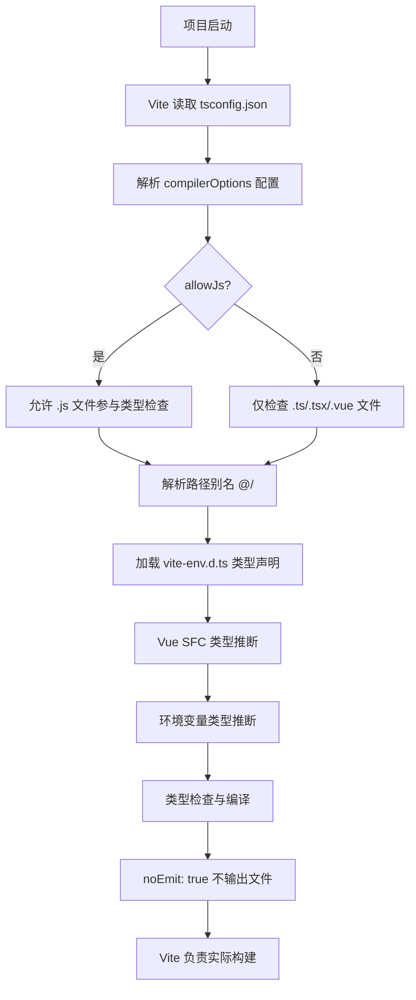

### 1.4 逻辑分析

**设计策略分析：**

TypeScript 配置采用了"严格内核 + 宽松边界"的分层设计策略。核心层面通过 `strict: true` 确保类型系统的严谨性，但在具体规则上做了务实的妥协：`noImplicitAny: false` 允许在未标注类型时使用隐式 any，这对于从 JavaScript 迁移的项目至关重要，避免了一次性改造的巨大工作量。

`allowJs: true` 配合 `noUnusedLocals: false`、`noUnusedParameters: false`，形成了一条"渐进式类型化"的平滑路径。开发者可以先让 JS 文件在项目中正常运行，然后逐步为关键模块添加类型注解，最终实现全量 TypeScript 化。

**模块解析策略：**

`moduleResolution: "bundler"` 是 Vite 生态的最佳实践。相较于传统的 `node` 解析策略，`bundler` 模式更贴合构建工具的行为，支持 `package.json` 中的 `exports` 字段，能够更好地处理 ESM 模块的导入导出。

**路径别名设计：**

`@/*` 指向 `src/*` 是前端项目的通用约定。配合 Vite 的 `resolve.alias` 配置（需在 vite.config.ts 中对应配置），实现了开发时类型提示与构建时路径解析的一致性，避免了相对路径的层级混乱。

**环境变量类型安全：**

`vite-env.d.ts` 中对 `ImportMetaEnv` 的扩展是一个关键设计。通过 TypeScript 的接口合并（Declaration Merging）特性，为 `import.meta.env` 提供了完整的类型定义，使得在代码中访问环境变量时能够获得自动补全和类型检查，避免了因拼写错误导致的运行时问题。

特别值得注意的是 `VITE_APP_ENV` 使用了联合类型 `"development" | "test" | "staging" | "production"`，而非简单的 `string`。这种字面量联合类型可以在代码中提供更精确的类型 narrowing，支持基于环境的条件编译逻辑。

**Vue 组件类型声明：**

`declare module "*.vue"` 是 Vue + TypeScript 项目的标配。它将所有 `.vue` 文件统一声明为 `DefineComponent<{}, {}, any>`，虽然 `any` 丢失了部分类型信息，但确保了 SFC 导入的基本可用性。配合 Volar 或 Vue - Official 插件，可以在 IDE 中获得更精确的组件类型推断。

### 1.5 数据流图

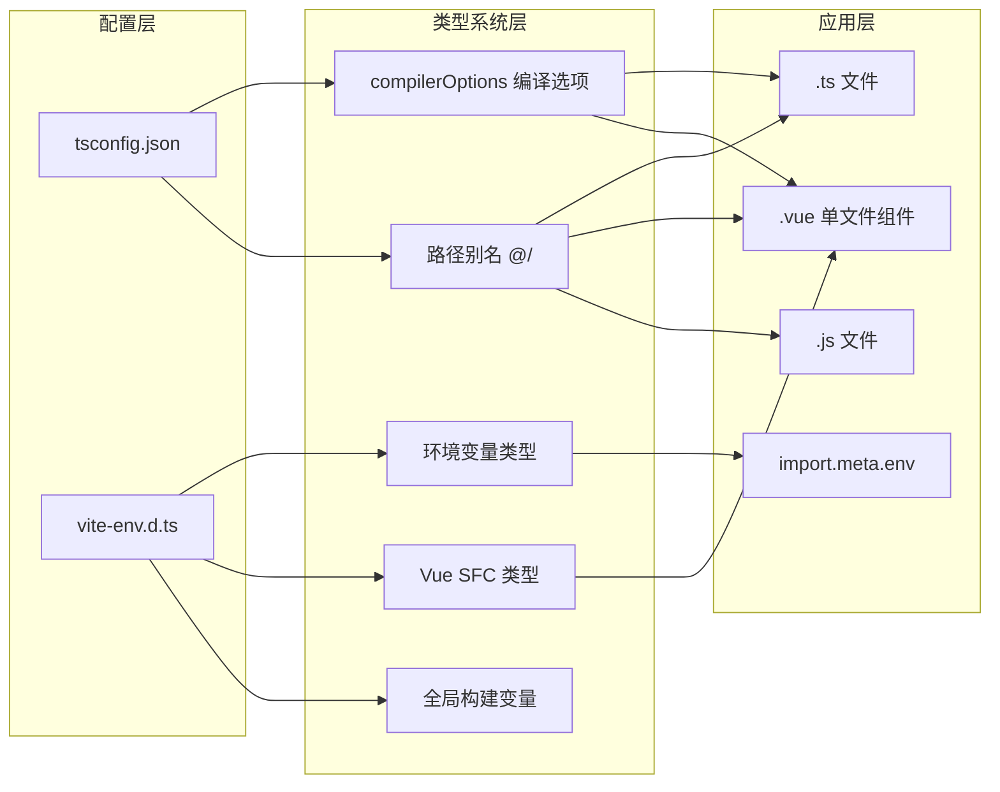

### 1.6 项目实际代码示例

**tsconfig.json 核心配置：**

```json
{
  "compilerOptions": {
    "target": "ES2020",
    "useDefineForClassFields": true,
    "module": "ESNext",
    "lib": ["ES2020", "DOM", "DOM.Iterable"],
    "skipLibCheck": true,
    "moduleResolution": "bundler",
    "allowImportingTsExtensions": true,
    "resolveJsonModule": true,
    "isolatedModules": true,
    "noEmit": true,
    "jsx": "preserve",
    "strict": true,
    "noImplicitAny": false,
    "allowJs": true,
    "noUnusedLocals": false,
    "noUnusedParameters": false,
    "noFallthroughCasesInSwitch": true,
    "baseUrl": ".",
    "paths": {
      "@/*": ["src/*"]
    },
    "types": ["node", "nprogress"]
  },
  "include": ["src/**/*.ts", "src/**/*.d.ts", "src/**/*.tsx", "src/**/*.vue"],
  "exclude": ["node_modules", "dist"],
  "references": [{ "path": "./tsconfig.node.json" }]
}
```

**vite-env.d.ts 环境变量声明：**

```typescript
/// <reference types="vite/client" />

interface ImportMetaEnv {
  readonly VITE_APP_TITLE: string;
  readonly VITE_API_BASE_URL: string;
  readonly VITE_APP_ENV: "development" | "test" | "staging" | "production";
  readonly VITE_APP_VERSION: string;
  readonly VITE_ENABLE_MOCK: string;
  readonly VITE_ENABLE_DEVTOOLS: string;
}

interface ImportMeta {
  readonly env: ImportMetaEnv;
}

declare module "*.vue" {
  import type { DefineComponent } from "vue";
  const component: DefineComponent<{}, {}, any>;
  export default component;
}

declare const __APP_ENV__: string;
declare const __BUILD_TIME__: string;
declare const __BUILD_VERSION__: string;
declare const __BUILD_ENV__: string;
```

---

## 二、Pinia 状态管理

### 2.1 功能介绍说明

Pinia 状态管理是项目的全局数据中枢，采用 Vue 3 官方推荐的 Pinia 状态管理库，结合 `pinia-plugin-persistedstate` 持久化插件，构建了模块化的状态管理体系。项目共包含三个核心 Store 模块：用户状态（user）、应用全局状态（app）、数据字典（dict），分别负责用户身份认证数据、应用级 UI 配置、系统枚举数据缓存。

整体架构采用 Setup Store 写法（Composition API 风格），而非传统的 Options API 写法，更贴合 Vue 3 的编程范式，具备更好的 TypeScript 类型推断能力和代码复用性。每个 Store 独立维护自身的 State、Getters（Computed）、Actions，并通过持久化配置选择性地将状态保存到 localStorage，实现刷新页面后数据不丢失。

### 2.2 详细实现步骤

**步骤一：初始化 Pinia 实例与插件注册**

1. 从 `pinia` 包导入 `createPinia` 函数创建实例
2. 导入 `pinia-plugin-persistedstate` 持久化插件
3. 通过 `pinia.use()` 方法注册持久化插件
4. 统一导出所有 Store 模块，便于外部引用

**步骤二：用户状态 Store（useUserStore）实现**

1. **State 定义**：使用 `ref` 定义四个核心状态
   - `token`：用户身份令牌，初始为空字符串
   - `userInfo`：用户基本信息对象，包含 id、username、name、avatar
   - `roles`：用户角色列表，初始为空数组
   - `permissions`：用户权限标识列表，初始为空数组

2. **Computed 计算属性**：使用 `computed` 定义派生状态
   - `isLoggedIn`：根据 token 判断是否已登录
   - `isAdmin`：判断是否包含 admin 角色
   - `displayName`：用户显示名称（优先 name，其次 username）

3. **Actions 方法实现**：
   - `setToken`、`setUserInfo`、`setRoles`、`setPermissions`：各状态的独立设置方法
   - `setLoginData`：登录成功后批量设置所有用户数据
   - `hasPermission`：权限检查方法，支持单个权限或权限数组（满足其一即可），admin 拥有所有权限
   - `hasRole`：角色检查方法，支持单个角色或角色数组
   - `logout`：退出登录，清除数据并跳转到登录页
   - `clearUserData`：仅清除数据不跳转，用于 token 过期场景

4. **持久化配置**：将 token、userInfo、roles、permissions 四个状态持久化到 localStorage，key 为 `tlias-user`

**步骤三：应用全局状态 Store（useAppStore）实现**

1. **State 定义**：
   - `sidebarCollapsed`：侧边栏折叠状态
   - `theme`：主题模式（light/dark）
   - `language`：当前语言
   - `globalLoading` / `globalLoadingText`：全局加载状态
   - `pageTitle`：页面标题
   - `cachedViews`：KeepAlive 缓存的路由名称列表

2. **Computed 计算属性**：
   - `isDarkTheme`：判断是否为暗色主题

3. **Actions 方法实现**：
   - 侧边栏控制：`toggleSidebar`、`setSidebarCollapsed`
   - 主题管理：`toggleTheme`、`setTheme`、`updateThemeStyle`（操作 DOM class）
   - 语言设置：`setLanguage`
   - 全局加载：`showGlobalLoading`、`hideGlobalLoading`
   - 页面标题：`setPageTitle`（同步设置 document.title）
   - 缓存视图：`addCachedView`、`removeCachedView`、`clearCachedViews`

4. **持久化配置**：持久化 sidebarCollapsed、theme、language，key 为 `tlias-app`

**步骤四：数据字典 Store（useDictStore）实现**

1. **State 定义**：
   - `dictData`：字典数据对象，按类型分组存储，预置了 emp_job（员工职位）、stu_degree（学生学历）、gender（性别）三类字典
   - `isLoaded`：字典是否已从后端加载的标记

2. **Actions 方法实现**：
   - `getDictByType`：根据字典类型获取列表
   - `getDictLabel`：根据类型和值获取显示文本
   - `getDictItem`：根据类型和值获取完整字典项
   - `setDictData`：设置单类字典数据
   - `setAllDictData`：批量设置所有字典数据
   - `clearDictData`：清除字典缓存
   - `loadDictFromServer`：从后端加载字典数据（预留接口）

3. **持久化配置**：持久化 dictData 和 isLoaded，key 为 `tlias-dict`

### 2.3 流程图

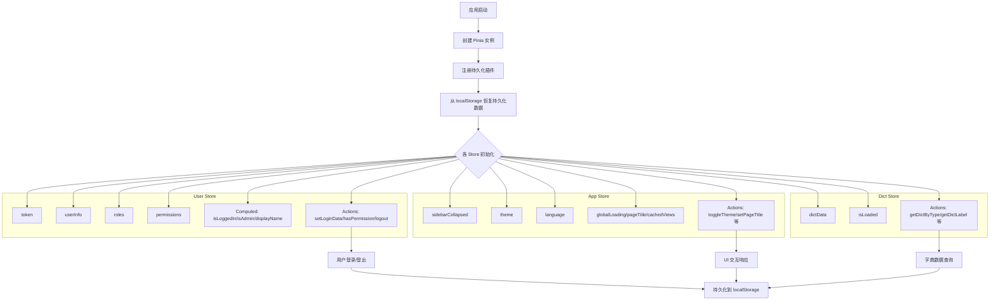

### 2.4 逻辑分析

**架构模式分析：**

项目采用 Setup Store 写法，这是 Pinia 与 Vue 3 Composition API 深度结合的最佳实践。与 Options Store 相比，Setup Store 具有以下优势：一是更自然的 TypeScript 类型推断，无需额外的类型声明；二是更好的代码组织能力，可以自由组合 `ref`、`computed` 等响应式 API；三是更高的灵活性，可以在 Store 内部使用其他组合式函数。

**模块化设计：**

三个 Store 按照职责边界清晰划分：
- **user store**：身份认证域，管理用户身份相关的所有数据
- **app store**：UI 配置域，管理界面展示相关的全局状态
- **dict store**：数据缓存域，管理系统枚举数据的缓存与访问

这种划分遵循了"单一职责原则"，每个 Store 只负责一个领域的状态，降低了模块间的耦合度。同时通过 `stores/index.js` 统一导出，使用方只需从 `@/stores` 导入即可，无需关心具体模块路径。

**持久化策略：**

持久化配置非常精细化，不是对整个 Store 进行持久化，而是通过 `paths` 选项选择性地持久化关键状态。例如 user store 持久化了所有身份数据（保证刷新不丢失登录状态），app store 只持久化 UI 偏好设置（侧边栏、主题、语言），而 globalLoading、pageTitle 等瞬时状态则不持久化。

这种"关键状态持久化 + 瞬时状态内存化"的策略平衡了用户体验与数据一致性，避免了不必要的 localStorage 读写开销。

**权限检查逻辑：**

`hasPermission` 方法的设计体现了良好的工程实践：
1. **admin 特权**：管理员角色自动拥有所有权限，这是 RBAC 系统的常见设计
2. **空列表处理**：权限列表为空时返回 false，避免误授权
3. **数组支持**：支持传入权限数组，满足"或"逻辑（满足任意一个即可）
4. **字符串转译**：在 `getDictItem` 中使用 `String()` 进行值比较，避免数字/字符串类型不一致导致的匹配失败

### 2.5 数据流图

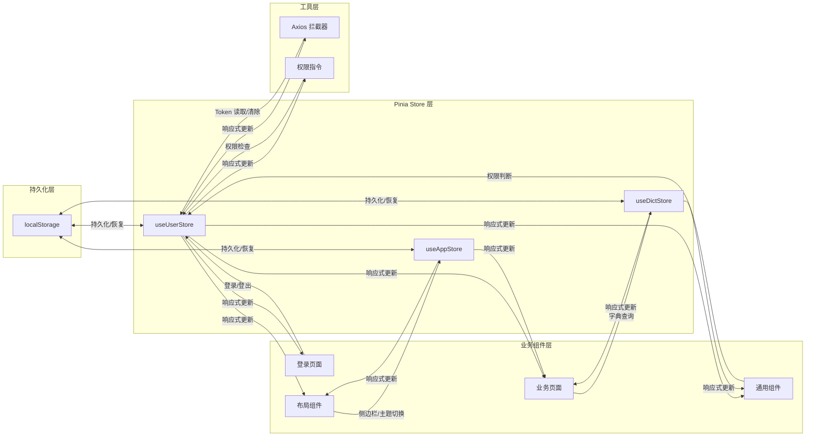

### 2.6 项目实际代码示例

**stores/index.js 入口文件：**

```javascript
import { createPinia } from 'pinia'
import piniaPluginPersistedstate from 'pinia-plugin-persistedstate'

const pinia = createPinia()
pinia.use(piniaPluginPersistedstate)

export default pinia

export * from './modules/user'
export * from './modules/app'
export * from './modules/dict'
```

**stores/modules/user.js 核心逻辑：**

```javascript
export const useUserStore = defineStore('user', () => {
  const token = ref('')
  const userInfo = ref({ id: null, username: '', name: '', avatar: '' })
  const roles = ref([])
  const permissions = ref([])

  const isLoggedIn = computed(() => !!token.value)
  const isAdmin = computed(() => roles.value.includes('admin'))
  const displayName = computed(() => userInfo.value.name || userInfo.value.username || '未知用户')

  const hasPermission = (permission) => {
    if (isAdmin.value) return true
    if (!permissions.value.length) return false
    if (Array.isArray(permission)) {
      return permission.some(p => permissions.value.includes(p))
    }
    return permissions.value.includes(permission)
  }

  const setLoginData = (data) => {
    setToken(data.token)
    if (data.userInfo) setUserInfo(data.userInfo)
    if (data.roles) setRoles(data.roles)
    if (data.permissions) setPermissions(data.permissions)
  }

  const logout = async () => {
    token.value = ''
    userInfo.value = { id: null, username: '', name: '', avatar: '' }
    roles.value = []
    permissions.value = []
    ElMessage.success('已退出登录')
    const router = useRouter()
    router.push('/login')
  }

  return { token, userInfo, roles, permissions, isLoggedIn, isAdmin, displayName, setLoginData, hasPermission, hasRole, logout, clearUserData }
}, {
  persist: {
    key: 'tlias-user',
    storage: localStorage,
    paths: ['token', 'userInfo', 'roles', 'permissions']
  }
})
```

**stores/modules/dict.js 字典缓存：**

```javascript
export const useDictStore = defineStore('dict', () => {
  const dictData = ref({
    emp_job: [
      { label: '班主任', value: 1 },
      { label: '讲师', value: 2 },
    ],
    gender: [
      { label: '男', value: 1 },
      { label: '女', value: 2 },
    ],
  })
  const isLoaded = ref(false)

  const getDictByType = (type) => dictData.value[type] || []
  const getDictLabel = (type, value) => {
    const list = getDictByType(type)
    const item = list.find((d) => d.value === value)
    return item ? item.label : ''
  }
  const getDictItem = (type, value) => {
    const list = getDictByType(type)
    return list.find((d) => String(d.value) === String(value)) || null
  }

  return { dictData, isLoaded, getDictByType, getDictLabel, getDictItem, setDictData, setAllDictData, clearDictData, loadDictFromServer }
}, {
  persist: {
    key: 'tlias-dict',
    storage: localStorage,
    paths: ['dictData', 'isLoaded'],
  },
})
```

---

## 三、权限指令

### 3.1 功能介绍说明

权限指令系统是前端权限控制的核心实现，基于 Vue 自定义指令（Directive）机制，提供了 `v-permission` 和 `v-role` 两个指令，分别用于权限标识和角色标识的细粒度 UI 级权限控制。开发者只需在 DOM 元素或组件上添加相应指令，即可根据当前用户的权限/角色列表自动控制元素的显示与隐藏。

该权限系统采用了"运行时检查 + DOM 移除"的实现策略，在指令的 `mounted` 钩子中进行权限校验，无权限时直接从 DOM 树中移除元素，而非仅通过 CSS 隐藏，从根本上避免了无权限用户通过开发者工具查看或操作敏感元素的风险。

### 3.2 详细实现步骤

**步骤一：定义权限指令 v-permission**

1. 导入 `useUserStore` 获取用户状态
2. 在 `mounted` 钩子中获取指令绑定值（权限标识）
3. 边界检查：如果未传入权限标识，输出警告并返回
4. 调用 `userStore.hasPermission(value)` 检查权限
5. 无权限时，通过 `el.parentNode?.removeChild(el)` 从 DOM 中移除元素

**步骤二：定义角色指令 v-role**

1. 导入 `useUserStore` 获取用户状态
2. 在 `mounted` 钩子中获取指令绑定值（角色标识）
3. 边界检查：如果未传入角色标识，输出警告并返回
4. 调用 `userStore.hasRole(value)` 检查角色
5. 无权限时，通过 `el.parentNode?.removeChild(el)` 从 DOM 中移除元素

**步骤三：封装注册函数**

1. 创建 `setupDirectives` 函数，接收 Vue 应用实例 `app`
2. 批量调用 `app.directive()` 注册所有自定义指令
3. 在应用入口 `main.ts` 中调用此函数完成注册

**步骤四：使用方式说明**

- 单个权限：`v-permission="'system:emp:add'"`
- 多个权限（满足任意一个）：`v-permission="['system:emp:add', 'system:emp:edit']"`
- 单个角色：`v-role="'admin'"`
- 多个角色：`v-role="['admin', 'teacher']"`

### 3.3 流程图

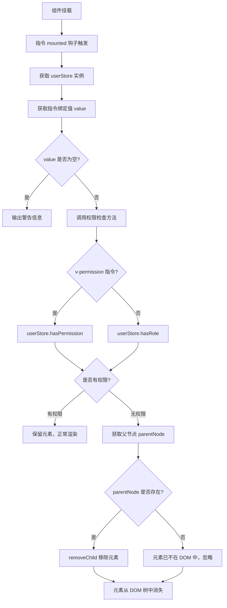

### 3.4 逻辑分析

**实现机制分析：**

权限指令基于 Vue 的自定义指令生命周期钩子 `mounted` 实现。选择 `mounted` 而非 `created` 或 `beforeMount` 的原因是：只有在 `mounted` 阶段，元素才真正被插入到 DOM 树中，其父节点才存在，此时才能执行 `removeChild` 操作。

**安全策略分析：**

采用 DOM 移除而非 CSS 隐藏（`display: none` 或 `visibility: hidden`）是一个重要的安全设计。如果仅用 CSS 隐藏，用户可以通过浏览器开发者工具修改样式后看到甚至操作敏感按钮；而直接移除 DOM 节点则从根本上杜绝了这种可能，提升了前端权限控制的安全性。

**可选链操作符的使用：**

`el.parentNode?.removeChild(el)` 中的 `?.` 可选链操作符是一个防御性编程细节。理论上 mounted 阶段的元素必然有父节点，但考虑到某些特殊场景（如元素被其他逻辑提前移除、Teleport 传送等），使用可选链可以避免报错导致整个应用崩溃。

**权限检查的委托设计：**

指令本身不包含任何权限判断逻辑，所有权限校验都委托给 `userStore.hasPermission` 和 `userStore.hasRole` 方法。这种"单一职责"的设计有两个好处：一是权限逻辑集中管理，修改权限判断规则时只需改 Store 中的一处代码；二是指令保持轻量，专注于 DOM 操作。

**数组参数的支持：**

两个指令都支持传入数组形式的权限/角色标识，采用"或"逻辑（满足任意一个即可）。这种设计覆盖了大多数业务场景，例如"新增或编辑权限的用户都可以看到保存按钮"。如果需要"与"逻辑，开发者可以在业务代码中自行组合。

**潜在局限：**

当前实现仅在 `mounted` 阶段检查一次权限，如果用户登录后权限发生动态变化（如刷新权限列表），已渲染的元素不会自动更新。对于大多数后台管理系统而言，权限变更通常伴随重新登录，这个局限影响不大。如果需要支持动态权限更新，可以增加 `updated` 钩子或使用 watch 监听权限变化。

### 3.5 数据流图

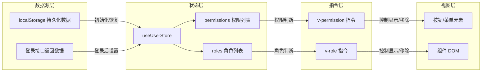

### 3.6 项目实际代码示例

**directives/permission.js 完整实现：**

```javascript
import { useUserStore } from '@/stores'

export const permission = {
  mounted(el, binding) {
    const userStore = useUserStore()
    const value = binding.value

    if (!value) {
      console.warn('[v-permission] 未传入权限标识')
      return
    }

    const hasPermission = userStore.hasPermission(value)

    if (!hasPermission) {
      el.parentNode?.removeChild(el)
    }
  }
}

export const role = {
  mounted(el, binding) {
    const userStore = useUserStore()
    const value = binding.value

    if (!value) {
      console.warn('[v-role] 未传入角色标识')
      return
    }

    const hasRole = userStore.hasRole(value)

    if (!hasRole) {
      el.parentNode?.removeChild(el)
    }
  }
}

export const setupDirectives = (app) => {
  app.directive('permission', permission)
  app.directive('role', role)
}
```

**使用示例（业务组件中）：**

```vue
<template>
  <!-- 单个权限控制 -->
  <el-button type="primary" v-permission="'system:emp:add'" @click="handleAdd">
    新增员工
  </el-button>

  <!-- 多个权限（满足任意一个） -->
  <el-button v-permission="['system:emp:edit', 'system:emp:view']" @click="handleView">
    查看详情
  </el-button>

  <!-- 角色控制 -->
  <el-button type="danger" v-role="'admin'" @click="handleDelete">
    删除
  </el-button>

  <!-- 多角色控制 -->
  <div v-role="['admin', 'manager']" class="admin-panel">
    管理员面板
  </div>
</template>
```

---

## 四、通用业务组件库

### 4.1 功能介绍说明

通用业务组件库是项目复用能力的核心载体，基于 Element Plus 组件库进行二次封装，提供了 6 个高频业务组件：ProTable（高级表格）、DictTag（字典标签）、ImageUpload（图片上传）、PageHeader（页面头部）、ProFormDialog（表单弹窗）、TableSkeleton（表格骨架屏）。这些组件覆盖了后台管理系统中最常见的业务场景，通过统一的封装减少重复代码，提升开发效率。

组件库采用"按需注册 + 全局可用"的策略，通过 `components/common/index.ts` 中的 `setupCommonComponents` 函数批量注册为全局组件，业务页面可以直接使用无需单独导入。同时也支持具名导出，满足按需导入的需求。

### 4.2 详细实现步骤

**步骤一：ProTable 高级表格组件实现**

1. **搜索区域**：根据 `searchColumns` 配置自动生成搜索表单，支持 input、select、date 三种类型
2. **工具栏区域**：左侧支持新增、批量删除按钮，右侧支持列设置下拉菜单
3. **表格主体**：基于 el-table 封装，支持多选、序号列、动态列显隐、自定义列插槽
4. **分页区域**：集成 el-pagination，支持页码和每页条数切换
5. **骨架屏**：加载时显示 TableSkeleton 骨架屏，提升感知体验
6. **列配置持久化**：通过 useTableColumns composable 实现列设置的本地存储
7. **暴露方法**：clearSelection、searchForm、pagination 等

**步骤二：DictTag 字典标签组件实现**

1. 接收 `dictType`（字典类型）和 `value`（字典值）两个 props
2. 调用 `useDictStore().getDictItem()` 获取字典项
3. 根据字典项的 tagType 属性设置 el-tag 的类型
4. 显示字典项的 label，找不到时显示 `-`

**步骤三：ImageUpload 图片上传组件实现**

1. 基于 el-upload 封装，配置 `accept="image/*"` 限制图片类型
2. 支持 `v-model` 双向绑定图片 URL
3. `beforeUpload` 钩子校验文件类型和大小
4. 上传成功后更新 modelValue 并触发 change 事件
5. 自定义上传区域样式：有图片时显示预览+遮罩编辑，无图时显示占位提示
6. 自动从 userStore 获取 token 并设置到请求头

**步骤四：PageHeader 页面头部组件实现**

1. 基于 el-card 封装，提供统一的页面标题样式
2. 支持 `title` 主标题和 `description` 描述文本
3. 支持 `showBack` 返回按钮和自定义 `backPath` 返回路径
4. 右侧通过 `extra` 插槽放置操作按钮

**步骤五：ProFormDialog 表单弹窗组件实现**

1. 基于 el-dialog 和 el-form 组合封装
2. 支持 `v-model` 控制显示隐藏
3. 通过 `initialData` 设置表单初始值
4. 通过 `rules` 配置表单验证规则
5. 弹窗打开时自动重置表单，关闭时同步更新 v-model
6. 提交时自动校验表单，校验通过后触发 submit 事件
7. 暴露 formData、formRef、resetForm 供父组件调用

**步骤六：组件统一注册**

1. 在 index.ts 中导入所有通用组件
2. 定义 components 数组统一管理
3. 实现 `setupCommonComponents` 函数遍历注册为全局组件
4. 同时具名导出所有组件，支持按需导入

### 4.3 流程图

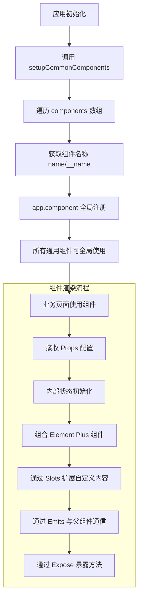

### 4.4 逻辑分析

**封装策略分析：**

通用组件采用了"约定优于配置"的设计理念。以 ProTable 为例，它内置了搜索、工具栏、表格、分页的标准布局，并提供了大量默认值，使得最简单的使用只需传入 `columns`、`data`、`total` 三个 props 即可工作。同时，组件又通过丰富的插槽和事件提供了足够的扩展点，满足复杂场景的定制需求。

**Props 与 Slots 的平衡：**

每个组件都精心设计了 Props 与 Slots 的边界。简单的配置项通过 Props 传入（如 title、width、loading），复杂的自定义内容通过 Slots 扩展（如搜索表单、表格列、工具栏）。这种设计既保证了常用场景的简洁性，又保留了复杂场景的灵活性。

**v-model 双向绑定：**

ImageUpload 和 ProFormDialog 都实现了 `v-model` 支持，这是 Vue 3 组件封装的最佳实践。通过 `modelValue` prop 和 `update:modelValue` 事件，实现了父组件与子组件数据的双向同步，使用方式简洁直观。

**暴露方法（defineExpose）：**

ProTable 和 ProFormDialog 都使用 `defineExpose` 暴露了内部方法和属性（如 clearSelection、formRef、resetForm）。这是组合式 API 组件与父组件交互的重要方式，父组件可以通过模板 ref 直接调用这些方法，实现更复杂的控制逻辑。

**与 Store 的集成：**

DictTag 和 ImageUpload 直接依赖对应的 Store（dictStore 和 userStore），这种"组件 + Store"的深度集成虽然增加了耦合度，但极大提升了使用便捷性。对于业务组件库来说，这种权衡是合理的，因为这些组件本身就是为特定业务系统设计的，而非通用的 UI 库。

**TypeScript 支持：**

所有组件都使用 `<script setup lang="ts">` 编写，并定义了清晰的 Props 接口。这为使用方提供了良好的类型提示和代码补全，降低了使用门槛，减少了因参数错误导致的 bug。

### 4.5 数据流图

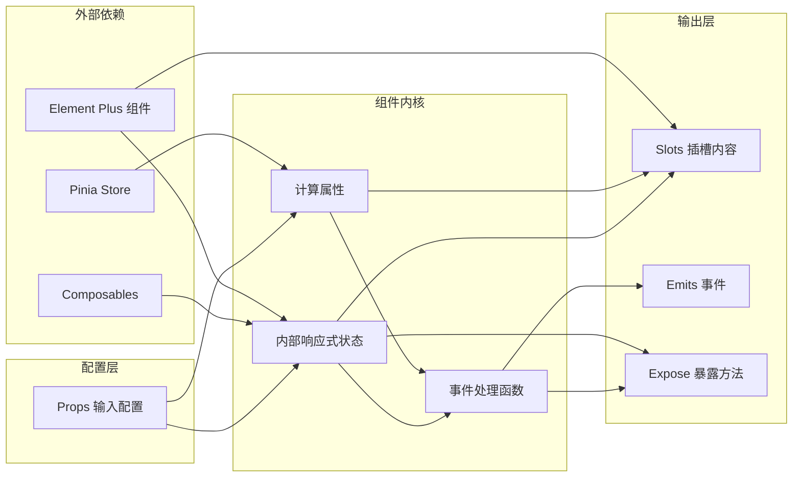

### 4.6 项目实际代码示例

**components/common/index.ts 统一注册：**

```typescript
import type { App, Component } from "vue";
import DictTag from "./DictTag.vue";
import ProTable from "./ProTable.vue";
import ProFormDialog from "./ProFormDialog.vue";
import ImageUpload from "./ImageUpload.vue";
import PageHeader from "./PageHeader.vue";
import TableSkeleton from "./TableSkeleton.vue";

const components: Component[] = [
  DictTag,
  ProTable,
  ProFormDialog,
  ImageUpload,
  PageHeader,
  TableSkeleton,
];

export function setupCommonComponents(app: App): void {
  components.forEach((component) => {
    const name = (component as any).name || (component as any).__name;
    if (name) {
      app.component(name, component);
    }
  });
}

export { DictTag, ProTable, ProFormDialog, ImageUpload, PageHeader, TableSkeleton };
```

**DictTag.vue 字典标签：**

```vue
<template>
  <el-tag v-if="dictItem" :type="dictItem.tagType || 'info'" effect="light">
    {{ dictItem.label }}
  </el-tag>
  <span v-else>-</span>
</template>

<script setup lang="ts">
import { computed } from "vue";
import { useDictStore } from "@/stores/modules/dict";

interface Props {
  dictType: string;
  value: string | number;
}

const props = defineProps<Props>();
const dictStore = useDictStore();

const dictItem = computed(() => {
  return dictStore.getDictItem(props.dictType, props.value);
});
</script>
```

**ProFormDialog.vue 表单弹窗核心逻辑：**

```vue
<script setup lang="ts">
import { ref, watch, reactive } from "vue";
import type { FormInstance, FormRules } from "element-plus";

interface Props {
  modelValue: boolean;
  title?: string;
  width?: string | number;
  rules?: FormRules;
  initialData?: Record<string, any>;
  submitLoading?: boolean;
}

const props = withDefaults(defineProps<Props>(), {
  title: "",
  width: "600px",
  rules: () => ({}),
  initialData: () => ({}),
  submitLoading: false,
});

const emit = defineEmits<{
  "update:modelValue": [val: boolean];
  submit: [formData: Record<string, any>];
}>();

const formRef = ref<FormInstance>();
const visible = ref(props.modelValue);
const formData = reactive<Record<string, any>>({ ...props.initialData });

watch(() => props.modelValue, (val) => {
  visible.value = val;
  if (val) resetForm();
});

function resetForm() {
  formRef.value?.resetFields();
  Object.keys(formData).forEach((key) => delete formData[key]);
  Object.assign(formData, props.initialData);
}

function handleSubmit() {
  formRef.value?.validate((valid) => {
    if (valid) {
      emit("submit", { ...formData });
    }
  });
}

defineExpose({ formData, formRef, resetForm });
</script>
```

---

## 五、错误边界

### 5.1 功能介绍说明

错误边界（ErrorBoundary）是前端应用的重要防护机制，基于 Vue 3 的 `onErrorCaptured` 生命周期钩子实现，用于捕获子组件树中的 JavaScript 错误，阻止错误冒泡导致整个应用崩溃（白屏）。当子组件发生渲染错误时，错误边界会展示友好的降级 UI，包含错误提示、重试按钮、刷新按钮，并在开发环境下显示详细的错误堆栈信息，便于调试定位问题。

该组件是应用容错体系的核心组成部分，遵循了 React 生态中"错误边界"的设计思想，并结合 Vue 的 API 特点进行了适配，是保障应用稳定性和用户体验的关键防线。

### 5.2 详细实现步骤

**步骤一：定义组件 Props**

1. `errorMessage`：自定义错误提示文案，默认为"页面出现异常"
2. `showRetry`：是否显示重试按钮，默认为 true
3. `showDetail`：是否显示错误详情，默认在开发环境（import.meta.env.DEV）下开启

**步骤二：定义内部状态**

1. `hasError`：布尔值，标记是否捕获到错误
2. `errorInfo`：对象，存储错误详情（message、stack、component、info）

**步骤三：实现错误捕获逻辑**

1. 使用 `onErrorCaptured` 钩子注册错误捕获函数
2. 接收三个参数：error（错误对象）、instance（触发错误的组件实例）、info（错误类型信息）
3. 设置 `hasError = true`，记录错误信息到 `errorInfo`
4. 通过 emit 触发 `error` 事件，将错误信息上报给父组件
5. 返回 `false`，阻止错误继续向上传播

**步骤四：实现用户操作方法**

1. `handleRetry`：重置错误状态，让 Vue 重新渲染子组件
2. `handleRefresh`：调用 `window.location.reload()` 刷新整个页面

**步骤五：实现降级 UI 模板**

1. 当 `hasError` 为 true 时，显示错误边界页面
2. 包含：警告图标、错误标题、描述文案
3. 开发环境显示详细错误信息（message + 可折叠的 stack）
4. 底部操作区：重试按钮（可选）、刷新页面按钮
5. 当 `hasError` 为 false 时，通过默认 slot 正常渲染子组件

**步骤六：样式设计**

1. 居中布局，最小高度 300px
2. 警告图标使用 SVG 绘制，橙色主题
3. 错误详情区域使用灰色背景，代码样式
4. 按钮区域居中排列，间距均匀

### 5.3 流程图

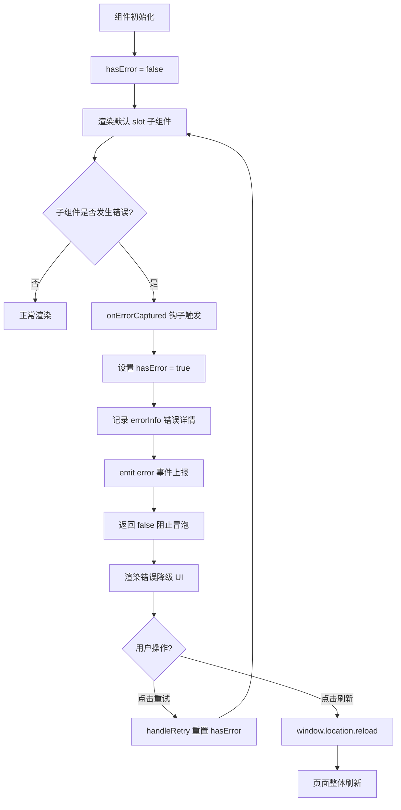

### 5.4 逻辑分析

**错误捕获机制：**

`onErrorCaptured` 是 Vue 3 提供的错误捕获钩子，它会捕获来自所有后代组件的错误。这个钩子可以在组件的 setup 函数或选项式 API 中使用。钩子函数返回 `false` 是一个关键细节——它告诉 Vue 这个错误已经被处理了，不需要继续向上传播，从而避免了全局错误处理器的重复触发。

**错误信息结构：**

除了标准的 `message` 和 `stack`，组件还额外记录了 `component`（组件名称）和 `info`（错误类型信息，如 "setup function"、"render function"、"lifecycle hook" 等）。这些信息对于定位问题非常有价值，特别是在复杂的组件树中，可以快速知道是哪个组件的哪个阶段出了问题。

**重试机制的设计：**

"重试"按钮的核心逻辑是将 `hasError` 重置为 `false`，这会触发组件重新渲染默认 slot。这种机制对于一些临时性错误（如网络抖动导致数据异常、状态不一致等）非常有效，用户无需刷新整个页面就可以恢复。但需要注意的是，如果错误是由代码逻辑 bug 导致的，重试后还是会再次出错，此时用户可以选择"刷新页面"。

**开发与生产的差异化：**

`showDetail` 的默认值设置为 `import.meta.env.DEV`，这是一个典型的环境差异化设计。在开发环境，开发者需要看到完整的错误堆栈来调试问题；而在生产环境，向用户暴露详细的错误信息既不友好也不安全（可能泄露系统内部信息）。生产环境只展示通用提示文案，同时通过 `error` 事件将错误上报到监控系统。

**作用范围：**

错误边界只能捕获子组件渲染阶段的错误，以下类型的错误无法被捕获：
- 事件处理器中的错误（需要 try/catch 手动处理）
- 异步代码中的错误（如 setTimeout、Promise 回调）
- 服务端渲染（SSR）中的错误
- 错误边界自身抛出的错误

因此，错误边界是应用容错体系的一部分，而非全部，需要配合全局错误处理器、接口错误处理等机制共同保障应用稳定性。

### 5.5 数据流图

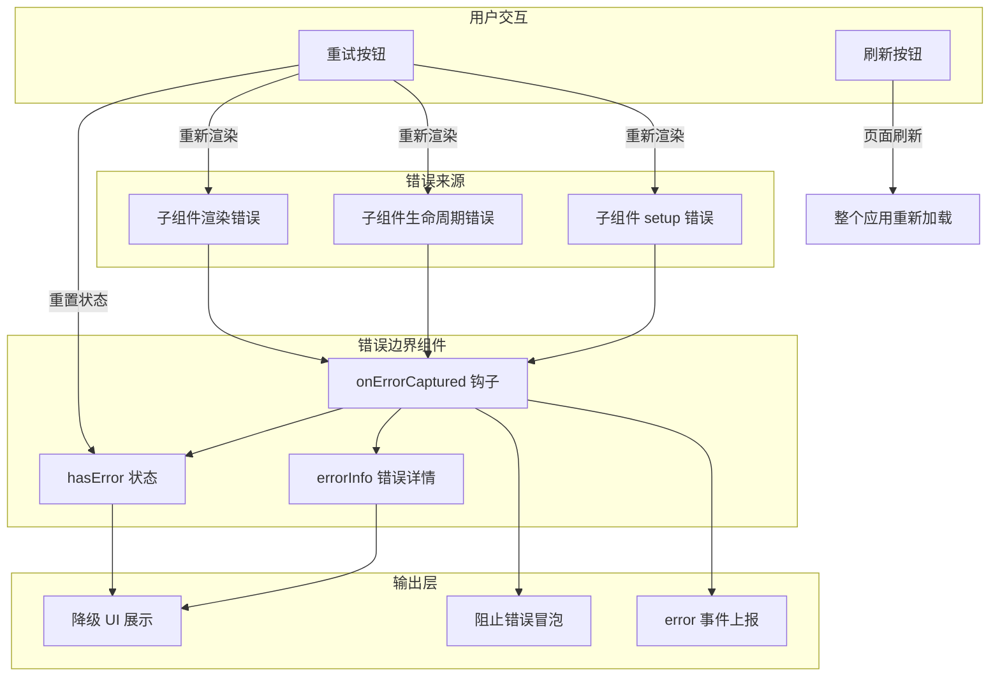

### 5.6 项目实际代码示例

**ErrorBoundary.vue 完整实现：**

```vue
<script setup>
import { ref, onErrorCaptured } from 'vue'

const props = defineProps({
  errorMessage: {
    type: String,
    default: '页面出现异常'
  },
  showRetry: {
    type: Boolean,
    default: true
  },
  showDetail: {
    type: Boolean,
    default: import.meta.env.DEV
  }
})

const emit = defineEmits(['error'])

const hasError = ref(false)

const errorInfo = ref({
  message: '',
  stack: ''
})

onErrorCaptured((error, instance, info) => {
  hasError.value = true
  errorInfo.value = {
    message: error.message,
    stack: error.stack,
    component: instance?.$options?.name || 'Anonymous',
    info
  }

  emit('error', errorInfo.value)

  return false
})

const handleRetry = () => {
  hasError.value = false
  errorInfo.value = { message: '', stack: '' }
}

const handleRefresh = () => {
  window.location.reload()
}
</script>

<template>
  <div v-if="hasError" class="error-boundary">
    <div class="error-boundary-content">
      <div class="error-icon">
        <svg viewBox="0 0 24 24" fill="none" xmlns="http://www.w3.org/2000/svg">
          <circle cx="12" cy="12" r="10" stroke="#E6A23C" stroke-width="2" />
          <path d="M12 8V12" stroke="#E6A23C" stroke-width="2" stroke-linecap="round" />
          <circle cx="12" cy="16" r="1" fill="#E6A23C" />
        </svg>
      </div>
      <h3 class="error-title">{{ errorMessage }}</h3>
      <p class="error-desc">请尝试刷新页面或联系管理员</p>

      <div v-if="showDetail && errorInfo.stack" class="error-detail">
        <pre>{{ errorInfo.message }}</pre>
        <details>
          <summary>查看详细信息</summary>
          <pre>{{ errorInfo.stack }}</pre>
        </details>
      </div>

      <div class="error-actions">
        <el-button v-if="showRetry" type="primary" @click="handleRetry">
          重试
        </el-button>
        <el-button @click="handleRefresh">
          刷新页面
        </el-button>
      </div>
    </div>
  </div>

  <slot v-else />
</template>
```

**使用方式示例：**

```vue
<template>
  <ErrorBoundary :error-message="'数据加载失败'" @error="handleError">
    <DataTable :data="tableData" />
  </ErrorBoundary>
</template>

<script setup>
import ErrorBoundary from '@/components/ErrorBoundary.vue'

function handleError(errorInfo) {
  console.error('组件出错了:', errorInfo)
}
</script>
```

---

## 六、Axios 请求封装

### 6.1 功能介绍说明

Axios 请求封装是项目前后端通信的基础设施，基于 axios 库进行了深度定制，提供了一整套企业级 HTTP 请求解决方案。核心能力包括：统一的请求/响应拦截、Token 自动注入、全局 Loading 状态管理、请求取消与防重复、接口重试机制、请求缓存、错误码统一处理、白名单机制等。

该封装采用了"配置中心化 + 拦截器流水线"的架构设计，将各种横切关注点（认证、日志、错误处理、性能优化等）通过拦截器串联起来，业务代码只需关注数据本身，无需关心底层的 HTTP 细节，大幅提升了开发效率和代码一致性。

### 6.2 详细实现步骤

**步骤一：基础配置与常量定义**

1. 设置 `BASE_URL = "/api"`，配合 Vite 代理转发
2. 设置 `TIMEOUT = 15000`，请求超时时间 15 秒
3. 定义重试配置：`RETRY_COUNT = 2`、`RETRY_DELAY = 1000`
4. 定义白名单：`WHITE_LIST`（不需要 Token 的接口）
5. 定义 `NO_RETRY_METHODS`：POST/PUT/DELETE 等非幂等请求不重试

**步骤二：请求队列与取消机制**

1. 使用 `pendingRequests = new Map()` 维护待处理请求队列
2. `generateRequestKey`：根据 method、url、params、data 生成唯一标识
3. `addPendingRequest`：请求发起前检查是否重复，重复则取消前一个
4. `removePendingRequest`：请求完成后从队列移除
5. `cancelAllRequests`：取消所有请求（路由切换时调用）

**步骤三：全局 Loading 管理**

1. 使用 `loadingInstance` 和 `loadingCount` 管理 Loading 状态
2. `showLoading`：loadingCount 为 0 时创建 Loading 实例，计数 +1
3. `hideLoading`：计数 -1，减到 0 时关闭 Loading
4. 通过引用计数避免多个请求同时进行时 Loading 闪烁

**步骤四：请求缓存机制**

1. 使用 `requestCache = new Map()` 存储缓存数据
2. 设置 `CACHE_MAX_AGE = 5 分钟`、`CACHE_MAX_SIZE = 200`
3. `generateCacheKey`：根据 method、url、排序后的 params 生成缓存键
4. `getCache`：读取缓存，过期自动删除
5. `setCache`：写入缓存，超过最大数量时删除最早的（FIFO）
6. `clearCache`：支持按模式清除缓存或全部清除

**步骤五：请求拦截器实现**

1. 开发环境打印请求日志
2. 检查 cache 配置且为 GET 请求时，优先从缓存读取，命中直接返回
3. 调用 `addPendingRequest` 加入请求队列
4. 从 userStore 获取 token，非白名单接口自动添加到请求头
5. 需要 Loading 的接口调用 `showLoading`
6. 请求发送失败时隐藏 Loading 并提示错误

**步骤六：响应拦截器实现**

1. 缓存数据直接返回（__fromCache 标记）
2. 开发环境打印响应日志
3. 调用 `removePendingRequest` 从队列移除
4. 调用 `hideLoading` 关闭 Loading
5. 成功的 GET 请求且配置了 cache 时，写入缓存
6. 根据业务状态码 `code` 判断成功/失败（code === 1 为成功）
7. 401 状态码时清除用户数据并跳转到登录页
8. 其他错误使用 ElMessage 统一提示

**步骤七：错误处理与重试**

1. 从 pending 队列移除、关闭 Loading
2. 如果是取消的请求，直接 reject 不提示
3. 401 错误：清除用户数据，跳转登录页
4. 403 错误：提示权限不足
5. 网络超时/错误时，幂等请求自动重试（最多 2 次，延迟 1 秒）
6. 其他错误统一提示用户友好的错误信息

**步骤八：错误信息映射**

1. 定义 `ERROR_MESSAGE_MAP` 映射常见 HTTP 状态码到中文提示
2. `getErrorMessage` 函数优先使用后端返回的 msg，其次使用映射表，最后使用默认文案
3. 特殊处理超时和网络错误

### 6.3 流程图

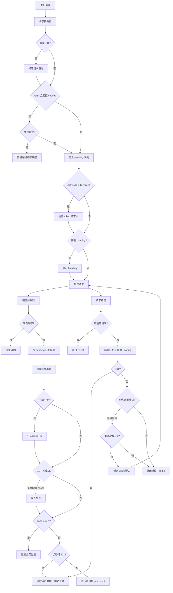

### 6.4 逻辑分析

**架构设计分析：**

整个封装采用了经典的"拦截器管道"模式，请求和响应各自经历一条处理流水线。这种架构的优势在于：每个关注点（日志、缓存、认证、Loading、错误处理等）都是独立的，可以单独调整和替换，不会影响其他部分。同时，业务代码完全感知不到这些底层处理，保持了业务逻辑的纯净。

**请求取消与防重复：**

重复请求是前端开发中的常见问题（如用户快速双击按钮、网络慢时多次点击等）。项目通过 `pendingRequests` Map 管理进行中的请求，每次发起新请求前检查是否有相同 key 的请求正在进行，如果有就取消前一个。这种策略既避免了重复请求浪费服务器资源，也保证了最新请求的响应不会被旧请求覆盖。

`cancelAllRequests` 函数用于路由切换时取消所有未完成的请求，这是一个重要的性能优化和用户体验细节——用户离开页面后，该页面的请求不再有意义，继续等待只会浪费资源，甚至可能因为组件已卸载而导致报错。

**Loading 引用计数：**

使用 `loadingCount` 引用计数而非简单的布尔值是一个精妙设计。当多个请求同时进行时，只有第一个请求会显示 Loading，最后一个完成的请求才会关闭 Loading，避免了多个请求之间 Loading 闪烁的问题，体验更加平滑。

**请求缓存策略：**

缓存功能设计得非常克制，只对 GET 请求生效（通过配置 `cache: true` 开启），且有过期时间和数量上限。缓存键生成时对 params 进行了排序，确保参数顺序不同但内容相同的请求能命中同一份缓存。FIFO 的淘汰策略虽然不如 LRU 精确，但实现简单、性能开销小，对于 200 条的上限来说完全够用。

**重试机制的审慎：**

重试机制只对幂等请求（GET 等）生效，POST/PUT/DELETE 等非幂等请求不重试。这是一个非常重要的安全考量——非幂等请求重试可能导致数据重复提交（如创建两条相同的记录）。同时，重试只针对网络超时和网络错误，对于业务错误（如参数校验失败）不重试，避免无意义的重试。

**Token 注入与白名单：**

Token 自动注入简化了业务代码，但登录接口等不需要 Token 的接口通过白名单排除。白名单使用 `url.includes(item)` 进行匹配，而非精确匹配，这样可以支持路径中带参数的情况（如 `/login/sms` 也能匹配 `/login`），但同时也带来了误匹配的风险，使用时需要注意命名规范。

**业务状态码约定：**

项目采用了 `code === 1` 表示成功的约定（而非 0 或 200），这是与后端约定的业务状态码。响应拦截器统一处理了成功解包和错误提示，业务代码中直接 `.then()` 就能拿到 `data` 数据，无需每次都判断 `code`。

### 6.5 数据流图

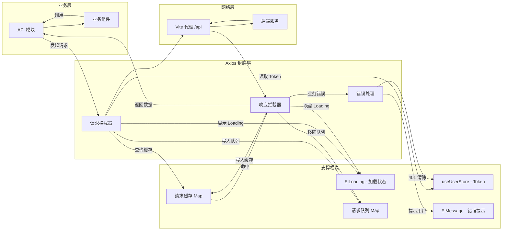

### 6.6 项目实际代码示例

**utils/axios.js 核心配置与拦截器：**

```javascript
import axios from "axios";
import { ElMessage, ElLoading } from "element-plus";
import { useUserStore } from "@/stores";

const BASE_URL = "/api";
const TIMEOUT = 15000;
const RETRY_COUNT = 2;
const RETRY_DELAY = 1000;
const WHITE_LIST = ["/login"];
const NO_RETRY_METHODS = ["POST", "PUT", "DELETE"];

const pendingRequests = new Map();
let loadingInstance = null;
let loadingCount = 0;

const generateRequestKey = (config) => {
  const { method, url, params, data } = config;
  return [method, url, JSON.stringify(params), JSON.stringify(data)].join("&");
};

const addPendingRequest = (config) => {
  const key = generateRequestKey(config);
  if (pendingRequests.has(key)) {
    pendingRequests.get(key)();
  }
  config.cancelToken = new axios.CancelToken((cancel) => {
    pendingRequests.set(key, cancel);
  });
};

const removePendingRequest = (config) => {
  const key = generateRequestKey(config);
  if (pendingRequests.has(key)) {
    pendingRequests.delete(key);
  }
};

const showLoading = (text = "加载中...") => {
  if (loadingCount === 0) {
    loadingInstance = ElLoading.service({
      lock: true, text, background: "rgba(0, 0, 0, 0.7)",
    });
  }
  loadingCount++;
};

const hideLoading = () => {
  loadingCount--;
  if (loadingCount <= 0) {
    loadingCount = 0;
    if (loadingInstance) {
      loadingInstance.close();
      loadingInstance = null;
    }
  }
};

const instance = axios.create({ baseURL: BASE_URL, timeout: TIMEOUT });

instance.interceptors.request.use(
  (config) => {
    if (config.cache && config.method?.toUpperCase() === "GET") {
      const cacheKey = generateCacheKey(config);
      const cached = getCache(cacheKey);
      if (cached) {
        return Promise.resolve({
          data: cached, config, status: 200, statusText: "OK",
          headers: {}, __fromCache: true,
        });
      }
    }

    addPendingRequest(config);

    const userStore = useUserStore();
    const token = userStore.token;
    if (token && !isInWhiteList(config.url)) {
      config.headers["token"] = token;
    }

    if (config.showLoading !== false && needLoading(config.url)) {
      showLoading(config.loadingText);
    }

    return config;
  },
  (error) => {
    hideLoading();
    ElMessage.error("请求发送失败");
    return Promise.reject(error);
  }
);

instance.interceptors.response.use(
  (response) => {
    if (response.__fromCache) return response.data;

    removePendingRequest(response.config);
    hideLoading();

    const res = response.data;

    if (res.code === 1) return res;

    if (res.code === 0 && response.status === 401) {
      const userStore = useUserStore();
      userStore.clearUserData();
      ElMessage.error("登录已过期，请重新登录");
      window.location.href = "/login";
      return Promise.reject(new Error(errorMsg));
    }

    ElMessage.error(res.msg || "操作失败");
    return Promise.reject(new Error(res.msg || "操作失败"));
  },
  async (error) => {
    if (error.config) removePendingRequest(error.config);
    hideLoading();

    if (axios.isCancel(error)) return Promise.reject(error);

    if (error.response?.status === 401) {
      const userStore = useUserStore();
      userStore.clearUserData();
      ElMessage.error("登录已过期，请重新登录");
      window.location.href = "/login";
      return Promise.reject(error);
    }

    const config = error.config;
    if (
      config && shouldRetry(config.method) && !config._retryCount &&
      (error.code === "ECONNABORTED" || error.message.includes("Network Error"))
    ) {
      config._retryCount = config._retryCount || 0;
      if (config._retryCount < RETRY_COUNT) {
        config._retryCount++;
        await new Promise((resolve) => setTimeout(resolve, RETRY_DELAY));
        return instance.request(config);
      }
    }

    ElMessage.error(getErrorMessage(error));
    return Promise.reject(error);
  }
);

export default instance;
```

**请求缓存与取消的工具函数：**

```javascript
const requestCache = new Map();
const CACHE_MAX_AGE = 5 * 60 * 1000;
const CACHE_MAX_SIZE = 200;

function generateCacheKey(config) {
  const { method, url, params } = config;
  const sortedParams = params
    ? Object.keys(params)
        .sort()
        .reduce((acc, key) => {
          acc[key] = params[key];
          return acc;
        }, {})
    : {};
  return `${method?.toUpperCase()}&${url}&${JSON.stringify(sortedParams)}`;
}

function getCache(key) {
  const item = requestCache.get(key);
  if (!item) return null;
  if (Date.now() - item.timestamp > CACHE_MAX_AGE) {
    requestCache.delete(key);
    return null;
  }
  return item.data;
}

function setCache(key, data) {
  if (requestCache.size >= CACHE_MAX_SIZE) {
    const firstKey = requestCache.keys().next().value;
    if (firstKey) requestCache.delete(firstKey);
  }
  requestCache.set(key, { data, timestamp: Date.now() });
}

export function clearCache(pattern) {
  if (!pattern) {
    requestCache.clear();
    return;
  }
  for (const key of requestCache.keys()) {
    if (key.includes(pattern)) requestCache.delete(key);
  }
}

export const cancelAllRequests = () => {
  pendingRequests.forEach((cancel) => cancel());
  pendingRequests.clear();
};
```

---

## 总结

阶段一（基础夯实 P0）构建了项目的完整基础设施体系，六大核心模块各有分工又紧密协作：

1. **TypeScript 配置**提供了类型安全的开发环境，采用渐进式策略平衡了严谨性与迁移成本
2. **Pinia 状态管理**构建了模块化的全局数据中枢，三个 Store 分工明确，配合持久化插件保障数据一致性
3. **权限指令**实现了细粒度的 UI 级权限控制，通过 DOM 移除而非 CSS 隐藏提升安全性
4. **通用业务组件库**封装了高频业务场景，通过"约定 + 扩展"的设计提升开发效率
5. **错误边界**建立了组件级的容错机制，防止局部错误导致整个应用崩溃
6. **Axios 请求封装**构建了企业级的 HTTP 通信层，集成了认证、缓存、重试、取消、错误处理等能力

这些基础设施共同构成了项目的"地基"，为后续业务功能的快速迭代提供了坚实的支撑。
