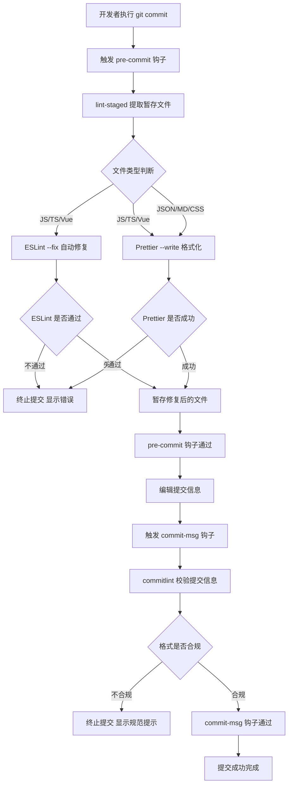
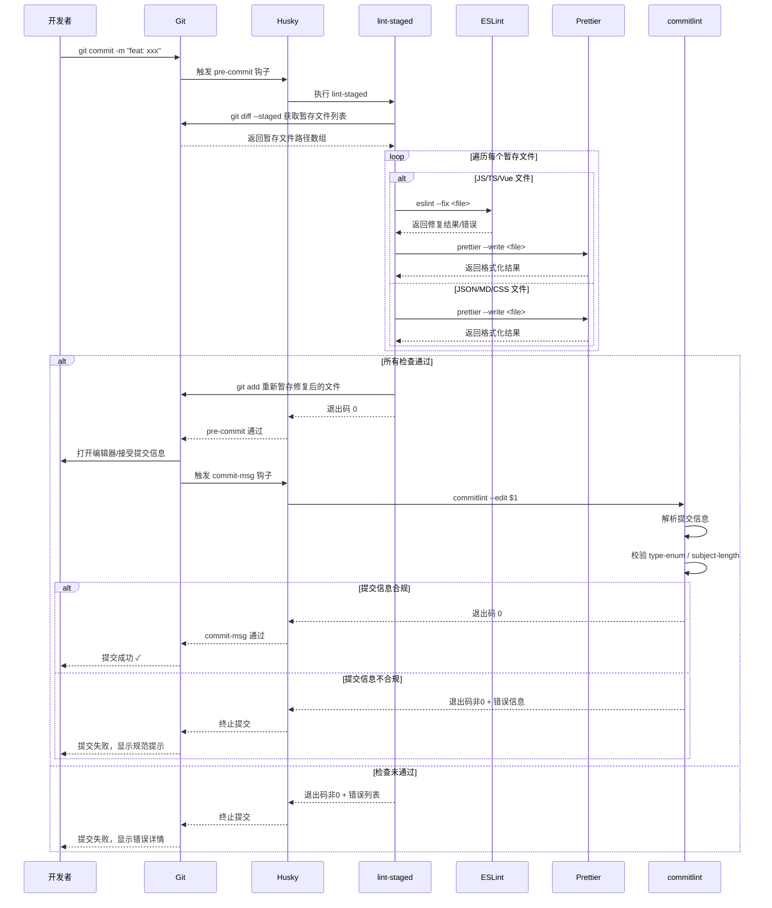
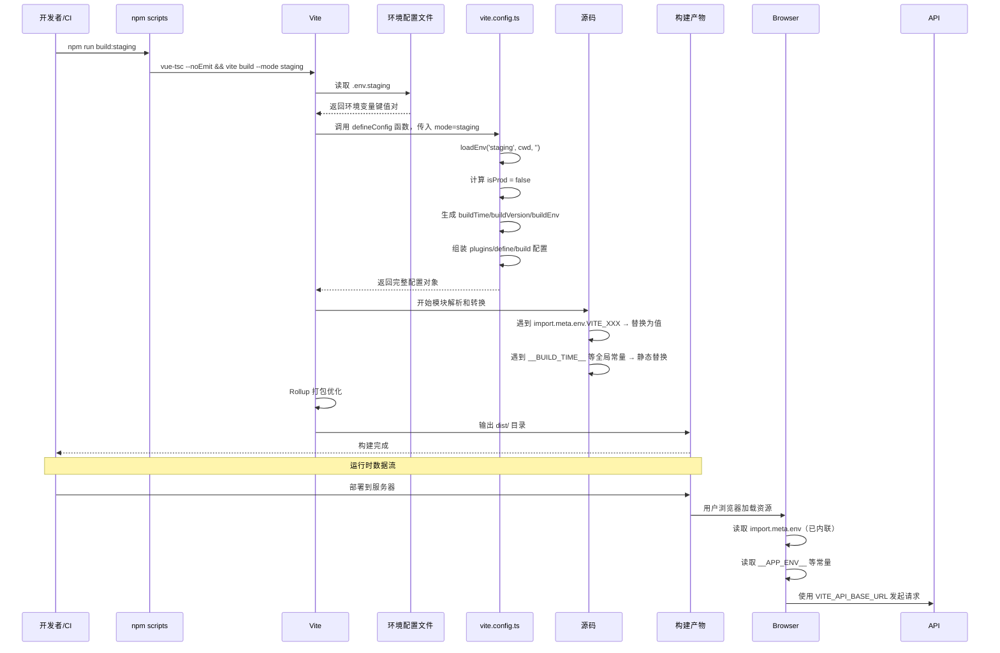
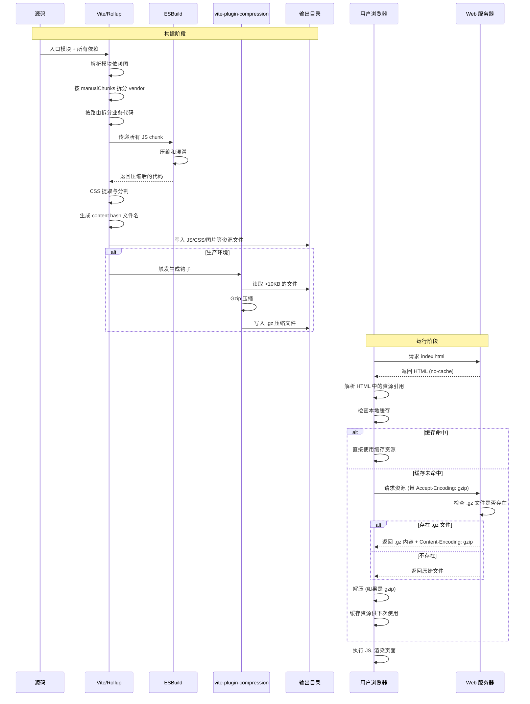

# 阶段二（工程化与效率 P1）深度分析文档

## 目录

1. [Git 工作流与代码规范](#1-git-工作流与代码规范)
2. [多环境配置体系](#2-多环境配置体系)
3. [构建优化策略](#3-构建优化策略)

---

## 1. Git 工作流与代码规范

### 1.1 功能介绍说明

Git 工作流与代码规范是现代前端工程化体系的基石，它通过自动化工具链确保团队协作时的代码质量一致性和提交历史的可追溯性。本项目构建了一套完整的 Git 钩子（Git Hooks）体系，结合 ESLint、Prettier、lint-staged 和 commitlint 等工具，在代码提交的各个关键节点进行质量门禁校验，从源头上杜绝不规范代码和不符合约定的提交信息进入代码仓库。

该体系涵盖两个核心校验环节：**提交前代码质量校验**和**提交信息规范校验**。提交前校验专注于代码本身的质量，包括语法错误检测、代码风格统一、潜在问题修复等；提交信息校验则专注于 Git 提交日志的规范性，遵循 Conventional Commits 规范，使提交历史具有可读性和可自动化处理能力。

这套规范体系的价值体现在：降低代码审查成本、减少团队协作中的风格摩擦、便于自动化生成变更日志、提升项目长期可维护性。

### 1.2 详细实现步骤

#### 1.2.1 工具链安装与配置

**步骤一：安装 Husky 并初始化 Git 钩子**

Husky 是一个 Git 钩子管理工具，它让 Git 钩子的配置变得简单且可共享。通过在 `package.json` 中定义 `prepare` 脚本，确保每位开发者在安装依赖时自动初始化 Git 钩子。

相关命令：
- `npm install husky --save-dev` — 安装 Husky
- `npm pkg set scripts.prepare="husky"` — 设置 prepare 脚本
- `npx husky init` — 初始化 Husky 配置

**步骤二：配置 lint-staged**

lint-staged 用于对 Git 暂存区（staged）的文件运行指定的检查命令，相比全量检查大幅提升执行速度。配置文件定义了不同文件类型对应的处理流水线。

**步骤三：配置 ESLint 代码检查规则**

ESLint 配置采用分层扩展策略，基础规则继承自 `eslint:recommended` 和 `plugin:vue/vue3-essential`，TypeScript 文件额外继承 `plugin:@typescript-eslint/recommended`，并通过 `@vue/eslint-config-prettier` 关闭与 Prettier 冲突的格式规则。

**步骤四：配置 Prettier 代码格式化**

Prettier 负责代码格式化的统一，虽然配置文件当前为空对象（使用默认配置），但通过与 ESLint 的集成，确保格式化规则不与代码检查规则冲突。

**步骤五：配置 commitlint 提交信息规范**

commitlint 基于 `@commitlint/config-conventional` 规范，扩展自定义了 type 枚举值和 subject 长度限制，支持 12 种提交类型，subject 最大长度放宽至 100 字符。

**步骤六：注册 Git 钩子**

- `pre-commit` 钩子：在提交前执行 `lint-staged`，对暂存文件进行代码检查和自动修复
- `commit-msg` 钩子：在提交信息编辑后执行 commitlint 校验

### 1.3 流程图



### 1.4 逻辑分析

Git 工作流与代码规范体系的核心设计思想是**"左移质量门禁"**——将质量检查尽可能前移到开发流程的早期阶段，而不是等到代码合并时才发现问题。

#### 分层校验机制

整个体系采用分层校验设计，从内到外依次为：

1. **IDE 层**（隐式）：开发者在编辑器中通过 ESLint 和 Prettier 插件获得实时反馈
2. **提交前层**：pre-commit 钩子 + lint-staged，仅检查即将提交的代码，速度快
3. **提交信息层**：commit-msg 钩子 + commitlint，确保提交日志规范
4. **CI/CD 层**（可选扩展）：流水线中的全量检查，作为最终防线

#### lint-staged 的增量检查逻辑

lint-staged 的核心价值在于**增量检查**。它通过 `git diff --staged --name-only` 获取暂存区文件列表，然后根据配置的 glob 模式匹配对应的处理命令。这种设计有两个关键优势：

- **性能优化**：大型项目中全量 ESLint 检查可能耗时数分钟，而 lint-staged 仅检查少量变更文件，通常在秒级完成
- **安全性**：只修改即将提交的文件，避免意外修改未暂存的工作区代码

#### ESLint 配置的分层扩展策略

ESLint 配置采用了"基础规则 + 类型特定规则"的双层结构：

- **基础层**：适用于所有 JS/TS/Vue 文件，包含 Vue3 必要规则和 ESLint 推荐规则
- **TypeScript 层**：通过 `overrides` 针对 `.ts`、`.tsx`、`.vue` 文件额外应用 TypeScript 特定规则

这种设计既保证了基础代码质量，又为 TypeScript 代码提供了更强的类型安全检查。同时，配置中关闭了部分过于严格的规则（如 `no-explicit-any`、`multi-word-component-names`），在规范和开发效率之间取得平衡。

#### commitlint 的规范化价值

commitlint  enforcing Conventional Commits 规范带来的长期收益：

- **自动化发布**：可基于提交类型自动生成语义化版本号
- **变更日志**：可自动生成 CHANGELOG.md
- **代码审查**：通过 type 和 scope 快速理解提交目的
- **历史追溯**：结构化的提交信息便于故障定位和回滚

### 1.5 数据流图



### 1.6 项目实际代码示例

#### 1.6.1 Husky pre-commit 钩子

文件路径：`/workspace/.husky/pre-commit`

```shell
npx lint-staged
```

这是 pre-commit 钩子的核心实现，仅一行命令却串联起整个代码质量检查流程。每次执行 `git commit` 时，Husky 会自动执行该脚本。

#### 1.6.2 Husky commit-msg 钩子

文件路径：`/workspace/.husky/commit-msg`

```shell
npx --no -- commitlint --edit "$1"
```

`--no` 参数确保 commitlint 使用本地项目安装的版本而非全局版本，`--edit "$1"` 表示读取 Git 传递的提交信息文件进行校验。

#### 1.6.3 lint-staged 配置

文件路径：`/workspace/.lintstagedrc.json`

```json
{
  "*.{js,jsx,ts,tsx,vue}": ["eslint --fix", "prettier --write"],
  "*.{json,md,html,css,scss}": ["prettier --write"]
}
```

配置采用对象格式，键为 glob 模式，值为该模式匹配文件需要依次执行的命令数组。注意命令执行顺序很重要：先 ESLint 修复语法问题，再 Prettier 统一格式。

#### 1.6.4 commitlint 配置

文件路径：`/workspace/commitlint.config.cjs`

```javascript
module.exports = {
  extends: ['@commitlint/config-conventional'],
  rules: {
    'type-enum': [
      2,
      'always',
      [
        'feat',
        'fix',
        'docs',
        'style',
        'refactor',
        'perf',
        'test',
        'chore',
        'revert',
        'build',
        'ci'
      ]
    ],
    'subject-case': [0],
    'subject-max-length': [2, 'always', 100]
  }
}
```

规则配置采用 `[级别, 适用条件, 配置值]` 的三元组格式：
- 级别：`0` = 禁用，`1` = 警告，`2` = 错误
- 适用条件：`always` | `never`
- 配置值：规则的具体参数

#### 1.6.5 ESLint 配置

文件路径：`/workspace/.eslintrc.cjs`

```javascript
/* eslint-env node */
require('@rushstack/eslint-patch/modern-module-resolution')

module.exports = {
  root: true,
  env: {
    browser: true,
    node: true,
    es2021: true
  },
  extends: [
    'plugin:vue/vue3-essential',
    'eslint:recommended',
    '@vue/eslint-config-prettier'
  ],
  parserOptions: {
    ecmaVersion: 'latest',
    sourceType: 'module'
  },
  overrides: [
    {
      files: ['*.ts', '*.tsx', '*.vue'],
      parser: 'vue-eslint-parser',
      parserOptions: {
        parser: '@typescript-eslint/parser',
        ecmaVersion: 'latest',
        sourceType: 'module'
      },
      extends: [
        'plugin:@typescript-eslint/recommended'
      ],
      rules: {
        '@typescript-eslint/no-explicit-any': 'off',
        '@typescript-eslint/no-unused-vars': 'off',
        '@typescript-eslint/no-empty-object-type': 'off',
        'vue/multi-word-component-names': 'off'
      }
    }
  ],
  rules: {
    'vue/multi-word-component-names': 'off',
    'no-unused-vars': 'off',
    'no-undef': 'off'
  }
}
```

`@rushstack/eslint-patch/modern-module-resolution` 补丁解决了 ESLint 在 monorepo 或扁平化依赖结构中模块解析的问题，确保插件能够正确加载。

#### 1.6.6 package.json 相关脚本

文件路径：`/workspace/package.json`

```json
{
  "scripts": {
    "lint": "eslint . --ext .vue,.js,.jsx,.cjs,.mjs,.ts,.tsx --fix --ignore-path .gitignore",
    "prepare": "husky",
    "commit": "git-cz"
  },
  "devDependencies": {
    "@commitlint/cli": "^21.2.0",
    "@commitlint/config-conventional": "^21.2.0",
    "eslint": "^8.22.0",
    "eslint-plugin-vue": "^9.3.0",
    "husky": "^9.1.7",
    "lint-staged": "^17.0.8",
    "prettier": "^2.7.1"
  }
}
```

`prepare` 脚本是 npm 的生命周期钩子，在 `npm install` 完成后自动执行，确保每位团队成员都能自动启用 Git 钩子，无需额外手动配置。

---

## 2. 多环境配置体系

### 2.1 功能介绍说明

多环境配置体系是现代前端应用部署流程中的核心基础设施，它通过将应用配置与代码分离，使得同一套代码能够在不同的部署环境（开发、测试、预发布、生产）中正确运行，各自连接不同的后端服务、启用不同的功能开关。

本项目基于 Vite 的环境变量机制，构建了一套完整的四环境配置体系，涵盖 **development（开发环境）**、**test（测试环境）**、**staging（预发布环境）** 和 **production（生产环境）**。每个环境拥有独立的配置文件，定义了应用标题、API 基础路径、环境标识、版本号、Mock 开关、DevTools 开关等关键参数。

这套体系的核心价值在于：**配置与代码解耦**，避免因环境差异而修改业务代码；**部署安全**，生产环境自动关闭调试工具，避免信息泄露；**流程标准化**，从开发到上线的每个环节都有对应的环境配置，确保发布流程可预测、可重复。

### 2.2 详细实现步骤

#### 2.2.1 环境变量文件规划

**步骤一：定义环境变量命名规范**

Vite 规定，只有以 `VITE_` 前缀开头的环境变量才会被注入到客户端代码中。本项目所有环境变量均遵循此约定，确保变量可在前端代码中通过 `import.meta.env` 访问。

**步骤二：创建多环境配置文件**

在项目根目录创建四个环境配置文件，分别对应四种部署环境：

- `.env.development` — 开发环境配置
- `.env.test` — 测试环境配置
- `.env.staging` — 预发布环境配置
- `.env.production` — 生产环境配置

**步骤三：定义统一的环境变量键**

四个环境文件保持完全相同的键名结构，仅值不同，确保代码中引用时无需关心当前运行环境。统一的键包括：
- `VITE_APP_TITLE` — 应用标题
- `VITE_API_BASE_URL` — API 基础路径
- `VITE_APP_ENV` — 环境标识
- `VITE_APP_VERSION` — 应用版本号
- `VITE_ENABLE_MOCK` — Mock 数据开关
- `VITE_ENABLE_DEVTOOLS` — DevTools 开关

#### 2.2.2 Vite 配置集成

**步骤四：加载环境变量**

在 `vite.config.ts` 中使用 Vite 内置的 `loadEnv` 函数，根据当前 `mode` 加载对应的环境文件。`loadEnv(mode, process.cwd(), "")` 的第三个参数为空字符串，表示加载所有环境变量（不过滤 `VITE_` 前缀），便于在配置文件中使用。

**步骤五：注入构建时全局常量**

通过 `define` 配置项，将环境相关的构建信息（环境标识、构建时间、版本号、构建环境）作为全局常量注入到客户端代码中。这些常量在构建时被静态替换，可在运行时直接访问。

**步骤六：配置构建脚本**

在 `package.json` 中为每个环境定义独立的构建命令，通过 `--mode` 参数指定构建模式，Vite 会自动加载对应模式的环境配置文件。

### 2.3 流程图

```mermaid
flowchart TD
    A[执行 npm run build:xxx] --> B[vite build --mode <mode>]
    B --> C[Vite 解析 mode 参数]
    C --> D{mode 是什么?}
    D -->|development| E[加载 .env.development]
    D -->|test| F[加载 .env.test]
    D -->|staging| G[加载 .env.staging]
    D -->|production| H[加载 .env.production]
    
    E --> I[合并默认 .env 文件（如果有）]
    F --> I
    G --> I
    H --> I
    
    I --> J[执行 vite.config.ts 配置函数]
    J --> K[loadEnv(mode, cwd, '') 加载环境变量]
    K --> L[计算 isProd = mode === 'production']
    L --> M[根据 isProd 决定插件配置]
    M --> N[设置 define 全局常量]
    N --> O[设置 build.sourcemap 等构建配置]
    O --> P[Vite 开始构建]
    P --> Q[输出构建产物到 dist 目录]
    Q --> R[构建完成]
```

### 2.4 逻辑分析

#### 环境变量加载优先级

Vite 的环境变量加载遵循以下优先级规则（后者覆盖前者）：

1. `.env` — 所有环境的默认配置
2. `.env.local` — 本地覆盖（不提交到 Git）
3. `.env.[mode]` — 指定模式的配置
4. `.env.[mode].local` — 指定模式的本地覆盖

本项目中仅使用了 `.env.[mode]` 形式的文件，没有使用 `.env` 基础文件，每个环境文件都是自包含的完整配置。这种设计的优缺点：

- **优点**：每个文件独立完整，阅读时无需脑补默认值，降低认知负担
- **缺点**：存在重复配置，若需修改公共值需同步修改四个文件

对于中小规模项目，这种直接明了的方式利大于弊；若环境数量继续增加，可考虑引入 `.env` 基础文件减少重复。

#### 构建模式与环境的对应关系

Vite 有三个**内置模式**：
- `development` — `vite` 开发服务器使用的模式
- `production` — `vite build` 默认使用的模式
- `test` — Vitest 使用的模式（本项目未使用）

本项目通过自定义 `build:test` 和 `build:staging` 脚本，扩展了 `test` 和 `staging` 两种构建模式。虽然 Vite 的测试模式原本设计用于单元测试，但本项目将其复用于测试环境构建，这是业界常见做法。

需要注意的是，**mode 不等于 NODE_ENV**。`NODE_ENV` 由 Vite 根据模式自动推导（development → development，其他 → production），这会影响构建产物的优化级别。例如 `test` 模式构建的产物仍然是 production 级别的优化构建，只是加载了 `.env.test` 的配置。

#### define 全局常量的作用机制

`vite.config.ts` 中的 `define` 配置实现了**构建时静态替换**机制：

```typescript
define: {
  __APP_ENV__: JSON.stringify(env.VITE_APP_ENV),
  __BUILD_TIME__: JSON.stringify(buildTime),
  __BUILD_VERSION__: JSON.stringify(buildVersion),
  __BUILD_ENV__: JSON.stringify(buildEnv),
}
```

这些常量的特点：
- 在代码中直接以全局变量形式使用，如 `console.log(__BUILD_VERSION__)`
- 构建时被替换为字面量值，不是运行时变量
- 必须使用 `JSON.stringify` 包裹字符串值，确保生成的是合法的 JS 字面量
- 建议在 `vite-env.d.ts` 中添加类型声明，获得 TypeScript 类型提示

#### 环境差异配置策略

分析四个环境文件，可以看出清晰的差异化配置策略：

| 配置项 | development | test | staging | production |
|-------|-------------|------|---------|------------|
| VITE_APP_ENV | development | test | staging | production |
| VITE_ENABLE_DEVTOOLS | true | true | false | false |
| VITE_ENABLE_MOCK | false | false | false | false |
| VITE_API_BASE_URL | /api | /api | /api | /api |

策略分析：
- **DevTools 开关**：开发和测试环境开启，便于调试；预发布和生产环境关闭，避免性能损耗和信息泄露
- **Mock 开关**：四个环境均关闭，表明项目采用真实后端对接策略
- **API 路径**：均使用 `/api` 相对路径，结合 Nginx 反向代理或 Vite 代理实现跨环境部署

### 2.5 数据流图



### 2.6 项目实际代码示例

#### 2.6.1 开发环境配置

文件路径：`/workspace/.env.development`

```
VITE_APP_TITLE=Tlias 智能学习辅助系统
VITE_API_BASE_URL=/api
VITE_APP_ENV=development
VITE_APP_VERSION=1.0.0
VITE_ENABLE_MOCK=false
VITE_ENABLE_DEVTOOLS=true
```

开发环境配置的特点是开启 DevTools，便于开发调试。API 基础路径使用相对路径 `/api`，配合 Vite 开发服务器的代理功能转发到后端。

#### 2.6.2 生产环境配置

文件路径：`/workspace/.env.production`

```
VITE_APP_TITLE=Tlias 智能学习辅助系统
VITE_API_BASE_URL=/api
VITE_APP_ENV=production
VITE_APP_VERSION=1.0.0
VITE_ENABLE_MOCK=false
VITE_ENABLE_DEVTOOLS=false
```

生产环境关闭 DevTools，避免暴露内部状态和调试信息。API 路径同样使用相对路径，部署时依赖 Nginx 等反向代理服务器转发。

#### 2.6.3 测试环境配置

文件路径：`/workspace/.env.test`

```
VITE_APP_TITLE=Tlias 智能学习辅助系统
VITE_API_BASE_URL=/api
VITE_APP_ENV=test
VITE_APP_VERSION=1.0.0
VITE_ENABLE_MOCK=false
VITE_ENABLE_DEVTOOLS=true
```

测试环境开启 DevTools，方便测试人员定位问题。测试环境通常连接测试数据库，用于功能验证和回归测试。

#### 2.6.4 预发布环境配置

文件路径：`/workspace/.env.staging`

```
VITE_APP_TITLE=Tlias 智能学习辅助系统
VITE_API_BASE_URL=/api
VITE_APP_ENV=staging
VITE_APP_VERSION=1.0.0
VITE_ENABLE_MOCK=false
VITE_ENABLE_DEVTOOLS=false
```

预发布环境配置与生产环境完全一致（关闭 DevTools），用于模拟生产环境进行最终验证，确保上线前的质量。

#### 2.6.5 Vite 配置中的环境变量处理

文件路径：`/workspace/vite.config.ts`

```typescript
import { defineConfig, loadEnv } from "vite";

export default defineConfig(({ mode }) => {
  const env = loadEnv(mode, process.cwd(), "");
  const isProd = mode === "production";

  const buildTime = new Date().toISOString();
  const buildVersion = env.VITE_APP_VERSION || "1.0.0";
  const buildEnv = mode;

  return {
    define: {
      __APP_ENV__: JSON.stringify(env.VITE_APP_ENV),
      __BUILD_TIME__: JSON.stringify(buildTime),
      __BUILD_VERSION__: JSON.stringify(buildVersion),
      __BUILD_ENV__: JSON.stringify(buildEnv),
    },
    build: {
      sourcemap: !isProd,
    },
    // ... 其他配置
  };
});
```

关键实现细节：
- `loadEnv` 的第三个参数为空字符串，加载所有变量（包括非 `VITE_` 前缀的）
- `isProd` 仅在 `mode === "production"` 时为真，staging 模式不开启生产级别构建优化
- `sourcemap` 根据环境动态开关：非生产环境生成 sourcemap 便于调试，生产环境不生成以保护源码

#### 2.6.6 package.json 多环境构建脚本

文件路径：`/workspace/package.json`

```json
{
  "scripts": {
    "dev": "vite",
    "build": "vue-tsc --noEmit && vite build",
    "build:dev": "vue-tsc --noEmit && vite build --mode development",
    "build:test": "vue-tsc --noEmit && vite build --mode test",
    "build:staging": "vue-tsc --noEmit && vite build --mode staging",
    "build:prod": "vue-tsc --noEmit && vite build --mode production",
    "preview": "vite preview --port 4173"
  }
}
```

脚本命名采用 `build:<环境>` 的统一约定，便于记忆和自动补全。每个构建命令前都执行 `vue-tsc --noEmit` 进行类型检查，确保构建产物的类型正确性。

---

## 3. 构建优化策略

### 3.1 功能介绍说明

构建优化是前端工程化体系中直接影响用户体验和部署效率的关键环节。一个优秀的构建优化策略能够显著减少首屏加载时间、降低服务器带宽消耗、提升应用运行时性能。

本项目基于 Vite 构建工具，围绕 **包体积优化**、**加载性能优化** 和 **构建体验优化** 三个维度，实施了多维度的构建优化策略。具体包括：Gzip 压缩、代码分割（Code Splitting）、手动分包（Manual Chunks）、资源文件名 hash 缓存策略、CSS 代码分割、ESBuild 压缩、SourceMap 按需生成等。

这些优化策略的核心目标是：**让用户用最短的时间加载并渲染页面**。通过减小单个文件体积、利用浏览器并行下载能力、充分利用缓存机制、按需加载资源，最终实现更快的首屏渲染和更流畅的用户体验。

### 3.2 详细实现步骤

#### 3.2.1 代码分割与手动分包

**步骤一：配置手动分包策略**

在 `rollupOptions.output.manualChunks` 中定义分包规则，将第三方依赖按功能模块拆分为独立的 chunk 文件。本项目将依赖分为四个包：
- `vue` — Vue 核心生态（vue、vue-router、pinia）
- `elementPlus` — UI 组件库（element-plus、@element-plus/icons-vue）
- `echarts` — 图表库（echarts、vue-echarts）
- `i18n` — 国际化库（vue-i18n）

**步骤二：配置动态文件名与 hash**

通过配置 `chunkFileNames`、`entryFileNames` 和 `assetFileNames`，为构建产物添加内容哈希值，利用浏览器的强缓存机制，避免未变更的资源被重复下载。

#### 3.2.2 压缩优化

**步骤三：引入 vite-plugin-compression**

安装 `vite-plugin-compression` 插件，在生产构建时自动生成 Gzip 压缩版本的静态资源文件。配置阈值为 10KB，仅压缩超过该大小的文件，避免压缩小文件带来的边际收益不足问题。

**步骤四：使用 ESBuild 压缩**

将 `build.minify` 设置为 `esbuild`，利用 ESBuild 的高性能压缩能力替代默认的 Terser，在保证压缩率的同时大幅提升构建速度。

#### 3.2.3 其他优化配置

**步骤五：CSS 代码分割**

启用 `cssCodeSplit`，将 CSS 按模块拆分，实现 CSS 的按需加载，避免加载未使用页面的样式代码。

**步骤六：SourceMap 按需生成**

根据环境动态决定是否生成 SourceMap：开发和测试环境生成，生产环境不生成。既保证了调试便利性，又避免了生产环境的源码泄露和体积增加。

**步骤七：设置代码分割警告阈值**

将 `chunkSizeWarningLimit` 设置为 1000KB，当单个 chunk 超过此大小时发出警告，提醒开发者关注包体积问题。

### 3.3 流程图

```mermaid
flowchart TD
    A[vite build 启动] --> B[加载环境配置]
    B --> C{是否生产环境?}
    C -->|是| D[添加 vite-plugin-compression 插件]
    C -->|否| E[启用 sourcemap]
    D --> F[ESBuild 压缩代码]
    E --> F
    
    F --> G[Rollup 开始打包]
    G --> H[解析入口模块和依赖关系]
    H --> I[按 manualChunks 规则拆分第三方依赖]
    I --> J[按路由拆分业务代码 chunk]
    J --> K[CSS 代码分割 cssCodeSplit]
    
    K --> L[生成带 hash 的文件名]
    L --> M[输出到 assets/js/ 和 assets/css/ 等目录]
    M --> N{文件 > 10KB?}
    N -->|是 (仅生产环境)| O[Gzip 压缩生成 .gz 文件]
    N -->|否| P[跳过压缩]
    O --> Q[计算 chunk 总大小]
    P --> Q
    
    Q --> R{chunk > 1000KB?}
    R -->|是| S[输出警告提示]
    R -->|否| T[构建完成]
    S --> T
```

### 3.4 逻辑分析

#### 手动分包（manualChunks）的设计逻辑

手动分包是构建优化中最核心的策略之一，其设计思想基于以下几个原则：

**1. 缓存利用率最大化**

将不常变动的第三方依赖与频繁变动的业务代码分离。当业务代码更新时，用户只需重新下载业务代码 chunk，而第三方依赖 chunk 可以继续使用浏览器缓存。本项目选择的四个分包维度各有考量：

- **vue 包**：框架核心，几乎不升级，缓存价值最高
- **elementPlus 包**：UI 组件库，体积较大但版本相对稳定
- **echarts 包**：图表库体积巨大，且并非所有页面都需要，可配合按需加载
- **i18n 包**：国际化库，独立拆分便于按需加载语言包

**2. 并行下载优化**

浏览器对同一域名下的并发连接数有限制（通常 6 个）。将大文件拆分为多个较小文件，可以更好地利用浏览器的并行下载能力，减少总加载时间。

**3. 体积预警与边界控制**

`chunkSizeWarningLimit: 1000` 的设置是一个重要的质量门禁。当单个 chunk 超过 1000KB 时，Vite 会输出警告。这并非硬性限制，而是提醒开发者审视是否有进一步优化空间，例如：
- 是否引入了不必要的依赖
- 是否可以改用按需引入
- 是否可以进一步拆分模块

#### Gzip 压缩的性价比分析

`vite-plugin-compression` 的配置参数经过精心权衡：

| 参数 | 值 | 含义 | 设计考量 |
|------|----|------|---------|
| threshold | 10240 | 10KB 以上才压缩 | 小文件压缩后体积减少有限，且解压有 CPU 开销 |
| algorithm | gzip | 使用 Gzip 算法 | 兼容性最好，所有浏览器都支持 |
| ext | .gz | 压缩文件后缀 | 标准命名，便于 Nginx 等服务器识别 |
| disable | false | 启用压缩 | 可通过环境变量动态控制 |

Gzip 压缩通常能将文本资源（JS/CSS/HTML）压缩至原大小的 30%-40%，对于中大型应用，这意味着数百 KB 的流量节省。需要注意的是，Gzip 需要服务器端配合（Nginx 的 `gzip_static` 模块）才能生效，否则即使生成了 `.gz` 文件也不会被使用。

#### 文件命名的哈希策略

构建产物文件名采用 `[name]-[hash].[ext]` 格式，这是前端工程化中的标准实践：

- **`[name]`**：保留原始模块名，便于调试和识别
- **`[hash]`**：基于文件内容生成的哈希值，内容不变则哈希不变
- **目录分层**：JS 文件放入 `assets/js/`，资源文件按扩展名分目录

这种命名策略配合 HTTP 强缓存（Cache-Control: max-age=31536000）可以实现：
- 首次访问：下载所有资源
- 后续访问：未变更的资源直接从缓存读取（0 网络请求）
- 版本更新：只有变更的文件哈希变化，用户只需下载变更部分

#### 构建速度优化

除了产物优化，构建过程本身的速度也很重要：

1. **ESBuild 压缩**：相比 Terser，ESBuild 使用 Go 编写，压缩速度快 10-100 倍
2. **类型检查与构建解耦**：`vue-tsc --noEmit` 在构建前单独执行类型检查，不阻塞 Vite 构建流程
3. **开发环境优化**：开发环境不压缩、不生成 Gzip，保持快速热更新

### 3.5 数据流图



### 3.6 项目实际代码示例

#### 3.6.1 Vite 构建优化配置

文件路径：`/workspace/vite.config.ts`

```typescript
import { defineConfig, loadEnv } from "vite";
import vue from "@vitejs/plugin-vue";
import viteCompression from "vite-plugin-compression";

export default defineConfig(({ mode }) => {
  const env = loadEnv(mode, process.cwd(), "");
  const isProd = mode === "production";

  const plugins: any[] = [vue()];

  if (isProd) {
    plugins.push(
      viteCompression({
        verbose: true,
        disable: false,
        threshold: 10240,
        algorithm: "gzip",
        ext: ".gz",
      })
    );
  }

  return {
    plugins,
    resolve: {
      alias: {
        "@": fileURLToPath(new URL("./src", import.meta.url)),
      },
    },
    define: {
      __APP_ENV__: JSON.stringify(env.VITE_APP_ENV),
      __BUILD_TIME__: JSON.stringify(buildTime),
      __BUILD_VERSION__: JSON.stringify(buildVersion),
      __BUILD_ENV__: JSON.stringify(buildEnv),
    },
    build: {
      target: "esnext",
      sourcemap: !isProd,
      minify: "esbuild",
      cssCodeSplit: true,
      rollupOptions: {
        output: {
          chunkFileNames: "assets/js/[name]-[hash].js",
          entryFileNames: "assets/js/[name]-[hash].js",
          assetFileNames: "assets/[ext]/[name]-[hash].[ext]",
          manualChunks: {
            vue: ["vue", "vue-router", "pinia"],
            elementPlus: ["element-plus", "@element-plus/icons-vue"],
            echarts: ["echarts", "vue-echarts"],
            i18n: ["vue-i18n"],
          },
        },
      },
      chunkSizeWarningLimit: 1000,
    },
  };
});
```

配置要点解析：

- **`target: "esnext"`**：使用最新的 ES 语法标准，不做降级编译，适合现代浏览器环境
- **`minify: "esbuild"`**：使用 ESBuild 进行代码压缩，速度远快于 Terser
- **`cssCodeSplit: true`**：启用 CSS 代码分割，每个 JS chunk 对应独立的 CSS 文件
- **`chunkSizeWarningLimit: 1000`**：单 chunk 超过 1000KB 时输出警告

#### 3.6.2 构建产物目录结构

通过配置的文件名规则，构建产物将形成如下目录结构：

```
dist/
├── index.html
├── favicon.ico
└── assets/
    ├── js/
    │   ├── index-abc123.js          # 入口文件
    │   ├── vue-def456.js           # Vue 生态 vendor
    │   ├── elementPlus-ghi789.js   # Element Plus vendor
    │   ├── echarts-jkl012.js       # ECharts vendor
    │   ├── i18n-mno345.js          # 国际化 vendor
    │   ├── Login-pqr678.js         # 路由级业务 chunk
    │   ├── Index-stu901.js         # 首页 chunk
    │   └── ...
    ├── css/
    │   ├── index-abc123.css
    │   ├── elementPlus-def456.css
    │   └── ...
    ├── png/
    │   ├── logo-ghi789.png
    │   └── ...
    ├── jpg/
    │   └── bg1-jkl012.jpg
    └── ...
```

每个文件都带有内容哈希，确保文件名与内容一一对应，实现精确的缓存控制。

#### 3.6.3 package.json 构建相关依赖

文件路径：`/workspace/package.json`

```json
{
  "devDependencies": {
    "@vitejs/plugin-vue": "^3.0.3",
    "rollup-plugin-visualizer": "^7.0.1",
    "typescript": "^6.0.3",
    "vite": "^3.0.9",
    "vite-plugin-compression": "^0.5.1",
    "vue-tsc": "^3.3.6"
  }
}
```

关键依赖说明：

- **`vite-plugin-compression`**：Gzip/Brotli 压缩插件，生产环境构建时生成压缩版本
- **`rollup-plugin-visualizer`**：包体积可视化分析插件，可生成构建产物体积分析图，帮助识别体积瓶颈
- **`vue-tsc`**：Vue 3 TypeScript 类型检查工具，在构建前执行类型校验

#### 3.6.4 构建脚本命令

文件路径：`/workspace/package.json`

```json
{
  "scripts": {
    "dev": "vite",
    "build": "vue-tsc --noEmit && vite build",
    "build:dev": "vue-tsc --noEmit && vite build --mode development",
    "build:test": "vue-tsc --noEmit && vite build --mode test",
    "build:staging": "vue-tsc --noEmit && vite build --mode staging",
    "build:prod": "vue-tsc --noEmit && vite build --mode production",
    "preview": "vite preview --port 4173",
    "type-check": "vue-tsc --noEmit"
  }
}
```

构建流程设计为**类型检查先行**的模式：先执行 `vue-tsc --noEmit` 进行全量类型检查，通过后才开始 Vite 构建。这确保了有类型错误时代码不会被构建发布，是一道重要的质量门禁。

`preview` 命令用于本地预览生产构建产物，可以在部署前验证构建结果是否正常。

---

## 总结

阶段二的工程化建设为项目构建了完整的质量保障和效率提升体系：

- **Git 工作流与代码规范**：通过 Husky + lint-staged + ESLint + Prettier + commitlint 的工具链组合，在代码提交环节建立自动化质量门禁，从源头保障代码质量和提交规范。

- **多环境配置体系**：基于 Vite 环境变量机制，构建 development/test/staging/production 四套独立配置，实现配置与代码解耦，支撑标准化的部署流程。

- **构建优化策略**：通过手动分包、Gzip 压缩、内容哈希缓存、ESBuild 压缩等多重策略，从包体积、加载速度、缓存利用等维度全面优化构建产物性能。

这三大模块相互配合，共同构成了项目工程化体系的坚实基础，为后续的功能开发和团队协作提供了可靠的效率和质量保障。
