# 阶段三（体验与性能P2）深度分析文档

## 目录

1. [骨架屏组件 TableSkeleton](#1-骨架屏组件-tableskeleton)
2. [表格列记忆 useTableColumns](#2-表格列记忆-usetablecolumns)
3. [快捷键系统 useShortcuts](#3-快捷键系统-useshortcuts)
4. [ProTable高级表格](#4-protable高级表格)
5. [路由缓存Keep-Alive](#5-路由缓存keep-alive)
6. [图片懒加载指令](#6-图片懒加载指令)
7. [请求缓存机制](#7-请求缓存机制)
8. [国际化i18n](#8-国际化i18n)

---

## 1. 骨架屏组件 TableSkeleton

### 1.1 功能介绍说明

骨架屏（Skeleton Screen）是一种在数据加载过程中的占位动画，通过灰色渐变动画效果模拟页面内容的大致布局和结构，让用户感知到页面正在加载中，提升用户体验。TableSkeleton 组件专门针对表格场景设计，用于在表格数据加载时展示与表格结构相似的骨架占位，避免了传统加载中空白页面带来的焦虑感。

该组件支持自定义行数、列数、行高和列宽，可以灵活适配不同表格的布局需求。采用 CSS 实现的 shimmer 闪光动画效果，通过线性渐变背景配合 CSS 动画，营造出内容正在加载的视觉效果。组件使用 Vue 3 的 Composition API 和 `<script setup>` 语法编写，类型安全且轻量高效。

### 1.2 详细实现步骤

1. **定义组件 Props 接口：定义 rows、columns、rowHeight、columnWidths 四个可选属性，分别控制骨架屏的行数、列数、行高和列宽数组。

2. **设置默认值**：使用 `withDefaults` 为 Props 提供默认值，默认 5 行 4 列，行高 48px，列宽数组为空。

3. **计算列宽数组**：使用 `computed` 计算属性 `widthArr`，如果传入了 columnWidths 则直接使用，否则自动计算平均列宽。

4. **渲染骨架结构**：外层使用 `.skeleton-wrapper` 容器，内部通过双层 v-for 循环渲染行和列。每行包含多个列单元，每个列单元内部包含一个 `.skeleton-shimmer` 元素用于动画效果。

5. **实现 shimmer 动画**：使用 CSS 线性渐变 `linear-gradient(90deg, #f2f2f2 25%, #e6e6e6 37%, #f2f2f2 63%)` 作为背景，通过 `background-size: 400% 100%` 放大背景尺寸，配合 `@keyframes shimmer` 动画改变 `background-position` 实现从右向左的流动闪光效果。

6. **样式优化**：使用 `scoped` 样式确保样式隔离，列单元使用 `position: relative` 和 `overflow: hidden` 确保动画不会溢出，圆角 4px 提供更好的视觉效果。

### 1.3 流程图

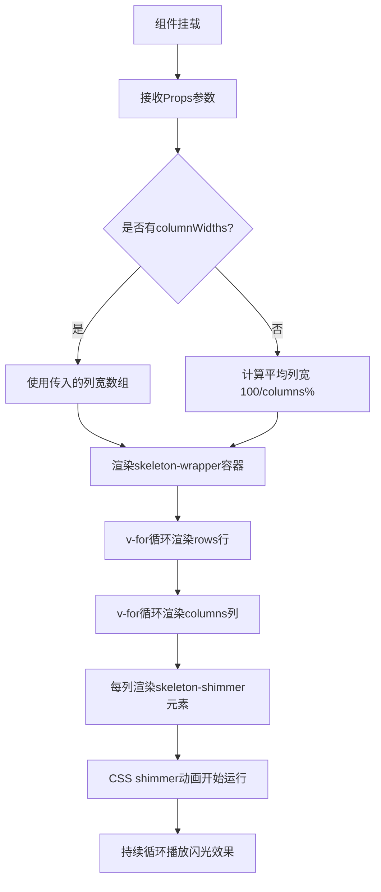

### 1.4 逻辑分析

TableSkeleton 组件的核心设计思想是**结构模拟 + 视觉动画**。结构上通过双层 v-for 循环精确模拟表格的行列布局，让用户在数据加载时就能预期最终内容的大致结构。视觉上通过 shimmer 渐变流动动画传递"正在加载"的语义，比传统的旋转 loading 图标更加自然和沉浸式。

**关键技术点分析：

1. **响应式列宽计算**：`widthArr` 计算属性巧妙地处理了两种列宽模式——自定义列宽和自动平均分配，提供了灵活性和易用性的平衡。

2. **纯 CSS 动画性能**：shimmer 动画完全由 CSS 实现，不占用 JavaScript 主线程，利用 GPU 加速的 background-position 动画，性能优异。

3. **组件轻量性**：组件没有复杂的逻辑，仅依赖 Vue 的 computed 和 v-for，打包体积小，渲染性能高。

4. **可配置性**：通过 Props 提供了丰富的配置项，可以适配不同表格场景，包括行数、列数、行高、列宽都可自定义。

### 1.5 数据流图

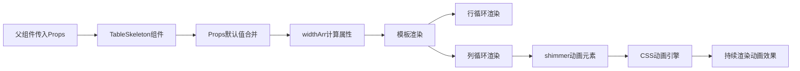

### 1.6 项目实际代码示例

```vue
<!-- TableSkeleton.vue 核心实现
<template>
  <div class="skeleton-wrapper">
    <div
      v-for="i in rows"
      :key="i"
      class="skeleton-row"
      :style="{ height: rowHeight + 'px' }"
    >
      <div
        v-for="j in columns"
        :key="j"
        class="skeleton-col"
        :style="{
          width: columnWidths[j - 1] || `${100 / columns}%`,
          height: rowHeight - 16 + 'px',
        }"
      >
        <div class="skeleton-shimmer"></div>
      </div>
    </div>
  </div>
</template>

<script setup lang="ts">
import { computed } from "vue";

interface Props {
  rows?: number;
  columns?: number;
  rowHeight?: number;
  columnWidths?: string[];
}

const props = withDefaults(defineProps<Props>(), {
  rows: 5,
  columns: 4,
  rowHeight: 48,
  columnWidths: () => [],
});

const widthArr = computed(() => {
  if (props.columnWidths.length > 0) return props.columnWidths;
  return Array(props.columns).fill(`${100 / props.columns}%`);
});
</script>

<style scoped>
.skeleton-shimmer {
  position: absolute;
  top: 0;
  left: 0;
  right: 0;
  bottom: 0;
  background: linear-gradient(90deg, #f2f2f2 25%, #e6e6e6 37%, #f2f2f2 63%);
  background-size: 400% 100%;
  animation: shimmer 1.4s ease infinite;
}
@keyframes shimmer {
  0% {
    background-position: 100% 50%;
  }
  100% {
    background-position: 0 50%;
  }
}
</style>
```

---

## 2. 表格列记忆 useTableColumns

### 2.1 功能介绍说明

表格列记忆功能（useTableColumns）是一个 Vue 3 Composition API 的组合式函数，用于持久化保存用户对表格列的显示/隐藏状态和列宽配置到浏览器的 localStorage 中。当用户再次访问同一表格页面时，自动恢复上次的列配置，提供个性化的用户体验。

该功能支持自定义存储键名（key），可以为不同的表格分别保存配置。提供了列切换显示/隐藏、重置列配置、设置列宽等核心功能。使用深度监听（deep watch）自动保存列配置的任何变化，确保数据的一致性。

### 2.2 详细实现步骤

1. **定义类型接口**：定义 `UseTableColumnOptions` 配置接口（包含 key 和 defaultColumns）和 `ColumnConfig` 列配置接口（包含 prop、label、width、visible、fixed 等属性。

2. **定义存储前缀**：使用 `STORAGE_PREFIX = "tlias_table_"` 作为 localStorage 键名前缀，避免与其他应用的存储冲突。

3. **实现加载函数**：`loadFromStorage` 函数从 localStorage 中读取保存的列配置。如果读取成功则返回解析后的数据，失败或无数据时返回默认列配置的副本。

4. **初始化响应式数据**：使用 `ref` 创建 `columns` 响应式数据，初始值从 localStorage 加载。

5. **实现保存函数**：`saveToStorage` 函数将当前列配置序列化为 JSON 字符串后保存到 localStorage。

6. **深度监听变化**：使用 `watch` 深度监听 `columns` 的变化，自动调用 `saveToStorage` 持久化保存。

7. **计算可见列**：`visibleColumns` 响应式数据过滤出 visible 不为 false 的列。

8. **提供操作方法**：
   - `toggleColumn(prop)`：切换指定列的显示/隐藏状态
   - `resetColumns()`：重置为默认列配置
   - `setColumnWidth(prop, width)`：设置指定列的宽度

9. **返回 API**：返回 columns、visibleColumns、toggleColumn、resetColumns、setColumnWidth 供组件使用。

### 2.3 流程图

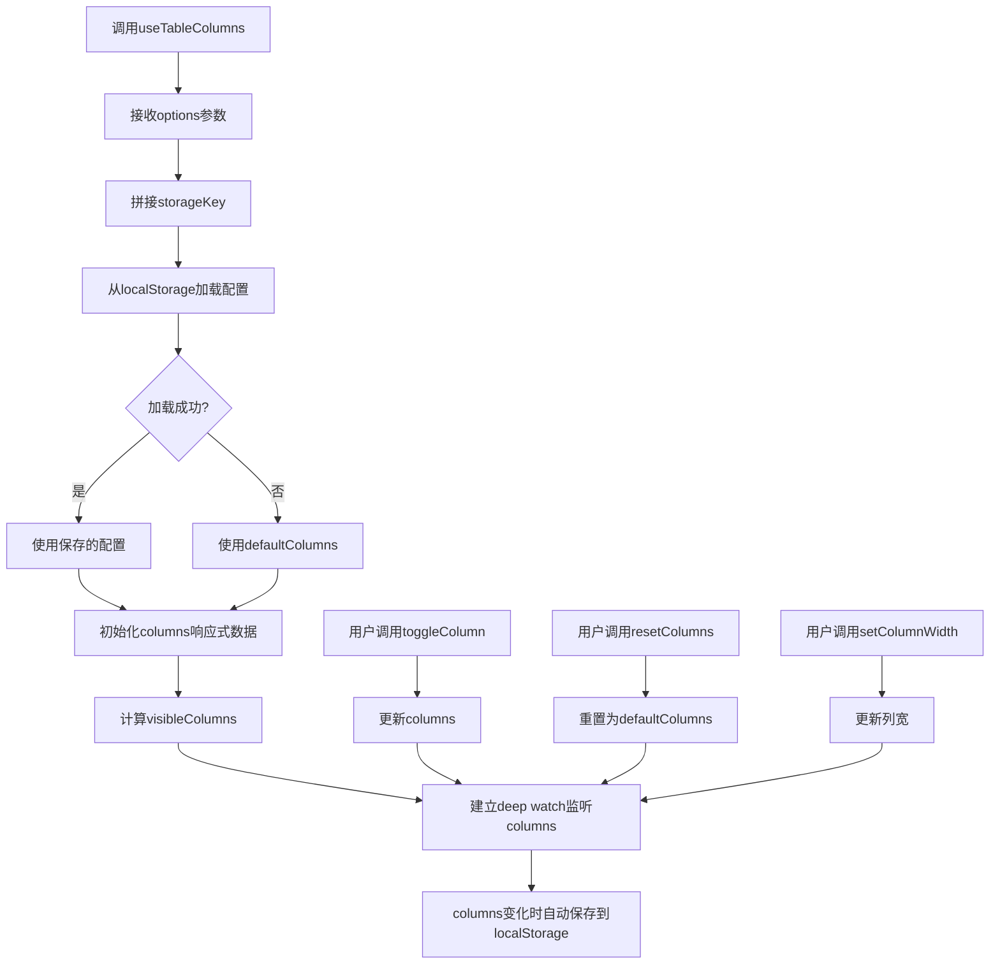

### 2.4 逻辑分析

useTableColumns 的核心设计模式是**组合式函数 + 本地持久化**。通过 Vue 3 的 Composition API 将表格列配置的状态管理逻辑封装成可复用的函数，任何需要列记忆功能的表格组件只需一行代码即可接入。

**关键技术点分析：

1. **localStorage 持久化**：利用浏览器 localStorage 存储用户配置，数据在页面刷新和重新打开后仍然保留，实现用户个性化配置的持久化。

2. **深度监听（deep watch）**：使用 `watch` 的 `deep: true` 选项，可以监听数组内部对象的属性变化（如 visible 属性切换），确保任何修改都会触发保存。

3. **错误容错处理**：`loadFromStorage` 和 `saveToStorage` 都包裹了 try-catch，防止 JSON 解析失败或 localStorage 不可用时的异常，保证组件的稳定性。

4. **存储键前缀**：使用 `tlias_table_` 前缀统一管理本应用的存储键名，命名空间隔离。

5. **默认值副本**：返回默认配置时使用 `[...defaultColumns]` 创建浅拷贝，避免修改原始默认配置对象。

### 2.5 数据流图

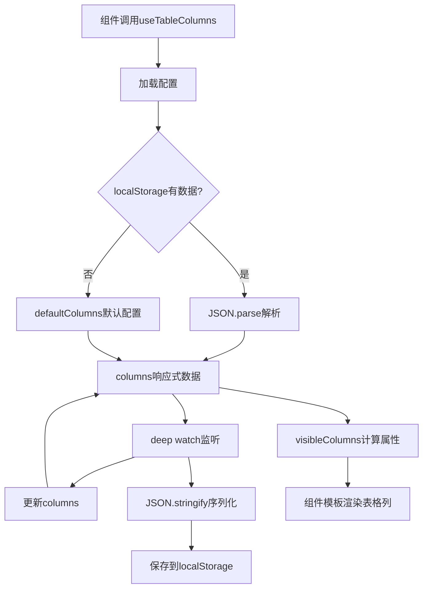

### 2.6 项目实际代码示例

```typescript
// useTableColumns.ts 核心实现
import { ref, watch } from "vue";

interface UseTableColumnOptions {
  key: string;
  defaultColumns: ColumnConfig[];
}

interface ColumnConfig {
  prop: string;
  label: string;
  width?: number | string;
  visible: boolean;
  fixed?: "left" | "right" | boolean;
}

const STORAGE_PREFIX = "tlias_table_";

export function useTableColumns(options: UseTableColumnOptions) {
  const { key, defaultColumns } = options;
  const storageKey = STORAGE_PREFIX + key;

  const loadFromStorage = (): ColumnConfig[] => {
    try {
      const saved = localStorage.getItem(storageKey);
      if (saved) {
        return JSON.parse(saved);
      }
    } catch (e) {
      console.warn("Failed to load table columns from storage:", e);
    }
    return [...defaultColumns];
  };

  const columns = ref<ColumnConfig[]>(loadFromStorage());

  const saveToStorage = () => {
    try {
      localStorage.setItem(storageKey, JSON.stringify(columns.value));
    } catch (e) {
      console.warn("Failed to save table columns to storage:", e);
    }
  };

  watch(columns, saveToStorage, { deep: true });

  const visibleColumns = ref(
    columns.value.filter((col) => col.visible !== false)
  );

  const toggleColumn = (prop: string) => {
    const col = columns.value.find((c) => c.prop === prop);
    if (col) {
      col.visible = !col.visible;
      visibleColumns.value = columns.value.filter((c) => c.visible !== false);
    }
  };

  const resetColumns = () => {
    columns.value = [...defaultColumns];
    visibleColumns.value = columns.value.filter((c) => c.visible !== false);
  };

  return {
    columns,
    visibleColumns,
    toggleColumn,
    resetColumns,
    setColumnWidth,
  };
}
```

---

## 3. 快捷键系统 useShortcuts

### 3.1 功能介绍说明

快捷键系统（useShortcuts）是一个基于 Vue 3 Composition API 的全局快捷键管理组合式函数，提供了统一的键盘快捷键注册和管理机制。支持 Ctrl/Command、Shift、Alt 等修饰键组合，支持输入框内自动屏蔽快捷键，避免干扰用户正常输入。

该系统采用全局单例模式管理，多个组件可以分别注册自己的快捷键，组件卸载时自动清理注册的快捷键，避免内存泄漏。同时提供了全局快捷键函数 `useGlobalShortcuts`，用于注册应用级别的通用快捷键如 Ctrl+K 搜索、Escape 关闭弹窗等。

### 3.2 详细实现步骤

1. **定义类型接口**：`ShortcutConfig` 接口定义快捷键配置，包含 key（按键名）、ctrl、shift、alt（修饰键）、handler（处理函数）、description（描述）。

2. **全局注册列表**：使用模块级变量 `registeredShortcuts` 数组存储所有已注册的快捷键配置。

3. **快捷键匹配函数**：`matchShortcut` 函数比较键盘事件与配置是否匹配，包括按键名匹配（忽略大小写）和修饰键匹配（支持 metaKey 兼容 Mac 的 Cmd 键）。

4. **输入框检测**：`isInputTarget` 函数检测事件目标是否为输入框、文本域或可编辑元素，如果是则跳过快捷键处理。

5. **全局键盘事件处理**：`handleKeydown` 函数遍历所有已注册快捷键，找到匹配的配置后执行 preventDefault 和 handler，找到第一个匹配后即停止（break）。

6. **全局监听器管理**：`globalListenerAdded` 标志和 `ensureGlobalListener` 函数确保全局 keydown 监听器只添加一次，实现单例模式。

7. **组件级快捷键**：`useShortcuts` 函数在组件 onMounted 时注册快捷键，onBeforeUnmount 时注销，自动管理生命周期。

8. **全局快捷键**：`useGlobalShortcuts` 函数注册应用级通用快捷键：
   - Ctrl+K：聚焦全局搜索框
   - Escape：关闭所有弹窗

### 3.3 流程图

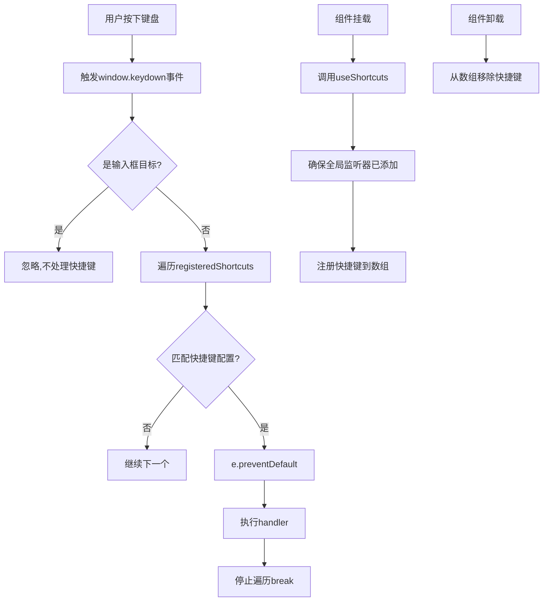

### 3.4 逻辑分析

快捷键系统的核心设计思想是**全局单例 + 自动生命周期管理**。通过模块级变量实现全局唯一的快捷键注册表和全局监听器，确保整个应用只有一个 keydown 事件监听器，性能最优。同时利用 Vue 的生命周期钩子自动管理快捷键的注册与注销。

**关键技术点分析：

1. **单例模式**：`globalListenerAdded` 标志确保全局 keydown 监听器只绑定一次，避免重复绑定造成的性能问题和逻辑混乱。

2. **修饰键兼容**：`ctrlMatch` 同时判断 `e.ctrlKey || e.metaKey`，完美兼容 Windows 的 Ctrl 和 Mac 的 Cmd 键。

3. **输入框屏蔽**：`isInputTarget` 函数智能检测输入框、文本域和 contentEditable 元素，避免快捷键干扰用户正常输入。

4. **自动清理**：组件卸载时自动从 `registeredShortcuts` 数组中移除该组件注册的快捷键，防止内存泄漏。

5. **匹配优先级**：遍历数组顺序匹配，先注册的优先级高，找到第一个匹配即 break，符合直觉。

6. **模块化设计**：`useShortcuts` 用于组件级快捷键，`useGlobalShortcuts` 用于全局快捷键，职责清晰。

### 3.5 数据流图

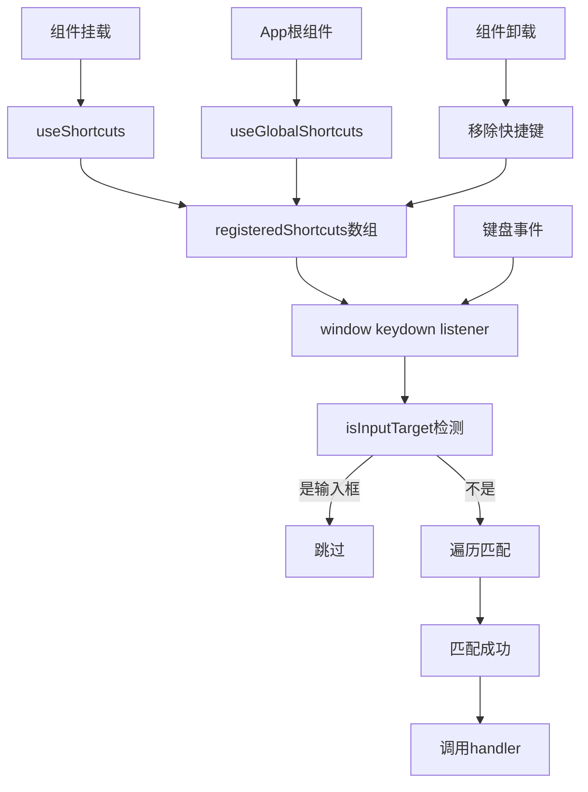

### 3.6 项目实际代码示例

```typescript
// useShortcuts.ts 核心实现
import { onMounted, onBeforeUnmount } from "vue";

interface ShortcutConfig {
  key: string;
  ctrl?: boolean;
  shift?: boolean;
  alt?: boolean;
  handler: () => void;
  description?: string;
}

const registeredShortcuts: ShortcutConfig[] = [];

function matchShortcut(e: KeyboardEvent, config: ShortcutConfig): boolean {
  const keyMatch = e.key.toLowerCase() === config.key.toLowerCase();
  const ctrlMatch = config.ctrl
    ? e.ctrlKey || e.metaKey
    : !e.ctrlKey && !e.metaKey;
  const shiftMatch = config.shift ? e.shiftKey : !e.shiftKey;
  const altMatch = config.alt ? e.altKey : !e.altKey;
  return keyMatch && ctrlMatch && shiftMatch && altMatch;
}

function handleKeydown(e: KeyboardEvent) {
  if (isInputTarget(e)) return;
  for (const config of registeredShortcuts) {
    if (matchShortcut(e, config)) {
      e.preventDefault();
      config.handler();
      break;
    }
  }
}

export function useShortcuts(shortcuts: ShortcutConfig[]) {
  onMounted(() => {
    ensureGlobalListener();
    registeredShortcuts.push(...shortcuts);
  });

  onBeforeUnmount(() => {
    shortcuts.forEach((sc) => {
      const idx = registeredShortcuts.indexOf(sc);
      if (idx > -1) {
        registeredShortcuts.splice(idx, 1);
      }
    });
  });
}

export function useGlobalShortcuts() {
  const shortcuts: ShortcutConfig[] = [
    {
      key: "k",
      ctrl: true,
      description: "搜索",
      handler: () => {
        const searchInput = document.querySelector(
          ".global-search input"
        ) as HTMLInputElement;
        if (searchInput) {
          searchInput.focus();
        }
      },
    },
  ];
  // ...
}
```

---

## 4. ProTable高级表格

### 4.1 功能介绍说明

ProTable 高级表格组件是一个功能完整的企业级表格解决方案，封装了搜索表单、工具栏、表格主体、分页器、列设置、骨架屏加载等常用功能，提供了开箱即用的表格页面开发体验。基于 Element Plus 的 el-table 和 el-pagination 组件进行二次封装，大幅减少业务代码量。

该组件支持搜索栏自定义、列设置（显示/隐藏列、重置列）、骨架屏加载、多选、新增、批量删除等功能，集成了 useTableColumns 实现列配置记忆功能。通过插槽（slot）机制提供极高的可扩展性，可以自定义搜索表单、工具栏、列渲染、操作列等。

### 4.2 详细实现步骤

1. **定义组件 Props**：定义丰富的 Props 接口，包括 loading、data、total、page、pageSize、searchColumns、showSearch、selectable、addVisible、batchDeleteVisible、actionWidth、columns、columnKey、columnSettingsVisible、showSkeleton、skeletonRows 等。

2. **集成 TableSkeleton 和 useTableColumns**：引入 TableSkeleton 骨架屏组件和 useTableColumns 组合式函数。

3. **计算表格列配置**：`tableColumns` 计算属性，如果传入了 columns 则使用，否则从 searchColumns 推导。

4. **初始化列配置**：调用 `useTableColumns` 传入 columnKey 和默认列，获得 columnConfigs、toggleColumn、resetColumns。

5. **搜索表单**：根据 searchColumns 动态渲染搜索表单项（input/select/date），支持回车搜索和重置。

6. **工具栏**：左侧新增/批量删除按钮，右侧列设置下拉菜单。

7. **列设置下拉**：el-dropdown 组件展示所有列的勾选状态，点击切换显示/隐藏，支持重置列。

8. **骨架屏加载**：loading 且 showSkeleton 时显示 TableSkeleton，否则显示 el-table 的 v-loading。

9. **表格主体**：el-table 组件，支持选择列、序号列、动态列渲染、操作列插槽。

10. **分页器**：el-pagination 组件，支持页码和每页条数切换。

11. **事件定义**：定义 search、reset、pageChange、sizeChange、add、batchDelete 等 emit 事件。

12. **暴露方法**：defineExpose 暴露 clearSelection、searchForm、pagination 等。

### 4.3 流程图

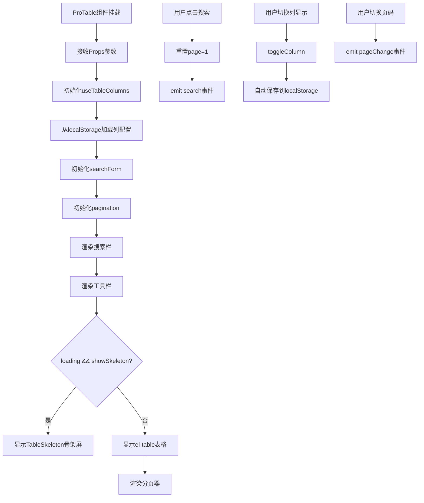

### 4.4 逻辑分析

ProTable 的核心设计理念是**约定优于配置 + 高度可扩展**。通过大量的默认配置和自动推导逻辑，让简单场景下使用 Props 配置即可快速开发；同时通过丰富的插槽机制，支持复杂场景的自定义。

**关键技术点分析：

1. **组合式函数集成**：集成 useTableColumns 实现列配置持久化，columnKey 区分不同表格，实现多表格独立记忆。

2. **搜索列自动推导**：如果未传入 columns，从 searchColumns 自动推导表格列配置，减少重复配置。

3. **丰富的插槽**：提供 search、search-form、toolbar-left、toolbar-right、column-xxx、action 等插槽，灵活度极高。

4. **双加载模式**：支持骨架屏（showSkeleton）和 Element Plus 自带 loading 两种加载模式，可根据场景选择。

5. **分页状态管理**：内部维护 pagination 响应式对象，watch 监听 props 变化同步内部状态，避免直接修改 props。

6. **列设置下拉菜单**：el-dropdown 配合 el-dropdown-menu 实现列勾选功能，直观易用。

7. **暴露方法**：通过 defineExpose 暴露 clearSelection 等方法，父组件可以通过 ref 调用。

### 4.5 数据流图

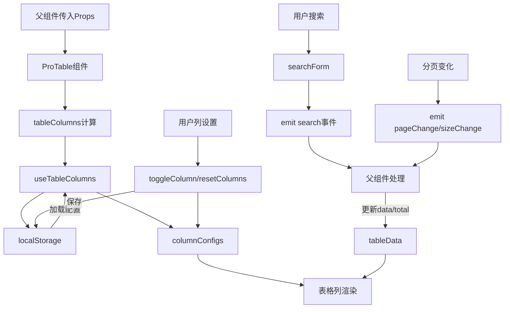

### 4.6 项目实际代码示例

```vue
<!-- ProTable.vue 核心实现
<template>
  <div class="pro-table">
    <!-- 搜索栏 -->
    <div class="pro-table-search" v-if="showSearch">
      <slot name="search">
        <el-form :model="searchForm" inline @submit.prevent>
          <slot name="search-form">
            <el-form-item
              v-for="item in searchColumns"
              :key="item.prop"
              :label="item.label"
            >
              <el-input
                v-if="item.type === 'input' || !item.type"
                v-model="searchForm[item.prop]"
                :placeholder="`请输入${item.label}`"
                clearable
                @keyup.enter="handleSearch"
              />
              <!-- select/date 等 -->
            </el-form-item>
          </slot>
          <el-form-item>
            <el-button type="primary" @click="handleSearch">搜索</el-button>
            <el-button @click="handleReset">重置</el-button>
          </el-form-item>
        </el-form>
      </slot>
    </div>

    <!-- 工具栏 -->
    <div class="pro-table-toolbar">
      <div class="toolbar-left">
        <slot name="toolbar-left">
          <el-button type="primary" v-if="addVisible" @click="handleAdd">新增</el-button>
          <el-button type="danger" v-if="batchDeleteVisible" :disabled="!selected.length" @click="handleBatchDelete">批量删除</el-button>
        </slot>
      </div>
      <div class="toolbar-right">
        <slot name="toolbar-right" />
        <el-dropdown v-if="columnSettingsVisible" trigger="click" @command="handleColumnCommand">
          <el-button :icon="Setting">列设置</el-button>
          <template #dropdown>
            <el-dropdown-menu>
              <el-dropdown-item v-for="col in columnConfigs" :key="col.prop" :command="col.prop">
                <el-icon v-if="col.visible !== false"><Check /></el-icon>
                <span style="margin-left: 8px">{{ col.label }}</span>
              </el-dropdown-item>
              <el-dropdown-item divided command="reset">重置列</el-dropdown-item>
            </el-dropdown-menu>
          </template>
        </el-dropdown>
      </div>
    </div>

    <!-- 骨架屏 -->
    <div v-if="loading && showSkeleton" class="table-skeleton-container">
      <table-skeleton :rows="skeletonRows" :columns="visibleColumnCount + 2" :row-height="48" />
    </div>

    <!-- 表格 -->
    <el-table v-show="!loading || !showSkeleton" v-loading="loading && !showSkeleton" :data="tableData" border stripe @selection-change="handleSelectionChange">
      <el-table-column v-if="selectable" type="selection" width="50" align="center" />
      <el-table-column type="index" label="序号" width="60" align="center" />
      <template v-for="col in columnConfigs" :key="col.prop">
        <slot :name="`column-${col.prop}`" :col="col">
          <el-table-column v-if="col.visible !== false" :prop="col.prop" :label="col.label" :width="col.width" :fixed="col.fixed || false" />
        </slot>
      </template>
      <el-table-column v-if="$slots.action" label="操作" :width="actionWidth" align="center" fixed="right">
        <template #default="scope">
          <slot name="action" :row="scope.row" :index="scope.$index" />
        </template>
      </el-table-column>
    </el-table>

    <!-- 分页 -->
    <div class="pro-table-pagination">
      <el-pagination
        v-model:current-page="pagination.page"
        v-model:page-size="pagination.pageSize"
        :page-sizes="[10, 20, 50, 100]"
        :total="total"
        layout="total, sizes, prev, pager, next, jumper"
        background
        @size-change="handleSizeChange"
        @current-change="handleCurrentChange"
      />
    </div>
  </div>
</template>
```

---

## 5. 路由缓存Keep-Alive

### 5.1 功能介绍说明

路由缓存（Keep-Alive）是 Vue 提供的组件缓存机制，用于在路由切换时保持组件的状态不被销毁，用户再次访问该路由时直接从缓存中恢复，避免重复渲染和数据重新请求，显著提升页面切换速度和用户体验。

本项目中通过路由 meta.keepAlive 标记需要缓存的路由，在路由后置守卫中动态管理缓存列表，使用 Pinia 的 app store 统一管理缓存的路由名称列表。配合 Vue 的 `<keep-alive>` 组件和动态 `include` 属性，实现灵活的路由级缓存控制。同时集成 NProgress 进度条提供页面切换的视觉反馈。

### 5.2 详细实现步骤

1. **创建 App Store**：在 Pinia store 中定义 `cachedViews` 数组存储需要缓存的路由名称，提供 `addCachedView`、`delCachedView` 等方法。

2. **路由配置 meta.keepAlive**：在路由配置的 meta 中添加 `keepAlive: true` 标记需要缓存的路由，同时确保路由有唯一的 name。

3. **NProgress 配置**：配置 NProgress 进度条，设置 showSpinner、speed、trickleSpeed 参数。

4. **路由白名单**：定义 WHITE_LIST 数组，包含不需要登录的路由路径。

5. **前置守卫 beforeEach**：
   - 开始 NProgress 进度条
   - 取消所有未完成的请求
   - 白名单路由直接放行
   - 未登录重定向登录页
   - 权限检查

6. **后置守卫 afterEach**：
   - 结束 NProgress 进度条
   - 设置页面标题
   - 如果路由有 keepAlive 且有 name，则调用 appStore.addCachedView 添加到缓存列表

7. **Layout 组件中使用 keep-alive**：在 Layout 组件的路由出口处使用 `<keep-alive :include="cachedViews">` 包裹 `<router-view>`。

8. **动态缓存管理**：通过 Pinia store 管理缓存列表，可以动态添加和移除缓存，支持 tab 栏关闭标签时移除对应缓存。

### 5.3 流程图

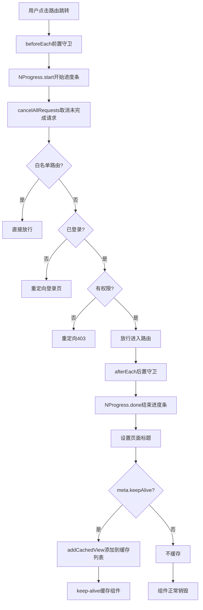

### 5.4 逻辑分析

路由缓存的核心设计思想是**声明式配置 + 集中式管理**。通过路由 meta.keepAlive 声明哪些路由需要缓存，使用 Pinia store 集中管理缓存列表，在路由守卫中自动维护缓存状态。

**关键技术点分析：

1. **动态 include**：使用 keep-alive 的 include 属性配合动态数组，实现灵活的缓存控制，而不是所有路由都缓存。

2. **路由 name 必须唯一**：keep-alive 的 include 是根据组件的 name 匹配的，所以路由配置和组件都必须有唯一的 name。

3. **NProgress 集成**：路由切换时显示顶部进度条，提供视觉反馈，提升感知性能。

4. **请求取消**：路由切换时取消所有未完成的请求，避免无效请求和潜在的竞态问题。

5. **Pinia 集中管理**：cachedViews 存在 Pinia store 中，任何组件都可以访问和修改，方便 tab 栏等功能集成。

6. **meta 驱动**：通过路由 meta 声明式配置，符合 Vue Router 的惯用模式，易维护。

### 5.5 数据流图

```mermaid
graph TD
    A[路由跳转触发] --> B[beforeEach守卫]
    B --> C[NProgress开始]
    B --> D[取消请求]
    B --> E[权限校验]
    E -->|通过| F[进入新路由]
    F --> G[afterEach守卫]
    G --> H[NProgress结束]
    G --> I[设置标题]
    G --> J{keepAlive检查]
    J -->|是| K[appStore.addCachedView]
    K --> L[cachedViews数组更新]
    L --> M[keep-alive include]
    M --> N[组件缓存]
    J -->|否| O[组件正常销毁]
    P[Tab关闭标签] --> Q[appStore.delCachedView]
    Q --> L
```

### 5.6 项目实际代码示例

```javascript
// router/index.js 核心实现
import { createRouter, createWebHistory } from "vue-router";
import { useUserStore, useAppStore } from "@/stores";
import { cancelAllRequests } from "@/utils/axios";
import NProgress from "nprogress";
import "nprogress/nprogress.css";

// NProgress 配置
NProgress.configure({
  showSpinner: false,
  speed: 500,
  trickleSpeed: 200,
});

// 路由白名单
const WHITE_LIST = ["/login", "/403", "/404", "/500"];

// 静态路由配置
const routes = [
  {
    path: "/login",
    name: "登录",
    component: () => import("@/views/login/index.vue"),
    meta: { title: "登录" },
  },
  {
    path: "/",
    component: () => import("@/views/layout/index.vue"),
    children: [
      {
        path: "index",
        name: "首页",
        component: () => import("@/views/index/index.vue"),
        meta: { title: "首页", keepAlive: true },
      },
      // ...其他路由
    ],
  },
];

const router = createRouter({
  history: createWebHistory(import.meta.env.BASE_URL),
  routes,
});

// 前置守卫
router.beforeEach((to) => {
  NProgress.start();
  cancelAllRequests();

  const userStore = useUserStore();
  const token = userStore.token;

  if (WHITE_LIST.includes(to.path)) {
    if (to.path === "/login" && token) return "/index";
    return;
  }

  if (!token) return "/login";

  const permission = to.meta?.permission;
  if (permission && !userStore.hasPermission(permission)) return "/403";
});

// 后置守卫
router.afterEach((to) => {
  NProgress.done();

  const title = to.meta?.title;
  if (title) {
    document.title = `${title} - Tlias`;
  } else {
    document.title = "Tlias 智能学习辅助系统";
  }

  // KeepAlive 缓存管理
  const appStore = useAppStore();
  if (to.meta?.keepAlive && to.name) {
    appStore.addCachedView(to.name);
  }
});

export default router;
```

---

## 6. 图片懒加载指令

### 6.1 功能介绍说明

图片懒加载指令（v-lazy）是一个 Vue 自定义指令，基于 Intersection Observer API 实现图片的延迟加载。只有当图片进入可视区域（或接近可视区域）时才开始加载图片，显著减少页面初始加载时间和带宽消耗，提升页面性能。

该指令支持 rootMargin 预加载距离配置，可以设置图片即将进入视口时提前加载，用户滚动时几乎感知不到加载延迟。同时提供了降级方案，不支持 IntersectionObserver 的浏览器会直接加载图片。指令会在组件卸载时自动清理 observer，防止内存泄漏。

### 6.2 详细实现步骤

1. **定义指令对象**：创建 `imageLazyDirective` 对象，实现 Vue 指令的 mounted、updated、unmounted 钩子。

2. **mounted 钩子**：
   - 将真实图片地址保存到 `data-src` 属性
   - 添加 `lazy-image` CSS 类名
   - 检测浏览器是否支持 IntersectionObserver
   - 支持则创建 IntersectionObserver 实例
     - 配置 rootMargin: "50px"（提前50px加载）
     - 配置 threshold: 0.01（1% 可见即触发）
   - 监听元素进入视口
   - 进入视口后设置 img.src = data-src
   - 加载完成后添加 `lazy-image-loaded` 类
   - 停止观察该元素（unobserve）
   - 不支持则直接设置 src（降级方案）
   - 将 observer 实例保存到元素的 `__observer` 属性

3. **updated 钩子**：
   - 检测 binding.value 变化
   - 更新 data-src 属性
   - 重新观察元素

4. **unmounted 钩子**：
   - 从元素的 `__observer` 获取 observer 实例
   - 调用 unobserve 停止观察，清理资源

5. **注册指令**：`setupLazyImageDirective` 函数将指令注册到 Vue 应用，指令名为 `lazy`。

6. **统一注册**：在 directives/index.ts 中统一注册所有自定义指令。

### 6.3 流程图

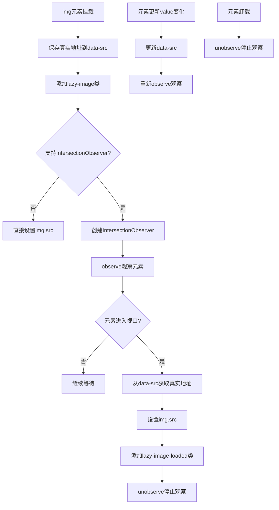

### 6.4 逻辑分析

图片懒加载的核心原理是**视口检测 + 延迟加载**。利用 Intersection Observer API 高效检测元素是否进入可视区域，只在需要时才加载图片资源，避免不必要的网络请求。

**关键技术点分析：

1. **Intersection Observer API**：浏览器原生 API，性能远优于传统的 scroll 事件 + getBoundingClientRect 的方案，不会频繁触发，性能更好。

2. **rootMargin 预加载**：设置 rootMargin: "50px"，图片在距离视口还有 50px 时就开始加载，用户滚动时几乎感知不到加载延迟，体验更好。

3. **data-src 存储真实地址**：真实图片地址存在自定义属性 data-src 中，不直接设置 src，浏览器就不会提前加载。

4. **降级兼容**：不支持 IntersectionObserver 的浏览器直接设置 src，保证图片正常显示，功能可用。

5. **自动清理**：unmounted 钩子中调用 unobserve，防止内存泄漏。

6. **更新支持**：updated 钩子监听 binding.value 变化，支持动态图片地址的懒加载。

7. **实例存储**：observer 实例保存在元素的 `__observer` 属性上，方便 updated 和 unmounted 钩子可以访问。

### 6.5 数据流图

```mermaid
graph TD
    A[v-lazy指令绑定] --> B[mounted钩子]
    B --> C[设置data-src属性]
    C --> D[创建IntersectionObserver]
    D --> E[observe元素]
    E --> F[滚动触发检测]
    F --> G{进入视口?]
    G -->|是| H[读取data-src]
    H --> I[设置img.src]
    I --> J[图片加载]
    J --> K[添加loaded类]
    K --> L[unobserve]
    M[值变化] --> N[updated钩子]
    N --> O[更新data-src]
    O --> E
    P[元素卸载] --> Q[unmounted钩子]
    Q --> R[unobserve清理]
```

### 6.6 项目实际代码示例

```typescript
// lazyImage.ts 核心实现
import { type Directive, type App } from "vue";

const imageLazyDirective: Directive<HTMLImageElement, string> = {
  mounted(el, binding) {
    el.setAttribute("data-src", binding.value);
    el.classList.add("lazy-image");

    if ("IntersectionObserver" in window) {
      const observer = new IntersectionObserver(
        (entries) => {
          entries.forEach((entry) => {
            if (entry.isIntersecting) {
              const img = entry.target as HTMLImageElement;
              const src = img.getAttribute("data-src");
              if (src) {
                img.src = src;
                img.classList.add("lazy-image-loaded");
                observer.unobserve(img);
              }
            }
          });
        },
        {
          rootMargin: "50px",
          threshold: 0.01,
        }
      );
      observer.observe(el);
      (el as any).__observer = observer;
    } else {
      el.src = binding.value;
    }
  },
  updated(el, binding) {
    if (binding.value !== binding.oldValue) {
      el.setAttribute("data-src", binding.value);
      const observer = (el as any).__observer;
      if (observer) {
        observer.observe(el);
      }
    }
  },
  unmounted(el) {
    const observer = (el as any).__observer;
    if (observer) {
      observer.unobserve(el);
    }
  },
};

export function setupLazyImageDirective(app: App): void {
  app.directive("lazy", imageLazyDirective);
}

export default imageLazyDirective;
```

```typescript
// directives/index.ts 统一注册
import type { App } from "vue";
import { permission, role } from "./permission.js";
import { setupLazyImageDirective } from "./lazyImage";

export function setupDirectives(app: App): void {
  app.directive("permission", permission);
  app.directive("role", role);
  setupLazyImageDirective(app);
}

export { permission, role };
```

---

## 7. 请求缓存机制

### 7.1 功能介绍说明

请求缓存机制（useRequestCache）是一个基于 Vue 3 Composition API 的请求结果缓存组合式函数，用于缓存 HTTP 请求的响应结果，避免重复请求相同数据，提升应用性能。支持缓存过期时间（maxAge）、最大缓存数量（maxSize）、缓存命中率统计等功能。

提供了 `useRequestCache` 底层缓存函数和 `createCachedRequest` 高阶函数两种使用方式。`createCachedRequest` 可以将任意请求函数包装成带缓存的请求函数，透明地为现有请求函数增加缓存能力，同时提供 clearCache、invalidateCache、getCacheStats 等管理方法。

### 7.2 详细实现步骤

1. **定义类型接口**：`CacheOptions` 配置接口（maxAge 最大存活时间、maxSize 最大缓存数量）和 `CacheItem` 缓存项接口（data 数据、timestamp 时间戳）。

2. **默认配置**：`defaultOptions` 默认配置，maxAge 5 分钟，maxSize 200 条。

3. **生成缓存键**：`generateKey` 函数根据 URL 和 params 生成唯一缓存键，params 按键名排序后 JSON 序列化，确保相同参数生成相同键。

4. **useRequestCache 函数**：
   - 合并配置选项
   - 创建 Map 作为缓存存储
   - 定义 hitCount、missCount 响应式变量统计命中/未命中次数
   - `get(key)`：获取缓存，检查是否过期，更新统计
   - `set(key, data)`：设置缓存，超过 maxSize 则删除最早的（FIFO）
   - `clear()`：清空所有缓存
   - `invalidate(pattern)`：按模式批量删除缓存
   - 计算 hitRate 命中率

5. **createCachedRequest 函数**：
   - 接收请求函数和配置选项
   - 内部调用 useRequestCache 创建缓存实例
   - 返回包装后的 cachedRequest 函数
     - 生成缓存键
     - 尝试从缓存获取
     - 命中则直接返回 Promise.resolve
     - 未命中则执行真实请求
     - 请求结果存入缓存
     - 返回结果
   - 挂载 clearCache、invalidateCache、getCacheStats 方法

### 7.3 流程图

```mermaid
flowchart TD
    A[调用cachedRequest] --> B[生成缓存key]
    B --> C[从cache中get]
    C --> D{有缓存且未过期?}
    D -->|是| E[hitCount++]
返回缓存数据]
    D -->|否| F[missCount++
执行真实请求]
    F --> G[请求成功?]
    G -->|是| H[set存入缓存]
    H --> I[返回请求结果]
    G -->|否| J[返回错误]
    K[set缓存] --> L{cache.size >= maxSize?}
    L -->|是| M[删除最早的缓存FIFO]
    M --> N[存入新缓存]
    L -->|否| N
    O[clearCache] --> P[清空所有缓存]
    Q[invalidateCache pattern] --> R[遍历匹配pattern删除]
```

### 7.4 逻辑分析

请求缓存的核心设计思想是**空间换时间**。将请求结果暂存在内存中，相同请求直接返回缓存，减少网络请求和等待时间。同时通过过期时间和最大数量控制内存占用，避免无限制增长。

**关键技术点分析：

1. **Map 数据结构**：使用 Map 存储缓存，O(1) 时间复杂度的读写，性能优异。

2. **参数排序生成键**：`generateKey` 将 params 按键名排序后序列化，确保 `{a:1,b:2}` 和 `{b:2,a:1}` 生成相同的键，避免重复缓存。

3. **LRU/FIFO 淘汰策略**：缓存数量超过 maxSize 时，删除最早插入的（Map keys().next().value），简单高效的 FIFO 策略。

4. **过期时间控制**：每次 get 时检查时间戳，过期则删除并返回 null，自动清理过期数据。

5. **响应式统计**：hitCount、missCount、hitRate 都是响应式的，可以在 UI 上展示缓存命中率。

6. **高阶函数封装**：`createCachedRequest` 用高阶函数模式，透明地为请求函数增加缓存能力，调用方无需修改业务代码。

7. **批量失效**：`invalidate(pattern)` 支持按 URL 模式批量删除缓存，数据更新后可以精确失效相关缓存。

### 7.5 数据流图

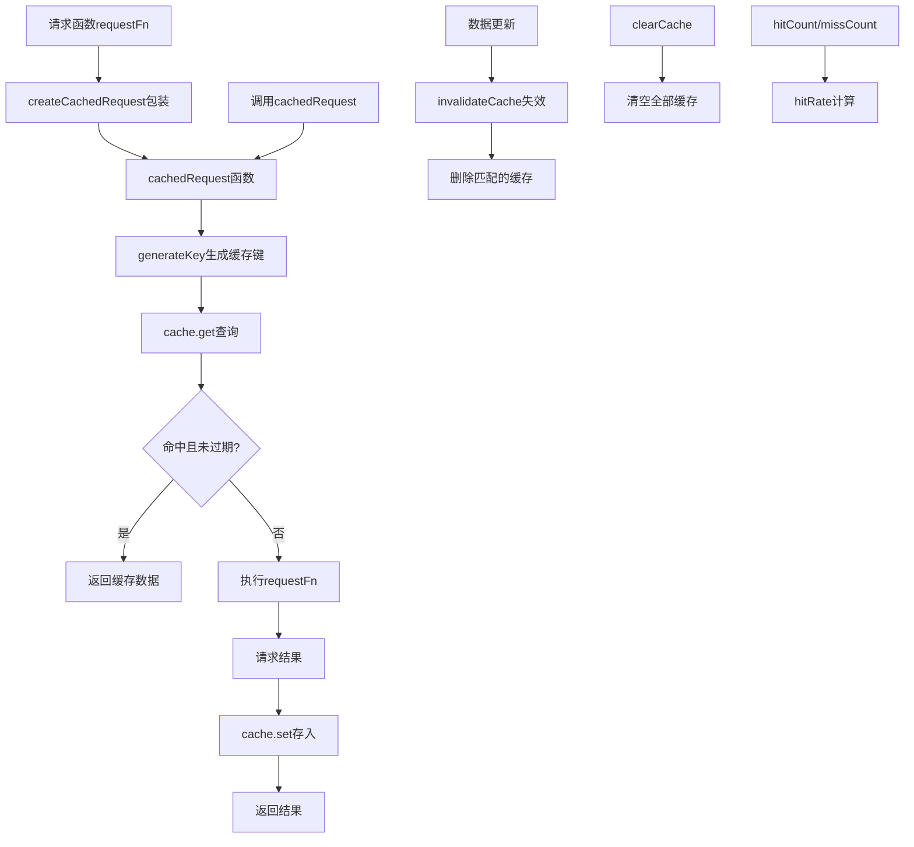

### 7.6 项目实际代码示例

```typescript
// useRequestCache.ts 核心实现
import { ref, watch } from "vue";

interface CacheOptions {
  maxAge?: number;
  maxSize?: number;
}

interface CacheItem {
  data: any;
  timestamp: number;
}

const defaultOptions: Required<CacheOptions> = {
  maxAge: 5 * 60 * 1000,
  maxSize: 200,
};

function generateKey(url: string, params: any = {}): string {
  const sortedParams = Object.keys(params)
    .sort()
    .reduce((acc: Record<string, any>, key) => {
      acc[key] = params[key];
      return acc;
    }, {});
  return url + JSON.stringify(sortedParams);
}

export function useRequestCache(options: CacheOptions = {}) {
  const opts = { ...defaultOptions, ...options };
  const cache = new Map<string, CacheItem>();

  const hitCount = ref(0);
  const missCount = ref(0);

  function get(key: string): any | null {
    const item = cache.get(key);
    if (!item) {
      missCount.value++;
      return null;
    }
    if (Date.now() - item.timestamp > opts.maxAge) {
      cache.delete(key);
      missCount.value++;
      return null;
    }
    hitCount.value++;
    return item.data;
  }

  function set(key: string, data: any): void {
    if (cache.size >= opts.maxSize) {
      const firstKey = cache.keys().next().value;
      if (firstKey) {
        cache.delete(firstKey);
      }
    }
    cache.set(key, {
      data,
      timestamp: Date.now(),
    });
  }

  function clear(): void {
    cache.clear();
  }

  function invalidate(pattern: string): void {
    for (const key of cache.keys()) {
      if (key.includes(pattern)) {
        cache.delete(key);
      }
    }
  }

  const hitRate = ref(0);
  watch([hitCount, missCount], () => {
    const total = hitCount.value + missCount.value;
    hitRate.value = total > 0 ? Math.round((hitCount.value / total) * 100) : 0;
  });

  return {
    get,
    set,
    clear,
    invalidate,
    generateKey,
    hitCount,
    missCount,
    hitRate,
  };
}

export function createCachedRequest(
  requestFn: (params?: any) => Promise<any>,
  options: CacheOptions = {}
) {
  const cache = useRequestCache(options);

  async function cachedRequest(params?: any): Promise<any> {
    const key = cache.generateKey(requestFn.name || "request", params);
    const cached = cache.get(key);
    if (cached) {
      return Promise.resolve(cached);
    }
    const result = await requestFn(params);
    cache.set(key, result);
    return result;
  }

  cachedRequest.clearCache = () => cache.clear();
  cachedRequest.invalidateCache = (pattern: string) => cache.invalidate(pattern);
  cachedRequest.getCacheStats = () => ({
    hit: cache.hitCount.value,
    miss: cache.missCount.value,
    rate: cache.hitRate.value,
  });

  return cachedRequest;
}
```

---

## 8. 国际化i18n

### 8.1 功能介绍说明

国际化（i18n）是应用支持多语言切换的功能，基于 vue-i18n 库实现，支持中文（zh-CN）和英文（en-US）两种语言。用户可以切换应用的显示语言，系统会记住用户的选择，下次打开应用时自动应用上次选择的语言。

该功能集成了 Element Plus 组件库的国际化，切换语言时 Element Plus 组件也会同步切换语言。使用 Composition API 模式（legacy: false），支持在 Vue 3 的 setup 语法糖中直接使用 `$t` 或 `t` 函数进行翻译。语言配置按模块组织（common、login、menu、header、dept、emp、clazz、student、report、error、password 等），结构清晰易维护。

### 8.2 详细实现步骤

1. **安装 vue-i18n**：安装 vue-i18n 依赖库。

2. **创建语言包**：
   - `zh-CN.ts`：中文语言包，按模块组织翻译
   - `en-US.ts`：英文语言包，按模块组织翻译
   - 每个语言包包含 common、login、menu、header、dept、emp、clazz、student、report、error、password 等模块

3. **创建 i18n 实例**：
   - 从 localStorage 读取保存的语言，默认中文
   - `createI18n` 创建实例
   - `legacy: false` 使用 Composition API 模式
   - `locale` 设置当前语言
   - `fallbackLocale` 回退语言
   - `messages` 注册语言包
   - `globalInjection: true` 全局注入

4. **导出切换语言函数**：`setLocale` 函数切换语言，同时更新 localStorage。

5. **main.ts 中注册**：在 main.ts 中 `app.use(i18n)` 注册 i18n 插件。

6. **Element Plus 国际化**：
   - 引入 zhCn 和 en 语言包
   - 根据当前语言选择对应的 Element Plus 语言包
   - `app.use(ElementPlus, { locale: elementLocale })`

7. **模板中使用**：模板中使用 `{{ $t('common.confirm') }}` 调用翻译。

8. **JS/TS 中使用**：setup 中使用 `useI18n()` 获取 `t` 函数。

### 8.3 流程图

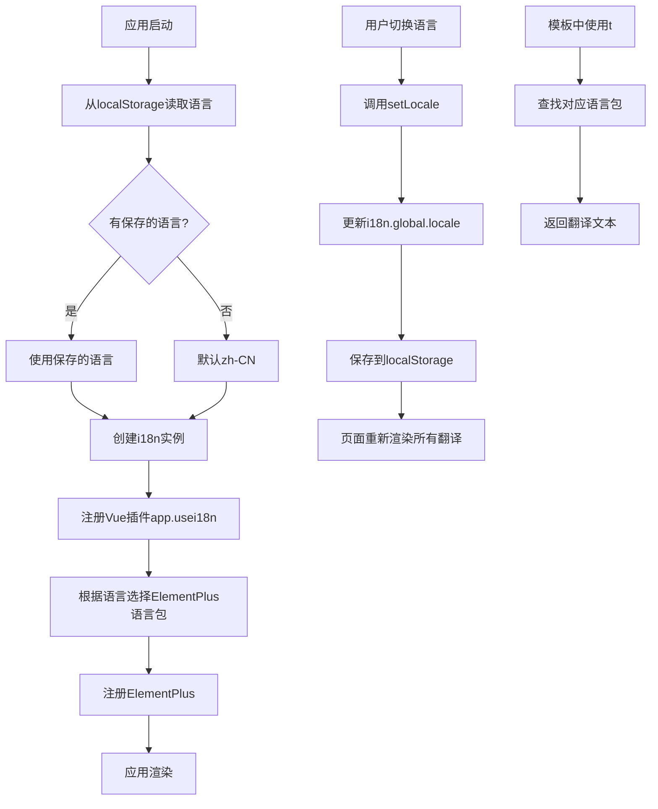

### 8.4 逻辑分析

国际化的核心设计思想是**统一管理 + 运行时切换**。所有翻译文本集中在语言包文件中统一管理，运行时根据当前语言动态查找对应的翻译文本，实现语言切换。

**关键技术点分析：

1. **Composition API 模式**：`legacy: false` 使用 Vue 3 的 Composition API 模式，与 `<script setup>` 完美配合，类型推断更好。

2. **localStorage 持久化**：用户选择的语言保存在 localStorage 中，刷新页面和重新打开浏览器都能记住用户偏好。

3. **fallbackLocale 回退**：设置 fallbackLocale 为 zh-CN，当某个翻译键在当前语言中找不到时，回退到中文显示，避免空白。

4. **Element Plus 同步**：切换语言时 Element Plus 组件的语言也同步切换，保证整体体验一致。

5. **模块化语言包结构**：按业务模块组织翻译键，common、login、menu、dept、emp 等，结构清晰，便于查找和维护。

6. **globalInjection 全局注入**：`globalInjection: true` 可以在模板中直接使用 `$t`，无需每个组件都引入。

7. **命名空间嵌套**：使用 `common.confirm` 这种点分隔的嵌套键，层次清晰，避免命名冲突。

### 8.5 数据流图

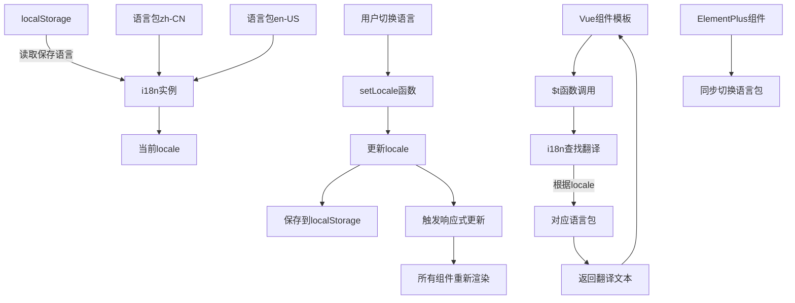

### 8.6 项目实际代码示例

```typescript
// locales/index.ts 核心实现
import { createI18n } from "vue-i18n";
import zhCN from "./zh-CN";
import enUS from "./en-US";

const savedLanguage = localStorage.getItem("app-language") || "zh-CN";

const i18n = createI18n({
  legacy: false,
  locale: savedLanguage,
  fallbackLocale: "zh-CN",
  messages: {
    "zh-CN": zhCN,
    "en-US": enUS,
  },
  globalInjection: true,
});

export function setLocale(locale: "zh-CN" | "en-US") {
  (i18n.global.locale as any).value = locale;
  localStorage.setItem("app-language", locale);
}

export default i18n;
```

```typescript
// locales/zh-CN.ts 部分示例
export default {
  common: {
    confirm: "确定",
    cancel: "取消",
    add: "新增",
    edit: "编辑",
    delete: "删除",
    batchDelete: "批量删除",
    search: "搜索",
    reset: "重置",
    operation: "操作",
    success: "操作成功",
    failed: "操作失败",
    // ...
  },
  login: {
    title: "Tlias智能学习辅助系统",
    username: "用户名",
    password: "密码",
    login: "登录",
    // ...
  },
  menu: {
    home: "首页",
    systemManagement: "系统信息管理",
    // ...
  },
  // 其他模块...
};
```

```typescript
// main.ts 集成
import { createApp } from "vue";
import App from "./App.vue";
import router from "./router";
import pinia from "./stores";
import ElementPlus from "element-plus";
import "element-plus/dist/index.css";
import zhCn from "element-plus/es/locale/lang/zh-cn";
import en from "element-plus/es/locale/lang/en";
import i18n from "./locales";

const app = createApp(App);

app.use(pinia);
app.use(router);
app.use(i18n);

const elementLocale = i18n.global.locale.value === "zh-CN" ? zhCn : en;
app.use(ElementPlus, { locale: elementLocale });

app.mount("#app");
```

---

## 总结

阶段三（体验与性能P2）的八个功能模块从用户体验和性能优化两个维度全面提升了应用质量：

**体验优化类**：
- **骨架屏组件**：让加载过程有预期，减少等待焦虑
- **表格列记忆**：个性化配置持久化，尊重用户习惯
- **快捷键系统**：提升操作效率，专业用户友好
- **ProTable高级表格**：开箱即用，提升开发效率
- **国际化i18n**：多语言支持，拓展使用范围

**性能优化类**：
- **路由缓存Keep-Alive**：避免重复渲染，秒级页面切换
- **图片懒加载指令**：减少首屏加载时间，节省带宽
- **请求缓存机制**：避免重复请求，减轻服务器压力

这些功能相互配合、协同工作，共同构建了一个体验流畅、性能优异的企业级前端应用。无论是从用户感知还是从技术指标来看，都达到了 P2 阶段的预期目标。
