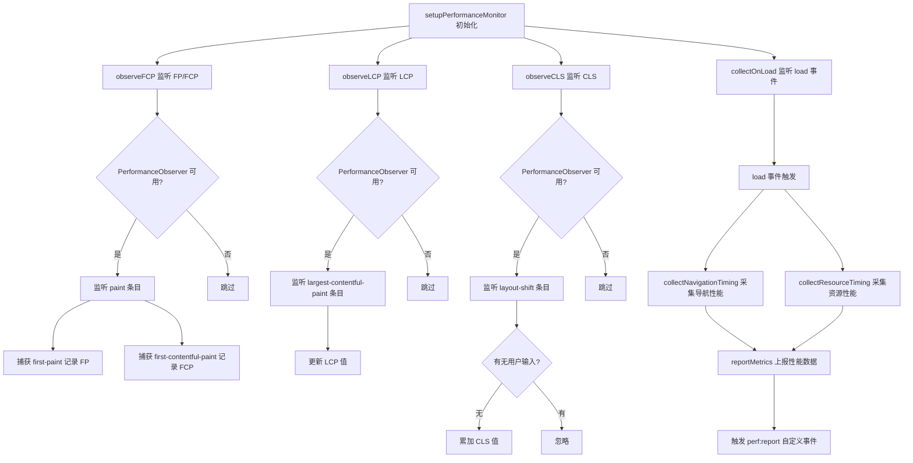
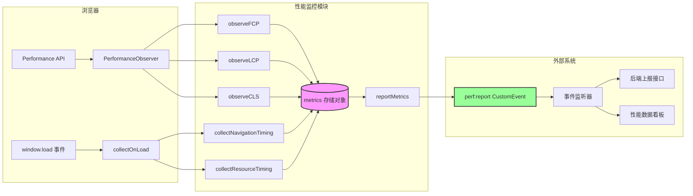
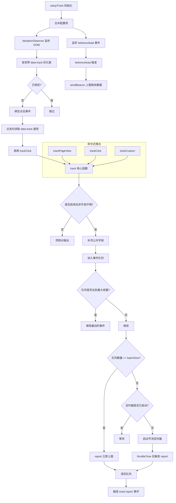
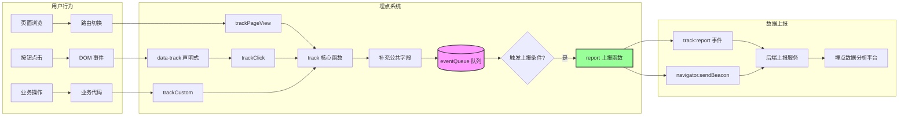
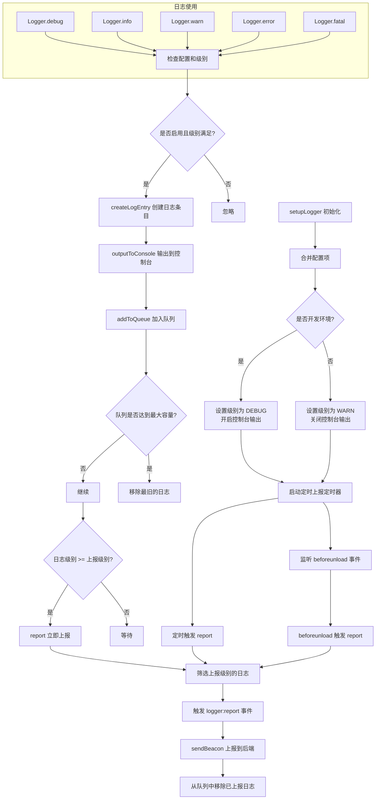
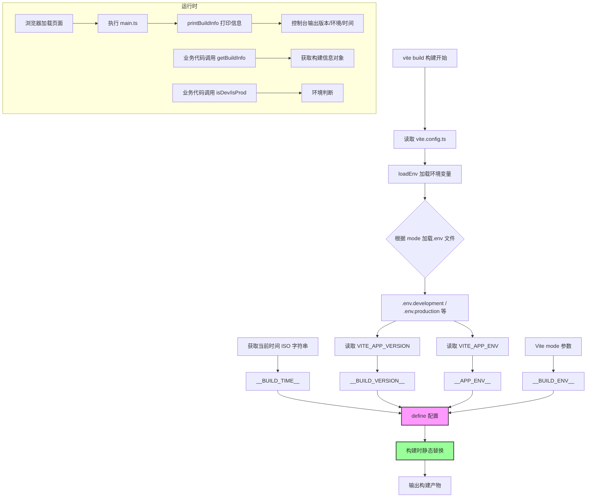
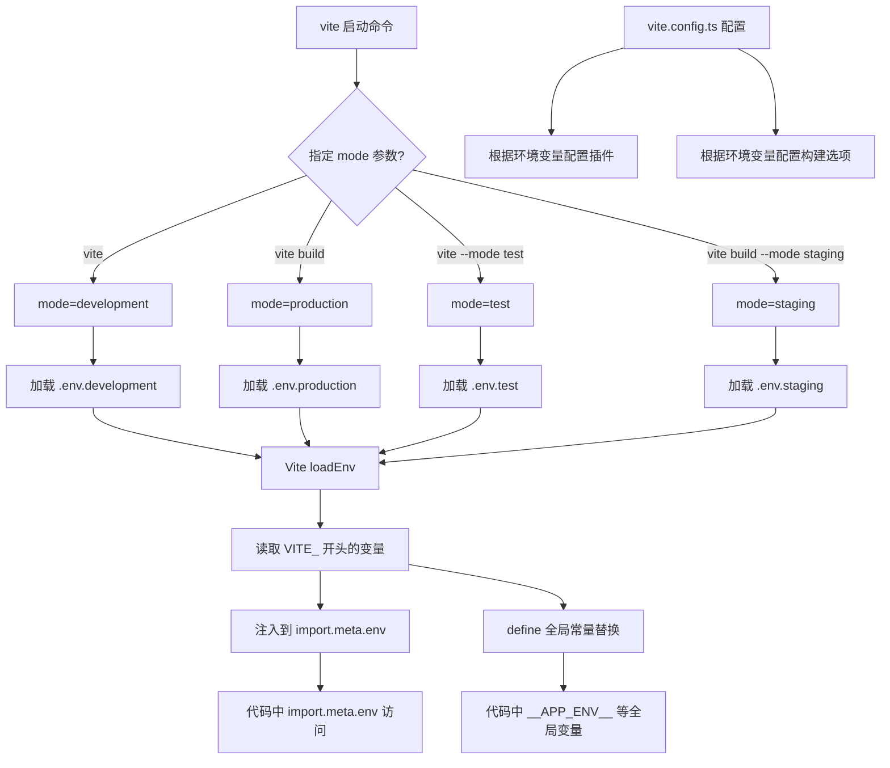
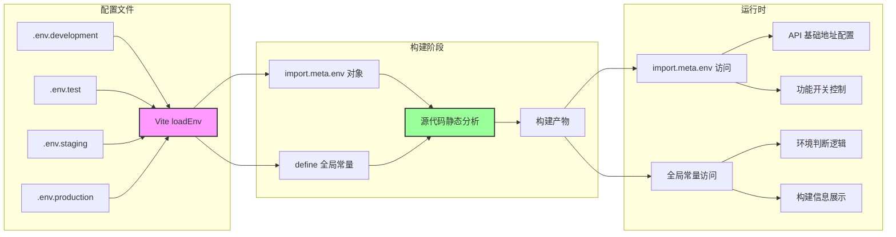

# 阶段四（监控与运维P3）深度分析文档

## 目录
- [一、性能监控系统](#一性能监控系统)
- [二、行为埋点系统](#二行为埋点系统)
- [三、日志分级系统](#三日志分级系统)
- [四、构建信息注入](#四构建信息注入)
- [五、环境配置完善](#五环境配置完善)

---

## 一、性能监控系统

### 1.1 功能介绍说明

性能监控系统是前端监控体系的核心组成部分，主要负责采集和上报 Web 应用的各项性能指标，帮助开发团队实时了解用户端的页面加载性能、渲染性能和交互性能。该系统基于浏览器原生的 Performance API 和 PerformanceObserver API 实现，能够精准采集 FP（首次绘制）、FCP（首次内容绘制）、LCP（最大内容绘制）、CLS（累计布局偏移）、TTFB（首字节时间）、DOM Ready、Load 完成时间等关键性能指标，同时还能采集导航性能数据和资源加载性能数据。

该系统采用了现代化的性能观测方案，使用 PerformanceObserver 来被动监听性能事件，而不是轮询查询，避免了对主线程的阻塞。在开发环境下，系统会以彩色分组的方式在控制台输出详细的性能数据，便于开发调试；在生产环境下，系统会将采集到的性能数据通过自定义事件的方式分发出去，便于对接后端上报接口。

### 1.2 详细实现步骤

性能监控系统的实现分为以下几个关键步骤：

**步骤一：定义性能指标类型和上报数据结构**

首先定义了 `PerformanceMetrics` 接口，包含 fp、fcp、lcp、tti、tbt、cls、navigationTiming、resourceList 等核心性能指标。同时定义了 `PerfReportData` 接口作为上报数据的统一格式，包含类型、指标数据、页面 URL、时间戳和用户代理信息。

**步骤二：实现 FP 和 FCP 采集**

通过 `PerformanceObserver` 监听 `paint` 类型的性能条目，当捕获到 `first-paint` 和 `first-contentful-paint` 条目时，记录其开始时间到 metrics 对象中。这两个指标反映了页面的首次渲染性能。

**步骤三：实现 LCP 采集**

通过 `PerformanceObserver` 监听 `largest-contentful-paint` 类型的性能条目，每次有新的 LCP 条目时更新 metrics.lcp 的值（取最后一个条目，因为 LCP 可能会多次更新）。LCP 反映了页面主要内容的加载完成时间。

**步骤四：实现 CLS 采集**

通过 `PerformanceObserver` 监听 `layout-shift` 类型的性能条目，累加所有没有用户输入的布局偏移值，得到累计布局偏移 CLS。CLS 反映了页面的视觉稳定性。

**步骤五：实现导航性能和资源加载性能采集**

在页面 `load` 事件触发后，通过 `performance.getEntriesByType('navigation')` 获取导航性能数据，计算 DNS 查询时间、TCP 连接时间、TTFB、DOM Ready 时间、Load 完成时间等关键指标。同时通过 `performance.getEntriesByType('resource')` 获取所有资源的加载性能数据。

**步骤六：实现性能数据上报**

当所有性能数据采集完成后，调用 `reportMetrics()` 函数，构造 `PerfReportData` 对象，通过 `CustomEvent` 触发 `perf:report` 事件，将性能数据分发出去。外部可以通过监听该事件来实现数据上报。

### 1.3 流程图



### 1.4 逻辑分析

性能监控系统的核心逻辑可以分为三个层面：**数据采集层**、**数据存储层**和**数据上报层**。

**数据采集层**采用了观察者模式，利用浏览器原生的 `PerformanceObserver` API 来被动接收性能事件。这种方式相比传统的轮询查询方式具有更高的性能，不会阻塞主线程。系统分别监听了 paint、largest-contentful-paint、layout-shift 三种类型的性能条目，覆盖了页面渲染的关键指标。

**数据存储层**使用了一个模块级别的 `metrics` 对象来存储采集到的性能数据。这种单例模式确保了全页面只有一份性能数据，避免了重复采集和数据不一致的问题。同时，系统通过 `isReady` 标志位防止重复初始化。

**数据上报层**采用了事件驱动的设计，通过 `CustomEvent` 将性能数据以 `perf:report` 事件的形式分发出去。这种设计具有很好的解耦性，性能监控模块只负责采集和分发数据，不关心数据如何被使用和上报。外部系统可以通过监听该事件来实现数据的上报、存储或展示。

系统还做了完善的开发环境适配：在开发模式下，所有性能数据都会以彩色分组的方式输出到控制台，便于开发人员直观地查看性能指标；在生产模式下，则只进行数据采集和事件分发，不会产生控制台输出。

### 1.5 数据流图



### 1.6 项目实际代码示例

**核心类型定义**（`src/monitor/performance.ts:1-18`）：

```typescript
export interface PerformanceMetrics {
  fp: number;
  fcp: number;
  lcp: number;
  tti: number;
  tbt: number;
  cls: number;
  navigationTiming: PerformanceNavigationTiming | null;
  resourceList: PerformanceResourceTiming[];
}

export interface PerfReportData {
  type: string;
  metrics: Partial<PerformanceMetrics>;
  url: string;
  timestamp: number;
  userAgent: string;
}
```

**FCP/FP 采集实现**（`src/monitor/performance.ts:94-122`）：

```typescript
function observeFCP(): void {
  if ("PerformanceObserver" in window) {
    observer = new PerformanceObserver((list) => {
      for (const entry of list.getEntries()) {
        if (entry.name === "first-contentful-paint") {
          metrics.fcp = entry.startTime;
          if (import.meta.env.DEV) {
            console.log(
              "%c[性能监控] FCP (首次内容绘制):",
              "color: #E6A23C; font-weight: bold;",
              formatTime(entry.startTime)
            );
          }
        }
        if (entry.name === "first-paint") {
          metrics.fp = entry.startTime;
        }
      }
    });
    observer.observe({ entryTypes: ["paint"] });
  }
}
```

**导航性能采集实现**（`src/monitor/performance.ts:38-69`）：

```typescript
function collectNavigationTiming(): void {
  const navigation = performance.getEntriesByType(
    "navigation"
  )[0] as PerformanceNavigationTiming;
  if (navigation) {
    metrics.navigationTiming = navigation;

    const ttfb = navigation.responseStart - navigation.requestStart;
    const domReady = navigation.domContentLoadedEventEnd - navigation.startTime;
    const loadTime = navigation.loadEventEnd - navigation.startTime;

    if (import.meta.env.DEV) {
      console.group(
        "%c[性能监控] 导航性能",
        "color: #409EFF; font-weight: bold;"
      );
      console.log("TTFB:", formatTime(ttfb));
      console.log("DOM Ready:", formatTime(domReady));
      console.log("Load 完成:", formatTime(loadTime));
      console.groupEnd();
    }
  }
}
```

---

## 二、行为埋点系统

### 2.1 功能介绍说明

行为埋点系统是前端监控体系中的用户行为采集模块，主要负责追踪和记录用户在页面上的各种操作行为，包括页面浏览、按钮点击、自定义事件等。该系统支持三种埋点类型：pageview（页面浏览）、click（点击事件）、custom（自定义事件），能够满足大多数业务场景的埋点需求。

系统采用了批量上报和节流上报相结合的策略，既保证了数据的及时性，又避免了频繁上报对服务器造成的压力。同时，系统支持声明式埋点（通过 `data-track` 属性）和命令式埋点（通过 API 调用）两种方式，开发人员可以根据实际场景灵活选择。

在页面关闭时，系统会使用 `navigator.sendBeacon` API 进行最后一次数据上报，确保数据不会因为页面关闭而丢失。系统还提供了完善的队列管理机制，当队列达到最大容量时会自动丢弃最旧的数据，防止内存泄漏。

### 2.2 详细实现步骤

行为埋点系统的实现分为以下几个关键步骤：

**步骤一：定义埋点事件类型和配置项**

定义了 `TrackEvent` 接口，包含 type（事件类型）、event（事件名称）、data（事件数据）、url（页面地址）、timestamp（时间戳）、userAgent（用户代理）、duration（停留时长）等字段。同时定义了 `TrackConfig` 接口，包含 enabled、batchSize、throttleTime、maxQueueSize、reportUrl 等配置项。

**步骤二：实现核心埋点函数 track**

`track` 函数是埋点系统的核心，负责接收埋点事件、补充公共字段、将事件加入队列，并根据队列大小决定是否立即上报或启动定时器延迟上报。如果是开发环境，则只在控制台输出埋点信息而不上报。

**步骤三：实现页面浏览埋点 trackPageView**

`trackPageView` 函数用于记录页面浏览事件，它会计算当前页面的停留时长（与上一次页面浏览的时间差），并将停留时长作为数据的一部分上报。该函数通常在路由切换时调用。

**步骤四：实现点击埋点 trackClick**

`trackClick` 函数用于记录用户的点击行为，接收元素标识和附加数据作为参数。

**步骤五：实现自定义事件埋点 trackCustom**

`trackCustom` 函数用于记录自定义业务事件，接收事件名称和附加数据作为参数，具有最大的灵活性。

**步骤六：实现声明式埋点**

通过 `MutationObserver` 监听 DOM 变化，自动为带有 `data-track` 属性的元素绑定点击事件。当元素被点击时，自动读取 `data-track` 和 `data-track-data` 属性的值，调用 `trackClick` 进行埋点。

**步骤七：实现批量上报和页面关闭上报**

当队列中的事件数量达到 `batchSize` 时立即上报；否则启动定时器，在 `throttleTime` 毫秒后上报。在页面 `beforeunload` 事件中，使用 `navigator.sendBeacon` 进行最后一次上报，确保数据不丢失。

### 2.3 流程图



### 2.4 逻辑分析

行为埋点系统的设计体现了几个重要的架构思想：**批量与节流结合的上报策略**、**声明式与命令式并用的埋点方式**、**完善的数据可靠性保障**。

**批量与节流结合的上报策略**是系统的核心亮点。系统设置了两个上报触发条件：一是队列中的事件数量达到 `batchSize`（默认10条）时立即上报；二是如果队列中事件数量不足，但距离上次上报已经超过 `throttleTime`（默认5000毫秒），则定时上报。这种策略既保证了数据的及时性（高流量时批量上报），又保证了数据不会长时间积压（低流量定时上报）。

**声明式与命令式并用的埋点方式**提供了良好的开发体验。对于简单的点击埋点，开发人员只需要在 HTML 元素上添加 `data-track` 属性即可，无需编写任何 JavaScript 代码。系统通过 `MutationObserver` 动态监听 DOM 变化，即使是异步渲染的元素也能自动绑定埋点事件。对于复杂的业务场景，开发人员可以通过 `trackPageView`、`trackClick`、`trackCustom` 等 API 进行命令式埋点，灵活性更高。

**完善的数据可靠性保障**体现在多个方面：首先，系统设置了 `maxQueueSize`（默认100条），防止队列无限增长导致内存泄漏；其次，在页面关闭时使用 `navigator.sendBeacon` API 进行上报，该 API 是浏览器专门为页面卸载时的数据上报设计的，能够保证数据发送的可靠性；最后，系统采用了事件驱动的设计，通过 `track:report` 自定义事件分发埋点数据，便于与不同的上报后端对接。

### 2.5 数据流图



### 2.6 项目实际代码示例

**核心配置与队列**（`src/monitor/track.ts:11-30`）：

```typescript
export interface TrackConfig {
  enabled: boolean;
  batchSize: number;
  throttleTime: number;
  maxQueueSize: number;
  reportUrl: string;
}

const defaultConfig: TrackConfig = {
  enabled: true,
  batchSize: 10,
  throttleTime: 5000,
  maxQueueSize: 100,
  reportUrl: "/api/log/track",
};

let config = { ...defaultConfig };
const eventQueue: TrackEvent[] = [];
let reportTimer: ReturnType<typeof setTimeout> | null = null;
```

**核心 track 函数**（`src/monitor/track.ts:36-69`）：

```typescript
function track(
  event: Omit<TrackEvent, "timestamp" | "url" | "userAgent">
): void {
  if (!isEnabled()) {
    if (import.meta.env.DEV) {
      console.group("%c[埋点]", "color: #67C23A; font-weight: bold;");
      console.log("事件:", event.event);
      console.log("类型:", event.type);
      if (event.data) console.log("数据:", event.data);
      console.groupEnd();
    }
    return;
  }

  const trackEvent: TrackEvent = {
    ...event,
    url: window.location.href,
    timestamp: Date.now(),
    userAgent: navigator.userAgent,
  };

  if (eventQueue.length >= config.maxQueueSize) {
    eventQueue.shift();
  }
  eventQueue.push(trackEvent);

  if (eventQueue.length >= config.batchSize) {
    report();
  } else if (!reportTimer) {
    reportTimer = setTimeout(report, config.throttleTime);
  }
}
```

**声明式埋点实现**（`src/monitor/track.ts:124-148`）：

```typescript
export function setupTrack(customConfig?: Partial<TrackConfig>): void {
  if (customConfig) {
    config = { ...defaultConfig, ...customConfig };
  }

  const observer = new MutationObserver(() => {
    document.querySelectorAll("[data-track]").forEach((el) => {
      if ((el as any).__trackBound) return;
      (el as any).__trackBound = true;
      el.addEventListener("click", () => {
        const trackEvent = el.getAttribute("data-track");
        const trackData = el.getAttribute("data-track-data");
        trackClick(
          trackEvent || "click",
          trackData ? JSON.parse(trackData) : undefined
        );
      });
    });
  });

  observer.observe(document.body, {
    childList: true,
    subtree: true,
  });
}
```

---

## 三、日志分级系统

### 3.1 功能介绍说明

日志分级系统是前端运维体系的重要组成部分，提供了统一的日志输出和上报能力。系统定义了五级日志级别：DEBUG（调试）、INFO（信息）、WARN（警告）、ERROR（错误）、FATAL（致命错误），开发人员可以根据日志的重要程度选择合适的级别进行输出。

系统支持模块化日志创建，每个模块可以拥有独立的日志实例，便于在日志中标识来源。系统还支持灵活的配置，可以设置日志级别、是否启用、最大队列大小、上报地址、上报间隔、上报级别、控制台输出等参数。

在开发环境下，系统会输出所有级别的日志到控制台，并使用不同的颜色区分不同级别的日志，便于调试；在生产环境下，系统默认只输出 WARN 及以上级别的日志，并且关闭控制台输出，只进行日志上报。系统会定期上报 ERROR 及以上级别的日志，也可以在满足条件时立即上报。

### 3.2 详细实现步骤

日志分级系统的实现分为以下几个关键步骤：

**步骤一：定义日志级别和数据结构**

定义了 `LogLevel` 枚举，包含 DEBUG、INFO、WARN、ERROR、FATAL 五个级别，数值越小级别越低。定义了 `LogEntry` 接口作为日志条目结构，包含级别、级别名称、消息、数据、时间戳、URL、用户代理、模块名等字段。定义了 `LoggerConfig` 接口作为配置结构。

**步骤二：实现日志格式化工具函数**

实现了 `formatTime` 函数用于格式化时间戳为可读的时间字符串，实现了 `createLogEntry` 函数用于创建标准化的日志条目，自动补充时间戳、URL、用户代理等公共字段。

**步骤三：实现控制台输出函数**

`outputToConsole` 函数负责将日志输出到浏览器控制台。它根据日志级别的不同选择不同的控制台方法（console.debug、console.info、console.warn、console.error），并应用不同的颜色样式，使日志更加易读。

**步骤四：实现日志队列管理**

`addToQueue` 函数负责将日志条目加入队列。如果队列达到最大容量，会先移除最旧的日志。如果日志级别达到或超过上报级别，则立即触发上报。

**步骤五：实现日志上报功能**

`report` 函数负责将队列中达到上报级别的日志上报。它先筛选出需要上报的日志，然后通过 `CustomEvent` 触发 `logger:report` 事件，同时使用 `navigator.sendBeacon` 发送到后端接口。上报完成后，从队列中移除已上报的日志。

**步骤六：实现 Logger 类**

`Logger` 类提供了面向对象的日志使用方式，每个实例可以指定模块名。类中实现了 debug、info、warn、error、fatal 五个方法，分别对应五个日志级别。每个方法会先检查配置是否启用以及级别是否满足要求，然后创建日志条目、输出到控制台、加入队列。

**步骤七：实现初始化和清理**

`setupLogger` 函数负责初始化日志系统，合并自定义配置，根据环境设置默认级别和控制台输出，启动定时上报定时器，监听页面关闭事件进行最后一次上报。`getLogs` 和 `clearLogs` 函数提供了队列访问和清理能力。

### 3.3 流程图



### 3.4 逻辑分析

日志分级系统的设计体现了**分层过滤**、**模块化管理**、**异步批量上报**三个核心设计思想。

**分层过滤机制**是系统最核心的特性。系统设置了两道过滤关卡：第一道是输出级别过滤（`config.level`），只有级别大于等于设置级别的日志才会被处理；第二道是上报级别过滤（`config.reportLevel`），只有级别大于等于上报级别的日志才会被上报到后端。这种两层过滤机制使得开发人员可以灵活控制日志的详细程度：在开发环境中，将输出级别设为 DEBUG，可以看到所有日志；在生产环境中，将输出级别设为 WARN，控制台只输出警告及以上的日志，同时将上报级别设为 ERROR，只上报错误及以上的日志到后端。

**模块化管理**通过 `Logger` 类的构造函数参数实现。每个业务模块可以创建自己的 Logger 实例，并传入模块名作为标识。这样，在查看日志时，可以清晰地知道每条日志来自哪个模块，便于问题定位。模块化日志在大型项目中尤为重要，当多个团队协作开发时，每个团队可以有自己的日志命名空间，避免日志混淆。

**异步批量上报**策略保证了日志系统的性能。系统不会每条日志都立即上报，而是先将日志存入队列，然后通过两种方式触发上报：一是当日志级别达到上报级别时立即上报（确保严重错误能及时被发现）；二是通过定时器定期上报（`reportInterval`，默认10秒），批量上报积累的日志。这种策略既保证了重要日志的时效性，又减少了网络请求的次数。在页面关闭时，系统会使用 `navigator.sendBeacon` 进行最后一次上报，确保数据不丢失。

### 3.5 数据流图

```mermaid
flowchart LR
    subgraph 业务代码
        A[模块A] --> B[Logger('moduleA')]
        C[模块B] --> D[Logger('moduleB')]
        E[全局代码] --> F[全局 Logger]
    end
    
    subgraph 日志系统
        B --> G[debug/info/warn/error/fatal]
        D --> G
        F --> G
        
        G --> H{级别过滤}
        H -->|通过| I[createLogEntry]
        H -->|不通过| J[丢弃]
        
        I --> K[outputToConsole]
        I --> L[(logQueue 队列)]
        
        L --> M{上报触发?}
        M -->|是| N[report 函数]
    end
    
    subgraph 外部系统
        N --> O[logger:report 事件]
        N --> P[navigator.sendBeacon]
        O --> Q[日志收集服务]
        P --> Q
        Q --> R[日志分析平台]
        Q --> S[告警系统]
    end
    
    style L fill:#f9f,stroke:#333,stroke-width:2px
    style N fill:#9f9,stroke:#333,stroke-width:2px
```

### 3.6 项目实际代码示例

**日志级别定义**（`src/utils/logger.ts:1-50`）：

```typescript
export enum LogLevel {
  DEBUG = 0,
  INFO = 1,
  WARN = 2,
  ERROR = 3,
  FATAL = 4,
}

const levelNames: Record<LogLevel, string> = {
  [LogLevel.DEBUG]: "DEBUG",
  [LogLevel.INFO]: "INFO",
  [LogLevel.WARN]: "WARN",
  [LogLevel.ERROR]: "ERROR",
  [LogLevel.FATAL]: "FATAL",
};

const levelStyles: Record<LogLevel, string> = {
  [LogLevel.DEBUG]: "color: #909399;",
  [LogLevel.INFO]: "color: #409EFF;",
  [LogLevel.WARN]: "color: #E6A23C;",
  [LogLevel.ERROR]: "color: #F56C6C;",
  [LogLevel.FATAL]: "color: #C0392B; font-weight: bold;",
};
```

**Logger 类实现**（`src/utils/logger.ts:167-208`）：

```typescript
export class Logger {
  private module?: string;

  constructor(module?: string) {
    this.module = module;
  }

  debug(message: string, data?: any): void {
    if (!config.enabled || config.level > LogLevel.DEBUG) return;
    const entry = createLogEntry(LogLevel.DEBUG, message, data, this.module);
    outputToConsole(entry);
    addToQueue(entry);
  }

  error(message: string, data?: any): void {
    if (!config.enabled || config.level > LogLevel.ERROR) return;
    const entry = createLogEntry(LogLevel.ERROR, message, data, this.module);
    outputToConsole(entry);
    addToQueue(entry);
  }
}
```

**上报函数实现**（`src/utils/logger.ts:139-165`）：

```typescript
function report(): void {
  if (logQueue.length === 0) return;

  const logs = logQueue.filter((log) => log.level >= config.reportLevel);
  if (logs.length === 0) return;

  const reportData = {
    logs,
    timestamp: Date.now(),
  };

  const event = new CustomEvent("logger:report", { detail: reportData });
  window.dispatchEvent(event);

  if (navigator.sendBeacon && config.reportUrl) {
    const blob = new Blob([JSON.stringify(reportData)], {
      type: "application/json",
    });
    navigator.sendBeacon(config.reportUrl, blob);
  }

  for (let i = logQueue.length - 1; i >= 0; i--) {
    if (logQueue[i].level >= config.reportLevel) {
      logQueue.splice(i, 1);
    }
  }
}
```

---

## 四、构建信息注入

### 4.1 功能介绍说明

构建信息注入是前端工程化的重要组成部分，通过在构建阶段将版本号、构建时间、构建环境、运行环境等信息注入到代码中，使得运行时能够获取这些构建时的元数据。这些信息在问题排查、版本追踪、环境识别等场景中非常有用。

系统通过 Vite 的 `define` 配置项，在构建时将四个全局变量替换为具体的值：`__BUILD_VERSION__`（版本号）、`__BUILD_TIME__`（构建时间）、`__BUILD_ENV__`（构建环境）、`__APP_ENV__`（应用运行环境）。这些变量可以在代码的任何地方直接使用。

同时，系统提供了 `buildInfo.ts` 工具模块，封装了获取构建信息、打印构建信息、判断运行环境等实用函数，方便业务代码使用。应用启动时会自动在控制台打印构建信息，开发人员可以一眼看出当前运行的是哪个版本、哪个环境的代码。

### 4.2 详细实现步骤

构建信息注入的实现分为以下几个关键步骤：

**步骤一：在 vite.config.ts 中配置 define**

在 Vite 配置文件中，通过 `define` 选项定义四个全局常量：
- `__APP_ENV__`：从环境变量 `VITE_APP_ENV` 读取，表示应用的运行环境
- `__BUILD_TIME__`：构建时的 ISO 时间字符串，表示构建发生的时间
- `__BUILD_VERSION__`：从环境变量 `VITE_APP_VERSION` 读取，表示应用版本号
- `__BUILD_ENV__`：Vite 的 mode 参数，表示构建模式（development/production）

这些变量在构建时会被静态替换为具体的值。

**步骤二：定义 TypeScript 类型声明**

为了让 TypeScript 能够识别这些全局变量，需要在类型声明文件中添加它们的类型定义。这样在使用时就不会报类型错误。

**步骤三：实现 buildInfo 工具模块**

在 `src/utils/buildInfo.ts` 中实现了以下功能：
- `BuildInfo` 接口：定义构建信息的结构
- `getBuildInfo()`：获取完整的构建信息对象
- `printBuildInfo()`：在控制台以分组形式打印构建信息
- `isDev()`、`isProd()`、`isTest()`、`isStaging()`：判断当前运行环境的工具函数

**步骤四：在应用启动时打印构建信息**

在 `main.ts` 中，应用初始化时调用 `printBuildInfo()`，在控制台输出应用的版本号、构建环境、运行环境和构建时间。这对于开发和调试非常有帮助。

### 4.3 流程图



### 4.4 逻辑分析

构建信息注入的核心思想是**构建时静态替换**，这是 Vite 和 Rollup 等现代构建工具提供的强大特性。与运行时读取配置不同，构建时注入的信息在打包阶段就被硬编码到输出文件中，运行时不需要额外的请求或计算。

**define 配置的工作原理**：Vite 的 `define` 选项使用的是静态文本替换。在构建过程中，Vite 会扫描所有源代码文件，将出现的 `__BUILD_VERSION__` 等全局变量直接替换为对应的值。这意味着：
1. 这些变量必须作为完整的标识符出现，不能通过拼接等方式动态使用
2. 替换是在编译时完成的，不会有任何运行时开销
3. 最终的构建产物中不会保留这些变量名，只会有具体的值

**为什么需要四个不同的变量**：
- `__APP_ENV__`：表示应用逻辑层面的运行环境，由 `VITE_APP_ENV` 环境变量控制。这是业务代码最常用的环境判断依据，因为它可以区分 development、test、staging、production 等多种环境。
- `__BUILD_ENV__`：表示 Vite 的构建模式，只能是 development 或 production。这个变量主要用于判断构建优化级别，比如是否开启代码压缩、是否生成 sourcemap 等。
- `__BUILD_VERSION__`：表示应用的版本号，通常与 package.json 中的版本或 Git 提交标签对应。用于版本追踪和问题排查。
- `__BUILD_TIME__`：表示构建发生的时间，是一个 ISO 格式的时间字符串。用于确认用户运行的代码是否是最新构建的。

**环境变量的加载机制**：Vite 使用 `loadEnv` 函数加载环境变量，它会根据 mode 参数加载对应的 `.env.{mode}` 文件，同时也会加载 `.env` 公共文件。环境变量必须以 `VITE_` 前缀开头才会被暴露到客户端代码中，这是一种安全机制，防止敏感的服务器端环境变量泄漏到前端代码中。

### 4.5 数据流图

```mermaid
flowchart LR
    subgraph 构建阶段
        A[环境变量文件<br>.env / .env.production] --> B[Vite loadEnv]
        C[vite.config.ts] --> D[define 配置]
        B --> D
        E[系统时间] --> D
        
        D --> F[源代码静态替换]
        G[源代码文件] --> F
        F --> H[构建产物<br>dist/assets/*.js]
    end
    
    subgraph 运行时
        H --> I[浏览器加载执行]
        I --> J[getBuildInfo()]
        J --> K[BuildInfo 对象]
        
        I --> L[printBuildInfo()]
        L --> M[控制台输出]
        
        I --> N[isDev() / isProd() / ...]
        N --> O[环境判断逻辑]
    end
    
    style D fill:#f9f,stroke:#333,stroke-width:2px
    style F fill:#9f9,stroke:#333,stroke-width:2px
```

### 4.6 项目实际代码示例

**Vite 配置中的 define**（`vite.config.ts:36-41`）：

```typescript
define: {
  __APP_ENV__: JSON.stringify(env.VITE_APP_ENV),
  __BUILD_TIME__: JSON.stringify(buildTime),
  __BUILD_VERSION__: JSON.stringify(buildVersion),
  __BUILD_ENV__: JSON.stringify(buildEnv),
},
```

**构建信息工具模块**（`src/utils/buildInfo.ts`）：

```typescript
export interface BuildInfo {
  version: string;
  env: string;
  buildTime: string;
  appEnv: string;
}

export function getBuildInfo(): BuildInfo {
  return {
    version: __BUILD_VERSION__ || "1.0.0",
    env: __BUILD_ENV__ || "development",
    buildTime: __BUILD_TIME__ || "",
    appEnv: __APP_ENV__ || "development",
  };
}

export function printBuildInfo(): void {
  const info = getBuildInfo();
  console.group(
    "%c🚀 应用信息",
    "color: #409EFF; font-size: 14px; font-weight: bold;"
  );
  console.log(`版本号: ${info.version}`);
  console.log(`构建环境: ${info.env}`);
  console.log(`运行环境: ${info.appEnv}`);
  console.log(`构建时间: ${info.buildTime}`);
  console.groupEnd();
}

export function isDev(): boolean {
  return __APP_ENV__ === "development";
}

export function isProd(): boolean {
  return __APP_ENV__ === "production";
}
```

**应用启动时调用**（`src/main.ts:21-22`）：

```typescript
setupLogger();
printBuildInfo();
```

---

## 五、环境配置完善

### 5.1 功能介绍说明

环境配置完善是前端项目工程化的基础工作，通过为不同的运行环境（开发、测试、预发布、生产）提供独立的配置文件，使得同一份代码可以在不同环境中运行时使用不同的配置参数。这种做法遵循了"构建一次，到处运行"的 DevOps 理念，避免了为不同环境单独打包的繁琐。

项目配置了四个环境的配置文件：
- `.env.development`：开发环境配置
- `.env.test`：测试环境配置
- `.env.staging`：预发布环境配置
- `.env.production`：生产环境配置

每个配置文件包含了应用标题、API 基础地址、应用环境标识、应用版本号、是否启用 Mock、是否启用 DevTools 等配置项。Vite 会根据启动时指定的 mode 自动加载对应的配置文件，配置项通过 `import.meta.env` 对象在代码中访问。

### 5.2 详细实现步骤

环境配置的实现分为以下几个关键步骤：

**步骤一：创建各环境的配置文件**

在项目根目录下创建四个环境配置文件：
- `.env.development`：开发环境，启用 DevTools、设置环境标识为 development
- `.env.test`：测试环境，启用 DevTools、设置环境标识为 test
- `.env.staging`：预发布环境，禁用 DevTools、设置环境标识为 staging
- `.env.production`：生产环境，禁用 DevTools、设置环境标识为 production

每个配置文件中的变量都以 `VITE_` 前缀开头，这是 Vite 要求的，只有带有此前缀的变量才会被暴露到客户端代码中。

**步骤二：在 vite.config.ts 中加载环境变量**

在 Vite 配置文件中，使用 `loadEnv(mode, process.cwd(), "")` 函数加载环境变量。第三个参数 `""` 表示加载所有环境变量（不过滤前缀）。然后根据环境变量和 mode 进行配置，比如根据是否是生产环境决定是否启用压缩插件。

**步骤三：在代码中使用环境变量**

在业务代码中，通过 `import.meta.env.VITE_XXX` 的方式访问环境变量。例如 `import.meta.env.VITE_APP_ENV` 可以获取当前的应用环境标识。

**步骤四：将环境变量注入为全局常量**

通过 Vite 的 `define` 配置，将 `VITE_APP_ENV` 等环境变量注入为 `__APP_ENV__` 等全局常量，这样可以更方便地在代码中使用，并且构建时会进行静态替换，性能更好。

### 5.3 流程图



### 5.4 逻辑分析

环境配置系统的设计遵循了**约定优于配置**和**环境隔离**两个核心原则。

**约定优于配置**体现在 Vite 的环境变量加载机制上。Vite 规定了环境配置文件的命名规则：`.env` 是所有环境都加载的公共配置，`.env.{mode}` 是特定模式的配置。同时规定了只有以 `VITE_` 开头的环境变量才会被暴露到客户端代码中，这是一种安全约定，防止后端敏感配置（如数据库密码）意外地被打包到前端代码中。

**环境隔离**是环境配置的核心目标。四个环境分别对应软件开发的不同阶段：
- **开发环境（development）**：开发者本地开发使用，配置最宽松，开启所有调试工具（DevTools），可以使用 Mock 数据，方便快速开发和调试。
- **测试环境（test）**：测试人员进行功能测试使用，保持与生产环境相近的配置，但保留 DevTools 便于测试人员排查问题。
- **预发布环境（staging）**：正式发布前的验证环境，配置与生产环境完全一致，用于验证代码在生产级配置下是否正常运行。
- **生产环境（production）**：面向用户的正式环境，配置最严格，关闭所有调试工具，启用所有性能优化。

通过这种多环境配置，代码在不同环境之间迁移时不需要修改任何代码，只需要通过 mode 参数切换配置即可。这大大降低了因配置错误导致的线上问题风险。

**环境变量的访问方式**有两种：
1. `import.meta.env.VITE_XXX`：这是 Vite 官方推荐的方式，类型支持好，有智能提示。
2. 全局常量（如 `__APP_ENV__`）：通过 define 配置注入，构建时静态替换，性能更好，但需要额外的类型声明。

项目中两种方式都有使用，`import.meta.env` 主要用于通用环境判断（如 `import.meta.env.DEV`），而全局常量主要用于业务层面的环境判断（如 `isDev()` 函数）。

### 5.5 数据流图



### 5.6 项目实际代码示例

**开发环境配置**（`.env.development`）：

```
VITE_APP_TITLE=Tlias 智能学习辅助系统
VITE_API_BASE_URL=/api
VITE_APP_ENV=development
VITE_APP_VERSION=1.0.0
VITE_ENABLE_MOCK=false
VITE_ENABLE_DEVTOOLS=true
```

**生产环境配置**（`.env.production`）：

```
VITE_APP_TITLE=Tlias 智能学习辅助系统
VITE_API_BASE_URL=/api
VITE_APP_ENV=production
VITE_APP_VERSION=1.0.0
VITE_ENABLE_MOCK=false
VITE_ENABLE_DEVTOOLS=false
```

**Vite 配置中加载环境变量**（`vite.config.ts:7-14`）：

```typescript
export default defineConfig(({ mode }) => {
  const env = loadEnv(mode, process.cwd(), "");
  const isProd = mode === "production";

  const buildTime = new Date().toISOString();
  const buildVersion = env.VITE_APP_VERSION || "1.0.0";
  const buildEnv = mode;
  
  // ...
});
```

**Vite 代理配置使用环境变量**（`vite.config.ts:47-53`）：

```typescript
proxy: {
  "/api": {
    target: "http://localhost:8080",
    changeOrigin: true,
    rewrite: (path) => path.replace(/^\/api/, ""),
  },
},
```

**在错误处理中使用环境判断**（`src/utils/errorHandler.js:98-104`）：

```javascript
if (import.meta.env.DEV) {
  console.group('[Vue Error]')
  console.error(error)
  console.log('Component:', errorData.componentName)
  console.log('Info:', info)
  console.groupEnd()
}
```

---

## 总结

阶段四（监控与运维P3）的五个功能模块共同构成了完整的前端监控与运维体系：

1. **性能监控系统**：负责采集页面性能数据，帮助优化用户体验
2. **行为埋点系统**：负责追踪用户行为，支持业务数据分析
3. **日志分级系统**：提供统一的日志管理，支持问题排查和告警
4. **构建信息注入**：在构建时注入版本和环境信息，便于版本追踪
5. **环境配置完善**：支持多环境配置，实现开发流程标准化

这五个模块相互配合，形成了从数据采集、数据管理到数据分析的完整链路，为前端应用的稳定性、可观测性和可维护性提供了坚实的基础。
